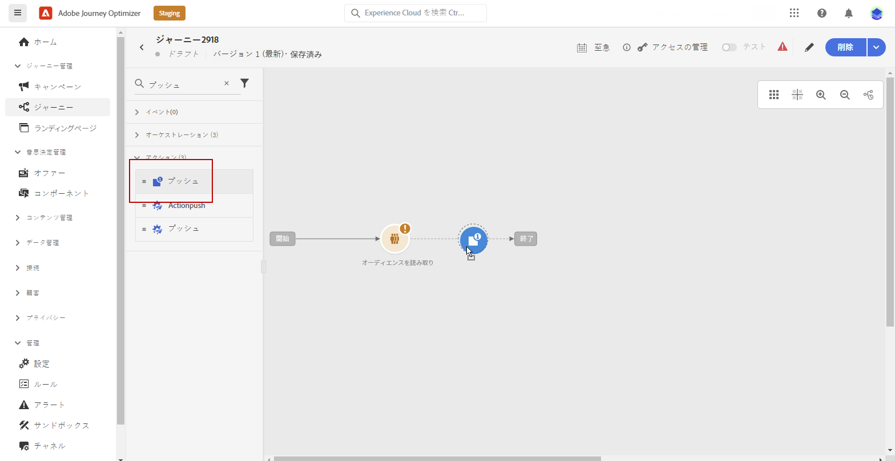
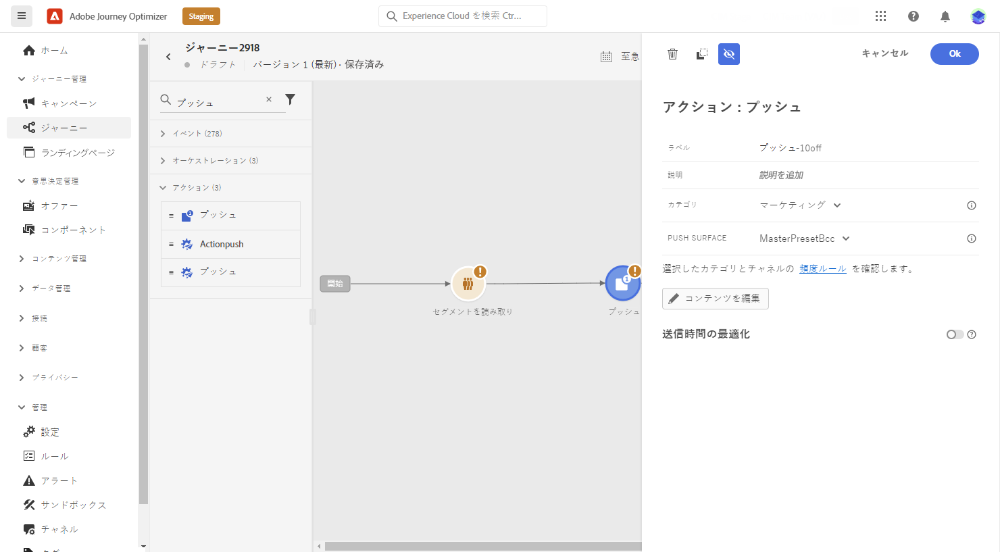
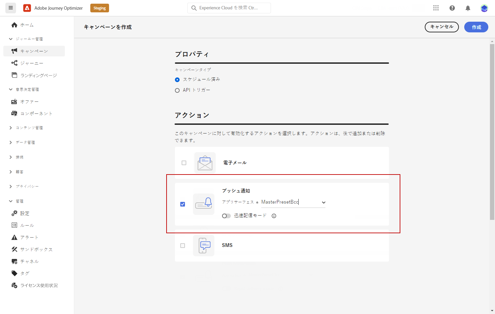
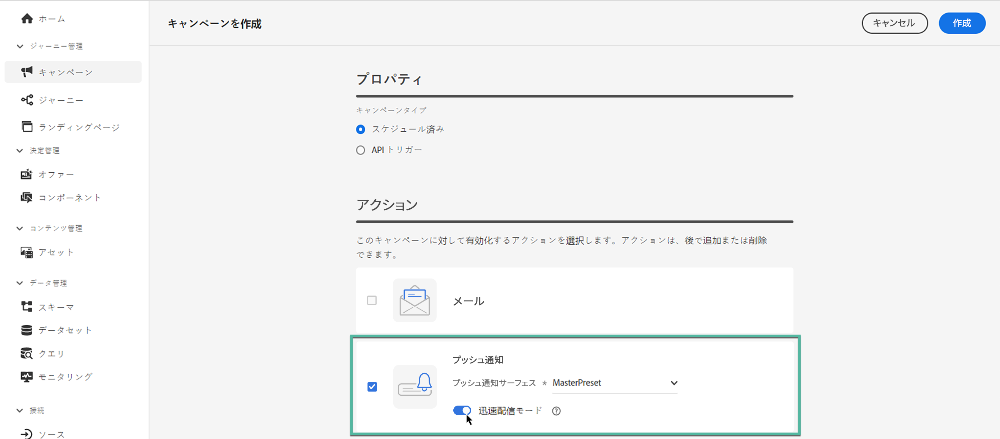

# プッシュ通知の作成 {#create-push-notification}

>[!BEGINSHADEBOX]

**このページ：**&#x200B;では、モバイルおよびweb向けのジャーニーまたはキャンペーン内でプッシュ通知を作成する方法について説明します。これには、高速配信モードを使用した大量送信の方法も含まれます。

>[!ENDSHADEBOX]

>[!CONTEXTUALHELP]
>id="ajo_journey_action_push"
>title="プッシュ通知アクション"
>abstract="プッシュ通知チャネルアクションは、このジャーニーのステップに達すると、プロファイルにプッシュ通知を送信します。 ラベルはジャーニーキャンバス内のアクティビティを識別し、アクションは配信されるコンテンツを定義するプッシュ設定を参照します。 **最適化** セクションには、コンテンツの実験やターゲティングルールを含めることができます。また、**多言語** セクションには多言語のコンテンツを配信できます。アクションが失敗した場合、**タイムアウトまたはエラー** セクションには代替パスを定義できます。"
>additional-url="https://experienceleague.adobe.com/en/docs/journey-optimizer/using/orchestrate-journeys/about-journey-building/journey-action#add-action" text="チャネルアクションの概要"

>[!CONTEXTUALHELP]
>id="ajo_message_push"
>title="プッシュメッセージの作成"
>abstract="プッシュメッセージを追加し、パーソナライゼーションエディターを使用してパーソナライズを開始します。"

モバイルデバイス（iOSおよびAndroid）およびweb ブラウザー向けのプッシュ通知を作成できます。 このページでは、ジャーニーまたはキャンペーンでプッシュ通知を設定するプロセスについて説明します。

## ジャーニーまたはキャンペーンでのプッシュ通知の作成 {#create}

プッシュ通知を作成するには、次の手順に従います。

>[!BEGINTABS]

>[!TAB ジャーニーへのプッシュの追加]

1. ジャーニーを開き、パレットの「**[!UICONTROL アクション]**」セクションから「**[!UICONTROL アクション]**」アクティビティをドラッグ&amp;ドロップします。 [ アクションアクティビティ ](../building-journeys/journey-action.md)の詳細をご覧ください。

   >[!IMPORTANT]
   >
   >従来のネイティブチャネルアクティビティ（電子メール、プッシュ、SMS、アプリ内、web、コードベースのエクスペリエンス、コンテンツカード）は、2026年3月のリリースで廃止されました。 これらのアクティビティを使用する既存のジャーニーは、変更なしで引き続き機能します。移行は必要ありません。

1. アクションタイプとして「**[!UICONTROL プッシュ]**」を選択します。

   

1. ジャーニーキャンバスでアクションを識別するには、**[!UICONTROL ラベル]**&#x200B;を入力します。

1. 「**[!UICONTROL 設定アクション]**」ボタンをクリックします。

1. 「**[!UICONTROL アクション]**」タブに移動します。 そこから、使用するプッシュ設定を選択または作成します。 [詳細情報](push-configuration.md)

   

1. さらに：

   * 「**[!UICONTROL ビジネスルール]**」ドロップダウンリストでルールセットを選択すると、プッシュアクションにキャッピングルールを適用できます。 [詳細情報](../conflict-prioritization/channel-capping.md)

   * **[!DNL Send time optimization]** オプションを使用して、過去の開封率とクリック率に基づいて、メッセージを送信する最適な時間を予測し、エンゲージメントを最大化できます。 [詳細情報](../building-journeys/send-time-optimization.md)

1. **[!UICONTROL 迅速配信モード]**&#x200B;を使用して、プッシュ通知を大量に送信します。 [詳細情報](#rapid-delivery)

1. 「**[!UICONTROL コンテンツを編集]**」ボタンを選択し、必要に応じてコンテンツを作成します。 [詳細情報](design-push.md)

1. メッセージコンテンツを定義したら、CSV／JSON ファイルからアップロードした、または手動で追加したテストプロファイルやサンプル入力データを使用して、そのコンテンツをプレビューできます。 [詳細情報](send-push.md)

1. ジャーニーキャンバスに戻ります。 必要に応じて、追加のアクションまたはイベントをドラッグ＆ドロップして、ジャーニーフローを完了します。 [詳細情報](../building-journeys/about-journey-activities.md)

   >[!NOTE]
   >
   >プッシュの開封やインタラクションを通じて受信者の行動をトラッキングするには、トラッキングセクションの専用オプションが[メールアクティビティ](../building-journeys/journey-action.md)で有効になっていることを確認してください。

ジャーニーの作成、設定、公開の方法について詳しくは、[このページ ](../building-journeys/journey-gs.md)を参照してください。

>[!TAB キャンペーンへのプッシュの追加]

1. **[!UICONTROL キャンペーン]**&#x200B;メニューにアクセスし、「**[!UICONTROL キャンペーンを作成]**」をクリックします。

1. 実施するキャンペーンのタイプを選択します。

   * **Scheduled - Marketing**：キャンペーンをすぐに実行するか、指定日に実行します。 スケジュール済みキャンペーンは、マーケティングメッセージを送信することを目的としています。 ユーザーインターフェイスから設定および実行します。

   * **API トリガー - マーケティング／トランザクション**：API 呼び出しを使用してキャンペーンを実行します。 API トリガーキャンペーンは、マーケティングメッセージまたはトランザクションメッセージのいずれか、つまり、個人が実行したアクション（パスワードのリセット、買い物かごの購入など）に続いて送信されるメッセージを送信することを目的としています。

1. 「**[!UICONTROL プロパティ]**」セクションで、キャンペーンの「**[!UICONTROL タイトル]**」と「**[!UICONTROL 説明]**」を編集します。

1. 「**[!UICONTROL オーディエンスを選択]**」ボタンをクリックして、使用可能な Adobe Experience Platform オーディエンスのリストからターゲットオーディエンスを定義します。 [学習を増やす](../audience/about-audiences.md)。

1. 「**[!UICONTROL ID 名前空間]**」フィールドで、選択したオーディエンスから個人を識別するために使用する名前空間を選択します。 [学習を増やす](../event/about-creating.md#select-the-namespace)。

1. 「**[!UICONTROL アクション]**」セクションで、「**[!UICONTROL プッシュ通知]**」を選択し、新しい設定を選択または作成します。

   [このページ ](push-configuration.md)のモバイル用および[このページ ](push-configuration-web.md)のweb用のプッシュ設定について詳しく説明します。

   

1. 「**[!UICONTROL 実験を作成]**」をクリックしてコンテンツ実験の設定を開始し、パフォーマンスを測定してターゲットオーディエンスに最適なオプションを特定するための処理を作成します。 [詳細情報](../content-management/content-experiment.md)

1. キャンペーンは、特定の日付に実行するか、繰り返し頻度で実行するように設計されています。 キャンペーンの&#x200B;**[!UICONTROL スケジュール]**&#x200B;を設定する方法については、[この節](../campaigns/create-campaign.md#schedule)を参照してください。

1. **[!UICONTROL アクショントリガー]**&#x200B;メニューから、プッシュ通知の「**[!UICONTROL 頻度]**」を選択します。

   * 1 回
   * 毎日
   * 毎週
   * 毎月

1. キャンペーンの設定画面で、「**[!UICONTROL コンテンツを編集]**」ボタンをクリックして、プッシュコンテンツを設定します。 [プッシュ通知のデザイン](design-push.md)

1. メッセージコンテンツを定義したら、CSV／JSON ファイルからアップロードした、または手動で追加したテストプロファイルやサンプル入力データを使用して、そのコンテンツをプレビューできます。 [詳細情報](send-push.md)

1. プッシュの準備が整ったら、[キャンペーン](../campaigns/create-campaign.md)の設定を完了させて送信します。

   プッシュの開封やインタラクションを通じて受信者の行動をトラッキングするには、トラッキングセクションの専用オプションが[キャンペーン](../campaigns/create-campaign.md)で有効になっていることを確認してください。

キャンペーンの作成、設定およびアクティベート方法について詳しくは、[このページ ](../campaigns/get-started-with-campaigns.md)を参照してください。

>[!ENDTABS]

**関連トピック**

* [プッシュチャネルの設定](push-gs.md)
* [ジャーニーでのメッセージの追加](../building-journeys/journey-action.md)

## 迅速配信モード {#rapid-delivery}

>[!CONTEXTUALHELP]
>id="ajo_campaigns_rapid_delivery"
>title="迅速配信モード"
>abstract="迅速配信モードを利用すると、プッシュチャネルで 3,000 万件未満のオーディエンスサイズに高速メッセージ送信を実行できます。"

迅速配信モードは、キャンペーンを通じて大量のプッシュメッセージを非常に高速に送信できるようにする [!DNL Journey Optimizer] アドオンです。

迅速配信は、メッセージ配信の遅延がビジネス上の重要な問題になる状況で、携帯電話に緊急のプッシュアラートを送信するときに使用します（ニュースチャネルアプリをインストールしたユーザーにニュース速報を配信するなど）。

迅速配信モードを使用する際のパフォーマンスについて詳しくは、[Adobe Journey Optimizer 製品の説明](https://helpx.adobe.com/jp/legal/product-descriptions/adobe-journey-optimizer.html){target="_blank"}を参照してください。

### 前提条件 {#prerequisites}

迅速配信メッセージには、次の要件があります。

* 迅速配信は&#x200B;**[!UICONTROL スケジュール型]**&#x200B;キャンペーンでのみ使用でき、API トリガーキャンペーンでは使用できません。
* プッシュメッセージはパーソナライズできません。
* ターゲットオーディエンスに含まれるプロファイルの数は 3,000 万未満にする必要があります。
* 迅速配信モードを使用すると、最大 5 つのキャンペーンを同時に実行できます。

### 迅速配信モードの有効化

1. プッシュ通知キャンペーンを作成し、「**[!UICONTROL 迅速配信]**」オプションをオンに切り替えます。

   

1. メッセージコンテンツを設定し、ターゲットにするオーディエンスを選択します。 [キャンペーンの作成方法を学ぶ](#create)

   >[!IMPORTANT]
   >
   >メッセージコンテンツにパーソナライゼーションが含まれていないことと、オーディエンスに含まれるプロファイルの数が 3,000 万未満であることを確認します。

1. 通常どおり、キャンペーンをレビューしてアクティブ化します。 テストモードでは、メッセージは迅速配信モードで送信されません。