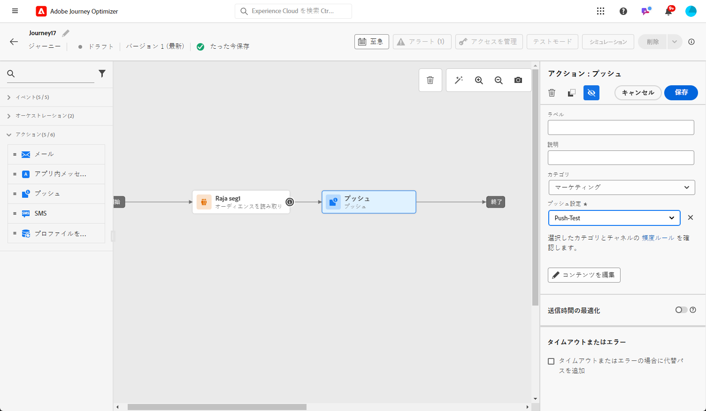
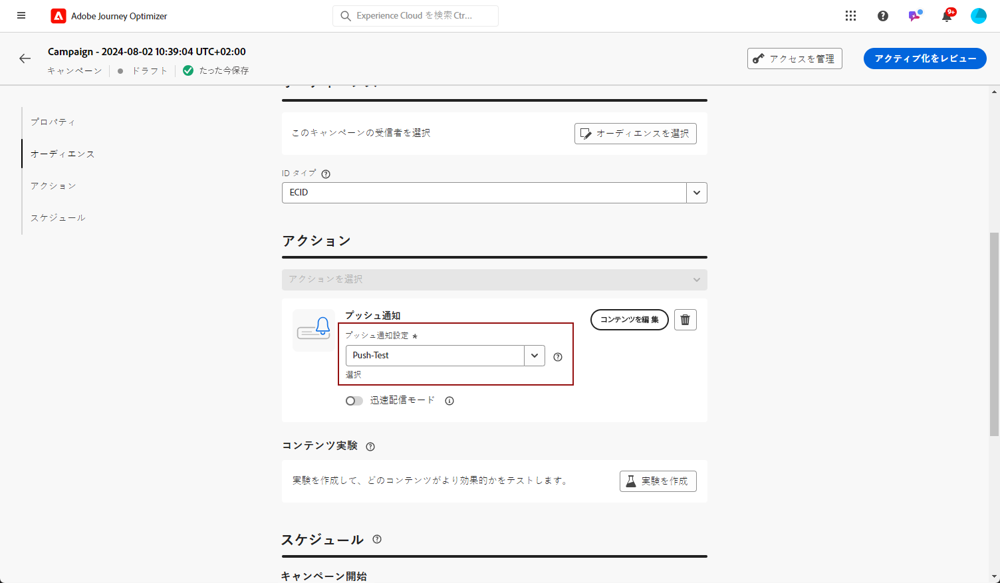

# プッシュ通知の作成 {#create-push-notification}

>[!CONTEXTUALHELP]
>id="ajo_message_push"
>title="プッシュメッセージの作成"
>abstract="プッシュメッセージを追加し、エクスプレッションエディターを使用して、そのメッセージのパーソナライズを開始します。"

## 移動またはキャンペーンでのプッシュ通知の作成 {#create}

プッシュ通知を作成するには、次の手順に従います。

>[!BEGINTABS]

>[!TAB 旅へのプッシュの追加]

1. 「パレット」の「アクション」セクションから、「プッシュ」アクティビティーをドラッグ &amp; ドロップします。

   

1. メッセージに基本的な情報 (ラベル、説明、カテゴリー) を入力してから、使用するメッセージサーフェスを選択します。

   

   >[!NOTE]
   >
   >このような場合は、Adobe 旅オプティマイザーの「送信時に通知」機能を利用して、メッセージを送信するのにかかる時間を短縮することができます。また、「時間を開く」および「クリックレート」に基づいて、最大限に活用することができます。 [送信時最適化の操作方法について説明します。](../building-journeys/journeys-message.md#send-time-optimization)

   旅の設定方法について詳しくは、このページを [ 参照してください。](../building-journeys/journey-gs.md)

1. 「設定」ボタンをクリック **[!UICONTROL Edit content]** して、プッシュコンテンツを設定します。 [プッシュ通知のデザイン](design-push.md)

1. 作成したメッセージコンテンツについては、テストプロファイルを使用してプレビューとテストを行うことができます。

1. プッシュの準備ができたら、送信する旅 ](../building-journeys/journey-gs.md) の [ 設定を完了します。

   プッシュのオープニングまたは操作、またはその両方を使用して、受信者の動作を追跡するには、「追跡」セクションの専用のオプションが電子メール活動 ](../building-journeys/journeys-message.md) で [ 有効になっていることを確認してください。

>[!TAB キャンペーンへのプッシュの追加]

1. 新しくスケジュール設定されたまたは API トリガキャンペーンを作成するには、「操作として」を選択 **[!UICONTROL Push notification]** し、「使用する」を選択 **[!UICONTROL App surface]** します。 [詳細について詳しくは、こちらを参照して ](push-configuration.md) ください。

   

1. をクリック **[!UICONTROL Create]** します。

1. **[!UICONTROL Properties]**&#x200B;セクションで、キャンペーンの **[!UICONTROL Title]** およびを **[!UICONTROL Description]** 編集します。

   

1. **[!UICONTROL Select audience]**&#x200B;このボタンをクリックして、使用可能な Adobe エクスペリエンスプラットフォームセグメントのリストから対象ユーザーを定義します。[詳しく ](../segment/about-segments.md) は、こちらを参照してください。

1. **[!UICONTROL Identity namespace]**「」フィールドで、選択した区分の個人を識別するために使用する名前空間を選択します。[詳しく ](../event/about-creating.md#select-the-namespace) は、こちらを参照してください。

   

1. キャンペーンは、特定の日付または定期的な頻度で実行するように設計されています。 この節 ](../campaigns/create-campaign.md#schedule) で [ は、 **[!UICONTROL Schedule]** キャンペーンの設定方法について説明します。

1. **[!UICONTROL Action triggers]**&#x200B;メニューからプッシュ通知のを選択 **[!UICONTROL Frequency]** します。

   * ある時
   * あたり
   * ごと
   * ヶ

1. キャンペーンコンフィギュレーション画面で、ボタンをクリック **[!UICONTROL Edit content]** して、プッシュコンテンツを設定します。 [プッシュ通知のデザイン](design-push.md)

1. 作成したメッセージコンテンツについては、テストプロファイルを使用してプレビューとテストを行うことができます。

1. プッシュの準備ができたら、キャンペーン ](../campaigns/create-campaign.md) の [ 設定を完了して送信します。

   プッシュのオープニングや操作によって、宛先の動作を追跡するには、「追跡」セクションの専用のオプションがキャンペーン ](../campaigns/create-campaign.md) で [ 有効になっていることを確認してください。

>[!ENDTABS]

**関連トピック**

* [プッシュチャネルの設定](push-gs.md)
* [メッセージの追加](../building-journeys/journeys-message.md)

## ラピッド配達モード {#rapid-delivery}

>[!CONTEXTUALHELP]
>id="ajo_campaigns_rapid_delivery"
>title="ラピッド配達モード"
>abstract="ラピッド配信モードを使用すると、プッシュチャネルでの30M 下にある視聴ユーザーのサイズに、高速メッセージ送信を実行することができます。"

Journeys の「バースト」モードは、事前に「バーストモード」と呼ばれていますが、この機能を使用すると、キャンペーン中に非常に高速な [!DNL Journey Optimizer] プッシュメッセージを送信できます。

配信が遅くなるのは、メッセージ配信の遅延がビジネスにとって重要な場合、例えば、news channel app をインストールしたユーザーにとって重要なニュースのような携帯電話のようなすばやい通知を送信する場合に使用されます。

高速配信モードを使用する場合のパフォーマンスについて詳しくは、『 Adobe 旅 Optimizer」製品の説明 ](https://helpx.adobe.com/legal/product-descriptions/adobe-journey-optimizer.html) を [ 参照してください。

### 知識 {#prerequisites}

迅速な配信メッセージには、次のような要件があります。

* すばやい配信は、キャンペーンのみに **[!UICONTROL Scheduled]** 使用できます。また、API によってトリガーされるキャンペーンには使用できません。
* Push メッセージではカスタマイズが許可されていません。
* 対象となるユーザーには、30M 未満のプロファイルが含まれている必要があります。
* ラピッドデリバリモードを使用して、5つのキャンペーンを同時に実行することができます。

### 高速配信モードの有効化

1. プッシュ通知キャンペーンを作成し、オプションで **[!UICONTROL Rapid delivery]** 切り替えます。

1. メッセージの内容を設定し、ターゲットを選択します。 [キャンペーンの作成方法について学習します。](#create)

   >[!IMPORTANT]
   >
   >メッセージコンテンツに個人用設定が含まれていないこと、および対象ユーザーのプロファイルが30M より少ないことを確認してください。

1. このようにして、キャンペーンを確認し、アクティブにします。 テストモードでは、メッセージは、ラピッド配信モードで送信されることはありません。