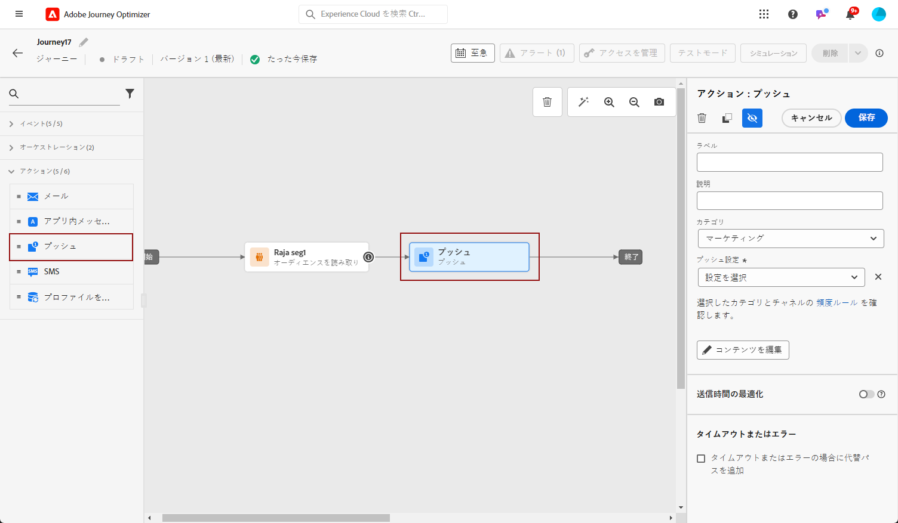
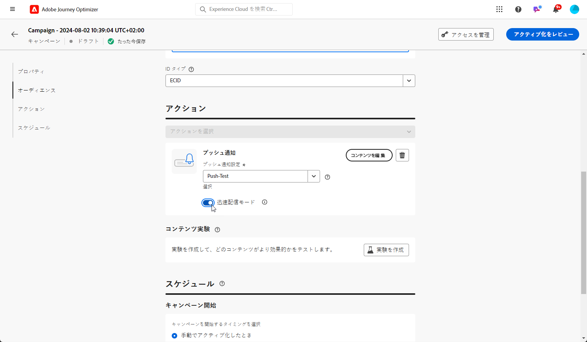

# プッシュ通知の作成 {#create-push-notification}

>[!CONTEXTUALHELP]
>id="ajo_message_push"
>title="プッシュメッセージの作成"
>abstract="プッシュメッセージを追加し、式エディターを使用してパーソナライズを開始します。"

## ジャーニーまたはキャンペーンでのプッシュ通知の作成 {#create}

プッシュ通知を作成するには、次の手順に従います。

>[!BEGINTABS]

>[!TAB ジャーニーへのプッシュの追加]

1. ジャーニーを開き、パレットの「アクション」セクションからプッシュアクティビティをドラッグ&amp;ドロップします。

   

1. メッセージに関する基本情報（ラベル、説明、カテゴリ）を入力し、使用するメッセージサーフェスを選択します。

   

   >[!NOTE]
   >
   >ジャーニーからプッシュ通知を送信する場合、Adobe Journey Optimizerの送信時間の最適化機能を利用して、メッセージ送信の最適な時間を予測し、過去の開封率とクリック率に基づいてエンゲージメントを最大化できます。 [送信時間の最適化の操作方法を説明します。](../building-journeys/journeys-message.md#send-time-optimization)

   ジャーニーの設定方法について詳しくは、 [このページ](../building-journeys/journey-gs.md)

1. ジャーニー設定画面で、 **[!UICONTROL コンテンツを編集]** ボタンをクリックして、プッシュコンテンツを設定します。 [プッシュ通知のデザイン](design-push.md)

1. メッセージコンテンツを定義したら、テストプロファイルを使用してプレビューとテストを行うことができます。

1. プッシュの準備が整ったら、 [ジャーニー](../building-journeys/journey-gs.md) 送信する

   プッシュの開封やインタラクションを通じて受信者の行動を追跡するには、トラッキングセクションの専用オプションが [メールアクティビティ](../building-journeys/journeys-message.md).

>[!TAB キャンペーンへのプッシュの追加]

1. スケジュール済みまたは API トリガーキャンペーンを新しく作成し、 **[!UICONTROL プッシュ通知]** を選択します。 **[!UICONTROL アプリサーフェス]** を使用します。 [プッシュ設定の詳細を説明します](push-configuration.md).

   

1. 「**[!UICONTROL 作成]**」をクリックします。

1. 「**[!UICONTROL プロパティ]**」セクションで、キャンペーンの&#x200B;**[!UICONTROL タイトル]**&#x200B;と&#x200B;**[!UICONTROL 説明]**&#x200B;を編集します。

   

1. 「**[!UICONTROL オーディエンスを選択]**」ボタンをクリックして、使用可能な Adobe Experience Platform セグメントのリストからターゲットオーディエンスを定義します。 [詳細情報](../segment/about-segments.md)。

1. 「**[!UICONTROL ID 名前空間]**」フィールドで、選択したセグメントから個人を識別するために使用する名前空間を選択します。[詳細情報](../event/about-creating.md#select-the-namespace)。

   

1. キャンペーンは、特定の日付に実行するか、繰り返し頻度で実行するように設計されています。キャンペーンの&#x200B;**[!UICONTROL スケジュール]**&#x200B;を設定する方法については、[この節](../campaigns/create-campaign.md#schedule)を参照してください。

1. 次の **[!UICONTROL アクショントリガー]** メニューから、 **[!UICONTROL 頻度]** プッシュ通知の次の情報：

   * 1 回
   * 毎日
   * 毎週
   * 毎月

1. キャンペーンの設定画面で、 **[!UICONTROL コンテンツを編集]** ボタンをクリックして、プッシュコンテンツを設定します。 [プッシュ通知のデザイン](design-push.md)

1. メッセージコンテンツを定義したら、テストプロファイルを使用してプレビューとテストを行うことができます。

1. プッシュの準備が整ったら、 [campaign](../campaigns/create-campaign.md) 送信する

   プッシュの開封やインタラクションを通じて受信者の行動を追跡するには、トラッキングセクションの専用オプションが [campaign](../campaigns/create-campaign.md).

>[!ENDTABS]

**関連トピック**

* [プッシュチャネルの設定](push-gs.md)
* [ジャーニーへのメッセージの追加](../building-journeys/journeys-message.md)

## 迅速配信モード {#rapid-delivery}

>[!CONTEXTUALHELP]
>id="ajo_campaigns_rapid_delivery"
>title="迅速配信モード"
>abstract="迅速配信モードプッシュチャネルで 3,000 万件未満のオーディエンスサイズに高速メッセージ送信を実行できます。"

以前はジャーニーのバーストモードと呼ばれていた迅速配信モードは、キャンペーンを通じて大量のプッシュメッセージを非常に高速に送信できるようにする [!DNL Journey Optimizer] アドオンです。

迅速配信は、メッセージ配信の遅延がビジネス上重要な場合、携帯電話に緊急のプッシュアラートを送信するときに使用します（ニュースチャネルアプリをインストールしたユーザーにニュース速報を流すなど）。

迅速配信モードを使用する際のパフォーマンスについて詳しくは、[Adobe Journey Optimizer 製品の説明](https://helpx.adobe.com/jp/legal/product-descriptions/adobe-journey-optimizer.html)を参照してください。

### 前提条件 {#prerequisites}

迅速配信メッセージには、次の要件があります。

* 迅速配信は&#x200B;**[!UICONTROL スケジュール済み]**&#x200B;キャンペーンでのみ使用でき、API トリガーキャンペーンでは使用できません。
* プッシュメッセージはパーソナライズできません。
* ターゲットオーディエンスに含まれるプロファイルの数は 3,000 万未満にする必要があります。
* 迅速な配信モードを使用して、最大 5 つのキャンペーンを同時に実行できます。

### 迅速配信モードの有効化

1. プッシュ通知キャンペーンを作成し、「**[!UICONTROL 迅速配信]**」オプションをオンに切り替えます。

1. メッセージコンテンツを設定し、ターゲットにするオーディエンスを選択します。[キャンペーンの作成方法について学ぶ](#create)

   >[!IMPORTANT]
   >
   >メッセージコンテンツにパーソナライゼーションが含まれていないことと、オーディエンスに含まれるプロファイルの数が 3,000 万未満であることを確認します。

1. 通常どおり、キャンペーンをレビューしてアクティブ化します。テストモードでは、メッセージは迅速配信モードで送信されません。