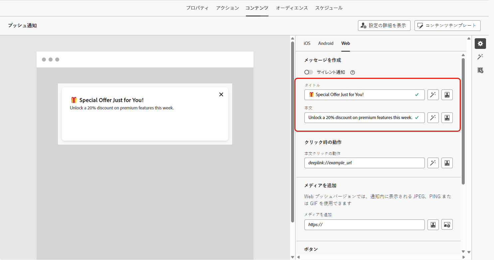
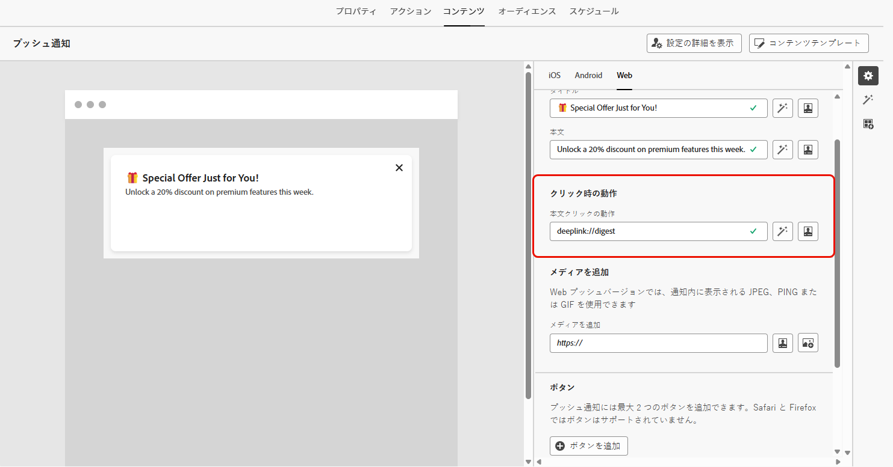
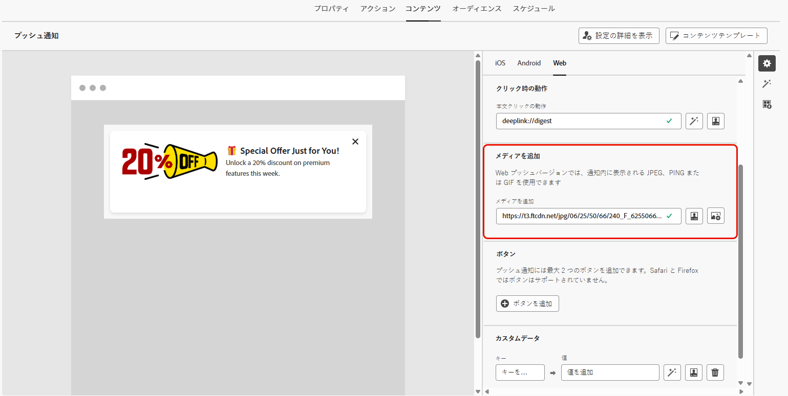
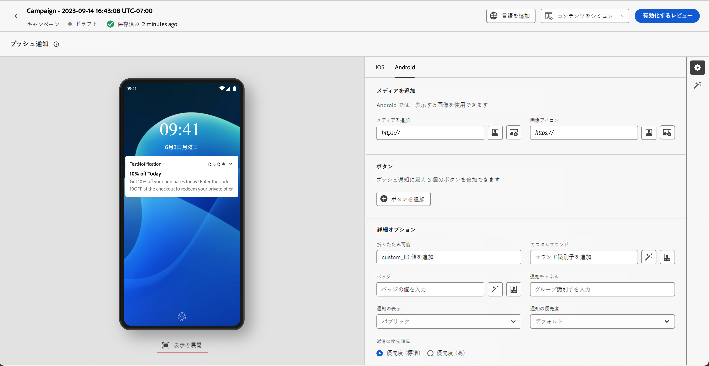
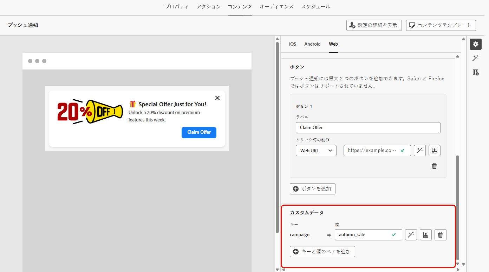

# Web プッシュ通知のデザイン {#design-push-notification}

>[!AVAILABILITY]
>
>現在、Journey Optimizerの web プッシュ通知では、**サイレント通知** および **コンテンツをシミュレート** 機能はサポートされていませんが、今後利用できるようになります。

Web プッシュ通知キャンペーンまたはジャーニーを作成したら、要件に応じてそのコンテンツと構造をデザインできます。 Web プッシュ通知を送信する前に、まず [&#x200B; チャネル設定 &#x200B;](push-configuration-web.md) 内でこのチャネルを設定する必要があります。

<!--
## Send a silent notification {#silent-notification}

A silent push notification (also called a background notification) is a hidden message sent to your web application without alerting the user.

To enable a silent notification, enable the **[!UICONTROL Silent Notification]** option. When this option is used, the notification is delivered directly to the application, and no alert, banner, or sound is shown to the user.

Use the **Custom Data** section to include additional information in the form of key-value pairs. 

-->

## タイトルと本文 {#push-title-body}

メッセージを作成するには、「**[!UICONTROL タイトル]**」フィールドと「**[!UICONTROL 本文]**」フィールドをクリックします。パーソナライゼーションエディターを使用して、コンテンツの定義 [&#x200B; データのパーソナライズ &#x200B;](../personalization/personalize.md) および [&#x200B; 動的コンテンツ &#x200B;](../personalization/get-started-dynamic-content.md) の追加を行います。

**[!UICONTROL AI アシスタントでテキストを編集]** をクリックすると、Journey Optimizer AI アシスタントを使用してコンテンツを簡単に生成できます。

## クリック時の動作 {#on-click-behavior}

「**[!UICONTROL 本文クリック動作]**」フィールドを使用して、ユーザーが通知本文をクリックした場合の動作を決定するディープリンクを定義します。 これにより、web アプリケーションの特定のページまたはセクションに直接ユーザーを送信できます。

## メディアの追加 {#add-media-push}

**[!UICONTROL メディアを追加]** フィールドにメディア URL を入力します。 また、URL にパーソナライゼーショントークンを含めて、各ユーザー用にコンテンツをカスタマイズすることもできます。

 をクリックすると、Journey Optimizer AI アシスタントを使用してメディアをすばやく生成できます。

## ボタンの追加 {#add-buttons-push}

コンテンツにボタンを追加して、web プッシュ通知をインタラクティブにします。

ボタンは、デバイスのロックが解除されている場合にのみ表示されることに注意してください。 画面がロックされている場合は、**[!UICONTROL タイトル]** と **[!UICONTROL メッセージ]** のみが表示されます。

「**[!UICONTROL ボタンを追加]**」オプションを使用して、次に示すように、各ボタンのラベルと関連するアクションを定義します。

* **[!UICONTROL ディープリンク]**：アプリ内の特定のビュー、セクション、タブにユーザーをリダイレクトします。 関連するフィールドにディープリンク URL を入力します。

* **[!UICONTROL Web URL]**：外部の web ページにユーザーをリダイレクトします。 関連するフィールドに URL を入力します。

## カスタムデータ {#custom-data}

「**[!UICONTROL カスタムデータ]**」セクションでは、カスタムのキーと値のペアを通知ペイロードに追加できます。 これらの値は、Web アプリケーションで特定のアクションをトリガーしたり、ユーザーエクスペリエンスをカスタマイズしたりするために使用できます。 Adobe Experience Platform でのプッシュ通知の設定方法について詳しくは、[この節](push-gs.md)を参照してください

