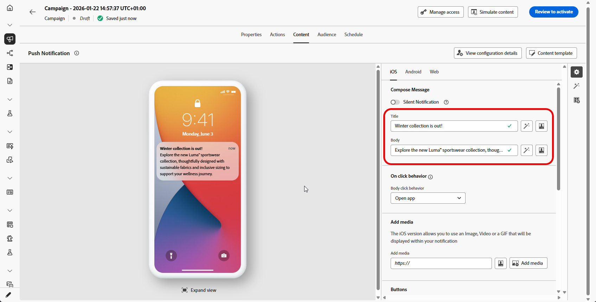
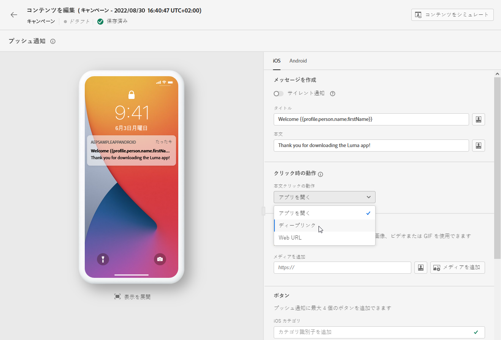
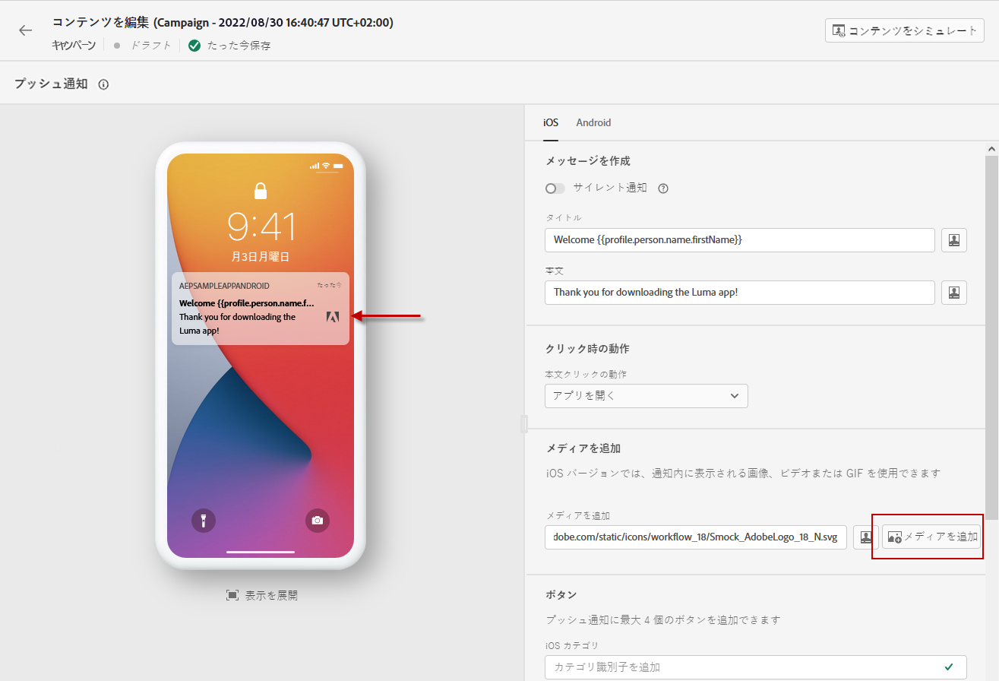
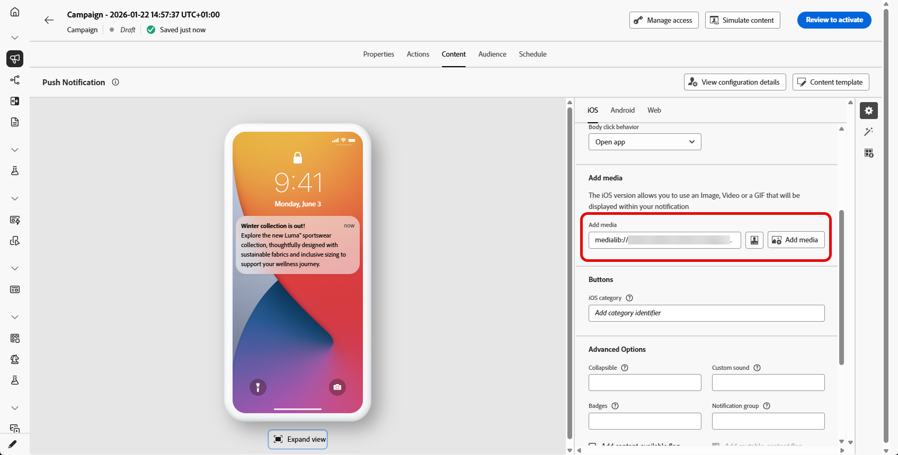
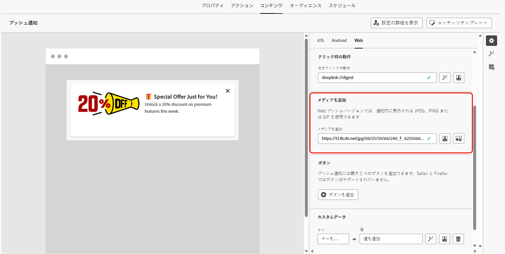
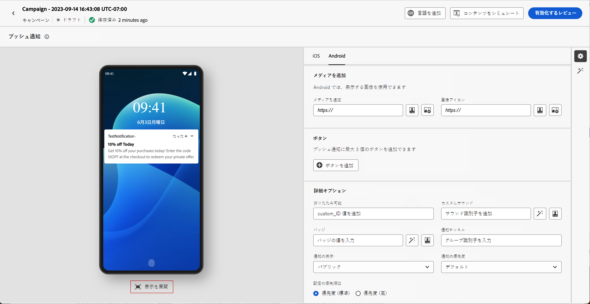
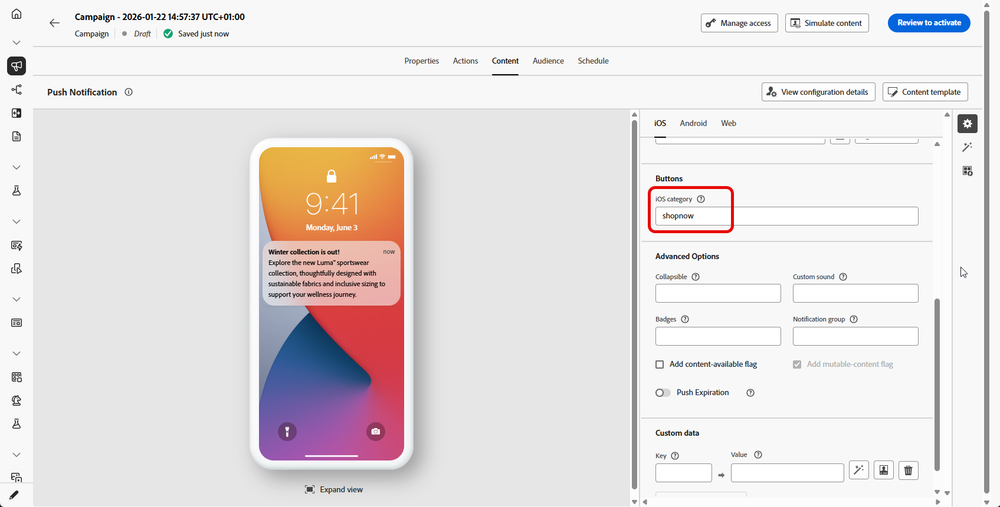
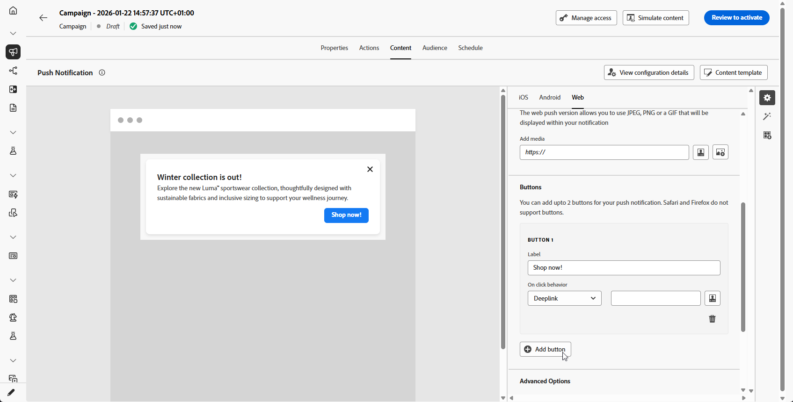

# プッシュ通知のデザイン {#design-push-notification}

プッシュ通知を作成したら、そのコンテンツをiOS、Android、およびWeb プラットフォーム用にデザインできます。 このページでは、メッセージの作成、クリック時の動作の設定、メディアとボタンの追加、高度なオプションの設定を通じて、オーディエンスの共感を呼ぶ魅力的なプッシュ通知を作成する方法を説明します。

## タイトルと本文 {#push-title-body}

>[!CONTEXTUALHELP]
>id="ajo-message-push-compose"
>title="プッシュ通知をパーソナライズします。"
>abstract="メッセージを作成するには、「**タイトル**」フィールドと「**本文**」フィールドにコンテンツを入力します。 パーソナライゼーショントークンを含めるには、パーソナライゼーションダイアログを開きます。"

メッセージを作成するには、「**[!UICONTROL タイトル]**」フィールドと「**[!UICONTROL 本文]**」フィールドをクリックします。 パーソナライゼーションエディターを使用して、コンテンツの定義、データのパーソナライズ、動的コンテンツの追加を行います。 パーソナライゼーションエディターでの[パーソナライズ機能](../personalization/personalize.md)および[動的コンテンツ](../personalization/get-started-dynamic-content.md)の詳細情報。

`{{`と入力して、**[!UICONTROL タイトル]**&#x200B;および&#x200B;**[!UICONTROL 本文]** フィールドにプロファイル属性をインラインで直接挿入することもできます。 カーソルでオートコンプリートドロップダウンが開きます。任意の属性を選択して、完全なエディターを開かずにパーソナライゼーショントークンとして挿入します。 [ インライン編集の詳細→](../personalization/personalize.md#inline-personalization)

デバイスプレビューセクションを使用して、iOS、Android、およびWebでのプッシュ通知の表示方法を視覚化します。

AI アシスタントを使用してコンテンツ作成を高速化し、[テキスト生成用の AI アシスタント](../content-management/generative-text.md)を使用して魅力的なプッシュ通知テキストを生成するか、[完全なコンテンツ生成用の AI アシスタント](../content-management/generative-full-content.md)を使用して完全なプッシュ通知を作成します。

## クリック時の動作 {#on-click-behavior}

>[!CONTEXTUALHELP]
>id="ajo-message-push-onclick"
>title="クリック動作について"
>abstract="受信者がプッシュ通知の本文をクリックしたときの動作を選択します。"

受信者がプッシュ通知の本文をタップしたときに発生するアクションを設定します。 次のオプションから選択します。

* **[!UICONTROL アプリを開く]**：通知に関連付けられているアプリケーションを起動します。 アプリは、[ チャネル設定](../configuration/channel-surfaces.md) （メッセージプリセット）で指定されます。
* **[!UICONTROL ディープリンク]**：特定のビュー、ページセクション、タブなど、アプリ内の特定のコンテンツにユーザーを誘導します。 指定されたフィールドにディープリンク URLを入力します。
* **[!UICONTROL Web URL]**: ユーザーを外部Web ページに誘導します。 指定したフィールドに宛先URLを入力します。

リンクまたはメディアフィールド内のURLが長すぎて表示できない場合は、ツールチップアイコンがフィールドの横に常に表示されます。URL全体を表示するには、そのフィールドにカーソルを合わせます。

>[!NOTE]
>
>プッシュ通知に、iOSでユニバーサルリンクとして設定されたURLが含まれている場合、選択した&#x200B;**[!UICONTROL Web URL]** アクションに関係なく、インストールすると関連するアプリがプッシュで開きます。 ブラウザーを強制的に開くには、ユニバーサルリンク用に設定されていないドメインを使用するか、ドメインのユニバーサルリンク登録を削除します。
>Adobe SDKでのディープリンクとユニバーサルリンクの処理方法について詳しくは、[Adobe Experience Platform モバイルSDK ドキュメント ](https://developer.adobe.com/client-sdks/documentation/adobe-journey-optimizer/push-notifications){target="_blank"}を参照してください。

## メディアの追加 {#add-media-push}

>[!CONTEXTUALHELP]
>id="ajo-message-push-media"
>title="プッシュ通知へのメディアの追加"
>abstract="通知内に表示する画像、ビデオまたは GIF を追加できます。"

ビジュアルメディアを追加して、プッシュ通知を強化しましょう。 使用可能なメディアの種類と実装方法は、以下のタブで詳しく説明しているように、オペレーティングシステムによって異なります。

>[!BEGINTABS]

>[!TAB Android]

Androidの場合は、画像アイコンと、展開された通知用の画像のみを追加できます。

次のいずれかの方法を使用してメディアを追加できます。

* **[!UICONTROL Add media]** ボタン：[Adobe Experience Manager Assets](../integrations/assets.md)からアセットを選択するか、AI アシスタントにアクセスして、プッシュ通知用に[魅力的な画像](../content-management/generative-image.md)を生成します。

* **[!UICONTROL メディアを追加]** フィールド：メディア URLを直接入力します。 パーソナライゼーショントークンをURLに含めることができます。

メディアを追加すると、通知本文の右側に表示されます。

>[!NOTE]
>
>プッシュ通知ペイロードにメディアの添付ファイル（`adb_media`などのカスタムデータフィールドの画像など）を含める場合、モバイルアプリケーションは、デバイスでレンダリングする画像に対して特定のクライアントサイド処理を実装する必要があります。 ペイロードからの画像の添付ファイルを処理するには、アプリで[自動表示および追跡ワークフロー](https://developer.adobe.com/client-sdks/edge/adobe-journey-optimizer/push-notification/android/automatic-display-and-tracking){target="_blank"}を実装する必要があります。

>[!TAB iOS]

IOSの場合、通知内に表示する画像、ビデオ、GIFを追加できます。

次のいずれかの方法を使用してメディアを追加できます。

* **[!UICONTROL メディアを追加]** ボタン：**[!DNL Adobe Experience Manager Assets]**&#x200B;からアセットを選択します。 **[!DNL Adobe Experience Manager Assets]**&#x200B;の使用について詳しくは、[このページ ](../integrations/assets.md)を参照してください。

* **[!UICONTROL メディアを追加]** フィールド：メディア URLを直接入力します。 パーソナライゼーショントークンをURLに含めることができます。

メディアを追加すると、通知本文の右側に表示されます。

>[!NOTE]
>
>プッシュ通知ペイロードにメディアの添付ファイル（`adb_media`などのカスタムデータフィールドの画像など）を含める場合、モバイルアプリケーションは、デバイスでレンダリングする画像に対して特定のクライアントサイド処理を実装する必要があります。 ペイロードからメディアコンテンツをダウンロードして処理するには、アプリで[通知サービス拡張機能](https://developer.apple.com/documentation/usernotifications/modifying_content_in_newly_delivered_notifications){target="_blank"}を実装する必要があります。 さらに、「[詳細設定オプション](#advanced-options-push)」セクションで「**[!UICONTROL 可変コンテンツフラグを追加]**」オプションを有効にする必要があります。

>[!TAB Web]

「**[!UICONTROL メディアを追加]**」フィールドにメディア URL を入力します。 また、URL にパーソナライゼーショントークンを含めて、各ユーザーのコンテンツをカスタマイズすることもできます。

「」をクリックすると、Journey Optimizer AI アシスタントを使用してメディアをすばやく生成できます。

>[!ENDTABS]

## ボタンの追加 {#add-buttons-push}

>[!CONTEXTUALHELP]
>id="ajo-message-push-buttons"
>title="ユーザーがプッシュ通知を操作するためのボタンを追加します。"
>abstract="このセクションから、メッセージにコールトゥアクションボタンを追加します。 Apple iOS の場合は、通知カテゴリ識別子を指定します。 Google Android の場合は、各ボタンにカスタムテキストとターゲットを含めることができます。"

プッシュコンテンツにボタンを追加することで、アクションにつながる通知を作成できます。 オペレーティングシステムに応じて、以下のタブを参照してください。

デバイスの画面がロックされている場合、次のボタンは表示されません。通知の&#x200B;**タイトル**&#x200B;と&#x200B;**メッセージ**&#x200B;のみが表示されます。 デバイスのロックが解除されている場合、受信者にボタンが表示されます。

>[!BEGINTABS]

>[!TAB Android]

Androidの場合は、最大3つのボタンを追加できます。

1. 「**[!UICONTROL ボタンを追加]**」をクリックして、ラベルと関連するアクションの設定を定義します。 可能なアクションは、[クリック時の動作](#on-click-behavior)の場合と同じです。

   

1. 中央のプレビュー画像の「**[!UICONTROL 表示を展開]**」アイコンを使用して、パーソナライズされたボタンをプレビューします。

>[!TAB iOS]

IOSの場合、通知カテゴリ IDが指定されます。 通知カテゴリは、iOS アプリで事前設定する必要があり、表示するボタンと実行されるアクションを定義します。 詳しくは、[Apple ドキュメント](https://developer.apple.com/documentation/usernotifications/declaring_your_actionable_notification_types)を参照してください。

>[!TAB Web]

「**[!UICONTROL ボタンを追加]**」オプションを使用して、次に示すように、各ボタンのラベルと関連するアクションを定義します。

* **[!UICONTROL ディープリンク]**：ユーザーをアプリ内の特定のビュー、セクション、タブにリダイレクトします。 関連するフィールドにディープリンク URLを入力します。

* **[!UICONTROL Web URL]**：外部の web ページにユーザーをリダイレクトします。 関連するフィールドに URL を入力します。

>[!ENDTABS]

## サイレント通知の送信 {#silent-notification}

>[!CONTEXTUALHELP]
>id="ajo_message_push_silent_notification"
>title="サイレント通知について"
>abstract="ユーザーを煩わせずに通知を送信すると、通知センターや通知バーに通知が表示されません。"

>[!AVAILABILITY]
>
>Journey OptimizerのWeb プッシュ通知は、**サイレント通知**&#x200B;機能をサポートしていません。

サイレントプッシュ通知（バックグラウンド通知）は、アプリケーションに配信される非表示の命令です。 これは、例えば、新しいコンテンツが利用可能であることをアプリケーションに通知したり、バックグラウンドでダウンロードを開始したりする場合に使用します。

「**[!UICONTROL サイレント通知]**」オプションを選択すると、アプリケーションにサイレントに通知できます。この場合、通知はアプリケーションに直接転送されます。 デバイスの画面にアラートは表示されません。

「 **[!UICONTROL カスタムデータ]**」セクションを使用すると、キーと値のペアを追加できます。

## カスタムデータ {#custom-data}

>[!CONTEXTUALHELP]
>id="ajo-message-push-custom"
>title="プッシュ通知のカスタムデータを設定します。"
>abstract="モバイルアプリケーションの設定に応じて、ペイロードにカスタム変数を追加します。"

**[!UICONTROL カスタムデータ]**&#x200B;セクションでは、モバイルアプリケーションの設定に応じて、ペイロードにカスタム変数を追加できます。 Adobe Experience Platform でのプッシュ通知の設定方法について詳しくは、[この節](push-gs.md)を参照してください

## 意思決定によるパーソナライゼーション {#decisioning-push}

**Decisioning**&#x200B;を使用すると、プッシュ通知のコンテンツをパーソナライズおよび最適化できます。 この機能により、優先順位スコア、数式、AI モデルを使用して、顧客に最適なコンテンツを動的に選択して表示できます。

プッシュ通知で決定ポリシーを作成および使用する方法について詳しくは、[この節](../experience-decisioning/create-decision.md)を参照してください。

## 詳細オプション {#advanced-options-push}

>[!CONTEXTUALHELP]
>id="ajo-message-push-advanced"
>title="プッシュ通知用に詳細オプションを設定します。"
>abstract="この節では、プッシュ通知のパーソナライゼーションの強化方法を説明します。"

プッシュ通知用に&#x200B;**[!UICONTROL 詳細オプション]**&#x200B;を設定できます。 使用できるパラメーターは以下のとおりです。

| パラメーター | 説明 |
|---------|---------|
| **[!UICONTROL 折りたたみ可能]**（iOS／Android） | 折りたたみ可能なメッセージとは、古くなった場合に新しいメッセージに置き換えられる可能性のあるメッセージです。 折りたたみ可能なメッセージの一般的なユースケースは、モバイルアプリに対して、サーバーからのデータを同期するよう伝えるメッセージです。 例えば、最新のスコアでユーザーを更新するスポーツアプリが挙げられます。 最新のメッセージのみが関連します。 一方、折りたたみが不可能なメッセージはすべて、クライアントアプリにとって重要で、配信が必要なものです。 |
| **[!UICONTROL カスタムサウンド]**（iOS／Android） | 通知を受け取ったときにモバイル端末が再生するサウンド。 サウンドは、アプリにバンドルされている必要があります。 |
| **[!UICONTROL バッジ]**（iOS／Android） | バッジは、新しい未読情報の数をアプリケーションアイコンに直接表示するために使用します。  バッジの値は、ユーザーがアプリケーションで新しいコンテンツを開いたり読んだりするとすぐに消えます。 デバイスで通知を受け取ると、関連アプリのバッジ値を更新したり追加したりできます。 例えば、顧客の未読記事の数を保存している場合、パーソナライズ機能を利用して、顧客ごとに未読記事の固有のバッジ値を送信できます。 パーソナライゼーションの詳細については、[この節](../personalization/personalize.md)を参照してください。 |
| **[!UICONTROL 通知グループ]**（iOS のみ） | 通知グループをプッシュ通知に関連付けます。 iOS 12 以降は、通知グループを使用すると、メッセージスレッドと通知トピックをスレッド ID に統合できます。 例えば、1つのグループ IDの下にマーケティング通知を送信する一方で、1つ以上の異なるIDの下に運用タイプの通知を保持する場合があります。 これを示すには、groupID: 123 「新しいスプリングセーターのコレクションをチェックアウト」とgroupID: 456 「パッケージが配信されました」通知グループを設定できます。 この例では、すべての配達通知はグループ ID：456 の下にバンドルされます。 |
| **[!UICONTROL 通知チャネル]**（Android のみ） | プッシュ通知に通知チャネルを関連付けます。 Android 8.0（API レベル 26）以降では、表示するすべての通知をチャネルに割り当てる必要があります。 詳しくは、[Android 開発者向けドキュメント](https://developer.android.com/guide/topics/ui/notifiers/notifications#ManageChannels)を参照してください。 |
| **[!UICONTROL コンテンツ可用性フラグの追加]**（iOS のみ） | プッシュペイロードでコンテンツ利用可能フラグを送信して、アプリがプッシュ通知を受信するとすぐに起動できるようにします。つまり、アプリはペイロードデータにアクセスできるようになります。  これは、アプリがバックグラウンドで実行されており、ユーザーの操作（プッシュ通知のタップなど）を必要としない場合でも機能します。 ただし、アプリが実行されていない場合は適用されません。 詳しくは、[Apple 開発者向けドキュメント](https://developer.apple.com/library/content/documentation/NetworkingInternet/Conceptual/RemoteNotificationsPG/CreatingtheNotificationPayload.html)を参照してください。 |
| **[!UICONTROL 可変コンテンツフラグの追加]**（iOS のみ） | プッシュペイロードに可変コンテンツフラグを送信し、iOS SDK で提供される通知サービスアプリケーション拡張機能によって、プッシュ通知の内容を変更できるようにします。 詳しくは、[Apple 開発者向けドキュメント](https://developer.apple.com/library/content/documentation/NetworkingInternet/Conceptual/RemoteNotificationsPG/ModifyingNotifications.html)を参照してください。 次に、モバイルアプリの拡張機能を活用して、[!DNL Journey Optimizer]から送信された着信プッシュ通知のコンテンツまたはプレゼンテーションをさらに変更できます。 例えば、このオプションを使用して、データの復号化、通知の本文またはタイトルテキストの変更、スレッド IDの通知への追加などができます。 **重要**：このフラグは、iOS デバイスでレンダリングするために、ペイロードフィールド（`adb_media`など）を介してメディアの添付ファイル（画像、ビデオ）を含める場合に有効にする必要があります。 また、ペイロードからメディアコンテンツをダウンロードして処理するには、アプリで Notification Service Extension を実装する必要もあります。 |
| **[!UICONTROL プッシュの有効期限の追加]**（iOS のみ） | プッシュの有効期限の&#x200B;**日時**&#x200B;を選択します。 iOS では、通知の有効期限はハードストップとして適用されます。つまり、有効期限後に Apple プッシュ通知サービス（APNS）に到達したメッセージは配信されず、お客様が古い通知や無関係な通知を受信することはありません。 詳しくは、[Apple 開発者向けドキュメント](https://developer.apple.com/documentation/usernotifications/sending-notification-requests-to-apns)を参照してください。 |
| **[!UICONTROL 通知の表示]**（Android のみ） | プッシュ通知の表示を定義します。  <b>プライベート</b>に設定すると、すべてのロック画面に通知が表示されますが、保護されたロック画面では機密情報やプライベートな情報を非表示にします。  <b>パブリック</b>に設定すると、すべてのロック画面に通知全体を表示します。  <b>シークレット</b>に設定すると、保護されたロック画面に通知を一切表示しません。  詳しくは、[Android 開発者向けドキュメント](https://developer.android.com/reference/android/app/Notification)を参照してください。 |
| **[!UICONTROL 通知の優先度]**（Android のみ） | プッシュ通知の重要度を「低」から「最高」まで定義します。 プッシュ通知が配信された際の、プッシュ通知の「割り込み」の度合いを決定します。 詳しくは、[Android 開発者向けドキュメント](https://developer.android.com/guide/topics/ui/notifiers/notifications#importance)を参照してください。 |
| **[!UICONTROL 配信の優先順位]**（Android のみ） | プッシュ通知の優先度を「高」または「通常」に設定します。 メッセージの優先度の詳細については、[Google 開発者向けドキュメント](https://firebase.google.com/docs/cloud-messaging/concept-options#setting-the-priority-of-a-message)を参照してください。 |
| **[!UICONTROL 有効期間]**（Android のみ） | メッセージが期限切れになるまでの秒数を設定します。 Android では、有効期限は配信ウィンドウとして処理されます。Firebase Cloud Messaging（FCM）は、有効期限を、メッセージの受信時から始まる有効期間（TTL）値に変換します。つまり、未配信のキャンペーンは予想より遅れて送信されるか、目的の期間外に送信される場合があります。 詳しくは、[Android 開発者向けドキュメント](https://firebase.google.com/docs/cloud-messaging/concept-options#ttl)を参照してください。 |
