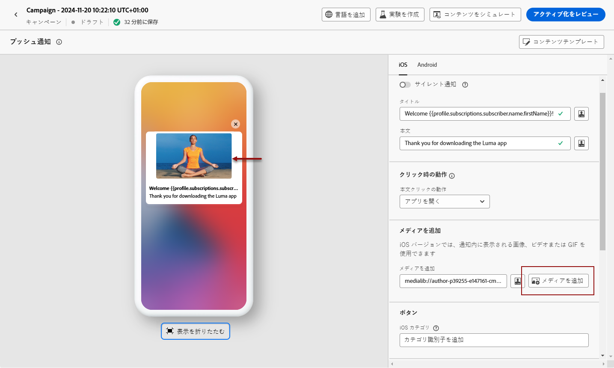

# プッシュ通知のデザイン {#design-push-notification}

## タイトルと本文 {#push-title-body}

メッセージを作成するには **[!UICONTROL Title]** 、「」および **[!UICONTROL Body]** 「フィールド」をクリックします。 エクスプレッションエディターを使用して、コンテンツを定義し、データをパーソナライズし、動的コンテンツを追加します。 エクスプレッションエディターで、パーソナル化 ](../personalization/personalize.md) と [ 動的コンテンツ ](../personalization/get-started-dynamic-content.md) について [ 詳しく説明します。

デバイスプレビューセクションを使用して、iOS および Android デバイスでのプッシュ通知の表示方法を表示します。

## クリック時の動作 {#on-click-behavior}

>[!CONTEXTUALHELP]
>id="ajo-message-push-onclick"
>title="クリック時の動作について"
>abstract="受信者が push 通知の本文をクリックしたときのビヘイビアーを選択します。"

ユーザーが push 通知の body をクリックしたときの動作を選択できます。

* アプリケーションを開くには、オプションを選択 **[!UICONTROL Open app]** します。 通知に関連付けられたアプリケーションは、チャンネルサーフェス ](../configuration/channel-surfaces.md) (メッセージプリセット) に [ 定義されます。
* アプリケーション内で特定のコンテンツをユーザーにリダイレクトするには、このオプションを選択 **[!UICONTROL Deeplink]** します。  特定のビュー、ページの特定のセクション、または特定のタブを指定することができます。 このオプションを選択した後、関連付けられたフィールドにディープリンクを入力します。
* ユーザーが外部 URL にリダイレクトされるようにするには、このオプションを使用 **[!UICONTROL Web URL]** します。 このオプションを選択した後、関連付けられたフィールドに URL を入力します。

## メディアを追加 {#add-media-push}

送受信通知の iOS 版では、通知の中に表示されるイメージ、ビデオまたは GIF を追加することができます。

Android 版では、イメージアイコンおよび展開された通知のイメージのみを追加することができます。

次の2つのオプションを選択できます。 できます：

* ボタンを使用して **[!UICONTROL Add media]** 、で **[!DNL Adobe Experience Manager Assets Essentials]** アセットを選択します。

   このページ ](../email/assets-essentials.md) での [ 使用 **[!DNL Adobe Experience Manager Assets Essentials]** 方法について説明します。

* または、フィールドに **[!UICONTROL Add media]** メディアの URL を入力します。 このような場合は、個人用設定を URL に追加できます。

メディアを追加すると、その内容が通知本文の右側に表示されます。

## ボタンを追加します。 {#add-buttons-push}

ボタンをプッシュコンテンツに追加して、アクション可能な通知を作成します。

デバイス画面がロックされている場合、これらのボタンは表示されません。通知のタイトル **と** メッセージ **だけ** が表示されます。デバイスのロックが解除されている場合は、ボタンが表示されます。

IOS 版では最大4つのボタンを追加することができます。 Android バージョンには、最大で3つのボタンを追加することができます。

>[!NOTE]
>
>IOS の場合は、このフィールドを使用 **[!UICONTROL iOS category]** して、アクションを通知カテゴリーに関連付けます。

1. **[!UICONTROL Add button]**&#x200B;を使用して設定を定義します。ラベルと関連するアクションです。可能なアクションは、クリックしたときの [ 動作 ](#on-click-behavior) と同じです。

1. **[!UICONTROL Expand view]**&#x200B;プレビューイメージの下にあるアイコンを使用して、パーソナライズされたボタンをプレビューします。

## サイレント通知の送信 {#silent-notification}

>[!CONTEXTUALHELP]
>id="ajo_message_push_silent_notification"
>title="サイレント通知について"
>abstract="通知はユーザーに通知せずに送信されるので、通知センターや通知バーに通知が表示されることはありません。"

サイレントプッシュ通知 (バックグラウンド通知) は、アプリケーションに配信される非表示の命令です。 この機能を使用して、新しいコンテンツが使用可能かどうかをアプリケーションに通知したり、バックグラウンドでダウンロードを開始したりできます。

**[!UICONTROL Silent Notification]**&#x200B;アプリケーションに通知を自動的に通知するオプションを選択します。この場合、通知は直接アプリケーションに転送されます。デバイス画面にアラートは表示されません。

キーと値のペアを追加するには、 **[!UICONTROL Custom data]** 「」セクションを使用します。

## カスタムデータ

**[!UICONTROL Custom data]**&#x200B;セクションでは、モバイルアプリケーションの設定に応じて、ペイロードにカスタム変数を追加することができます。Adobe エクスペリエンスプラットフォームと Adobe 発売でのプッシュ通知の設定方法について詳しくは、次の項を [ 参照してください。](push-gs.md)

## 高度なオプション {#advanced-options-push}

Push 通知については、を設定 **[!UICONTROL Advanced options]** することができます。 使用可能なパラメーターは以下のとおりです。

| 指定 | つい |
|---------|---------|
| **[!UICONTROL Collapsible]** (iOS/Android) | 折りたたみ可能なメッセージとは、古くなったメッセージが新しいメッセージに置き換えられる可能性があることを示します。 折りたたみ可能なメッセージとは、サーバーからデータを同期するためにモバイルアプリケーションに対して使用されるメッセージのことです。 例としては、最新のスコアがユーザーによって更新されるスポーツアプリが挙げられます。 最新のメッセージのみが表示されます。 逆に、折りたたみ表示されていないメッセージについては、クライアントアプリケーションにとって重要なメッセージなので、配信が必要になります。 |
| **[!UICONTROL Custom sound]** (iOS/Android) | 通知を受信したときにモバイル端末によって再生されるサウンド。 サウンドはアプリケーションにバンドルされている必要があります。 |
| **[!UICONTROL Badges]** (iOS/Android) | バッジは、アプリケーションアイコン上に直接表示するために使用されます。新しい未読情報の数です。  このバッジの値は、ユーザーがアプリケーションから新しいコンテンツを開いたり読み込んだりするとすぐには表示されなくなります。 デバイスで通知を受信すると、それによって更新されたり、関連するアプリケーションのバッジ値が追加されたりすることができます。 例えば、顧客の未読記事数を保管している場合は、パーソナル化を利用して、顧客ごとに一意の未読記事のバッジ値を送信できます。 パーソナライズについては、この節 ](../personalization/personalize.md) を [ 参照してください。 |
| **[!UICONTROL Notification group]**  (iOS のみ) | 通知先グループを push 通知に関連付けます。 IOS 12 以降では、通知グループを使用して、メッセージスレッドと通知トピックをスレッド Id に整理することができます。 例えば、1つ以上の Id についての操作タイプの通知を使用して、1つのグループ ID の下にマーケティング通知を送信することができます。 このことを説明するために、groupID: 123 &quot;パッケージが配信された&quot; sweaters &quot;および groupID: 456&quot; という &quot;通知グループ&quot; を作成することができます。 この例では、すべての配布通知がグループ ID: 456 にバンドルされています。 |
| **[!UICONTROL Notification channel]** (Android のみ) | 通知チャネルを push 通知に関連付けます。 Android 8.0 (API level 26) では、表示するにはすべての通知がチャネルに割り当てられている必要があります。 詳細については、Android 開発者向けドキュメント ](https://developer.android.com/guide/topics/ui/notifiers/notifications#ManageChannels) を [ 参照してください。 |
| **[!UICONTROL Add content-availability flag]** (iOS のみ) | プッシュ通知の受信直後にアプリが起動されると同時に、そのアプリケーションがペイロードデータにアクセスできるようになるので、コンテンツの利用可能フラグを push ペイロードに送信します。  これは、アプリケーションがバックグラウンドで実行されていて、ユーザーの操作が不要になった場合でも機能します (プッシュ通知上をタップするなど)。 ただし、アプリケーションが実行されていない場合には適用されません。 詳細については、アップル開発者向けドキュメント ](https://developer.apple.com/library/content/documentation/NetworkingInternet/Conceptual/RemoteNotificationsPG/CreatingtheNotificationPayload.html) を [ 参照してください。 |
| **[!UICONTROL Add mutable-content flag]** (iOS のみ) | 可変コンテンツフラグを push ペイロードで送信し、iOS SDK に用意されている notification service アプリケーション拡張機能によってプッシュ通知コンテンツを変更できるようにします。 詳細については、アップル開発者向けドキュメント ](https://developer.apple.com/library/content/documentation/NetworkingInternet/Conceptual/RemoteNotificationsPG/ModifyingNotifications.html) を [ 参照してください。 これにより、モバイルアプリケーション拡張機能を活用して、から [!DNL Journey Optimizer] 送信された受信プッシュ通知のコンテンツやプレゼンテーションをさらに変更することができます。 例えば、ユーザーはこのオプションを使用して、データを復号化したり、通知の本文またはタイトルのテキストを変更することができます。また、通知のスレッド id を追加することもできます。 |
| **[!UICONTROL Notification visibility]** (Android のみ) | Push 通知の表示/非表示を定義します。  <b>「プライベート </b> 」を選択すると、セキュリティで保護された lockscreens で通知が表示されます。  <b></b>すべての lockscreens に通知全体が表示されます。 <b>秘匿 </b> によって、セキュリティーロックされているときに通知の一部が表示されることはありません。  詳細については、Android 開発者向けドキュメント ](https://developer.android.com/reference/android/app/Notification) を参照して [ ください。 |
| **[!UICONTROL Notification priority]** (Android のみ) | Push 通知の重要度を「ロー」から「最大」に定義します。 これにより、プッシュ通知が配信されるときの &quot;侵入&quot; をどのようにするかを指定できます。 詳細については、Android 開発者向けドキュメントを [ 参照してください。](https://developer.android.com/guide/topics/ui/notifiers/notifications#importance) |
| **[!UICONTROL Delivery priority]** (Android のみ) | Push 通知について、高い優先度または通常の優先度を設定します。 メッセージの優先度について詳しくは、Google 開発者向けドキュメント ](https://firebase.google.com/docs/cloud-messaging/concept-options#setting-the-priority-of-a-message) を [ 参照してください。 |
