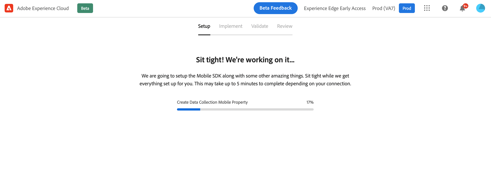

# モバイルオンボーディングのクイックスタートワークフロー {#mobile-wf}

新しい&#x200B;**モバイルオンボーディングのクイックスタートワークフロー**&#x200B;は、Adobe Experience Platform Mobile SDK を迅速に設定し、モバイルイベント データの収集と検証を開始し、[!DNL Journey Optimizer] でプッシュ通知を送信するための新しい製品機能です。

この機能は、パブリックベータ版としてすべてのお客様が **[!DNL Adobe Experience Platform Data Collection]** ホームページからアクセスできます。

## 基本を学ぶ{#gs-mobile-wf}

この新しいワークフローは、合計クリック数を減らし、Journey Optimizer のモバイル設定を高速化することで、データ収集の設定を自動化します。このクイックスタートワークフローでは、4 つの簡単な手順に従って、モバイル設定を[設定](##setup-mobile-wf)、[実装](#implement-mobile-wf)、[検証](#valid-mobile-wf)、[レビュー](#review-mobile-wf)できます。

新しいモバイルオンボーディングクイックスタートワークフローにアクセスするには、ソリューション切り替えツールから **[!DNL Data Collection]** を参照します。次に、ホームページで **[!DNL Start Collecting Mobile Data]** カードを選択します。

一部の追加機能を以下に示します。

* 4 つの簡単な手順のワークフローとユーザーインターフェイス。
* [Adobe Experience Platform Mobile SDK](https://developer.adobe.com/client-sdks/documentation/){target="_blank"} を介してモバイルイベントデータの収集を数分で開始するための基本的な設定を提供します。
* [Adobe Experience Platform Assurance](https://experienceleague.adobe.com/docs/experience-platform/assurance/home.html?lang=ja){target="_blank"} を活用して、基本的なモバイルプッシュイベントをテストおよび検証する機能。
* 必要なすべてのデータ収集と Journey Optimizer アセットを自動で作成および設定します。
* 製品ガイダンスとツールヒント。
* 必要に応じて、より高度な実装へと自然に移行できます。

## 設定 {#setup-mobile-wf}

このワークフローの最初の手順では、必要なすべてのデータ収集と Journey Optimizer アセット（モバイルプロパティ、モバイル拡張機能、Journey Optimizer 拡張機能、ルール、データ要素など）を自動で作成および設定します。

ベータ版利用条件に同意したら、モバイルアプリの名前を入力し、「**[!DNL Next]**」をクリックします。

アプリ ID と認証キーキー ファイルをなど、iOS および Android プラットフォームの情報を入力します。

## 実装方法{#implement-mobile-wf}

次の手順では、モバイルアプリにコードをインストールする手順を説明します。

## 検証{#valid-mobile-wf}

実装をレビューおよび確認して、検証します。テストプッシュ通知を送信します。

## レビュー {#review-mobile-wf}

自動設定が完了しました。これで、タグモバイルプロパティにアクセスしてルールまたはデータ要素を設定し、Adobe Journey Optimizer でプッシュ通知の送信を開始できます。

**関連トピック**

* [プッシュ通知の基本を学ぶ](../../rp_landing_pages/push-landing-page.md)
* [プッシュ通知のデータフローとコンポーネント](push-gs.md)
* [プッシュチャネルの設定](push-configuration.md)
* [プッシュ通知レポート](../reports/journey-global-report-cja-push.md#push-global)
* [プッシュ通知の作成](create-push.md)
