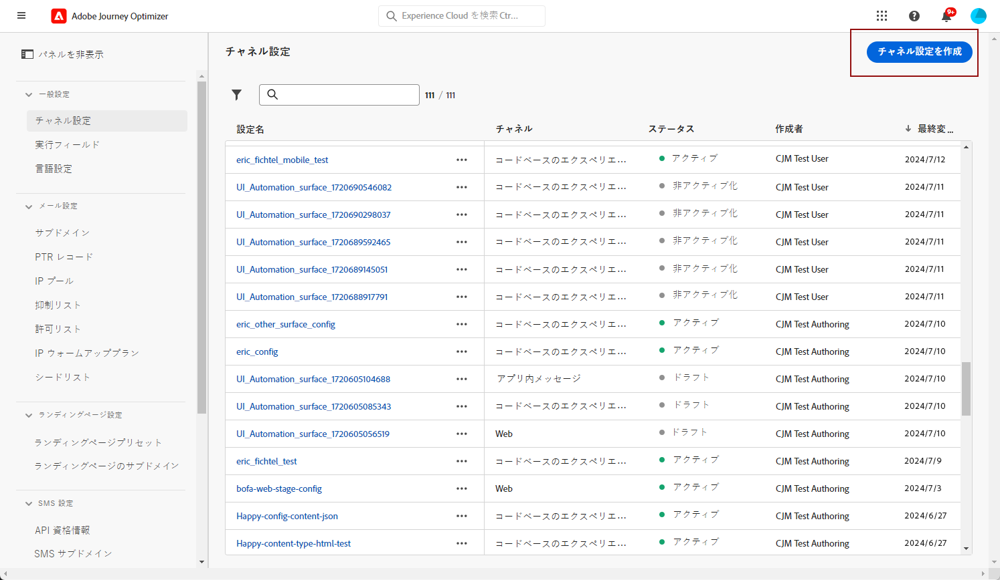

# Web プッシュ通知チャネルの設定 {#push-notification-configuration}

[!DNL Journey Optimizer] では、ジャーニーを作成し、ターゲットとなるオーディエンスにメッセージを送信できます。[!DNL Journey Optimizer] で web プッシュ通知の送信を開始する前に、Adobe Experience Platformで設定と統合が行われていることを確認する必要があります。 [!DNL Adobe Journey Optimizer] でのプッシュ通知のデータフローについては、[このページ](push-gs.md)を参照してください。

>[!AVAILABILITY]
>
>新しい&#x200B;**モバイルオンボーディングのクイックスタートワークフロー**&#x200B;が利用できるようになりました。この新しい製品機能を使用すると、Mobile SDK を迅速に設定し、モバイルイベント データの収集と検証を開始し、モバイルプッシュ通知を送信できます。この機能は、パブリックベータ版としてデータ収集ホームページから入手できます。[詳細情報](mobile-onboarding-wf.md)
>

## 開始する前に {#start-push}

### 権限の設定 {#setup-permissions}

モバイルアプリケーションを作成する前に、まず、Adobe Experience Platform のタグに適切なユーザー権限が既にあるか、もしくは割り当てられているかを確認する必要があります。詳しくは、[タグのドキュメント](https://experienceleague.adobe.com/docs/experience-platform/tags/admin/user-permissions.html?lang=ja){target="_blank"}を参照してください。

>[!CAUTION]
>
>プッシュ設定は、エキスパートユーザーが実行する必要があります。実装モデルとこの実装に関わるペルソナに応じて、権限のすべてを単一の製品プロファイルに割り当てるか、アプリ開発者と **Adobe Journey Optimizer** 管理者の間で権限を共有する必要が生じる場合があります。**タグ**&#x200B;の権限について詳しくは、[このドキュメント](https://experienceleague.adobe.com/docs/experience-platform/tags/admin/user-permissions.html?lang=ja){target="_blank"}を参照してください。

<!--ou need to your have access to perform following roles :

* Manage Datastreams
* Manage Client-side Properties
* Manage App Configurations
-->

**プロパティ**&#x200B;と&#x200B;**会社**&#x200B;の権限を割り当てるには、次の手順に従います。

1. **[!DNL Admin Console]** にアクセスします。

1. 「**[!UICONTROL 製品]**」タブから、**[!UICONTROL Adobe Experience Platform データ収集]**&#x200B;カードを選択します。

   

1. 既存の&#x200B;**[!UICONTROL 製品プロファイル]**&#x200B;を選択するか、「**[!UICONTROL 新規プロファイル]**」ボタンで新しい製品プロファイルを作成します。**[!UICONTROL 新しいプロファイル]**&#x200B;を作成する方法については、[Admin Console のドキュメント](https://experienceleague.adobe.com/docs/experience-platform/access-control/ui/create-profile.html?lang=ja#ui){target="_blank"}を参照してください。

1. 「**[!UICONTROL 権限]**」タブで、「**[!UICONTROL プロパティ権限]**」を選択します。

   

1. 「**[!UICONTROL すべて追加]**」をクリックします。これにより、製品プロファイルに次の権限が追加されます。
   * **[!UICONTROL 承認]**
   * **[!UICONTROL 開発]**
   * **[!UICONTROL 環境の管理]**
   * **[!UICONTROL 拡張機能の管理]**
   * **[!UICONTROL 公開]**

   これらの権限は、 Adobe Journey Optimizer 拡張機能をインストールして公開し、Adobe Experience Platform Mobile SDK でアプリプロパティを公開するために必要です。

1. 次に、左側のメニューで「**[!UICONTROL 会社権限]**」を選択します。

   

1. 次の権限を追加します。

   * **[!UICONTROL アプリ設定の管理]**
   * **[!UICONTROL プロパティの管理]**

   モバイルアプリ開発者が **Adobe Experience Platform データ収集**&#x200B;でプッシュ資格情報を設定し、**Adobe Journey Optimizer** でプッシュ通知チャネル設定（メッセージプリセット）を定義するには、これらの権限が必要です。

   

1. 「**[!UICONTROL 保存]**」をクリックします。

この&#x200B;**[!UICONTROL 製品プロファイル]**&#x200B;をユーザーに割り当てるには、次の手順に従います。

1. **[!DNL Admin Console]** にアクセスします。

1. 「**[!UICONTROL 製品]**」タブから、**[!UICONTROL Adobe Experience Platform データ収集]**&#x200B;カードを選択します。

1. 以前に設定した&#x200B;**[!UICONTROL 製品プロファイル]**&#x200B;を選択します。

1. 「**[!UICONTROL ユーザー]**」タブで「**[!UICONTROL ユーザーを追加]**」をクリックします。

   

1. ユーザーの名前またはメールアドレスを入力し、ユーザーを選択します。次に、「**[!UICONTROL 保存]**」をクリックします。

   >[!NOTE]
   >
   >Admin Console でユーザーをまだ作成していない場合は、[ユーザーの追加に関するドキュメント](https://helpx.adobe.com/jp/enterprise/admin-guide.html/enterprise/using/manage-users-individually.ug.html#add-users)を参照してください。

   

### データセットの確認 {#push-datasets}

プッシュ通知チャネルでは、次のスキーマとデータセットを使用できます。

| スキーマ データセット | フィールドのグループ | 操作 |
| -------------------------------------------------------------------------------------- | --------------------------------------------------------------------------------------------------------------------------------------------------------------------------------------- | -------------------------------------------------------- |
| CJM プッシュプロファイルスキーマ  CJM プッシュプロファイルデータセット | プッシュ通知の詳細  Adobe CJM ExperienceEvent - メッセージプロファイルの詳細  Adobe CJM ExperienceEvent - メッセージ実行の詳細 アプリケーションの詳細 環境の詳細 | プッシュトークンを登録 |
| CJM プッシュトラッキングエクスペリエンスイベントスキーマ  CJM プッシュトラッキングエクスペリエンスイベントデータセット | プッシュ通知トラッキング | インタラクションを追跡し、レポート UI にデータを提供 |

>[!NOTE]
>
>プッシュトラッキングイベントが CJM プッシュトラッキングエクスペリエンスイベントデータセットに取り込まれると、データの一部が正常に取り込まれたとしても、いくつかの失敗が発生する場合があります。これは、マッピング内の一部のフィールドが受信イベントに存在しない場合に発生する場合があります。警告はログに記録されますが、データの有効な部分の取り込みは防ぎません。これらの警告は、バッチステータスに「失敗」として表示されますが、部分的な取り込みの成功を反映しています。
>
>各スキーマのフィールドと属性の完全なリストを表示するには、[Journey Optimizer スキーマ辞書](https://experienceleague.adobe.com/tools/ajo-schemas/schema-dictionary.html?lang=ja){target="_blank"}を参照してください。

### pushNotification プロパティの設定 {#push-property}

**Web プッシュ通知** を有効にするには、まず [pushNotifications プロパティ &#x200B;](https://experienceleague.adobe.com/en/docs/experience-platform/collection/js/commands/configure/pushnotifications) が web SDK内で適切に設定されていることを確認する必要があります。 このプロパティは、Web アプリケーションによるプッシュ通知の処理方法を制御します。

さらに、Journey Optimizerで [&#x200B; アプリのプッシュ資格情報 &#x200B;](#push-credentials-launch) を設定するために必要な VAPID キーを生成する必要があります。

## 手順 1：Journey Optimizer でのアプリのプッシュ資格情報の追加 {#push-credentials-launch}

正しいユーザー権限を付与した後、モバイルアプリケーションのプッシュ資格情報を Journey Optimizer に追加する必要があります。

モバイルアプリのプッシュ資格情報の登録は、自分の代わりに Adobe がプッシュ通知を送信することを承認するために必要です。以下に説明する手順を参照してください。

1. **[!UICONTROL チャネル]**／**[!UICONTROL プッシュ設定]**／**[!UICONTROL プッシュ資格情報]**&#x200B;メニューにアクセスします。

1. 「**[!UICONTROL プッシュ認証情報を作成]**」をクリックします。

1. **[!UICONTROL Platform]** ドロップダウンから「**[!UICONTROL Web]**」を選択します。

   

1. **[!UICONTROL アプリ ID]** を指定します。

1. **[!UICONTROL VAPID 公開鍵]**&#x200B;および&#x200B;**[!UICONTROL 秘密鍵]**&#x200B;を入力します。

1. 「**[!UICONTROL 送信]**」をクリックして、アプリ設定を作成します。

## 手順 2：プッシュ用のチャネル設定の作成{#message-preset}

プッシュ資格情報を作成したら、**[!DNL Journey Optimizer]** からプッシュ通知を送信できるように、設定を作成する必要があります。

1. **[!UICONTROL チャネル]**／**[!UICONTROL 一般設定]**／**[!UICONTROL チャネル設定]**&#x200B;メニューにアクセスし、「**[!UICONTROL チャネル設定を作成]**」をクリックします。

   

1. 設定の名前と説明（オプション）を入力します。

   >[!NOTE]
   >
   > 名前は、文字（A ～ Z）で始める必要があります。使用できるのは英数字のみです。アンダースコア（`_`）、ドット（`.`）、ハイフン（`-`）も使用できます。

1. 設定にカスタムまたはコアのデータ使用ラベルを割り当てるには、「**[!UICONTROL アクセスを管理]**」を選択します。[詳しくは、オブジェクトレベルのアクセス制御（OLAC）を参照してください](../administration/object-based-access.md)。

1. **プッシュ**&#x200B;チャネルを選択します。

   

1. この設定を使用してメッセージに同意ポリシーを関連付けるには、**[!UICONTROL マーケティングアクション]**&#x200B;を選択します。顧客の意向に従うために、そのマーケティングアクションに関連付けられているすべての同意ポリシーが活用されます。[詳細情報](../action/consent.md#surface-marketing-actions)

1. **[!UICONTROL プラットフォーム]**（Android、iOS、web）を選択します。

1. 上記で設定した[プッシュ資格情報](#push-credentials-launch)と同じ&#x200B;**[!UICONTROL アプリ ID]** を選択します。

1. 変更を保存します。

プッシュ通知を作成する際に、設定を選択できるようになりました。

## 手順 3:sendPushSubscription プロパティの設定 {#sendPushSubscription-property}

プッシュ資格情報とチャネル設定を設定したら、web アプリケーションに [sendPushSubscription コマンド &#x200B;](https://experienceleague.adobe.com/en/docs/experience-platform/collection/js/commands/sendpushsubscription) を実装する必要があります。 このコマンドは、ユーザーのプッシュ通知をAdobe Experience Platformに登録します。これにより、どのユーザーがプッシュ通知を受け取り、購読ステータスを管理するかをシステムが追跡できるようになります。 この登録は、Journey Optimizerがターゲットを設定したプッシュ通知をユーザーに送信するために不可欠です。

## 手順 4：イベントでモバイルアプリのテスト {#mobile-app-test}

Adobe Experience Platformと [!DNL Adobe Experience Platform Data Collection] の両方で web プッシュ設定を完了したら、web プッシュ通知をプロファイルに送信する前に、実装をテストできます。 テストにより、購読が正しく登録され、ユーザーのブラウザーに通知が正しく配信されます。

Web プッシュ設定を検証するイベントを含むテストジャーニーの作成に関する詳細な手順については、[&#x200B; モバイルアプリのプッシュ通知設定のドキュメント &#x200B;](push-configuration.md) を参照してください。このドキュメントでは、モバイルチャネルと web プッシュチャネルの両方に適用できる包括的なテストワークフローを提供します。
