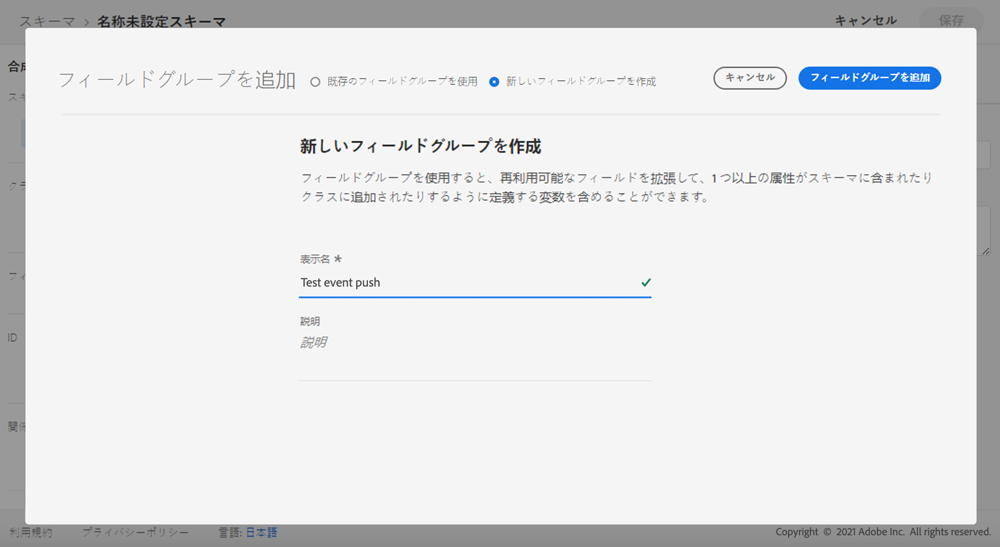
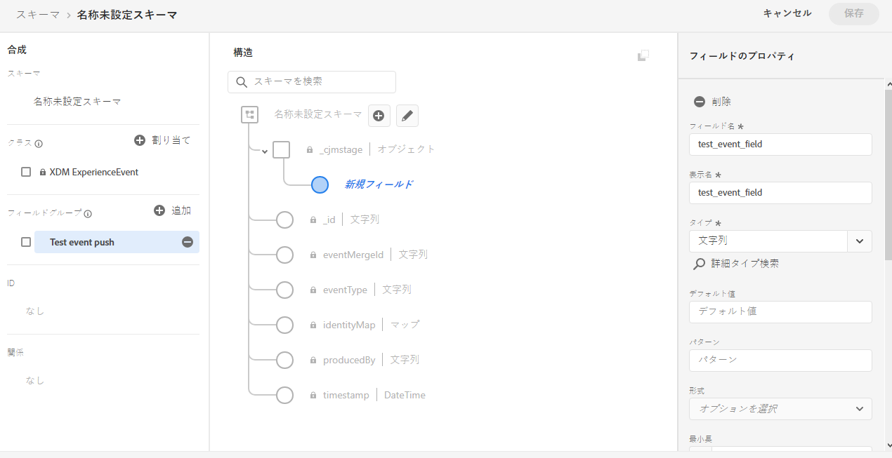

# プッシュ通知チャネルの設定 {#push-notification-configuration}

[!DNL Journey Optimizer] journeys を作成し、対象ユーザーにメッセージを送信することができます。 で [!DNL Journey Optimizer] のプッシュ通知の送信を開始する前に、Adobe エクスペリエンスプラットフォームのモバイルアプリケーションおよびタグについて、設定と統合が行われているかどうかを確認する必要があります。 Push 通知のデータフローに [!DNL Adobe Journey Optimizer] ついて詳しくは、このページ ](push-gs.md) を [ 参照してください。

## 開始する前に {#before-starting}

<!--
### Check provisioning

Your Adobe Experience Platform account must be provisioned to contain following schemas and datasets for push notification data flow to function correctly:

| Schema <br>Dataset                                                                       | Group of fields                                                                                                                                                                         | Operation                                                |
| -------------------------------------------------------------------------------------- | --------------------------------------------------------------------------------------------------------------------------------------------------------------------------------------- | -------------------------------------------------------- |
| CJM Push Profile Schema <br>CJM Push Profile Dataset                                     | Push Notification Details<br>Adobe CJM ExperienceEvent - Message Profile Details<br>Adobe CJM ExperienceEvent - Message Execution Details<br>Application Details<br>Environment Details | Register Push Token                                      |
| CJM Push Tracking Experience Event Schema<br>CJM Push Tracking Experience Event Dataset | Push Notification Tracking                                                                                                                                                              | Track interactions and provide data for the reporting UI |
-->

### 権限を設定します。 {#setup-permissions}

モバイルアプリケーションを作成する前に、まず Adobe エクスペリエンスプラットフォームに、タグに対する適切なユーザーアクセス許可があるかどうかを確認する必要があります。 タグ ](https://experienceleague.adobe.com/docs/experience-platform/tags/admin/user-permissions.html) について詳しくは、{target = &quot;_blank&quot;} を [ 参照してください。

>[!CAUTION]
>
>プッシュ設定は、エキスパートユーザーが実行する必要があります。 この実装にかかわる実装モデルとペルソナによっては、アプリケーション開発者と Adobe の **旅のオプティマイザー** 管理者との間で、完全なアクセス許可のセットを割り当てたり、共有のアクセス許可を割り当てたりすることが必要な場合があります。 このマニュアル ](https://experienceleague.adobe.com/docs/experience-platform/tags/admin/user-permissions.html) の「タグ **」パーミッションについて詳しくは、{target = &quot;_blank 「}」を [ 参照して** ください。

<!--ou need to your have access to perform following roles :

* Manage Datastreams
* Manage Client-side Properties
* Manage App Configurations
-->

プロパティ **および** 会社 **の権限を割り当てる** には、次の手順を実行します。

1. に **[!DNL Admin Console]** アクセスします。

1. **[!UICONTROL Products]**&#x200B;タブで、カードを選択 **[!UICONTROL Adobe Experience Platform Data Collection]** します。

   

1. ボタンを使用して **[!UICONTROL New profile]** 、既存 **[!UICONTROL Product Profile]** のものを選択するか、または新しいボタンを作成します。管理コンソール ](https://experienceleague.adobe.com/docs/experience-platform/access-control/ui/create-profile.html#ui) で新規 **[!UICONTROL New profile]** 作成を行う方法については、{target = &quot;_blank 「}」を参照して [ ください。

1. **[!UICONTROL Permissions]**&#x200B;タブで、を選択 **[!UICONTROL Property rights]** します。

   

1. をクリック **[!UICONTROL Add all]** します。 これにより、次の権利が製品プロファイルに追加されます。
   * **[!UICONTROL Approve]**
   * **[!UICONTROL Develop]**
   * **[!UICONTROL Manage Environments]**
   * **[!UICONTROL Manage Extensions]**
   * **[!UICONTROL Publish]**

   これらの権限は、Adobe の旅オプティマイザー拡張機能をインストールしてパブリッシュし、Adobe エクスペリエンス Platform Mobile SDK に公開するために必要です。

1. 次に、左側のメニューで「」を選択 **[!UICONTROL Company rights]** します。

   

1. 以下の権限を追加します。

   * **[!UICONTROL Manage App Configurations]**
   * **[!UICONTROL Manage Properties]**

   モバイルアプリケーションの開発者は、adobe エクスペリエンスプラットフォームデータコレクション **に** プッシュ認証情報を設定し、Adobe の旅オプティマイザー **で** プッシュ通知チャンネルサーフェス (メッセージプリセット) を定義するために、これらの権限が必要です。

   

1. をクリック **[!UICONTROL Save]** します。

この **[!UICONTROL Product profile]** 設定をユーザーに割り当てるには、次の手順を実行します。

1. に **[!DNL Admin Console]** アクセスします。

1. **[!UICONTROL Products]**&#x200B;タブで、カードを選択 **[!UICONTROL Adobe Experience Platform Data Collection]** します。

1. 以前に設定した設定 **[!UICONTROL Product profile]** を選択します。

1. **[!UICONTROL Users]**&#x200B;タブでをクリック **[!UICONTROL Add user]** します。

   

1. ユーザーの名前または電子メールアドレスを入力して、ユーザーを選択します。 次に、をクリック **[!UICONTROL Save]** します。

   >[!NOTE]
   >
   >ユーザーが以前に管理コンソールで作成されていない場合は、ユーザーマニュアル ](https://helpx.adobe.com/enterprise/admin-guide.html/enterprise/using/manage-users-individually.ug.html#add-users) の [ 追加を参照してください。

   

### アプリケーションの設定 {#configure-app}

技術設定には、app developer と business administrator との間の共同作業が必要です。 での [!DNL Journey Optimizer] プッシュ通知の送信を開始する前に、の設定 [!DNL Adobe Experience Platform Data Collection] を定義し、モバイルアプリケーションと Adobe エクスペリエンスプラットフォーム mobile sdk を統合する必要があります。

以下のリンクを参照してください。

* Apple iOS **について: アップルで [ 作成されるアプリケーションの登録方法について** は、apple のマニュアル ](https://developer.apple.com/documentation/usernotifications/registering_your_app_with_apns) を参照してください。 {target = &quot;_blank&quot;}
* Google Android **の場合: Android [ での焼討ベースクラウドメッセージクライアントアプリケーションのセットアップ方法については、Google のドキュメント ](https://firebase.google.com/docs/cloud-messaging/android/client) を参照して** ください。 {target = &quot;_blank&quot;}

### モバイルアプリと Adobe エクスペリエンス Platform SDK の統合 {#integrate-mobile-app}

Adobe エクスペリエンス Platform Mobile SDK は、Android および iOS 互換の Sdk を使用して、モバイル用のクライアントサイド統合 Api を提供します。 [Adobe エクスペリエンス Platform MOBILE SDK のマニュアル ](https://aep-sdks.gitbook.io/docs/getting-started/overview) {target = &quot;_blank&quot;} を使用して、アプリで Adobe エクスペリエンス Platform mobile sdk を使ったセットアップを取得してください。

さらに、で [!DNL Adobe Experience Platform Data Collection] モバイルプロパティを作成して設定する必要がありました。 通常は、管理対象となるモバイルアプリケーションごとに mobile プロパティを作成します。 Adobe エクスペリエンス Platform Mobile SDK マニュアル ](https://aep-sdks.gitbook.io/docs/getting-started/create-a-mobile-property) {target = &quot;_blank&quot;} で [ モバイルプロパティを作成および設定する方法について説明します。


## 手順 1: Adobe エクスペリエンス Platform データコレクションへのアプリケーションプッシュ認証情報の追加 {#push-credentials-launch}

適切なユーザー権限を付与した後は、で [!DNL Adobe Experience Platform Data Collection] モバイルアプリケーションプッシュ認証情報を追加する必要があります。

モバイルアプリのプッシュ認証情報を登録すると、Adobe が push 通知をユーザーの代わりに送信することを承認することが必要になります。 以下の手順を参照してください。

1. から [!DNL Adobe Experience Platform Data Collection] 、左側のパネルで「タブ」を選択 **[!UICONTROL App Surfaces]** します。

1. 新しい設定を作成するには、をクリック **[!UICONTROL Create App Surface]** します。

   

1. コンフィギュレーションのを **[!UICONTROL Name]** 入力します。

1. から **[!UICONTROL Mobile Application Configuration]** 、オペレーショナルシステムを選択します。

   * **IOS 用**

      

      1. モバイルアプリ **バンドル Id** をボックスに **[!UICONTROL App ID (iOS Bundle ID)]** 入力します。 アプリバンドル ID は、XCode **のプライマリターゲット** の「一般 **」タブに** あります。

      1. **[!UICONTROL Push Credentials]**&#x200B;ボタンをクリックすると、資格情報が追加されます。

      1. P8 Apple Push Notification 認証キーファイルをドラッグ &amp; ドロップします。 このキーは、 **証明書** 、 **識別子** 、および **プロファイル** ページで取得することができます。

      1. キー ID **を** 指定します。これは、p8 auth key の作成中に割り当てられた10文字のストリングです。 これは、証明書 **、** 識別子 **** 、プロファイル **ページの「** キー **」タブに** あります。

      1. チーム ID **を** 指定します。これは、メンバーシップタブにあるストリング値です。
   * **For Android**

      

      1. 次の情報を指定します。通常、 **[!UICONTROL App ID (Android package name)]** パッケージ名はファイルの `build.gradle` アプリケーション id です。

      1. **[!UICONTROL Push Credentials]**&#x200B;ボタンをクリックすると、資格情報が追加されます。

      1. FCM プッシュ認証情報をドラッグ &amp; ドロップします。 プッシュ認証情報を取得する方法について詳しくは、Google のドキュメント ](https://firebase.google.com/docs/admin/setup#initialize-sdk) {target = &quot;_blank&quot;} を [ 参照してください。


1. アプリ設定を作成するには、をクリック **[!UICONTROL Save]** します。

<!--
## Step 2: Set up a mobile property in Adobe Experience Platform Launch {#launch-property}

Setting up a mobile property allows the mobile app developer or marketer to configure the mobile SDKs attributes such as Session Timeouts, the [!DNL Adobe Experience Platform] sandbox to be targeted and the **[!UICONTROL Adobe Experience Platform Datasets]** to be used for mobile SDK to send data to.

For further details and procedures on how to set up a **[!UICONTROL Platform Launch property]**, refer to the steps detailed in [Adobe Experience Platform Mobile SDK documentation](https://aep-sdks.gitbook.io/docs/getting-started/create-a-mobile-property#create-a-mobile-property).


To get the SDKs needed for push notification to work you will need the following SDK extensions, for both Android and iOS:

* **[!UICONTROL Mobile Core]** (installed automatically)
* **[!UICONTROL Profile]** (installed automatically)
* **[!UICONTROL Adobe Experience Platform Edge]**
* **[!UICONTROL Adobe Experience Platform Assurance]**, optional but recommended to debug the mobile implementation.

Learn more about [!DNL Adobe Experience Platform Launch] extensions in [Adobe Experience Platform Launch documentation](https://experienceleague.adobe.com/docs/launch-learn/implementing-in-mobile-android-apps-with-launch/configure-launch/launch-add-extensions.html).
-->

## 手順 2: mobile プロパティを使用して Adobe 旅の最適化機能を設定する {#configure-journey-optimizer-extension}

アドビシステムズ社の adobe エクスペリエンスプラットフォーム用モバイル Sdk 用拡張機能 **によって、モバイルアプリケーション用のプッシュ通知が強化され** 、ユーザープッシュトークンが収集され、Adobe エクスペリエンスプラットフォームサービスとの連携測定が容易になります。

Adobe エクスペリエンス Platform Mobile SDK マニュアル ](https://aep-sdks.gitbook.io/docs/using-mobile-extensions/adobe-journey-optimizer) {target = &quot;_blank&quot;} の中で、旅の [ オプティマイザー拡張機能を設定する方法について説明します。


<!-- 
**[!UICONTROL Edge configuration]** is used by **[!UICONTROL Edge]** extension to send custom data from mobile device to [!DNL Adobe Experience Platform]. 
To configure [!DNL Adobe Experience Platform], you must provide the **[!UICONTROL Sandbox]** name and **[!UICONTROL Event Dataset]**.

For further details and procedures on how to create **[!UICONTROL Edge configuration]**, refer to the steps detailed in [Adobe Experience Platform Mobile SDK documentation](https://aep-sdks.gitbook.io/docs/getting-started/configure-datastreams).

1. From [!DNL Adobe Experience Platform Launch], select the **[!UICONTROL Edge Configurations]** tab and click **[!UICONTROL Edge Configurations]**.
    
1. Select **[!UICONTROL New Edge Configuration]** to add a new **[!UICONTROL Edge Configuration]**.
1. Enter a **[!UICONTROL Name]** and click **[!UICONTROL Save]**

1. Click the **[!UICONTROL Adobe Experience Platform]** toggle to enable it.

1. Fill in the **[!UICONTROL Sandbox]**, **[!UICONTROL Event dataset]** and **[!UICONTROL Profile Dataset]** fields. Then, click **[!UICONTROL Save]**.
    
    


1. From [!DNL Adobe Experience Platform Launch], ensure that **[!UICONTROL Client Side]** is selected in the drop-down menu.

1. select the **[!UICONTROL Properties]** tab and click **[!UICONTROL New Property]**.

    

1. Enter a **[!UICONTROL Name]** for your new property.

1. Select **[!UICONTROL Mobile]** as **[!UICONTROL Platform]**.

    

1. Click **[!UICONTROL Save]** to create your new property.

To configure **[!UICONTROL Adobe Experience Platform Edge Extension]** to send custom data from mobile devices to [!DNL Adobe Experience Platform].

1. Select your previously created property and select the **[!UICONTROL Extensions]** tab to view the extensions for this property.

    

1. Click **[!UICONTROL Configure]** under the **[!UICONTROL Adobe Experience Platform Edge]** Network' extension.

1. From the **[!UICONTROL Edge Configuration]** drop-down list, select the **[!UICONTROL Edge Configuration]** created in the previous steps. For more information on **[!UICONTROL Edge Configuration]**, refer to this [section](#edge-configuration).

1. Click **[!UICONTROL Save]**.

To configure **[!UICONTROL Adobe Experience Platform Messaging]** extension to send push profile and push interactions to the correct datasets, follow the same steps as above. Use **[!UICONTROL Sandbox]**, **[!UICONTROL Event dataset]** and **[!UICONTROL Profile Dataset]** created in the [Adobe Experience Platform setup](#edge-configuration).
-->

<!--
## Step 4: Publish the Property {#publish-property}

You now need to publish the property to integrate your configuration and to use it in the mobile app. 

To publish your property, refer to the steps detailed in [Adobe Experience Platform Mobile SDK documentation](https://aep-sdks.gitbook.io/docs/getting-started/create-a-mobile-property#publish-the-configuration)

## Step 5: Configure the ProfileDataSource {#configure-profiledatasource}

To configure the `ProfileDataSource`, use the `ProfileDCInletURL` from [!DNL Adobe Experience Platform] setup and add the following in the mobile app:

```
    MobileCore.updateConfiguration(
    mutableMapOf("messaging.dccs" to <ProfileDCSInletURL>)
```

-->

## 手順 3: イベントを使用したモバイルアプリケーションのテスト {#mobile-app-test}

Adobe エクスペリエンスプラットフォームとで [!DNL Adobe Experience Platform Data Collection] モバイルアプリを設定した後は、プロファイルにプッシュ通知を送信する前に、テストすることができます。 この例では、モバイルアプリケーションを対象とするように旅を作成し、push 通知をトリガーするイベントを設定します。

<!--
You can use a test mobile app for this use case. For more on this, refer to this [page](https://wiki.corp.adobe.com/pages/viewpage.action?spaceKey=CJM&title=Details+of+setting+the+mobile+test+app) (internal use only).
-->

このような旅を動くには、XDM スキーマを作成する必要があります。 詳しくは、XDM のマニュアル ](https://experienceleague.adobe.com/docs/experience-platform/xdm/schema/composition.html#schemas-and-data-ingestion) を参照してください {target = &quot;_blank 「}」を [ 参照してください。

1. 左側のメニューで、を **[!UICONTROL Schemas]** 参照します。

1. 「」を **[!UICONTROL XDM ExperienceEvent]** クリック **[!UICONTROL Create schema]** します。

   

1. を選択 **[!UICONTROL Create a new field group]** します。

1. **[!UICONTROL Display Name]**「And」と **[!UICONTROL Description]** 入力します。「完了」をクリックし **[!UICONTROL Add field groups]** ます。 フィールドグループの作成方法について詳しくは、XDM システムのマニュアル ](https://experienceleague.adobe.com/docs/experience-platform/xdm/tutorials/create-schema-ui.html) を参照してください {target = &quot;_blank 「}」を [ 参照してください。


   

1. 左側で、スキーマを選択します。 右側のペインに、スキーマと説明の名前を入力します。 このスキーマ **[!UICONTROL Profile]** を有効にします。

   


1. 左側のフィールドグループを選択してから、「+」アイコンをクリックして新しいフィールドを作成します。 **[!UICONTROL Field groups properties]**&#x200B;で、右側のに「a **[!UICONTROL Field name]** **[!UICONTROL Display name]** 」と入力し、「as **[!UICONTROL Type]** 」を選択 **[!UICONTROL String]** します。

   

1. チェックボックスをオン **[!UICONTROL Required]** にし、をクリック **[!UICONTROL Apply]** します。

1. をクリック **[!UICONTROL Save]** します。 これで、スキーマが作成され、イベントで使用できるようになりました。

その後、イベントを設定する必要があります。

1. ホームページの左のメニューから、「管理」の下の「」を選択 **[!UICONTROL Configurations]** します。 セクション内 **[!UICONTROL Events]** をクリック **[!UICONTROL Manage]** して、新しいイベントを作成します。

1. ボタンをクリック **[!UICONTROL Create Event]** すると、画面の右側に「イベント設定」ペインが表示されます。

   

1. イベントの名前を入力します。 説明を追加することもできます。

1. **[!UICONTROL Event ID type]**&#x200B;フィールドで、を選択 **[!UICONTROL Rule Based]** します。

1. **[!UICONTROL Parameters]**&#x200B;で、以前に作成したスキーマを選択します。

   

1. フィールドのリストで、「スキーマ」フィールドグループで作成したフィールドが選択されていることを確認します。

   

1. フィールド内を **[!UICONTROL Event ID condition]** クリックし **[!UICONTROL Edit]** ます。前に追加したフィールドをドラッグ &amp; ドロップして、システムで使用される条件を定義します。これによって、旅をトリガーするイベントが識別されます。

   

1. テストアプリケーションでプッシュ通知をトリガーするために使用する構文を入力します。この例 **では、注文確認** が行われます。

   

1. **[!UICONTROL Namespace]**「」を選択 **[!UICONTROL ECID]** します。

1. 「次 **[!UICONTROL Save]** へ」をクリック **[!UICONTROL Ok]** します。

これで、イベントが作成され、旅に使用できるようになりました。

1. 左側のメニューで、をクリック **[!UICONTROL Journeys]** します。

1. 新しい旅を作成するには、これをクリック **[!UICONTROL Create Journey]** します。

1. 右側に表示される設定ペインで、その旅のプロパティを編集します。 詳しくは、ここを [ ](../building-journeys/journey-gs.md#change-properties) 参照してください。

1. 前の手順で作成したイベントをドロップダウンから **[!UICONTROL Events]** ドラッグ &amp; ドロップして開始します。

   

1. **[!UICONTROL Actions]**&#x200B;ドロップダウンリストから、フライトにアクティビティをドラッグ &amp; ドロップ **[!UICONTROL Push]** します。

1. プッシュ通知を設定します。 プッシュ通知を作成する方法について詳しくは、この [ ページ ](create-push.md) を参照してください。

1. プッシュ通知のテストを開始するには、 **[!UICONTROL Test]** 「切り替え」をクリックして、をクリック **[!UICONTROL Trigger an event]** します。

   

1. フィールドに **[!UICONTROL Key]** 「d」と入力します。次に、2番目のフィールドに注文の **確認** を入力します。

   

1. をクリック **[!UICONTROL Send]** します。

イベントがトリガーされ、モバイルアプリケーションにプッシュ通知が送信されます。

## 手順 4: プッシュ用のチャンネルサーフェスの作成{#message-preset}

で [!DNL Adobe Experience Platform Data Collection] モバイルアプリを設定した後は、から **[!DNL Journey Optimizer]** プッシュ通知を送信できるようにするためのサーフェスを作成する必要があります。

この節 ](../configuration/channel-surfaces.md) で [ は、チャネルサーフェスを作成および設定する方法について説明します。

これで、旅のオプティマイザーを使用して、プッシュ通知を送信する準備ができました。

* このページ ](create-push.md) で [ 、プッシュメッセージを作成する方法について説明します。
* この節 ](../building-journeys/journeys-message.md) で [ は、旅にメッセージを追加する方法について説明します。
