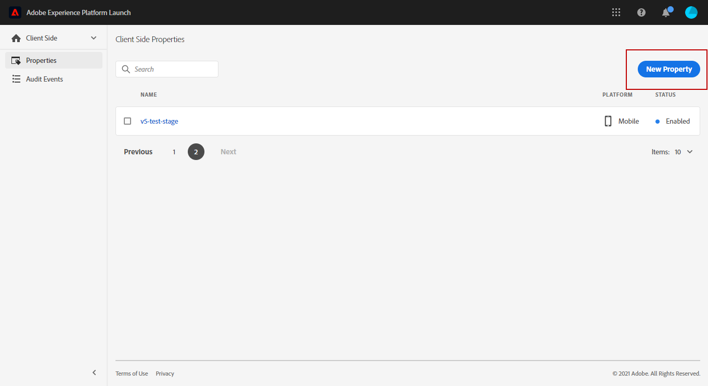
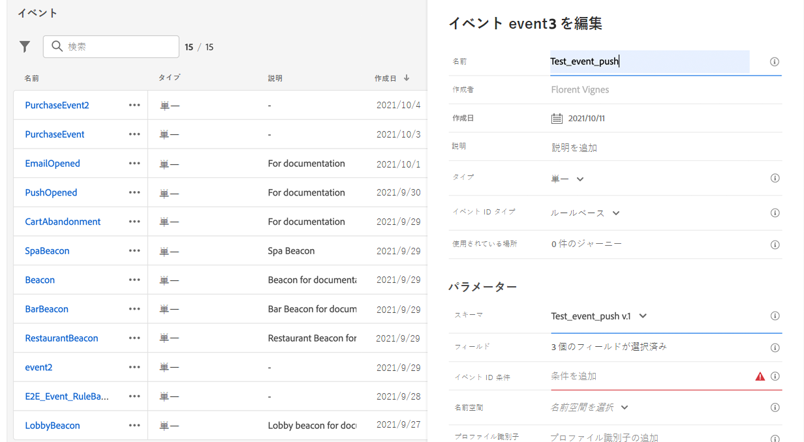

# プッシュ通知チャネルの設定 {#push-notification-configuration}

[!DNL Journey Optimizer] では、ジャーニーを作成し、ターゲットとなるオーディエンスにメッセージを送信できます。[!DNL Journey Optimizer] でプッシュ通知の送信を開始する前に、モバイルアプリと Adobe Experience Platform のタグで設定と統合が行われていることを確認する必要があります。[!DNL Adobe Journey Optimizer] でのプッシュ通知のデータフローについては、[このページ](push-gs.md)を参照してください。

>[!AVAILABILITY]
>
>新しい&#x200B;**モバイルオンボーディングのクイックスタートワークフロー**&#x200B;が利用できるようになりました。この新しい製品機能を使用すると、Mobile SDK を迅速に設定し、モバイルイベント データの収集と検証を開始し、モバイルプッシュ通知を送信できます。この機能は、パブリックベータ版としてデータ収集ホームページから入手できます。[詳細情報](mobile-onboarding-wf.md)
>

## 開始する前に {#start-push}

### 権限の設定 {#setup-permissions}

モバイルアプリケーションを作成する前に、まず、Adobe Experience Platform のタグに適切なユーザー権限が既にあるか、もしくは割り当てられているかを確認する必要があります。詳しくは、[タグのドキュメント](https://experienceleague.adobe.com/docs/experience-platform/tags/admin/user-permissions.html?lang=ja){target="_blank"}を参照してください。

>[!CAUTION]
>
>プッシュ設定は、エキスパートユーザーが実行する必要があります。実装モデルとこの実装に関わるペルソナに応じて、権限のすべてを単一の製品プロファイルに割り当てるか、アプリ開発者と **Adobe Journey Optimizer** 管理者の間で権限を共有する必要が生じる場合があります。**タグ**&#x200B;の権限について詳しくは、[このドキュメント](https://experienceleague.adobe.com/docs/experience-platform/tags/admin/user-permissions.html?lang=ja){target="_blank"}を参照してください。

<!--ou need to your have access to perform following roles :

* Manage Datastreams
* Manage Client-side Properties
* Manage App Configurations
-->

**プロパティ**&#x200B;と&#x200B;**会社**&#x200B;の権限を割り当てるには、次の手順に従います。

1. **[!DNL Admin Console]** にアクセスします。

1. 「**[!UICONTROL 製品]**」タブから、**[!UICONTROL Adobe Experience Platform データ収集]**&#x200B;カードを選択します。

   

1. 既存の&#x200B;**[!UICONTROL 製品プロファイル]**&#x200B;を選択するか、「**[!UICONTROL 新規プロファイル]**」ボタンで新しい製品プロファイルを作成します。**[!UICONTROL 新しいプロファイル]**&#x200B;を作成する方法については、[Admin Console のドキュメント](https://experienceleague.adobe.com/docs/experience-platform/access-control/ui/create-profile.html?lang=ja#ui){target="_blank"}を参照してください。

1. 「**[!UICONTROL 権限]**」タブで、「**[!UICONTROL プロパティ権限]**」を選択します。

   

1. 「**[!UICONTROL すべて追加]**」をクリックします。これにより、製品プロファイルに次の権限が追加されます。
   * **[!UICONTROL 承認]**
   * **[!UICONTROL 開発]**
   * **[!UICONTROL 環境の管理]**
   * **[!UICONTROL 拡張機能の管理]**
   * **[!UICONTROL 公開]**

   これらの権限は、 Adobe Journey Optimizer 拡張機能をインストールして公開し、Adobe Experience Platform Mobile SDK でアプリプロパティを公開するために必要です。

1. 次に、左側のメニューで「**[!UICONTROL 会社権限]**」を選択します。

   

1. 次の権限を追加します。

   * **[!UICONTROL アプリ設定の管理]**
   * **[!UICONTROL プロパティの管理]**

   モバイルアプリ開発者が **Adobe Experience Platform データ収集**&#x200B;でプッシュ資格情報を設定し、**Adobe Journey Optimizer** でプッシュ通知チャネル設定（メッセージプリセット）を定義するには、これらの権限が必要です。

   

1. 「**[!UICONTROL 保存]**」をクリックします。

この&#x200B;**[!UICONTROL 製品プロファイル]**&#x200B;をユーザーに割り当てるには、次の手順に従います。

1. **[!DNL Admin Console]** にアクセスします。

1. 「**[!UICONTROL 製品]**」タブから、**[!UICONTROL Adobe Experience Platform データ収集]**&#x200B;カードを選択します。

1. 以前に設定した&#x200B;**[!UICONTROL 製品プロファイル]**&#x200B;を選択します。

1. 「**[!UICONTROL ユーザー]**」タブで、「**[!UICONTROL ユーザーを追加]**」をクリックします。

   

1. ユーザーの名前またはメールアドレスを入力し、ユーザーを選択します。次に、「**[!UICONTROL 保存]**」をクリックします。

   >[!NOTE]
   >
   >Admin Console でユーザーをまだ作成していない場合は、[ユーザーの追加に関するドキュメント](https://helpx.adobe.com/jp/enterprise/admin-guide.html/enterprise/using/manage-users-individually.ug.html#add-users)を参照してください。

   


### データセットの確認 {#push-datasets}

プッシュ通知チャネルでは、次のスキーマとデータセットを使用できます。

| スキーマ<br>データセット | フィールドのグループ | 操作 |
| -------------------------------------------------------------------------------------- | --------------------------------------------------------------------------------------------------------------------------------------------------------------------------------------- | -------------------------------------------------------- |
| CJM プッシュプロファイルスキーマ <br>CJM プッシュプロファイルデータセット | プッシュ通知の詳細 <br>Adobe CJM ExperienceEvent - メッセージプロファイルの詳細 <br>Adobe CJM ExperienceEvent - メッセージ実行の詳細<br>アプリケーションの詳細<br>環境の詳細 | プッシュトークンを登録 |
| CJM プッシュトラッキングエクスペリエンスイベントスキーマ <br>CJM プッシュトラッキングエクスペリエンスイベントデータセット | プッシュ通知トラッキング | インタラクションを追跡し、レポート UI にデータを提供 |


>[!NOTE]
>
>プッシュトラッキングイベントが CJM プッシュトラッキングエクスペリエンスイベントデータセットに取り込まれると、データの一部が正常に取り込まれたとしても、いくつかの失敗が発生する場合があります。これは、マッピング内の一部のフィールドが受信イベントに存在しない場合に発生する場合があります。警告はログに記録されますが、データの有効な部分の取り込みは防ぎません。これらの警告は、バッチステータスに「失敗」として表示されますが、部分的な取り込みの成功を反映しています。
>
>各スキーマのフィールドと属性の完全なリストを表示するには、[Journey Optimizer スキーマ辞書](https://experienceleague.adobe.com/tools/ajo-schemas/schema-dictionary.html?lang=ja){target="_blank"}を参照してください。


### アプリの設定 {#configure-app}

技術的な設定は、アプリ開発者とビジネス管理者の緊密な共同作業を伴います。[!DNL Journey Optimizer] でプッシュ通知の送信を開始する前に、Adobe Journey Optimizer でプッシュ資格情報とプッシュチャネル設定を作成し、モバイルアプリを Adobe Experience Platform Mobile SDK と統合する必要があります。

以下のリンクに記載されている実装手順に従ってください。

* **Apple iOS** の場合：API でアプリを登録する方法については、[Appleドキュメント](https://developer.apple.com/documentation/usernotifications/registering_your_app_with_apns){target="_blank"}を参照してください
* **Google Android** の場合：Android に Firebase Cloud Messaging クライアントアプリをセットアップする方法については、[Googleドキュメント](https://firebase.google.com/docs/cloud-messaging/android/client){target="_blank"}を参照してください 

### モバイルアプリの Adobe Experience Platform SDK との統合 {#integrate-mobile-app}

Adobe Experience Platform Mobile SDK は、Android および iOS 互換の SDK を介してモバイル用のクライアントサイド統合 API を提供します。[Adobe Experience Platform Mobile SDK のドキュメント](https://developer.adobe.com/client-sdks/documentation/getting-started/){target="_blank"}に従って、アプリで Adobe Experience Platform Mobile SDK を設定します。

この作業が完了するまでに、[!DNL Adobe Experience Platform Data Collection] でモバイルプロパティも作成および設定する必要があります。通常、管理するモバイルアプリケーションごとにモバイルプロパティを作成します。モバイルプロパティを作成および設定する方法について詳しくは、[Adobe Experience Platform Mobile SDK ドキュメント](https://developer.adobe.com/client-sdks/documentation/getting-started/create-a-mobile-property/){target="_blank"}を参照してください。

<!--To enable **Web push notifications**, ensure that the [pushNotifications property](https://experienceleague.adobe.com/ja/docs/experience-platform/web-sdk/commands/configure/pushnotifications) is properly configured within the Web SDK. Then, use [the sendPushSubscription command](https://experienceleague.adobe.com/ja/docs/experience-platform/web-sdk/commands/sendpushsubscription) to register push subscriptions with Adobe Experience Platform.
-->

## 手順 1：Journey Optimizer でのアプリのプッシュ資格情報の追加 {#push-credentials-launch}

正しいユーザー権限を付与した後、モバイルアプリケーションのプッシュ資格情報を Journey Optimizer に追加する必要があります。

モバイルアプリのプッシュ資格情報の登録は、自分の代わりに Adobe がプッシュ通知を送信することを承認するために必要です。以下に説明する手順を参照してください。

1. **[!UICONTROL チャネル]**／**[!UICONTROL プッシュ設定]**／**[!UICONTROL プッシュ資格情報]**&#x200B;メニューにアクセスします。

1. 「**[!UICONTROL プッシュ認証情報を作成]**」をクリックします。

1. **[!UICONTROL Platform]** ドロップダウンで、オペレーティングシステムを選択します。

   * **iOS の場合**

     

      1. モバイルアプリの&#x200B;**[!UICONTROL アプリ ID]** を入力します。

      1. これらのプッシュ資格情報をすべてのサンドボックスで使用できるようにするには、「**[!UICONTROL すべてのサンドボックスに適用]**」オプションを有効にします。特定のサンドボックスに同じプラットフォームとアプリ ID のペアに対する独自の資格情報がある場合、これらのサンドボックス固有の資格情報が優先されます。

      1. 資格情報を追加するには、「**[!UICONTROL プッシュ資格情報を手動で入力]**」ボタンをオンにします。

      1. .p8 Apple Push Notification Authentication Key ファイルをドラッグ＆ドロップします。このキーは、**証明書**、**識別子**、**プロファイル**&#x200B;ページから取得できます。

         >[!NOTE]
         >
         > .p8 Appleのプッシュ通知キーのみがサポートされています。 .p8 キーの制限に達した場合は、別のApple開発者アカウントを使用します。
         >Appleのキー制限について詳しくは、[Apple Developer Documentation](https://developer.apple.com/documentation/usernotifications/registering_your_app_with_apns) を参照してください。


      1. **キー ID** を指定します。これは、p8 認証キーの作成中に割り当てられた 10 文字の文字列です。これは、**証明書**、**識別子**&#x200B;および&#x200B;**プロファイル**&#x200B;ページの「**キー**」タブにあります。

      1. **チーム ID** を指定します。これは、「メンバーシップ」タブにある文字列値です。

   * **Android の場合**

     

      1. **[!UICONTROL アプリ ID]** を指定します。通常、パッケージ名は `build.gradle` ファイル内のアプリ ID です。

      1. これらのプッシュ資格情報をすべてのサンドボックスで使用できるようにするには、「**[!UICONTROL すべてのサンドボックスに適用]**」オプションを有効にします。特定のサンドボックスに同じプラットフォームとアプリ ID のペアに対する独自の資格情報がある場合、これらのサンドボックス固有の資格情報が優先されます。

      1. 資格情報を追加するには、「**[!UICONTROL プッシュ資格情報を手動で入力]**」ボタンをオンにします。

      1. FCM プッシュ資格情報をドラッグ＆ドロップします。プッシュ資格情報の取得方法の詳細については、[Google ドキュメント](https://firebase.google.com/docs/admin/setup#initialize-sdk){target="_blank"}を参照してください。

<!--
    * **For Web**

        

        1. Provide the **[!UICONTROL App ID]**.

        1. Enter your **[!UICONTROL VAPID public key]** and **[!UICONTROL private key]**.
-->

1. 「**[!UICONTROL 送信]**」をクリックして、アプリ設定を作成します。

<!--
## Step 2: Set up a mobile property in Adobe Experience Platform Launch {#launch-property}

Setting up a mobile property allows the mobile app developer or marketer to configure the mobile SDKs attributes such as Session Timeouts, the [!DNL Adobe Experience Platform] sandbox to be targeted and the **[!UICONTROL Adobe Experience Platform Datasets]** to be used for mobile SDK to send data to.

For further details and procedures on how to set up a **[!UICONTROL Platform Launch property]**, refer to the steps detailed in [Adobe Experience Platform Mobile SDK documentation](https://aep-sdks.gitbook.io/docs/getting-started/create-a-mobile-property#create-a-mobile-property).


To get the SDKs needed for push notification to work you will need the following SDK extensions, for both Android and iOS:

* **[!UICONTROL Mobile Core]** (installed automatically)
* **[!UICONTROL Profile]** (installed automatically)
* **[!UICONTROL Adobe Experience Platform Edge]**
* **[!UICONTROL Adobe Experience Platform Assurance]**, optional but recommended to debug the mobile implementation.

Learn more about [!DNL Adobe Experience Platform Launch] extensions in [Adobe Experience Platform Launch documentation](https://experienceleague.adobe.com/docs/launch-learn/implementing-in-mobile-android-apps-with-launch/configure-launch/launch-add-extensions.html?lang=ja).
-->

## 手順 2：プッシュ用のチャネル設定の作成{#message-preset}

プッシュ資格情報を作成したら、**[!DNL Journey Optimizer]** からプッシュ通知を送信できるように、設定を作成する必要があります。

1. **[!UICONTROL チャネル]**／**[!UICONTROL 一般設定]**／**[!UICONTROL チャネル設定]**&#x200B;メニューにアクセスし、「**[!UICONTROL チャネル設定を作成]**」をクリックします。

   

1. 設定の名前と説明（オプション）を入力します。

   >[!NOTE]
   >
   > 名前は、文字（A ～ Z）で始める必要があります。使用できるのは英数字のみです。アンダースコア（`_`）、ドット（`.`）、ハイフン（`-`）も使用できます。


1. 設定にカスタムまたはコアのデータ使用ラベルを割り当てるには、「**[!UICONTROL アクセスを管理]**」を選択します。[詳しくは、オブジェクトレベルのアクセス制御（OLAC）を参照してください](../administration/object-based-access.md)。

1. **プッシュ**&#x200B;チャネルを選択します。

   

1. この設定を使用してメッセージに同意ポリシーを関連付けるには、**[!UICONTROL マーケティングアクション]**&#x200B;を選択します。顧客の意向に従うために、そのマーケティングアクションに関連付けられているすべての同意ポリシーが活用されます。[詳細情報](../action/consent.md#surface-marketing-actions)

1. **[!UICONTROL プラットフォーム]**（Android、iOS <!--and/or Web-->）を選択します。

1. 上記で設定した[プッシュ資格情報](#push-credentials-launch)と同じ&#x200B;**[!UICONTROL アプリ ID]** を選択します。

1. 変更を保存します。

プッシュ通知を作成する際に、設定を選択できるようになりました。

## 手順 3：モバイルプロパティでの Adobe Journey Optimizer 拡張機能の設定 {#configure-journey-optimizer-extension}

Adobe Experience Platform Mobile SDK 用 **Adobe Journey Optimizer 拡張機能**&#x200B;は、モバイルアプリに対するプッシュ通知を強化します。また、ユーザープッシュトークンの収集や、Adobe Experience Platform サービスとのインタラクション測定の管理をサポートします。

Journey Optimizer 拡張機能を設定する方法について詳しくは、[Adobe Experience Platform Mobile SDK ドキュメント](https://developer.adobe.com/client-sdks/documentation/adobe-journey-optimizer/){target="_blank"}を参照してください。


<!-- 
**[!UICONTROL Edge configuration]** is used by **[!UICONTROL Edge]** extension to send custom data from mobile device to [!DNL Adobe Experience Platform]. 
To configure [!DNL Adobe Experience Platform], you must provide the **[!UICONTROL Sandbox]** name and **[!UICONTROL Event Dataset]**.

1. From [!DNL Adobe Experience Platform Launch], select the **[!UICONTROL Edge Configurations]** tab and click **[!UICONTROL Edge Configurations]**.
    
1. Select **[!UICONTROL New Edge Configuration]** to add a new **[!UICONTROL Edge Configuration]**.
1. Enter a **[!UICONTROL Name]** and click **[!UICONTROL Save]**

1. Click the **[!UICONTROL Adobe Experience Platform]** toggle to enable it.

1. Fill in the **[!UICONTROL Sandbox]**, **[!UICONTROL Event dataset]** and **[!UICONTROL Profile Dataset]** fields. Then, click **[!UICONTROL Save]**.
    
    


1. From [!DNL Adobe Experience Platform Launch], ensure that **[!UICONTROL Client Side]** is selected in the drop-down menu.

1. select the **[!UICONTROL Properties]** tab and click **[!UICONTROL New Property]**.

    

1. Enter a **[!UICONTROL Name]** for your new property.

1. Select **[!UICONTROL Mobile]** as **[!UICONTROL Platform]**.

    

1. Click **[!UICONTROL Save]** to create your new property.

To configure **[!UICONTROL Adobe Experience Platform Edge Extension]** to send custom data from mobile devices to [!DNL Adobe Experience Platform].

1. Select your previously created property and select the **[!UICONTROL Extensions]** tab to view the extensions for this property.

    

1. Click **[!UICONTROL Configure]** under the **[!UICONTROL Adobe Experience Platform Edge]** Network' extension.

1. From the **[!UICONTROL Edge Configuration]** drop-down list, select the **[!UICONTROL Edge Configuration]** created in the previous steps. For more information on **[!UICONTROL Edge Configuration]**, refer to this [section](#edge-configuration).

1. Click **[!UICONTROL Save]**.

To configure **[!UICONTROL Adobe Experience Platform Messaging]** extension to send push profile and push interactions to the correct datasets, follow the same steps as above. Use **[!UICONTROL Sandbox]**, **[!UICONTROL Event dataset]** and **[!UICONTROL Profile Dataset]** created in the [Adobe Experience Platform setup](#edge-configuration).
-->

<!--
## Step 4: Publish the Property {#publish-property}

You now need to publish the property to integrate your configuration and to use it in the mobile app. 

To publish your property, refer to the steps detailed in [Adobe Experience Platform Mobile SDK documentation](https://aep-sdks.gitbook.io/docs/getting-started/create-a-mobile-property#publish-the-configuration)

## Step 5: Configure the ProfileDataSource {#configure-profiledatasource}

To configure the `ProfileDataSource`, use the `ProfileDCInletURL` from [!DNL Adobe Experience Platform] setup and add the following in the mobile app:

```
    MobileCore.updateConfiguration(
    mutableMapOf("messaging.dccs" to <ProfileDCSInletURL>)
```

-->

## 手順 4：イベントでモバイルアプリのテスト {#mobile-app-test}

Adobe Experience Platform と [!DNL Adobe Experience Platform Data Collection] の両方でモバイルアプリを設定した後、プッシュ通知をテストしてからプロファイルに送信できるようになりました。このユースケースでは、モバイルアプリをターゲットにするジャーニーを作成し、プッシュ通知をトリガーするイベントを設定します。

<!--
You can use a test mobile app for this use case. For more on this, refer to this [page](https://wiki.corp.adobe.com/pages/viewpage.action?spaceKey=CJM&title=Details+of+setting+the+mobile+test+app) (internal use only).
-->

このジャーニーを機能させるには、XDM スキーマを作成する必要があります。詳しくは、[詳細なドキュメント](https://experienceleague.adobe.com/docs/experience-platform/xdm/schema/composition.html?lang=ja#schemas-and-data-ingestion){target="_blank"}を参照してください。

1. 「データ管理」メニュー セクションで、「**[!UICONTROL スキーマ]**」をクリックします。
   
1. 右上の「**[!UICONTROL スキーマを作成]**」をクリックして、「**[!UICONTROL エクスペリエンスイベント]**」を選択した後、「**次へ**」をクリックします。
   
1. スキーマの名前と説明を入力して、「**終了**」をクリックします。
   
1. 左側の「**フィールドグループ**」セクションで、「**追加**」をクリックして、「**[!UICONTROL 新しいフィールドグループを作成]**」を選択します。

1. **[!UICONTROL 表示名]**&#x200B;と&#x200B;**[!UICONTROL 説明]**&#x200B;を入力します。完了したら、「**[!UICONTROL フィールドグループを追加]**」をクリックします。 フィールドグループの作成方法について詳しくは、[XDM システムのドキュメント](https://experienceleague.adobe.com/docs/experience-platform/xdm/tutorials/create-schema-ui.html?lang=ja){target="_blank"}を参照してください。


   

1. 左側で、スキーマを選択します。右側のパネルで、「**[!UICONTROL プロファイル]**」のスキーマを有効にします。

   


1. 左側でフィールドグループを選択し、「+」アイコンをクリックして新しいフィールドを作成します。「**[!UICONTROL フィールドグループのプロパティ]**」の右側で、「**[!UICONTROL フィールド名]**」、「**[!UICONTROL 表示名]**」を入力し、「**[!UICONTROL タイプ]**」で「**[!UICONTROL 文字列]**」を選択します。

   

1. 「**[!UICONTROL 必須]**」をオンにし、「**[!UICONTROL 適用]**」をクリックします。

1. 「**[!UICONTROL 保存]**」をクリックします。これでスキーマが作成され、イベントで使用できます。

次に、イベントを設定する必要があります。

1. ホームページの左側のメニューの「管理」で、「**[!UICONTROL 設定]**」を選択します。「**[!UICONTROL イベント]**」セクションの「**[!UICONTROL 管理]**」をクリックして、新しいイベントを作成します。

1. 「**[!UICONTROL イベントを作成]**」をクリックすると、画面の右側にイベント設定ペインが開きます。


   

1. イベントの名前を入力します。説明を追加することもできます。

1. 「**[!UICONTROL イベント ID タイプ]**」フィールドで、「**[!UICONTROL ルールベース]**」を選択します。

1. 「**[!UICONTROL パラメーター]**」で、以前に作成したスキーマを選択します。

   

1. フィールドのリストで、スキーマフィールドグループで作成したフィールドが選択されていることを確認します。

   

1. 「**[!UICONTROL イベント ID 条件]**」フィールドで「**[!UICONTROL 編集]**」をクリックします。以前に追加したフィールドをドラッグ＆ドロップして、システムで使用される条件を定義し、ジャーニーをトリガーするイベントを識別します。

   

1. テストアプリでプッシュ通知をトリガーするために使用する構文（この例では&#x200B;**注文確認**）を入力します。

   

1. **[!UICONTROL 名前空間]**&#x200B;として **[!UICONTROL ECID]** を選択します。

1. 「**[!UICONTROL OK]**」をクリックしてから「**[!UICONTROL 保存]**」をクリックします。

これでイベントが作成され、ジャーニーで使用できるようになりました。

1. 左のメニューで、「**[!UICONTROL ジャーニー]**」をクリックします。

1. 「**[!UICONTROL ジャーニーを作成]**」をクリックして、新規のジャーニーを作成します。

1. 右側に表示される設定ペインで、ジャーニーのプロパティを編集します。詳しくは、[この節](../building-journeys/journey-properties.md)を参照してください。

1. まず、前の手順で作成したイベントを「**[!UICONTROL イベント]**」ドロップダウンからドラッグ＆ドロップします。

   

1. 「**[!UICONTROL アクション]**」ドロップダウンから、**[!UICONTROL プッシュ]**&#x200B;アクティビティをジャーニーにドラッグ＆ドロップします。

1. プッシュ通知を設定します。プッシュ通知の作成方法の詳細については、この[ページ](create-push.md)を参照してください。

1. 「**[!UICONTROL テスト]**」切替スイッチをクリックしてプッシュ通知のテストを開始し、「**[!UICONTROL イベントをトリガー]**」をクリックします。

   

1. 「**[!UICONTROL キー]**」フィールドに ECID を入力し、2 番目のフィールドに「**注文確認**」と入力します。

   

1. 「**[!UICONTROL 送信]**」をクリックします。

イベントがトリガーされ、モバイルアプリにプッシュ通知が届きます。

