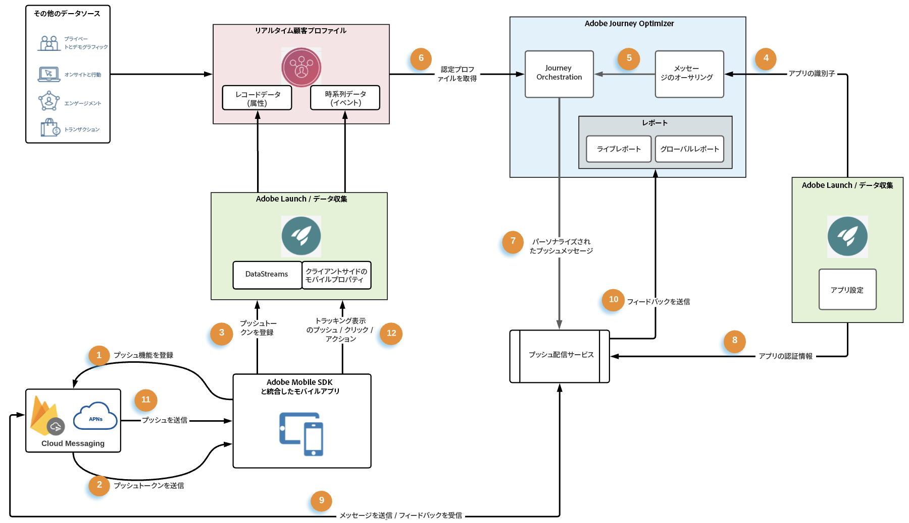
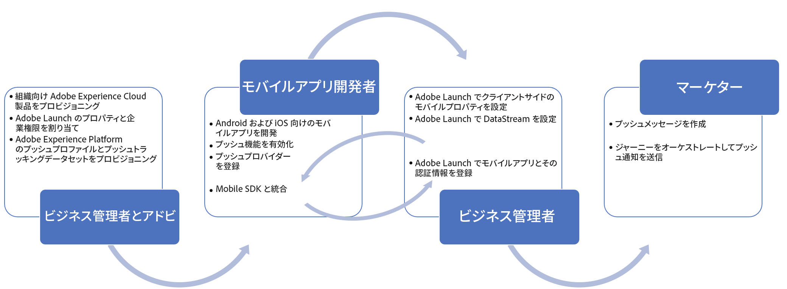

# プッシュ通知のデータフローとコンポーネント {#get-started-push}

このページは、[!DNL Journey Optimizer] でのプッシュ通知に関連する主要なサービスとワークフローの設定と理解に役立ちます。

>[!AVAILABILITY]
>
>新しい&#x200B;**モバイルオンボーディングのクイックスタートワークフロー**&#x200B;が利用できるようになりました。この新しい製品機能を使用すると、Mobile SDK を迅速に設定し、モバイルイベント データの収集と検証を開始し、モバイルプッシュ通知を送信できます。この機能は、パブリックベータ版としてデータ収集ホームページから入手できます。[詳細情報](mobile-onboarding-wf.md)
>

プッシュ通知を作成する方法については、[このページ](create-push.md)を参照してください。

[!DNL Adobe Journey Optimizer] でプッシュチャネルを設定する手順について詳しくは、[このページ](push-configuration.md)を参照してください。

次の図は、関連付けられたデータフローを使用するシステムおよびサービスを示しています。エンドツーエンドのサービスの観点から、プッシュ通知がどのように配信されるかを重点的に示しています。

1. Apple の APNs および Google FCM プッシュメッセージのメッセージサービスを使用したブランドモバイルアプリ（Android または iOS）の登録
1. メッセージサービスがプッシュトークンを生成します。プッシュトークンは、[!DNL Adobe Journey Optimizer] で特定のデバイスをプッシュ通知のターゲットとするために使用される識別子です。
1. 生成済みのプッシュトークンが Adobe Experience Platform に渡され、リアルタイム顧客プロファイルと同期されます。これは、統合しやすいクライアント SDK を使用して標準で実行されます。
1. プッシュメッセージは、[!DNL Adobe Journey Optimizer] で、チャネル設定（メッセージプリセットなど）に対して作成されます
1. プッシュメッセージは、ジャーニーのオーケストレーションキャンバスに含めることができます
1. ジャーニーを公開すると、ジャーニー条件に基づく顧客プロファイルがプッシュ通知を受信する資格を得ます。プッシュメッセージペイロードは、この手順でパーソナライズされます。
1. パーソナライズされたプッシュペイロードは、内部のプッシュメッセージ配信サービスに転送されます
1. 次に、この内部サービスは、メッセージに関連付けられたアプリの資格情報を検証し、
1. 最終配信用に Apple および Google のメッセージサービスにメッセージを送信します
1. メッセージサービスからのフィードバックは記録され、エラーと成功はジャーニーライブレポートおよび Customer Journey Analytics レポートに記録されます
1. プッシュ通知はエンドユーザーのデバイスに配信されます
1. エンドユーザーのプッシュ通知インタラクションは、SDK 統合を介して、エンドユーザークライアントからエクスペリエンスイベントとして送信されます

## プッシュ通知における主要サービスの役割 {#roles-of-key-services}

* **プッシュ通知サービスプロバイダー**&#x200B;は、リモートサーバーからモバイルアプリに通知を配信するコアコンポーネント Web サービスです。

  [!DNL Adobe Journey Optimizer] は、Android と iOS の両方のプラットフォームをサポートし、その結果、次と統合されます。
   * [Firebase Cloud Messaging（FCM）](https://firebase.google.com/docs/cloud-messaging) - Android モバイルアプリに通知を送信します。
   * [Apple Push Notification Service（APN）](https://developer.apple.com/library/archive/documentation/NetworkingInternet/Conceptual/RemoteNotificationsPG/APNSOverview.html) - iOS モバイルアプリに通知を送信します。

* **Adobe Experience Platform Mobile SDK** は Android および iOS 互換の SDK を介してモバイル用のクライアントサイド統合 API を提供します。SDK に用意されている [!DNL Adobe Journey Optimizer] 拡張機能は、プッシュメッセージ専用の様々な API を公開し、プッシュトークンの登録や、プッシュトラッキングイベントまたはその他の任意のカスタムエクスペリエンスイベントの Adobe Experience Platform への送信といったデータフローを可能にします。また、SDK は、他の Adobe Experience Cloud およびサードパーティパートナー機能を有効にするその他の各種拡張機能も提供します。

  SDK 統合には、次のような Adobe Experience Platform [データ収集](https://experienceleague.adobe.com/docs/experience-platform/tags/home.html?lang=ja){target="_blank"}サービスのセットアップも必要です。

   * Adobe Experience Platform にデータが取り込まれる、プロファイルおよびエクスペリエンスイベントデータセットを設定するデータストリームの作成
   * クライアントサイドモバイルプロパティの作成と拡張機能の追加。SDK は、これらの拡張機能と密接に統合し、シームレスなデータ収集エクスペリエンスを提供します。
   * モバイルアプリバンドル識別子とアプリの資格情報の登録

* **Adobe Experience Platform リアルタイム顧客プロファイル**&#x200B;は、Web、モバイル、CRM、サードパーティなど複数のチャネルのデータを組み合わせることで、各顧客の全体像を把握します。プロファイルを使用すると、個別の顧客データを統合ビューに表示し、顧客インタラクションごとに実用的なタイムスタンプ付きの説明を提供できます。特定のアプリユーザーのプッシュトークンは、レコードデータとしてユーザーのプロファイルに保存されますが、プッシュ通知とのインタラクションは、時系列イベントデータとして追跡されます。[Adobe Experience Platform リアルタイム顧客プロファイルの詳細情報](https://experienceleague.adobe.com/docs/experience-platform/profile/home.html?lang=ja){target="_blank"}。

* **[!DNL Adobe Journey Optimizer]**：上記のコンポーネントとのモバイルアプリ統合が確立され、Adobe Experience Platform に顧客プロファイルが作成されたら、[!DNL Adobe Journey Optimizer] でプッシュ通知の作成と調整を行って、ユーザーのエンゲージメントを促進することができます。

## プッシュテクニカルセットアップおよび実践者ワークフロー {#push-technical-setup}

次の図は、プッシュデータフローの骨格を構成するコンポーネントの設定に関する様々な手順をエンドツーエンドで示しています。アクション項目は、設定を実行する役割と設定するコンポーネントに基づいて分類されています。

**関連トピック**

* [プッシュチャネルの設定](push-configuration.md)
* [プッシュ通知レポート](../reports/journey-global-report-cja-push.md)
* [プッシュ通知の作成](create-push.md)
* [ジャーニーへのメッセージの追加](../building-journeys/journeys-message.md)
* [キャンペーンへのメッセージの追加](../campaigns/create-campaign.md)