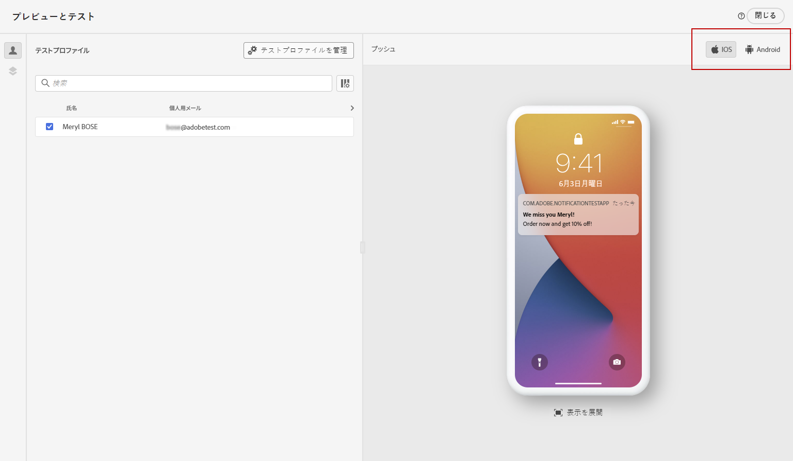
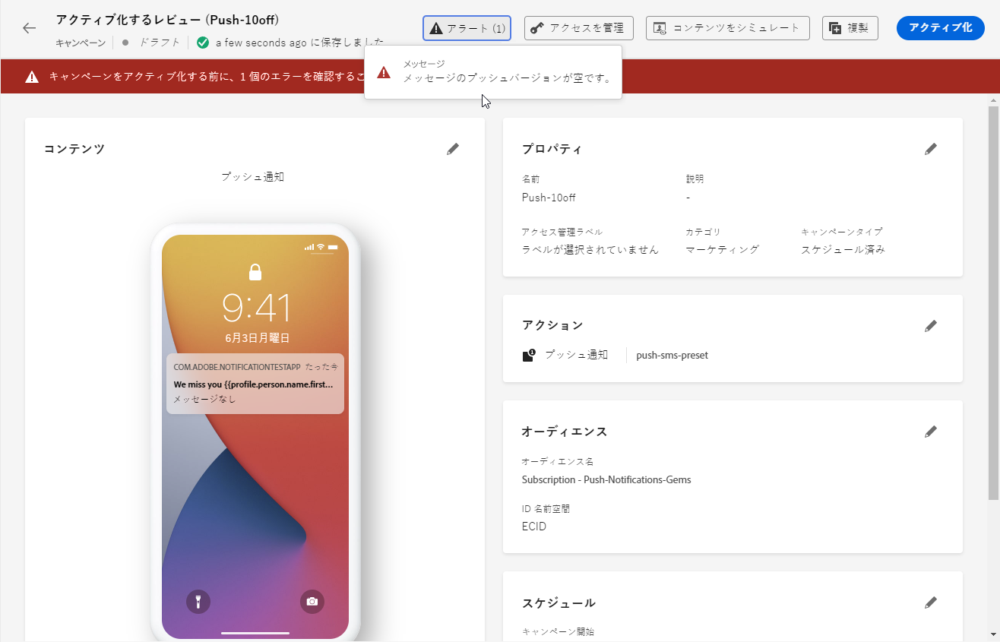

# プッシュ通知の確認と送信 {#send-push}

## プッシュ通知のプレビュー {#preview-push}

メッセージコンテンツを定義したら、CSV／JSON ファイルからアップロードした、または手動で追加したテストプロファイルやサンプル入力データを使用して、そのコンテンツをプレビューできます。パーソナライズされたコンテンツを挿入した場合は、そのコンテンツがメッセージ内でどのように表示されるかを確認できます。[詳しくは、サンプル入力データを使用してコンテンツをテストする方法を参照してください](../test-approve/simulate-sample-input.md)

これを行うには、「**[!UICONTROL コンテンツをシミュレート]**」をクリックします。コンテンツをプレビューするデバイスの種類を **[!UICONTROL iOS]** または **[!UICONTROL Android]** から選択します。

コンテンツをプレビューおよびテストする方法について詳しくは、[コンテンツ管理](../content-management/preview-test.md)の節を参照してください。

## プッシュ通知の検証 {#push-validate}

エディターの上部セクションでアラートを確認する必要があります。単純な警告もありますが、メッセージの送信を妨げる可能性のある警告もあります。発生する可能性のあるアラートには、警告とエラーの 2 種類があります。

* **警告**&#x200B;は、レコメンデーションやベストプラクティスを示しています。

* **エラー**（例えば次のようなもの）が解決されない限り、ジャーニーのテストやアクティブ化はできません。

   * **[!UICONTROL メッセージのプッシュバージョンが空です]**：このエラーは、プッシュ通知の本文またはタイトルがない場合に表示されます。プッシュ通知コンテンツを定義する方法については、[この節](create-push.md)で説明します。

   * **[!UICONTROL 設定が存在しません]**：選択した設定がメッセージの作成後に削除された場合は、メッセージを使用できません。このエラーが発生した場合は、メッセージ&#x200B;**[!UICONTROL プロパティ]**&#x200B;で別の設定を選択します。チャネル設定について詳しくは、[この節](../configuration/channel-surfaces.md)を参照してください。

   * **[!UICONTROL プッシュの iOS / Android ペイロードが 4KB の制限を超えています]**：プッシュ通知のサイズは、4KB を超えることはできません。この制限を守るために、画像や絵文字の使用を減らすようにしてください。プッシュ通知コンテンツの管理方法については、[この節](../push/create-push.md)を参照してください。

  

>[!NOTE]
>
> 配信品質を高めるには、必ずプロバイダーがサポートする形式の電話番号を使用する必要があります。例えば、Twilio と Sinch は E.164 形式の電話番号のみをサポートしています。

## プッシュ通知の送信{#push-send}

>[!IMPORTANT]
>
> キャンペーンが承認ポリシーの対象となっている場合、プッシュ通知を送信できるようにするには、承認をリクエストする必要があります。[詳細情報](../test-approve/gs-approval.md)

プッシュメッセージの準備が整ったら、[ジャーニー](../building-journeys/journey-gs.md)または[キャンペーン](../campaigns/create-campaign.md)の設定を完了して送信します。

**関連トピック**

* [プッシュチャネルの設定](push-configuration.md)
* [プッシュ通知レポート](../reports/journey-global-report-cja-push.md)
* [プッシュ通知の作成](create-push.md)
* [ジャーニーへのメッセージの追加](../building-journeys/journeys-message.md)
* [キャンペーンへのメッセージの追加](../campaigns/create-campaign.md)

