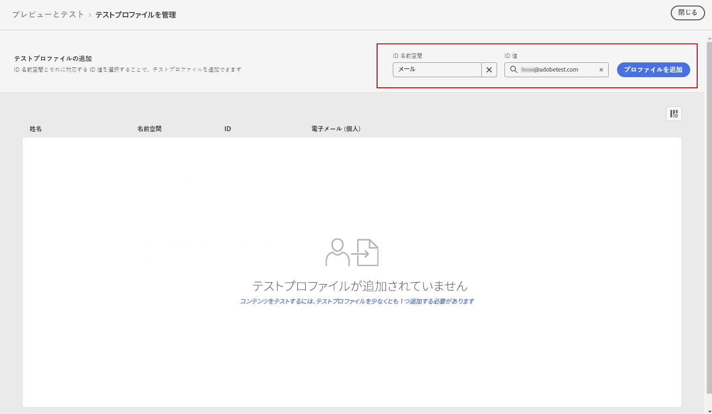
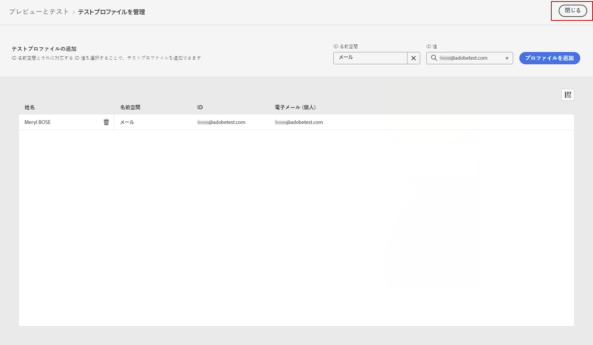

# プッシュ通知の送信 {#send-push}

## プッシュ通知のプレビュー {#preview-push}

メッセージコンテンツを定義したら、テストプロファイルを使用してプレビューとテストを行うことができます。パーソナライズされたコンテンツを挿入してある場合は、そのコンテンツがメッセージにどのように表示されるかを、テストプロファイルデータを利用して確認できます。

1. 「**[!UICONTROL コンテンツをシミュレート]**」をクリックします。

1. 「**[!UICONTROL テストプロファイルを管理]**」をクリックして、テストプロファイルを追加します。

1. 「**[!UICONTROL ID 名前空間]**」フィールドと「**[!UICONTROL ID 値]**」フィールドを使用して、テストプロファイルを検索します。そのあと、「**[!UICONTROL プロファイルを追加]**」をクリックします。

   

1. 上記と同じ手順を適用して、テストプロファイルを選択します。

   

1. プッシュのプレビューでは、テストプロファイルデータがメッセージコンテンツで利用されます。

   コンテンツをプレビューするデバイスの種類を **[!UICONTROL iOS]** または **[!UICONTROL Android]** から選択します。

   

## プッシュ通知の検証 {#push-validate}

>[!NOTE]
>
> 配信品質を高めるには、必ずプロバイダーがサポートする形式の電話番号を使用する必要があります。例えば、Twilio と Sinch は E.164 形式の電話番号のみをサポートしています。

また、エディターの上部セクションでアラートを確認します。単純な警告もありますが、メッセージの使用を妨げる可能性のある警告もあります。次の 2 種類のアラートが発生する可能性があります。

* **警告**&#x200B;は、推奨事項やベストプラクティスを示しています。

* **エラー**（例えば次のようなもの）が解決されない限り、ジャーニーのテストやアクティブ化はできません。

   * **[!UICONTROL メッセージのプッシュバージョンが空です]**：このエラーは、プッシュ通知の本文またはタイトルがない場合に表示されます。プッシュ通知コンテンツを定義する方法については、[この節](create-push.md)で説明します。

   * **[!UICONTROL サーフェスが存在しません]**：選択したサーフェスがメッセージの作成後に削除された場合は、メッセージを使用できません。このエラーが発生した場合は、メッセージの&#x200B;**[!UICONTROL プロパティ]**&#x200B;で別のサーフェスを選択します。チャネルサーフェスについて詳しくは、[この節](../configuration/channel-surfaces.md)を参照してください。

   * **[!UICONTROL プッシュの iOS / Android ペイロードが 4KB の制限を超えています]**：プッシュ通知のサイズは、4KB を超えることはできません。この制限を守るために、画像や絵文字の使用を減らすようにしてください。プッシュ通知コンテンツの管理方法については、[この節](../push/create-push.md)を参照してください。

プッシュ通知の準備ができたら、[ジャーニー](../building-journeys/journey-gs.md)または[キャンペーン](../campaigns/create-campaign.md)の設定を完了して通知を送信します。
