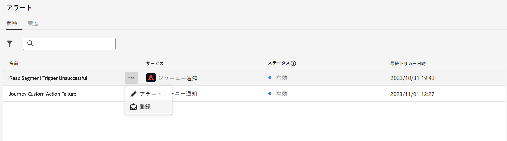
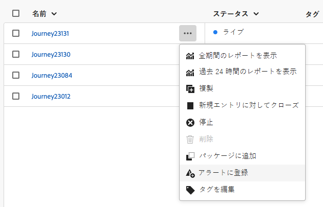
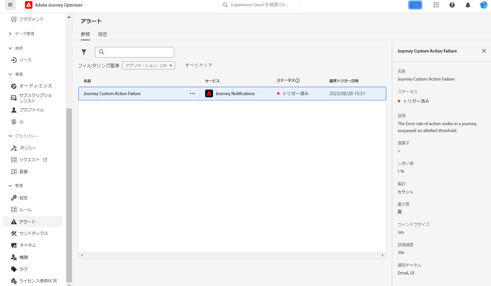
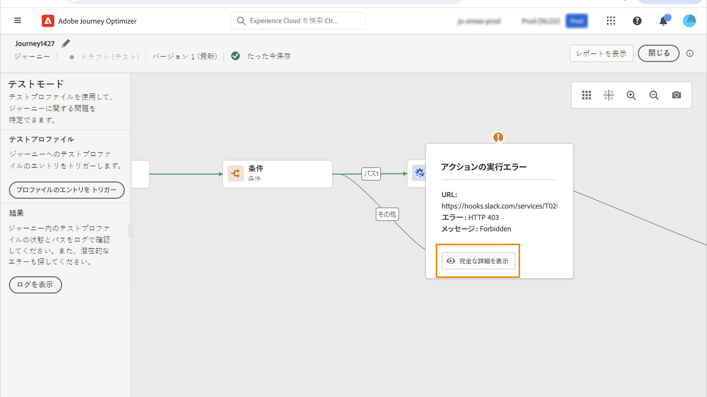
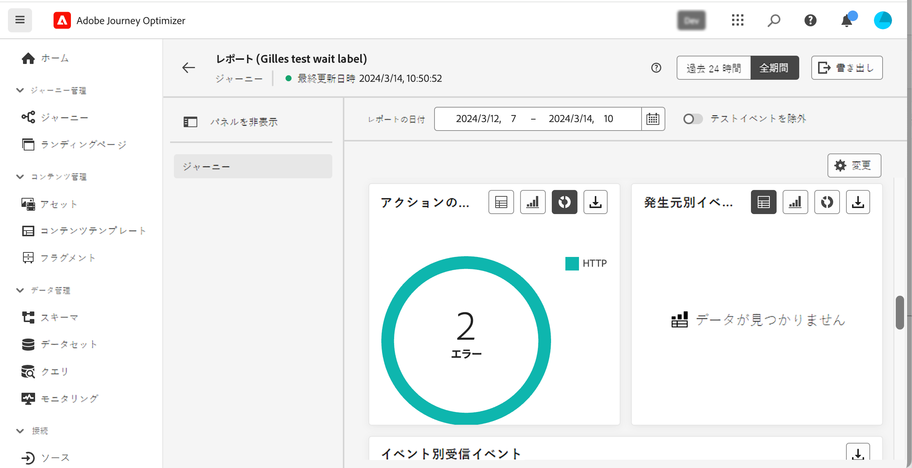
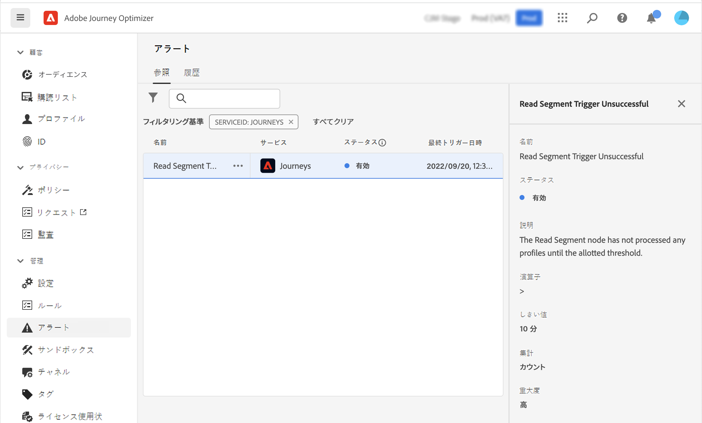
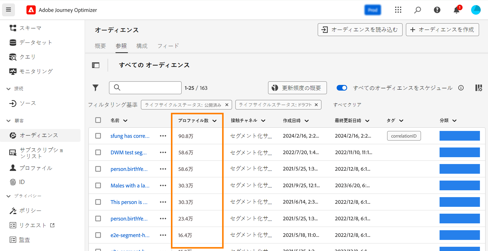
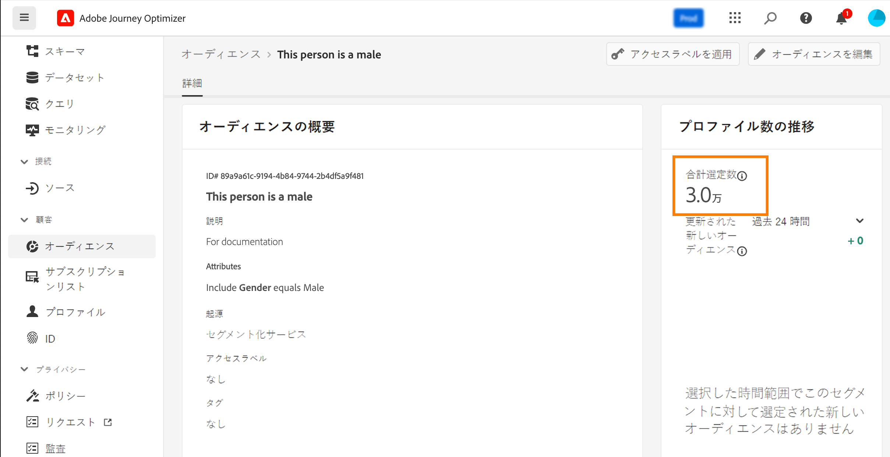
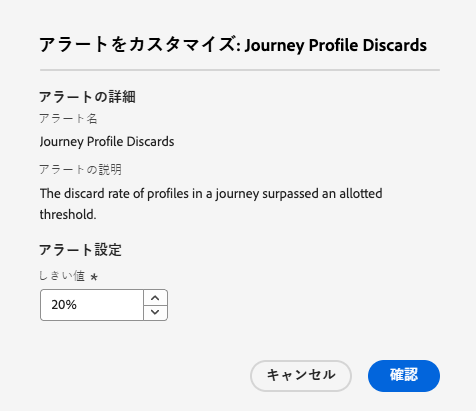
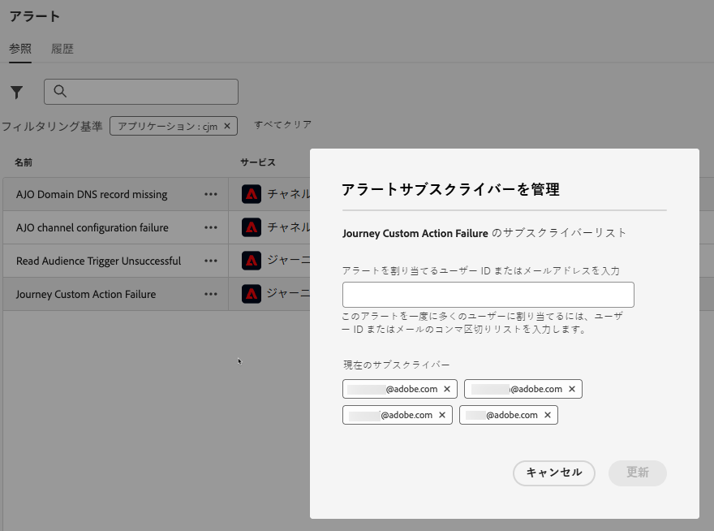

# システムアラートへのアクセスと購読 {#alerts}

ジャーニーとキャンペーンを作成する場合は、「**アラート**」ボタンを使用してエラーを確認および解決してから、実行または公開します。

専用の&#x200B;**[!UICONTROL アラート]**&#x200B;メニューから、このページで詳しく説明されているように、[!DNL Adobe Journey Optimizer] システムアラートを登録することもできます。

## アラートへのアクセス {#access-alerts}

エラーが発生した場合は、Journey Optimizer 通知センター（アプリ内アラート）でシステムアラートを受信したり、メールを受信したりできます。これらのアラートにアクセスするには、次の手順に従います。

<!--These messages can repeat over a pre-defined time interval until the alert has been resolved.-->

>[!NOTE]
>
>Adobe Experience Platform のアラートについて詳しくは、[Adobe Experience Platform ドキュメント](https://experienceleague.adobe.com/docs/experience-platform/observability/alerts/overview.html?lang=ja){target="_blank"}を参照してください。

左側のメニューの&#x200B;**[!UICONTROL 管理]**&#x200B;で、「**[!UICONTROL アラート]**」をクリックします。Journey Optimizer には、事前設定済みのアラートがいくつか用意されています。

これらのアラートは次のようにリストされています。各アラートの詳細は次のとおりです。

* ジャーニーに固有のアラート：

   * [ジャーニーカスタムアクションエラー](#alert-custom-actions)アラート
   * [オーディエンスを読み取りトリガーに失敗しました](#alert-read-audiences)アラート
<!--DOCAC-13465   * the [Profile Discard Rate Exceeded](#alert-discard-rate) alert
   * the [Custom Action Error Rate Exceeded](#alert-custom-action-error-rate) alert
   * the [Profile Error Rate Exceeded](#alert-profile-error-rate) alert-->

* チャネル設定に固有のアラート：

   * [AJO ドメイン DNS レコードがありません](#alert-dns-record-missing)アラート
   * [AJO チャネル設定エラー &#x200B;](#alert-channel-config-failure) アラート
     <!--* the [AJO domain certificates renewal unsuccessful](#alert-certificates-renewal) alert-->

## アラートの配信を登録 {#subscribe-alerts}

予期しない動作が発生した場合や、操作の特定の条件（システムがしきい値に達した場合に問題が発生する可能性があるなど）に達した場合、その条件を登録している組織内のユーザーにアラート通知が配信されます。

ユーザーインターフェイスから各アラートを個別に、**[!UICONTROL アラート]** メニューからグローバルに登録できます（[&#x200B; グローバル登録 &#x200B;](#global-subscription) を参照） <!--DOCAC-13465, or unitary for a specific journey (see [Unitary subscription](#unitary-subscription))-->。

登録者の環境設定に基づいて、アラートはメールで送信されるか、ユーザーインターフェイスの右上隅にある Journey Optimizer 通知センター内（アプリ内通知）で直接送信されます。[!DNL Adobe Experience Cloud] **[!UICONTROL 環境設定]**&#x200B;で、これらのアラートを受信する方法を選択します。[詳細情報](../start/user-interface.md#in-product-alerts)

アラートが解決されると、登録者に「解決済み」通知が届きます。

### グローバル購読 {#global-subscription}

すべてのジャーニーとキャンペーンでアラートを購読/購読解除するには、次の手順に従います。

1. 左側のメニューから **[!UICONTROL アラート]** ダッシュボードを参照し、購読するアラートの **[!UICONTROL 購読]** オプションを選択します。

   {width=80%}

   >[!NOTE]
   >
   >登録は、特定のサンドボックスにのみ適用されます。各サンドボックスのアラートを個別に登録する必要があります。

1. **[!UICONTROL 登録解除]**&#x200B;する場合も同じ方法を使用します。

[I/O イベント通知 &#x200B;](https://experienceleague.adobe.com/docs/experience-platform/observability/alerts/subscribe.html?lang=ja){target="_blank"} を通じて登録することもできます。 アラートルールは、様々な登録パッケージに整理されます。特定の Journey Optimizer アラートに対応するイベント登録については、[以下](#journey-alerts)で詳しく説明します。

<!--DOCAC-13465
### Unitary subscription {#unitary-subscription}

To subscribe/unsubscribe to an alert for a specific journey, follow these steps:

1. Browse to the journey inventory and select the **[!UICONTROL Subscribe to alerts]** option for a specific journey.

      {width=80%}

1. Choose the alert(s). The following alerts are available: [Profile Discard Rate Exceeded](#alert-discard-rate), [Custom Action Error Rate Exceeded](#alert-custom-action-error-rate), and [Profile Error Rate Exceeded](#alert-profile-error-rate).
   
1. To unsubscribe to an alert, unselect it from the same screen.

1. Click **[!UICONTROL Save]** to confirm.
-->

<!--To enable email alerting, refer to [Adobe Experience Platform documentation](https://experienceleague.adobe.com/docs/experience-platform/observability/alerts/ui.html#enable-email-alerts){target="_blank"}.-->

## ジャーニーアラート {#journey-alerts}

>[!CAUTION]
>
>Adobe Journey Optimizer に特定のアラートは、**ライブ**&#x200B;ジャーニーにのみ適用されます。 テストモードのジャーニーでは、アラートはトリガーされません。

### ジャーニーカスタムアクションエラー {#alert-custom-actions}

このアラートは、カスタムアクションが失敗した場合に警告を表示します。過去 5 分間に特定のカスタムアクションで 1％以上のエラーが発生した場合、エラーが発生したとみなします。これは 30 秒ごとに評価されます。

アラートの名前をクリックして、アラートの詳細と設定を確認します。

カスタムアクションに関するアラートは、過去 5 分間ににわたり次の場合に解決されます。

* そのカスタムアクションに関するエラー（または 1％のしきい値を下回るエラー）が発生していない。

* または、そのカスタムアクションに到達したプロファイルがない。

カスタムアクションアラートに対応する I/O イベント登録名は、**ジャーニーカスタムアクションエラー**&#x200B;です。

**カスタムアクション**&#x200B;アラートのトラブルシューティングをするには:

* 別のジャーニーでテストモードを使用してカスタムアクションを確認：

  

* ジャーニーレポートを調べて、アクションに関するエラー理由を確認します。

  

* ジャーニーの stepEvents で「failureReason」の詳細を確認します。

* カスタムアクション設定を確認し、認証が正常であることを検証します。例えば、Postman で手動チェックを実行します。

### オーディエンストリガーの読み取りが失敗しました {#alert-read-audiences}

このアラートは、スケジュールされた実行時間から 10 分経過しても、「**オーディエンスを読み取り**」アクティビティでプロファイルを処理されなかった場合に警告します。このエラーは、技術的な問題やオーディエンスが空であることが原因で発生する可能性があります。このエラーが技術的な問題によって発生した場合、問題のタイプに応じて、再試行が引き続き行われる可能性があります（例：エクスポートジョブの作成に失敗した場合、最大 1 時間、10 分ごとに再試行されます）。

「**オーディエンスを読み取り**」アクティビティに関するアラートは、繰り返しジャーニーにのみ適用されます。**1 回**&#x200B;または&#x200B;**できるだけ早く**&#x200B;実行するスケジュールが設定されているライブジャーニーの「**オーディエンスを読み取り**」アクティビティは無視されます。

**オーディエンスを読み取り**&#x200B;に関するアラートは、プロファイルが&#x200B;**オーディエンスを読み取り**&#x200B;ノードにエントリすると解決されます。

**オーディエンスを読み取りのトリガー失敗**&#x200B;アラートに対応する I/O イベント購読名は、**ジャーニーのオーディエンスを読み取りの遅延、失敗およびエラー**&#x200B;です。

**オーディエンスの読み取り**&#x200B;アラートのトラブルシューティングをするには、Experience Platform インターフェイスでオーディエンス数を確認します。

<!--DOCAC-13465

### Profile Discard Rate Exceeded {#alert-discard-rate}

This alert warns you if the ratio of profile discards to entered profiles over the last 5 minutes exceeded threshold. The defaut threshold is set to 20% but you can [define a custom theshold](#custom-threshold).

Click the name of the alert to check the alert details and configuration.

### Custom Action Error Rate Exceeded {#alert-custom-action-error-rate}

This alert warns you if the ratio of custom action errors to successful HTTP calls over the last 5 minutes exceeded threshold. The defaut threshold is set to 20% but you can [define a custom theshold](#custom-threshold).

### Profile Error Rate Exceeded {#alert-profile-error-rate}

This alert warns you if the ratio of custom action errors to successful HTTP calls over the last 5 minutes exceeded threshold. The defaut threshold is set to 20% but you can [define a custom theshold](#custom-threshold).

Click the name of the alert to check the alert details and configuration.
-->

## アラートの設定 {#configuration-alerts}

### AJO ドメイン DNS レコードがありません {#alert-dns-record-missing}

このアラートは、適切な配信品質設定に必要な、重要な DNS レコード（NS または CNAME）が欠落しているか、誤って設定されている場合に通知します。これらのレコードがないと、メールの配信品質が損なわれる場合があります。

>[!NOTE]
>
>* NS レコードは、アドビへの完全なサブドメインデリゲーションに不可欠です。[詳細情報](../configuration/about-subdomain-delegation.md#full-subdomain-delegation)
>
>* CNAME レコードは、CNAME サブドメインの設定をサポートしています。[詳細情報](../configuration/about-subdomain-delegation.md#cname-subdomain-setup)

**AJO ドメイン DNS レコードがありません**&#x200B;アラートは、システムが必要な NS または CNAME レコードが存在しないか、設定標準と一致していないことを検出するとトリガーされます。

1. アラートをクリックして、[!DNL Journey Optimizer] インターフェイスで影響を受ける[サブドメイン](../configuration/delegate-subdomain.md)に移動します。

   <!--For guidance on editing delegated subdomains, see [this section](../configuration/delegate-subdomain.md).-->

1. レコードを正しく設定して DNS 設定を修正し、[サブドメインデリゲーションを再度送信](../configuration/delegate-subdomain.md#submit-subdomain)します。

   >[!NOTE]
   >
   >次に進む前に、ドメインをホストするソリューションですべてのレコードが適切に作成されていることを確認します。

1. 正しい値が不明な場合は、影響を受けるサブドメインと同じ名前で [!DNL Journey Optimizer] に新しいサブドメインを作成できます。[新しいサブドメインの設定方法の詳細情報](../configuration/delegate-subdomain.md#set-up-subdomain)

変更しても問題が解決しない場合は、翌日に同じアラートが再度トリガーされます。

<!--The I/O event subscription name corresponding to this alert is xx. > Do we need to mention this?-->

### AJO チャネル設定エラー {#alert-channel-config-failure}

>[!IMPORTANT]
>
>このアラートは、[カスタムサブドメイン](../configuration/delegate-custom-subdomain.md)デリゲーションタイプを使用する&#x200B;**メール**&#x200B;チャネル設定にのみ適用されます。<!--Other channel types (such as SMS, push, or in-app) are not covered by this alert.-->

このアラートは、システム監査によりメールチャネルの設定に関する問題が検出された場合にトリガーされます。これらの問題には、チャネル設定ミス、無効な DNS 設定、抑制リストの問題、IP の不一致、メールの配信に影響を与えることがあるその他のエラーが含まれる場合があります。

このようなアラートを受信した場合の解決手順を以下に示します。

1. アラートをクリックして、[!DNL Journey Optimizer] インターフェイスで影響を受ける[メールチャネル設定](../email/get-started-email-config.md)に移動します。

   チャネル設定の編集に関するガイダンスについて詳しくは、[この節](../configuration/channel-surfaces.md#edit-channel-surface)を参照してください。

1. 設定の詳細と表示されるエラーメッセージを確認します。一般的なエラーの理由を以下に示します。

   * SPF 検証に失敗しました
   * DKIM の検証に失敗しました
   * MX レコードの検証に失敗しました
   * DNS レコードが無効です

   >[!NOTE]
   >
   >考えられる設定エラーの理由について詳しくは、[この節](../configuration/channel-surfaces.md)を参照してください。

1. 次のように問題を解決します。

   * 必要に応じて、チャネル設定を更新します。
   * アラートに記載されている特定の DNS に関する問題を修正する必要がある場合があります。

   >[!NOTE]
   >
   >単一のドメインを複数のチャネル設定に関連付けることができるので、1 つのチャネル設定の DNS に関する問題を解決すると、複数の設定をまたいで関連する問題が自動的に修正される場合があります。

変更しても問題が解決しない場合は、翌日に同じアラートが再度トリガーされます。

メール設定に関する問題を解決する際は、以下に示すベストプラクティスに注意してください。

* 迅速に対応 - 設定エラーが検出されたらすぐに対処し、メール配信の中断を回避します。
* すべての設定を確認 - アラートに影響を受けるメール設定が複数示されている場合は、それぞれを確認して修正します。

<!--### AJO domain certificates renewal unsuccessful {#alert-certificates-renewal}

This alert warns you if a domain certificate (CDN, tracking URL) renewal failed for a specific Journey Optimizer subdomain.-->

## アラートの管理 {#manage-alerts}

### アラートの編集

アラートの行をクリックすると、そのアラートの詳細を確認できます。 名前、ステータス、通知チャネルが左側のパネルに表示されます。
<!--DOCAC-13465
For Journey alerts, use the **[!UICONTROL More actions]** button to edit them. You can then define a [custom theshold](#custom-threshold) for these alerts.-->

{width=60%}

<!--DOCAC-13465
#### Define a custom threshold {#custom-threshold}

You can set thresholds for the [Journey alerts](#journey-alerts). The threshold alerts above default to 20%. 

To change the threshold:

1. Browse to the **Alerts** screen
1. Click the **[!UICONTROL More actions]** button of the alert to update
1. Enter the new threshold and confirm. The new threshold applies to **all** journeys

{width=60%}

>[!CAUTION]
>
>The threshold levels are global across all journeys and cannot be individually modified per journey.
-->

### アラートの無効化

デフォルトでは、すべてのアラートが有効になっています。アラートを無効にするには、「**[!UICONTROL アラートを無効にする]**」オプションを選択します。このアラートのすべてのサブスクライバーは、関連する通知を受信しなくなります。

### アラートステータス

考えられるアラートステータスを以下に示します。

* **[!UICONTROL 有効]** - アラートは有効で、現在、トリガー条件を監視しています。
* **[!UICONTROL 無効]** - アラートは無効で、現在、トリガー条件を監視していません。このアラートに関する通知は受信されません。
* **[!UICONTROL トリガー]** - アラートのトリガー条件は、現在、満たされています。

### サブスクライバの表示と更新 {#manage-subscribers}

**[!UICONTROL アラート購読者を管理]** を選択して、アラートを購読しているユーザーのリストを表示します。

{width=80%}

サブスクライバーを追加するには、メールをコンマで区切って入力し、「**[!UICONTROL 更新]**」を選択します。

購読者を削除するには、現在の購読者からメールアドレスを削除して「**[!UICONTROL 更新]**」を選択します。

## その他のリソース {#additional-resources-alerts}

* ジャーニーをトラブルシューティングする方法について詳しくは、[このページ](../building-journeys/troubleshooting.md)を参照してください。
* キャンペーンをレビューする方法について詳しくは、[このページ](../campaigns/review-activate-campaign.md)を参照してください。