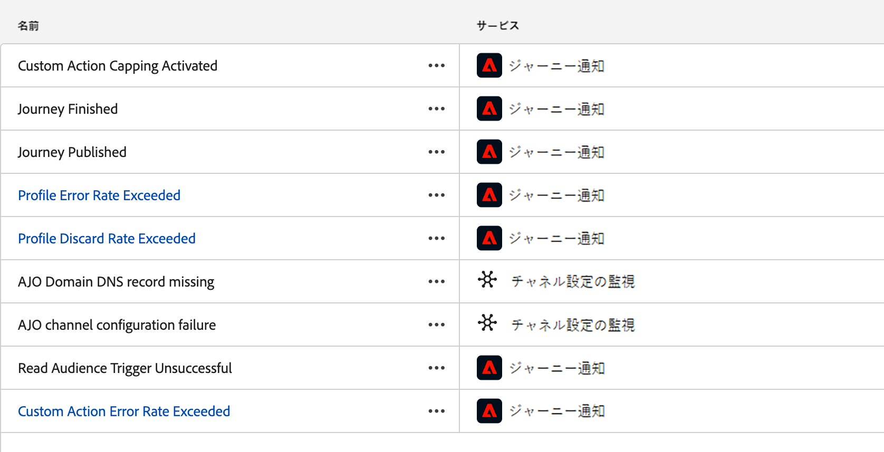
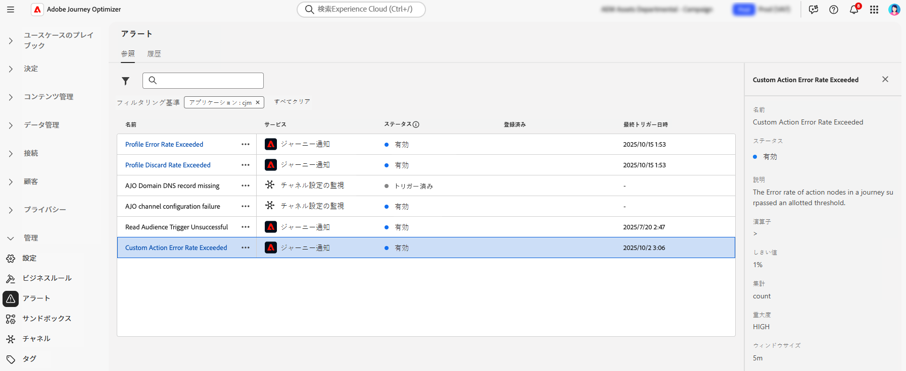

# システムアラートへのアクセスと購読 {#alerts}

## 概要

Adobe Journey Optimizerには、操作の監視とトラブルシューティングに役立つ 2 種類のアラートが用意されています。

* **キャンバス内検証アラート**：ジャーニーやキャンペーンを作成する際には、公開前にキャンバスの **アラート** ボタンを使用して設定エラーを特定し、解決します。 [&#x200B; ジャーニーのトラブルシューティング &#x200B;](../building-journeys/troubleshooting.md) およびキャンペーンのレビュー方法を学ぶ：[&#x200B; アクションキャンペーン &#x200B;](../campaigns/review-activate-campaign.md) | [API トリガーキャンペーン &#x200B;](../campaigns/review-activate-api-triggered-campaign.md) | [&#x200B; キャンペーンを調整 &#x200B;](../orchestrated/start-monitor-campaigns.md).

* **システム監視アラート** （詳細はこのページを参照）：操作のしきい値を超えたり、ライブジャーニーおよびチャネル設定で問題が検出されたりしたときに、プロアクティブな通知を受け取ります。 これらのアラートは、潜在的な問題が顧客体験に影響を与える前に、その問題に迅速に対応するのに役立ちます。

システムアラートは、**[!UICONTROL 管理]** の下の **[!UICONTROL アラート]** メニューから使用できます。 Adobe Experience Platformには、有効にできる事前定義済みのアラートルールがいくつか用意されています（ジャーニー用の [!DNL Adobe Journey Optimizer] 固有のアラートやチャネル設定など）。

## 前提条件

アラートを操作する前に：

* **権限**：アラートを表示および管理するには、特定の権限が必要です。 [Adobe Experience Platformで必要な権限 &#x200B;](https://experienceleague.adobe.com/docs/experience-platform/observability/alerts/overview.html#permissions){target="_blank"} を参照してください。

* **サンドボックス認識**：アラートの購読は、サンドボックスに固有です。 アラートを購読すると、そのアラートは現在のサンドボックスにのみ適用されます。 サンドボックスがリセットされると、すべてのアラート購読もリセットされます。

* **通知の環境設定**:[Adobe Experience Cloudの環境設定で、アラート（メールまたはアプリ内）を受信する方法を設定します &#x200B;](../start/user-interface.md#in-product-uc)。

>[!NOTE]
>
>Journey Optimizer固有のアラートは、**ライブ** ジャーニーにのみ適用されます。 テストモードのジャーニーでは、アラートはトリガーされません。 アラートフレームワークについて詳しくは、[Adobe Experience Platformのアラートドキュメント &#x200B;](https://experienceleague.adobe.com/docs/experience-platform/observability/alerts/overview.html?lang=ja){target="_blank"} を参照してください。

## 使用可能なアラート

アラートにアクセスするには、左側のメニューで **[!UICONTROL 管理]**/**[!UICONTROL アラート]** に移動します。 「**参照**」タブには、Journey Optimizerで使用可能な事前設定済みのすべてのアラートが表示されます。

{width=50%}

Journey Optimizerには、次の 2 つのカテゴリのシステムアラートが用意されています。

**ジャーニーアラート** - ジャーニーの実行とパフォーマンスを監視します。

* [&#x200B; オーディエンスの読み取りトリガーに失敗しました &#x200B;](#alert-read-audiences) - オーディエンスを読み取りアクティビティがプロファイルを処理できない場合に警告します
* [&#x200B; カスタムアクションエラー率を超えました &#x200B;](#alert-custom-action-error-rate) - カスタムアクション API 呼び出しで高いエラー率を検出します（以前のジャーニーのカスタムアクションエラー警告に代わるものです）
* [&#x200B; プロファイル破棄率を超えています &#x200B;](#alert-discard-rate) - プロファイルが異常な率で破棄されるタイミングを識別します
* [&#x200B; プロファイルエラー率を超えています &#x200B;](#alert-profile-error-rate) - ジャーニーの実行中にプロファイルでエラーが発生した場合のフラグ
* [&#x200B; 公開されたジャーニー](#alert-journey-published) - ジャーニーが公開されたときの情報通知
* [ジャーニー完了 &#x200B;](#alert-journey-finished) - ジャーニー完了時の情報通知
* [&#x200B; カスタムアクションキャッピングトリガー &#x200B;](#alert-custom-action-capping) - API 呼び出しの制限に達した場合に通知します

**チャネル設定アラート** - メール配信品質の設定に関する問題を検出します。

* [AJO ドメイン DNS レコードが見つかりません &#x200B;](#alert-dns-record-missing) – 見つからない、または設定が正しくない DNS レコードを特定します
* [AJO チャネル構成エラー &#x200B;](#alert-channel-config-failure) - メール構成の問題（SPF、DKIM、MX レコード）を検出します
  <!--* the [AJO domain certificates renewal unsuccessful](#alert-certificates-renewal) alert-->

>[!NOTE]
>
>他のAdobe Experience Platform サービスからのアラート（データ取得、ID 解決、セグメント化など）については、[&#x200B; 標準アラートルールのドキュメント &#x200B;](https://experienceleague.adobe.com/docs/experience-platform/observability/alerts/rules.html){target="_blank"} を参照してください。

## アラートの配信を登録 {#subscribe-alerts}

アラート通知は、特定の条件（しきい値を超えた、設定に関する問題が検出されたなど）を満たした場合に、購読しているユーザーに配信されます。

アラートの配信は、次の 2 つの方法で登録できます。

* **[グローバル購読](#global-subscription)**：現在のサンドボックス内のすべてのジャーニーとキャンペーンに適用されます
* **[ジャーニー固有のサブスクリプション](#unitary-subscription)**：個々のジャーニーにのみ適用します

**アラート通知の仕組み：**

* **配信チャネル**：アラートは、メールまたはJourney Optimizer通知センターのアプリ内通知（右上隅のベルアイコン）を介して送信されます。 [Adobe Experience Cloud環境設定 &#x200B;](../start/user-interface.md#in-product-uc) で優先配信チャネルを設定します。

* **アラートタイプ**:Journey Optimizerは、1 回限りのアラート（ジャーニーの公開などの情報イベント）と、繰り返しのアラート（しきい値の監視）の両方を提供します。 アラートの繰り返しは、条件が解決するまで継続されます。

* **解決策**：アラート条件が解決されると、サブスクライバーに「解決済み」通知が届きます。 通知疲労の値の変動を防ぐために、状態が継続しても 1 時間後にアラートが自動的に解決されます。

I/O イベントを介した購読について詳しくは、[Adobe Experience Platform ドキュメント &#x200B;](https://experienceleague.adobe.com/docs/experience-platform/observability/alerts/subscribe.html?lang=ja){target="_blank"} を参照してください。

### グローバル登録 {#global-subscription}

グローバル購読を使用すると、現在のサンドボックス内のすべてのジャーニーとキャンペーンに関するアラートを受信できます。

**アラートを購読するには：**

1. 左側のメニューで **[!UICONTROL 管理]**/**[!UICONTROL アラート]** に移動します。

1. 「**[!UICONTROL 参照]**」タブで、監視するアラートを探します。

1. 目的のアラートの **[!UICONTROL 購読]** をクリックします。

   {width=80%}

**購読解除：**

アラートの横にある **[!UICONTROL 登録解除]** をクリックします。

>[!IMPORTANT]
>
>アラートの購読は、サンドボックスに固有です。 通知を受信するサンドボックスごとに、アラートを個別に登録する必要があります。

**代替購読メソッド：**

[I/O イベント通知 &#x200B;](https://experienceleague.adobe.com/docs/experience-platform/observability/alerts/subscribe.html?lang=ja){target="_blank"} を介して購読することもできます。これにより、外部システムとの統合が可能になります。 Journey Optimizer アラートのイベント購読名は、各 [&#x200B; 以下のアラートの説明 &#x200B;](#journey-alerts) に記載されています。

### ジャーニー固有の購読 {#unitary-subscription}

ジャーニー固有の購読を使用すると、組織内のすべてのジャーニーに関するアラートを受け取ることなく、優先度の高い個々のジャーニーを監視できます。

**特定のジャーニーのアラートを購読するには：**

1. ジャーニーインベントリに移動します。

1. 監視するジャーニーの **⋯** （その他のアクション）メニューをクリックします。

1. **[!UICONTROL アラートを購読]** を選択します。

   {width=75%}

1. 使用可能なオプションから有効にするアラートを選択します。
   * [プロファイルの破棄率を超えました](#alert-discard-rate)
   * [カスタムアクションのエラー率を超えました](#alert-custom-action-error-rate)
   * [プロファイルのエラー率を超えました](#alert-profile-error-rate)
   * [ジャーニーが公開されました](#alert-journey-published)
   * [ジャーニーが完了しました](#alert-journey-finished)
   * [カスタムアクションのキャップがトリガーされました](#alert-custom-action-capping)

1. 「**[!UICONTROL 保存]**」をクリックして、購読を確定します。

**購読解除：**

同じダイアログを開き、アラートの選択を解除して、「**[!UICONTROL 保存]**」をクリックします。

>[!NOTE]
>
>[&#x200B; オーディエンスの読み取りに失敗 &#x200B;](#alert-read-audiences) アラートは、グローバルトリガーを通じてのみ使用でき、ジャーニーごとの購読では使用できません。

<!--To enable email alerting, refer to [Adobe Experience Platform documentation](https://experienceleague.adobe.com/docs/experience-platform/observability/alerts/ui.html#enable-email-alerts){target="_blank"}.-->

## ジャーニーアラート {#journey-alerts}

ユーザーインターフェイスで使用できるすべてのジャーニー通知は次のとおりです。

>[!CAUTION]
>
>Adobe Journey Optimizer に特定のアラートは、**ライブ**&#x200B;ジャーニーにのみ適用されます。 テストモードのジャーニーでは、アラートはトリガーされません。

### オーディエンストリガーの読み取りが失敗しました {#alert-read-audiences}

このアラートは、スケジュールされた実行時間から 10 分経過しても、「**オーディエンスを読み取り**」アクティビティでプロファイルを処理されなかった場合に警告します。このエラーは、技術的な問題やオーディエンスが空であることが原因で発生する可能性があります。このエラーが技術的な問題によって発生した場合、問題のタイプに応じて、再試行が引き続き行われる可能性があります（例：エクスポートジョブの作成に失敗した場合、最大 1 時間、10 分ごとに再試行されます）。

「**オーディエンスを読み取り**」アクティビティに関するアラートは、繰り返しジャーニーにのみ適用されます。**1 回**&#x200B;または&#x200B;**できるだけ早く**&#x200B;実行するスケジュールが設定されているライブジャーニーの「**オーディエンスを読み取り**」アクティビティは無視されます。

**オーディエンスを読み取り**&#x200B;に関するアラートは、プロファイルが&#x200B;**オーディエンスを読み取り**&#x200B;ノードにエントリした際または 1 時間後に解決されます。

**オーディエンスを読み取りのトリガー失敗**&#x200B;アラートに対応する I/O イベント購読名は、**ジャーニーのオーディエンスを読み取りの遅延、失敗およびエラー**&#x200B;です。

**オーディエンスの読み取り**&#x200B;アラートのトラブルシューティングをするには、Experience Platform インターフェイスでオーディエンス数を確認します。

### プロファイルの破棄率を超えました {#alert-discard-rate}

このアラートは、過去 5 分間にエントリ済みのプロファイルに対するプロファイル破棄率がしきい値を超えた場合に警告します。デフォルトのしきい値は 20％に設定されていますが、[カスタムしきい値を定義](#custom-threshold)できます。

アラートの名前をクリックすると、アラートの詳細と設定を確認できます。

プロファイルが破棄される理由はいくつかあり、それによってトラブルシューティングの方法がわかります。一般的な理由をいくつか以下に示します。

* プロファイルは、その単一ジャーニーで既にライブになっているので、エントリ時に破棄されます。これを解決するには、プロファイルに対する次のイベントが到達する前に、プロファイルがジャーニーを終了するのに十分な時間があることを確認します。
* プロファイルに ID が設定されていないか、オーディエンスを読み取りジャーニーで使用される名前空間がそのプロファイルで使用されていません。これを解決するには、ジャーニーの名前空間がプロファイルで使用される ID 名前空間と一致していることを確認します。
* イベントのスループット率を超えています。これを解決するには、システムに到達するイベントがこれらの制限を超えていないことを確認します。

### カスタムアクションのエラー率を超えました {#alert-custom-action-error-rate}

このアラートは、過去 5 分間に成功した HTTP 呼び出し数に対するカスタムアクションエラー率がしきい値を超えた場合に警告します。デフォルトのしきい値は 20％に設定されていますが、[カスタムしきい値を定義](#custom-threshold)できます。

>[!NOTE]
>
>このアラートは、以前の&#x200B;**ジャーニーカスタムアクションエラーアラート**&#x200B;に代わるものです。

アラートの名前をクリックすると、アラートの詳細と設定を確認できます。

カスタムアクションエラーは、様々な理由で発生する場合があります。これらのエラーのトラブルシューティングを行うには、次の操作を実行します。

* 別のジャーニーで[テストモード](../building-journeys/testing-the-journey.md)を使用してカスタムアクションを確認します。
* [ジャーニーレポート](../reports/journey-live-report.md)を調べて、アクションに関するエラー理由を確認します。
* ジャーニーの stepEvents で「failureReason」の詳細を確認します。
* カスタムアクションが正しく設定されていることを確認し、認証が引き続き有効であることを検証します。例えば、Postman で手動で確認を実行します。
* カスタムアクション接続チェッカー経由でエンドポイントに到達可能で、カスタムアクションがリーチできることを確認します。
* 認証資格照明を確認し、インターネット接続などを調べます

### プロファイルのエラー率を超えました {#alert-profile-error-rate}

このアラートは、過去 5 分間にエントリ済みのプロファイル数に対するプロファイルエラー率がしきい値を超えた場合に警告します。デフォルトのしきい値は 20％に設定されていますが、[カスタムしきい値を定義](#custom-threshold)できます。

アラートの名前をクリックすると、アラートの詳細と設定を確認できます。

プロファイルエラーのトラブルシューティングを行うには、ステップイベントのデータのクエリを実行して、プロファイルがジャーニーで失敗した場所と理由を理解します。

### ジャーニーが公開されました {#alert-journey-published}

このアラートは、ジャーニーキャンバスで実務担当者がジャーニーを公開した際に通知します。

これは、組織のジャーニーライフサイクルイベントを追跡するのに役立つ情報アラートです。これは 1 回限りの通知なので、解決条件はありません。

### ジャーニーが完了しました {#alert-journey-finished}

このアラートは、ジャーニーが完了した際に通知します。「完了」の定義は、ジャーニーのタイプによって異なります。 [&#x200B; ジャーニーが完了したと見なされるタイミングの詳細を説明します &#x200B;](../building-journeys/end-journey.md#journey-finished-definition)。

これは、ジャーニーの完了を追跡するのに役立つ情報アラートです。これは 1 回限りの通知なので、解決条件はありません。

### カスタムアクションのキャップがトリガーされました {#alert-custom-action-capping}

このアラートは、カスタムアクションでキャップ がトリガーされた際に警告します。キャップは、エンドポイントに過負荷がかかるのを防ぐために、外部エンドポイントに送信される呼び出しの数を制限するために使用されます。

アラートの名前をクリックすると、アラートの詳細と設定を確認できます。

キャップがトリガーされると、定義された期間内に API 呼び出しの最大数に達し、それ以降の呼び出しがスロットルされるかキューに追加されます。カスタムアクションのキャップについて詳しくは、[このページ](../action/about-custom-action-configuration.md#custom-action-enhancements-best-practices)を参照してください。

このアラートは、キャップがアクティブでなくなった場合や、評価期間中にカスタムアクションに到達するプロファイルがない場合に解決されます。

キャップの問題をトラブルシューティングするには：

* カスタムアクションのキャップ設定を確認し、制限がユースケースに適切であることを確認します。
* API 呼び出しの量が予想よりも多いかどうかを確認し、ジャーニーのデザインやキャップの設定の調整を考慮します。
* 外部エンドポイントを監視して、想定される負荷を処理できることを確認します。

## アラートの設定 {#configuration-alerts}

ユーザーインターフェイスで使用できるチャネル設定監視アラートは次のとおりです。

### AJO ドメイン DNS レコードがありません {#alert-dns-record-missing}

このアラートは、適切な配信品質設定に必要な、重要な DNS レコード（NS または CNAME）が欠落しているか、誤って設定されている場合に通知します。これらのレコードがないと、メールの配信品質が損なわれる場合があります。

>[!NOTE]
>
>* NS レコードは、アドビへの完全なサブドメインデリゲーションに不可欠です。[詳細情報](../configuration/about-subdomain-delegation.md#full-subdomain-delegation)
>
>* CNAME レコードは、CNAME サブドメインの設定をサポートしています。[詳細情報](../configuration/about-subdomain-delegation.md#cname-subdomain-setup)

**AJO ドメイン DNS レコードがありません**&#x200B;アラートは、システムが必要な NS または CNAME レコードが存在しないか、設定標準と一致していないことを検出するとトリガーされます。

1. アラートをクリックして、[!DNL Journey Optimizer] インターフェイスで影響を受ける[サブドメイン](../configuration/delegate-subdomain.md)に移動します。

   <!--For guidance on editing delegated subdomains, see [this section](../configuration/delegate-subdomain.md).-->

1. レコードを正しく設定して DNS 設定を修正し、[サブドメインデリゲーションを再度送信](../configuration/delegate-subdomain.md#submit-subdomain)します。

   >[!NOTE]
   >
   >次に進む前に、ドメインをホストするソリューションですべてのレコードが適切に作成されていることを確認します。

1. 正しい値が不明な場合は、影響を受けるサブドメインと同じ名前で [!DNL Journey Optimizer] に新しいサブドメインを作成できます。[新しいサブドメインの設定方法の詳細情報](../configuration/delegate-subdomain.md#set-up-subdomain)

変更しても問題が解決しない場合は、翌日に同じアラートが再度トリガーされます。

<!--The I/O event subscription name corresponding to this alert is xx. > Do we need to mention this?-->

### AJO チャネル設定エラー {#alert-channel-config-failure}

>[!IMPORTANT]
>
>このアラートは、[カスタムサブドメイン](../configuration/delegate-custom-subdomain.md)デリゲーションタイプを使用する&#x200B;**メール**&#x200B;チャネル設定にのみ適用されます。<!--Other channel types (such as SMS, push, or in-app) are not covered by this alert.-->

このアラートは、システム監査によりメールチャネルの設定に関する問題が検出された場合にトリガーされます。これらの問題には、チャネル設定ミス、無効な DNS 設定、抑制リストの問題、IP の不一致、メールの配信に影響を与えることがあるその他のエラーが含まれる場合があります。

このようなアラートを受信した場合の解決手順を以下に示します。

1. アラートをクリックして、[!DNL Journey Optimizer] インターフェイスで影響を受ける[メールチャネル設定](../email/get-started-email-config.md)に移動します。

   チャネル設定の編集に関するガイダンスについて詳しくは、[この節](../configuration/channel-surfaces.md#edit-channel-surface)を参照してください。

1. 設定の詳細と表示されるエラーメッセージを確認します。一般的なエラーの理由を以下に示します。

   * SPF 検証に失敗しました
   * DKIM の検証に失敗しました
   * MX レコードの検証に失敗しました
   * DNS レコードが無効です

   >[!NOTE]
   >
   >考えられる設定エラーの理由について詳しくは、[この節](../configuration/channel-surfaces.md)を参照してください。

1. 次のように問題を解決します。

   * 必要に応じて、チャネル設定を更新します。
   * アラートに記載されている特定の DNS に関する問題を修正する必要がある場合があります。

   >[!NOTE]
   >
   >単一のドメインを複数のチャネル設定に関連付けることができるので、1 つのチャネル設定の DNS に関する問題を解決すると、複数の設定をまたいで関連する問題が自動的に修正される場合があります。

変更しても問題が解決しない場合は、翌日に同じアラートが再度トリガーされます。

メール設定に関する問題を解決する際は、以下に示すベストプラクティスに注意してください。

* 迅速に対応 - 設定エラーが検出されたらすぐに対処し、メール配信の中断を回避します。
* すべての設定を確認 - アラートに影響を受けるメール設定が複数示されている場合は、それぞれを確認して修正します。

<!--### AJO domain certificates renewal unsuccessful {#alert-certificates-renewal}

This alert warns you if a domain certificate (CDN, tracking URL) renewal failed for a specific Journey Optimizer subdomain.-->

## アラートの管理 {#manage-alerts}

### アラートの編集

アラートの行をクリックすると、そのアラートの詳細を確認できます。名前、ステータス、通知チャネルが左側のパネルに表示されます。
ジャーニーアラートの場合は、「**[!UICONTROL その他のアクション]**」ボタンを使用して編集します。次に、これらのアラートに対して[カスタムしきい値](#custom-threshold)を定義できます。

{width=60%}

### カスタムしきい値の定義 {#custom-threshold}

[ジャーニーアラート](#journey-alerts)のしきい値を設定できます。上記のしきい値アラートのデフォルトは 20％です。

しきい値を変更するには：

1. **アラート**&#x200B;画面を参照します
1. 更新するアラートの「**[!UICONTROL その他のアクション]**」ボタンをクリックします
1. 新しいしきい値を入力して確定します。新しいしきい値は&#x200B;**すべて**&#x200B;のジャーニーに適用されます

{width=60%}

>[!CAUTION]
>
>しきい値レベルは、すべてのジャーニーをまたいでグローバルで、ジャーニーごとに個別に変更できません。

### アラートの無効化

デフォルトでは、すべてのアラートが有効になっています。アラートを無効にするには、「**[!UICONTROL アラートを無効にする]**」オプションを選択します。このアラートのすべてのサブスクライバーは、関連する通知を受信しなくなります。

### アラートステータス

考えられるアラートステータスを以下に示します。

* **[!UICONTROL 有効]** - アラートは有効で、現在、トリガー条件を監視しています。
* **[!UICONTROL 無効]** - アラートは無効で、現在、トリガー条件を監視していません。このアラートに関する通知は受信されません。
* **[!UICONTROL トリガー]** - アラートのトリガー条件は、現在、満たされています。

### サブスクライバーの表示と更新 {#manage-subscribers}

アラートを登録しているユーザーのリストを表示するには、「**[!UICONTROL アラートサブスクライバーを管理]**」を選択します。

{width=80%}

サブスクライバーを追加するには、メールをコンマで区切って入力し、「**[!UICONTROL 更新]**」を選択します。

サブスクライバーを削除するには、現在のサブスクライバーからメールアドレスを削除し、「**[!UICONTROL 更新]**」を選択します。

## その他のリソース {#additional-resources-alerts}

* ジャーニーをトラブルシューティングする方法について詳しくは、[このページ](../building-journeys/troubleshooting.md)を参照してください。
* キャンペーンをレビューする方法について詳しくは、[このページ](../campaigns/review-activate-campaign.md)を参照してください。
