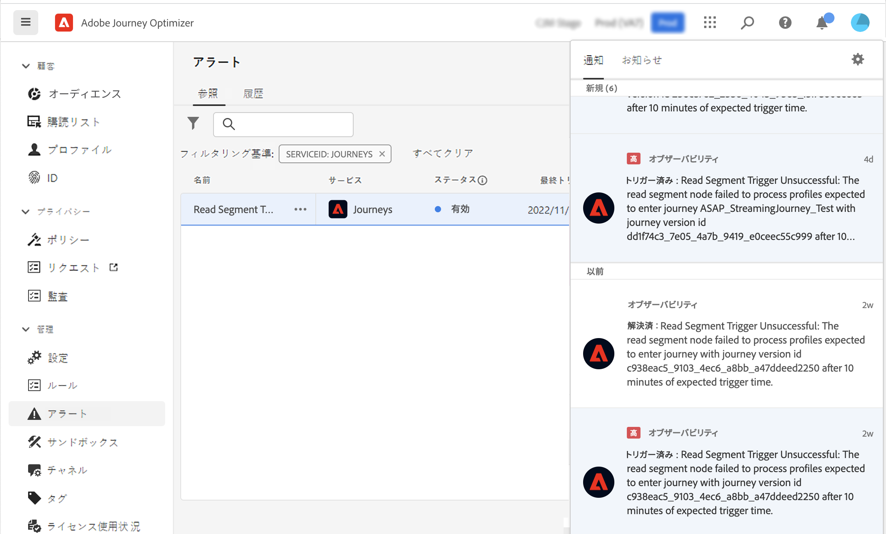

# アラートの基本を学ぶ {#alerts}

Journey Optimizer は Adobe Experience Platform のアラート機能を活用します。これにより、ユーザーインターフェイスからシステムアラートにアクセスできます。使用可能なアラートを確認し、購読できます。操作の特定の条件（システムがしきい値に達した場合に問題が発生する可能性があるなど）に達すると、その条件を購読している組織内のユーザーにアラートメッセージが配信されます。これらのメッセージは、アラートが解決されるまで、事前に定義された時間間隔で繰り返すことができます。

Adobe Experience Platform のアラートについて詳しくは、[ドキュメント](https://experienceleague.adobe.com/docs/experience-platform/observability/alerts/overview.html?lang=ja)を参照してください。
アラートを購読して設定する方法については、この[ページ](https://experienceleague.adobe.com/docs/experience-platform/observability/alerts/ui.html?lang=ja)を参照してください。

左側のメニューの&#x200B;**管理**&#x200B;で、「**アラート**」をクリックします。Journey Optimizer の事前設定済みのアラートを使用できます。このアラートは、定義された時間枠内にセグメントの読み取りノードがプロファイルを処理しなかった場合に警告します。

このような予期しない動作が発生した場合は、インターフェイスの右上隅にあるメールおよびアプリ内通知を通じて、アラートのサブスクライバーにアラート通知が送信されます。

[Platform UI でアラートルールを表示](https://experienceleague.adobe.com/docs/experience-platform/observability/alerts/ui.html?lang=ja)すると、各ルールを個別に登録できます。ただし、[I/O イベント通知](https://experienceleague.adobe.com/docs/experience-platform/observability/alerts/subscribe.html?lang=ja)を通じてアラートを登録する場合、アラートルールは異なる登録パッケージに整理されます。セグメントの読み取りアラートに対応する I/O イベントサブスクリプション名は、「ジャーニーのセグメントの読み取りの遅延、失敗およびエラー」です。

>[!WARNING]
>
>これらのアラートは、ライブジャーニーにのみ適用されます。テストモードのジャーニーでは、アラートはトリガーされません。