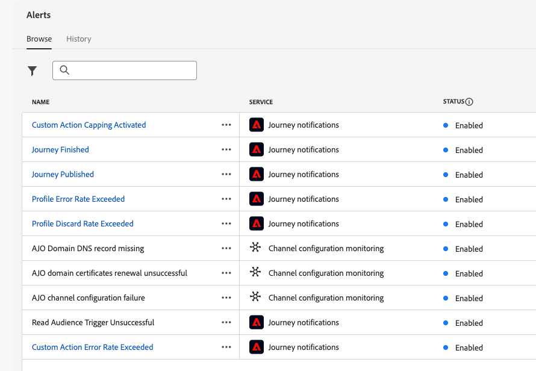
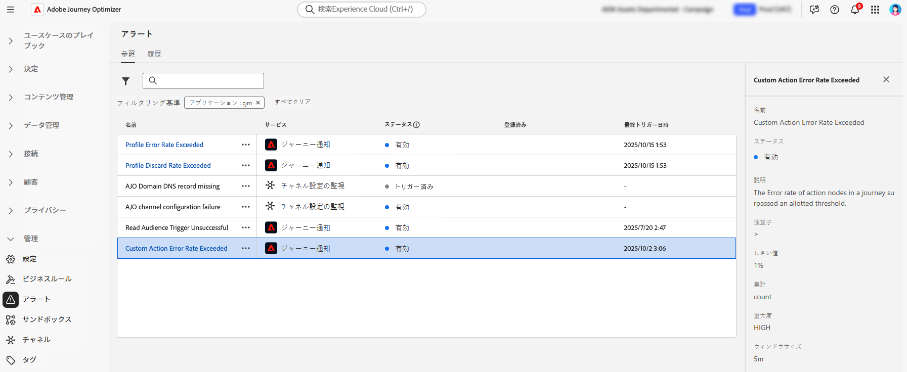
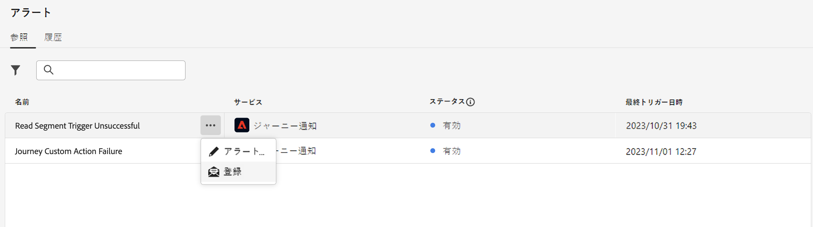
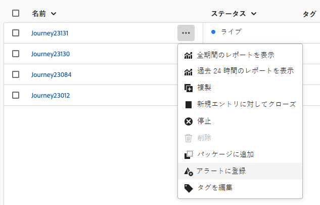
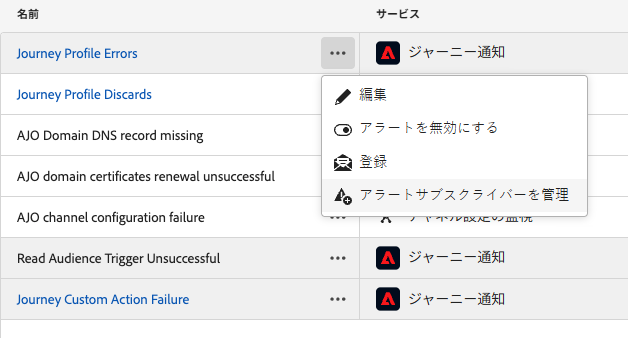
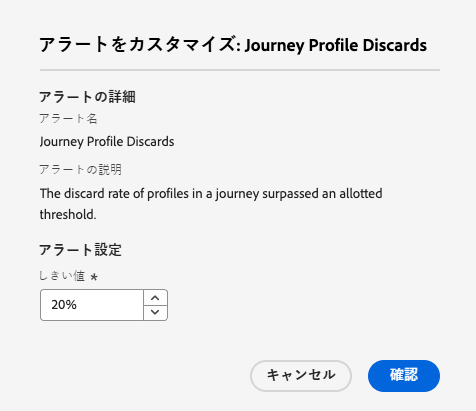
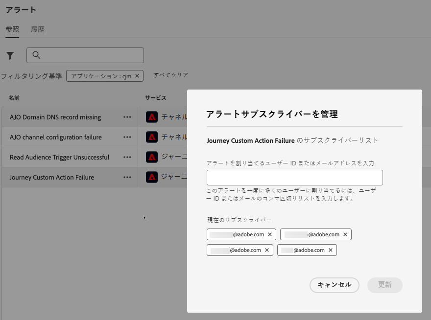

# システムアラートへのアクセスと購読 {#alerts}

## 概要

アラートは、Adobe Journey Optimizerの問題を監視し、トラブルシューティングするのに役立つ自動通知です。 ジャーニー、キャンペーン、チャネル設定における潜在的な問題をリアルタイムで把握し、顧客体験に影響を与える前に、是正措置を講じることができます。

Adobe Journey Optimizerには、次の2種類のアラートが用意されています。

* **キャンバス内の検証アラート**：ジャーニーとキャンペーンを構築する場合、キャンバスの&#x200B;**アラート** ボタンを使用して、公開前に設定エラーを特定および解決します。 ジャーニーを[&#x200B; トラブルシューティングし](../building-journeys/troubleshooting.md) キャンペーンを確認する方法について説明します。[&#x200B; アクションキャンペーン &#x200B;](../campaigns/review-activate-campaign.md) | [API トリガーキャンペーン &#x200B;](../campaigns/review-activate-api-triggered-campaign.md) | [&#x200B; オーケストレーションされたキャンペーン &#x200B;](../orchestrated/start-monitor-campaigns.md)。

* **システム監視アラート** （このページで詳しく説明）：運用上のしきい値を超えた場合、またはライブジャーニーとチャネル設定で問題が検出された場合、および重要なキャンペーンライフサイクルイベント（アクティベーション、配信、停止、および関連するエラー）が発生した場合に、プロアクティブな通知を受け取ります。 システムアラートは、キャンペーンイベントに加えて、エラー率、プロファイルの破棄、メール配信品質の問題などの指標を監視します。

**システムアラートの主な利点：**

* 顧客に影響を与える前に問題を事前に検出
* ジャーニーのパフォーマンスと健全性の自動モニタリング
* メール配信の問題に関する早期警告
* 業務上の課題を特定し、解決するための時間を短縮

システムアラートは、**[!UICONTROL 管理]**&#x200B;の&#x200B;**[!UICONTROL アラート]** メニューから利用できます。 Adobe Experience Platformには、ジャーニーとチャネル設定に対する[!DNL Adobe Journey Optimizer]固有のアラートなど、事前に定義されたアラートルールがいくつか用意されています。

## 前提条件

アラートを操作する前に：

* **権限**：アラートを表示および管理するには、特定の権限が必要です。 Adobe Experience Platform[&#128279;](https://experienceleague.adobe.com/docs/experience-platform/observability/alerts/overview.html#permissions){target="_blank"}の必要な権限を参照してください。

* **サンドボックス認知度**：アラートサブスクリプションはサンドボックス固有です。 アラートを購読すると、現在のサンドボックスにのみ適用されます。 サンドボックスがリセットされると、すべてのアラート購読もリセットされます。

* **通知の環境設定**: [Adobe Experience Cloudの環境設定](../start/user-interface.md#in-product-uc)でアラート（メールやアプリ内）を受信する方法を設定します。

## 利用可能なアラート {#available-alerts}

Journey Optimizerには、ジャーニー、キャンペーン、チャネル設定の特定の側面を監視する、事前設定済みのアラートルールが用意されています。 これらのアラートを作成する必要はありません。これらのアラートは、すぐに使用でき、サブスクリプションを通じて有効にすることができます。

**アラート リストにアクセスするには：**

左側のメニューで&#x200B;**[!UICONTROL 管理]** > **[!UICONTROL アラート]**&#x200B;に移動します。 「**参照**」タブには、Journey Optimizerで使用可能なすべての事前設定済みアラートが表示されます。

{width=60%}

ジャーニー、キャンペーン、チャネル設定のアラートを確認するには、以下のタブを参照してください。 タブ内のアラート名を選択して、その詳細な説明を展開します。

>[!BEGINTABS]

>[!TAB ジャーニーアラート ]

ユーザーインターフェイスで使用可能なすべてのジャーニー通知がこのタブに表示されます。 アラート名を選択して、その詳細な説明とガイダンスを展開します。

>[!CAUTION]
>
>Adobe Journey Optimizer に特定のアラートは、**ライブ**&#x200B;ジャーニーにのみ適用されます。 テストモードのジャーニーでは、アラートはトリガーされません。

+++ オーディエンストリガーの読み取りに失敗しました

このアラートは、スケジュールされた実行時間から 10 分経過しても、「**オーディエンスを読み取り**」アクティビティでプロファイルを処理されなかった場合に警告します。 このエラーは、技術的な問題やオーディエンスが空であることが原因で発生する可能性があります。 このエラーが技術的な問題によって発生した場合、問題のタイプに応じて、再試行が引き続き行われる可能性があります（例：エクスポートジョブの作成に失敗した場合、最大 1 時間、10 分ごとに再試行されます）。

「**オーディエンスを読み取り**」アクティビティに関するアラートは、繰り返しジャーニーにのみ適用されます。 **1 回**&#x200B;または&#x200B;**できるだけ早く**&#x200B;実行するスケジュールが設定されているライブジャーニーの「**オーディエンスを読み取り**」アクティビティは無視されます。

**オーディエンスを読み取り**&#x200B;に関するアラートは、プロファイルが&#x200B;**オーディエンスを読み取り**&#x200B;ノードにエントリした際または 1 時間後に解決されます。

**オーディエンスを読み取りのトリガー失敗**&#x200B;アラートに対応する I/O イベント購読名は、**ジャーニーのオーディエンスを読み取りの遅延、失敗およびエラー**&#x200B;です。

**オーディエンスの読み取り**&#x200B;アラートのトラブルシューティングをするには、Experience Platform インターフェイスでオーディエンス数を確認します。

➡️ [読み取りオーディエンスの設定](../building-journeys/read-audience.md)

➡️ [&#x200B; オーディエンスを定義して使用](../audience/about-audiences.md)

+++

+++ プロファイルの破棄レートを超えました

このアラートは、過去 5 分間にエントリ済みのプロファイルに対するプロファイル破棄率がしきい値を超えた場合に警告します。 デフォルトのしきい値は20%に設定されていますが、カスタムのしきい値を定義できます。

アラートの名前をクリックすると、アラートの詳細と設定を確認できます。

プロファイルが破棄される理由はいくつかあり、それによってトラブルシューティングの方法がわかります。 一般的な理由をいくつか以下に示します。

* プロファイルは、その単一ジャーニーで既にライブになっているので、エントリ時に破棄されます。 これを解決するには、プロファイルに対する次のイベントが到達する前に、プロファイルがジャーニーを終了するのに十分な時間があることを確認します。
* プロファイルに ID が設定されていないか、オーディエンスを読み取りジャーニーで使用される名前空間がそのプロファイルで使用されていません。 これを解決するには、ジャーニーの名前空間がプロファイルで使用される ID 名前空間と一致していることを確認します。
* イベントのスループット率を超えています。 これを解決するには、システムに到達するイベントがこれらの制限を超えていないことを確認します。

➡️ [&#x200B; ジャーニーの問題のトラブルシューティング &#x200B;](../building-journeys/troubleshooting.md)

➡️ [&#x200B; カスタムアラートしきい値を定義](#custom-threshold)

+++

+++ カスタムアクションエラー率を超えました

このアラートは、過去 5 分間に成功した HTTP 呼び出し数に対するカスタムアクションエラー率がしきい値を超えた場合に警告します。 デフォルトのしきい値は20%に設定されていますが、カスタムのしきい値を定義できます。

>[!NOTE]
>
>このアラートは、以前の&#x200B;**ジャーニーカスタムアクションエラーアラート**&#x200B;に代わるものです。

アラートの名前をクリックすると、アラートの詳細と設定を確認できます。

カスタムアクションエラーは、様々な理由で発生する場合があります。 これらのエラーのトラブルシューティングを行うには、次の操作を実行します。

* 別のジャーニーでテストモードを使用して、カスタムアクションを確認します。
* ジャーニーレポートで、アクションのエラー理由を確認します。
* ジャーニーの stepEvents で「failureReason」の詳細を確認します。
* カスタムアクションが正しく設定されていることを確認し、認証が引き続き有効であることを検証します。 例えば、Postman で手動で確認を実行します。
* カスタムアクション接続チェッカー経由でエンドポイントに到達可能で、カスタムアクションがリーチできることを確認します。
* 認証資格照明を確認し、インターネット接続などを調べます

➡️ [&#x200B; テストモードでの検証](../building-journeys/testing-the-journey.md)

➡️ [&#x200B; ジャーニーライブレポートの調査](../reports/journey-live-report.md)

➡️ [&#x200B; カスタムアクションの設定](../action/about-custom-action-configuration.md)

➡️ [&#x200B; カスタムアラートしきい値を定義](#custom-threshold)

+++

+++ プロファイルエラー率を超えました

このアラートは、過去 5 分間にエントリ済みのプロファイル数に対するプロファイルエラー率がしきい値を超えた場合に警告します。 デフォルトのしきい値は20%に設定されていますが、カスタムのしきい値を定義できます。

アラートの名前をクリックすると、アラートの詳細と設定を確認できます。

プロファイルエラーのトラブルシューティングを行うには、ステップイベントのデータのクエリを実行して、プロファイルがジャーニーで失敗した場所と理由を理解します。

➡️ [&#x200B; ジャーニーステップイベントの操作](../reports/journey-step-events-overview.md)

➡️ [&#x200B; ジャーニーライブレポートの調査](../reports/journey-live-report.md)

➡️ [&#x200B; カスタムアラートしきい値を定義](#custom-threshold)

+++

+++ ジャーニーが公開されました

このアラートは、ジャーニーキャンバスで実務担当者がジャーニーを公開した際に通知します。

これは、組織のジャーニーライフサイクルイベントを追跡するのに役立つ情報アラートです。 これは 1 回限りの通知なので、解決条件はありません。

➡️ [&#x200B; ジャーニーを公開](../building-journeys/publish-journey.md)

➡️ [&#x200B; テストモードでの検証](../building-journeys/testing-the-journey.md)

+++

+++ ジャーニーが完了しました

このアラートは、ジャーニーが完了した際に通知します。 「完了」の定義は、ジャーニーのタイプによって異なります。

これは、ジャーニーの完了を追跡するのに役立つ情報アラートです。 これは 1 回限りの通知なので、解決条件はありません。

➡️ [&#x200B; ジャーニーがいつ終了したかを理解する](../building-journeys/end-journey.md#journey-finished-definition)

+++

+++ カスタムアクションの上限がトリガーされました

このアラートは、カスタムアクションでキャップ がトリガーされた際に警告します。 キャップは、エンドポイントに過負荷がかかるのを防ぐために、外部エンドポイントに送信される呼び出しの数を制限するために使用されます。

アラートの名前をクリックすると、アラートの詳細と設定を確認できます。

キャップがトリガーされると、定義された期間内に API 呼び出しの最大数に達し、それ以降の呼び出しがスロットルされるかキューに追加されます。

このアラートは、キャップがアクティブでなくなった場合や、評価期間中にカスタムアクションに到達するプロファイルがない場合に解決されます。

キャップの問題をトラブルシューティングするには：

* カスタムアクションのキャップ設定を確認し、制限がユースケースに適切であることを確認します。
* API 呼び出しの量が予想よりも多いかどうかを確認し、ジャーニーのデザインやキャップの設定の調整を考慮します。
* 外部エンドポイントを監視して、想定される負荷を処理できることを確認します。

➡️ [&#x200B; カスタムアクションの上限を設定](../action/about-custom-action-configuration.md#custom-action-enhancements-best-practices)

+++

>[!TAB  キャンペーンアラート ]

**アクション**&#x200B;および&#x200B;**API トリガー**&#x200B;のキャンペーンで重要なライフサイクルまたは配信イベントが発生すると、システムアラートによって通知されます。 以下のアラート名を選択して、説明を展開します。

+++ キャンペーンがアクティブ化されました

キャンペーンが&#x200B;**アクティブ化**&#x200B;され、正常に公開/アクティブ化が完了したことを通知します。

➡️ [&#x200B; アクションキャンペーンのレビューとアクティブ化](../campaigns/review-activate-campaign.md)

➡️ [API トリガーキャンペーンのレビューとアクティブ化](../campaigns/review-activate-api-triggered-campaign.md)

+++

+++ キャンペーンのアクティブ化に失敗しました

キャンペーン **の** アクティベーション **が失敗**&#x200B;したときに通知します。 このアラートを使用して、設定や技術的な問題を早期に検出し、顧客に影響が及ぶ前にキャンペーンを再試行または修正します。

➡️ [&#x200B; アクションキャンペーンのレビューとアクティブ化](../campaigns/review-activate-campaign.md)

➡️ [API トリガーキャンペーンのレビューとアクティブ化](../campaigns/review-activate-api-triggered-campaign.md)

➡️ [前提条件とキャンペーン設定の確認](../campaigns/get-started-with-campaigns.md)

+++

+++ キャンペーンが停止しました

キャンペーンが正常に&#x200B;**停止**&#x200B;された場合（手動停止後やワークフローに従って実行が完了した場合など）に通知されます。

➡️ [&#x200B; キャンペーンの状態を理解](../campaigns/manage-campaigns.md#statuses)

➡️ [&#x200B; アクションキャンペーンを停止](../campaigns/manage-campaigns.md#stop)

+++

+++ キャンペーン停止に失敗しました

**停止**&#x200B;操作&#x200B;**が失敗したときに通知します**。 再試行する前に、キャンペーンの状態とUIに表示されるエラーを調査します。

➡️ [&#x200B; キャンペーンの状態を理解](../campaigns/manage-campaigns.md#statuses)

➡️ [&#x200B; エラーインジケーターの解釈](../campaigns/manage-campaigns.md#error-indicators)

➡️ [&#x200B; アクションキャンペーンを停止](../campaigns/manage-campaigns.md#stop)

+++

+++ キャンペーン配信が開始されました

キャンペーンの&#x200B;**メッセージ配信**&#x200B;が&#x200B;**開始** （実行が配信フェーズに移行）になったときに通知します。

➡️ [&#x200B; キャンペーンレポートの確認（CJA） &#x200B;](../reports/campaign-global-report-cja.md)

➡️ [&#x200B; キャンペーンの管理](../campaigns/manage-campaigns.md)

+++

+++ キャンペーン配信が完了しました

キャンペーンの&#x200B;**メッセージ配信**&#x200B;が&#x200B;**完了**&#x200B;したことを通知します。

➡️ [&#x200B; キャンペーンレポートの確認（CJA） &#x200B;](../reports/campaign-global-report-cja.md)

➡️ [&#x200B; キャンペーンの管理](../campaigns/manage-campaigns.md)

+++

+++ キャンペーン配信に失敗しました

キャンペーン **の** メッセージ配信&#x200B;**が失敗**&#x200B;したときに通知します。 キャンペーンレポート、実行ログ、チャネル設定を確認し、トラブルシューティングを実施します。

➡️ [&#x200B; キャンペーンレポートの確認（CJA） &#x200B;](../reports/campaign-global-report-cja.md)

➡️ [&#x200B; エラーインジケーターの解釈](../campaigns/manage-campaigns.md#error-indicators)

➡️ [&#x200B; チャネル配信の設定](../configuration/channel-surfaces.md)

+++

>[!TAB  チャネル設定アラート ]

ユーザーインターフェイスで使用可能なチャネル設定モニタリングアラートがこのタブに一覧表示されます。 修復ステップとメモを展開するアラート名を選択します。

+++ AJO ドメイン DNS レコードがありません

このアラートは、適切な配信品質設定に必要な、重要な DNS レコード（NS または CNAME）が欠落しているか、誤って設定されている場合に通知します。 これらのレコードがないと、メールの配信品質が損なわれる場合があります。

>[!NOTE]
>
>* NS レコードは、アドビへの完全なサブドメインデリゲーションに不可欠です。 [詳細情報](../configuration/about-subdomain-delegation.md#full-subdomain-delegation)
>
>* CNAME レコードは、CNAME サブドメインの設定をサポートしています。 [詳細情報](../configuration/about-subdomain-delegation.md#cname-subdomain-setup)

**AJO ドメイン DNS レコードがありません**&#x200B;アラートは、システムが必要な NS または CNAME レコードが存在しないか、設定標準と一致していないことを検出するとトリガーされます。

1. アラートをクリックして、[!DNL Journey Optimizer] インターフェイスで影響を受ける[サブドメイン](../configuration/delegate-subdomain.md)に移動します。

   <!--For guidance on editing delegated subdomains, see [this section](../configuration/delegate-subdomain.md).-->

1. レコードを正しく設定して DNS 設定を修正し、[サブドメインデリゲーションを再度送信](../configuration/delegate-subdomain.md#submit-subdomain)します。

   >[!NOTE]
   >
   >次に進む前に、ドメインをホストするソリューションですべてのレコードが適切に作成されていることを確認します。

1. 正しい値が不明な場合は、影響を受けるサブドメインと同じ名前で [!DNL Journey Optimizer] に新しいサブドメインを作成できます。 [新しいサブドメインの設定方法の詳細情報](../configuration/delegate-subdomain.md#set-up-subdomain)

変更しても問題が解決しない場合は、翌日に同じアラートが再度トリガーされます。

<!--The I/O event subscription name corresponding to this alert is xx. > Do we need to mention this?-->

+++

+++ AJO チャネル設定エラー

>[!IMPORTANT]
>
>このアラートは、[カスタムサブドメイン](../configuration/delegate-custom-subdomain.md)デリゲーションタイプを使用する&#x200B;**メール**&#x200B;チャネル設定にのみ適用されます。<!--Other channel types (such as SMS, push, or in-app) are not covered by this alert.-->

このアラートは、システム監査によりメールチャネルの設定に関する問題が検出された場合にトリガーされます。 これらの問題には、チャネル設定ミス、無効な DNS 設定、抑制リストの問題、IP の不一致、メールの配信に影響を与えることがあるその他のエラーが含まれる場合があります。

このようなアラートを受け取った場合、解決手順は以下のとおりです。

1. アラートをクリックして、[!DNL Journey Optimizer] インターフェイスで影響を受ける[メールチャネル設定](../email/get-started-email-config.md)に移動します。

   チャネル設定の編集に関するガイダンスについて詳しくは、[この節](../configuration/channel-surfaces.md#edit-channel-surface)を参照してください。

1. 設定の詳細と表示されるエラーメッセージを確認します。 一般的なエラーの理由を以下に示します。

   * SPF 検証に失敗しました
   * DKIM の検証に失敗しました
   * MX レコードの検証に失敗しました
   * DNS レコードが無効です

   >[!NOTE]
   >
   >考えられる設定エラーの理由について詳しくは、[この節](../configuration/channel-surfaces.md)を参照してください。

1. 次のように問題を解決します。

   * 必要に応じて、チャネル設定を更新します。
   * アラートに記載されている特定の DNS に関する問題を修正する必要がある場合があります。

   >[!NOTE]
   >
   >単一のドメインを複数のチャネル設定に関連付けることができるので、1 つのチャネル設定の DNS に関する問題を解決すると、複数の設定をまたいで関連する問題が自動的に修正される場合があります。

変更しても問題が解決しない場合は、翌日に同じアラートが再度トリガーされます。

メール設定に関する問題を解決する際は、以下に示すベストプラクティスに注意してください。

* 迅速に対応 - 設定エラーが検出されたらすぐに対処し、メール配信の中断を回避します。
* すべての設定を確認 - アラートに影響を受けるメール設定が複数示されている場合は、それぞれを確認して修正します。

+++

+++ AJO ドメイン証明書の更新に失敗しました

>[!IMPORTANT]
>
>このアラートは、[&#x200B; カスタムサブドメイン &#x200B;](../configuration/delegate-custom-subdomain.md)のデリゲーション タイプを使用するチャネル設定にのみ適用されます。

このアラートは、カスタム委任サブドメイン上のリソースまたはトラッキングドメイン証明書が30日以内に期限切れになっているか、すでに期限切れになっている場合に通知します。 有効な証明書がない場合、電子メールの配信品質とリンク追跡が中断される可能性があります。

>[!NOTE]
>
>チェックは&#x200B;**週単位**&#x200B;で実行されます。

このアラートがトリガーされた場合は、次の手順に従って問題を調査し、解決します。

1. アラートをクリックして、影響を受ける[&#x200B; サブドメイン &#x200B;](../configuration/delegate-subdomain.md)を[!DNL Journey Optimizer]で開きます。

1. 詳細を確認して、証明書の更新が必要かどうかを確認します。

   * 有効期限が近い場合、プランの修正：アラートは最大30日間の警告を提供できます。
   * 証明書が既に期限切れになっている場合は、すぐに対応してください。
   * 問題が解決しない場合は、翌週に同じアラートが再びトリガーされます。

1. DNS ホスティングソリューションで、サブドメインのデリゲーションに必要なすべてのレコードが、SSL検証に使用されるレコードを含め、[!DNL Journey Optimizer]に示す値にまだ一致することを確認します。

+++

>[!ENDTABS]

>[!NOTE]
>
>他のAdobe Experience Platform サービスからのアラート（データ収集、ID解決、セグメント化など）については、[標準アラートルールのドキュメント &#x200B;](https://experienceleague.adobe.com/docs/experience-platform/observability/alerts/rules.html){target="_blank"}を参照してください。

## アラートの配信を登録 {#subscribe-alerts}

アラートサブスクリプションは、特定の条件（エラー率のしきい値を超えている、設定の問題が検出されたなど）を満たしたときに通知を受け取るユーザーを決定します。 選択したアラートのアラート通知を受け取るのは、購読者ユーザーのみです。

### アラート通知の機能

**アラートのライフサイクル：**

1. **トリガー**：特定の条件が満たされたときのアラートトリガー（エラー率が20%を超えているなど）
2. **通知**：購読しているすべてのユーザーは、設定したチャネルを介して通知を受け取ります
3. **監視**：アラートは定期的に状態を監視し続けています
4. **解決策**：条件が解決されると、サブスクライバーに「解決済み」通知が送信されます

**通知の配信：**

* **配信チャネル**: アラートは、Journey Optimizer通知センター（右上隅のベル アイコン）の電子メールやアプリ内通知を介して送信されます。 [Adobe Experience Cloudの環境設定](../start/user-interface.md#in-product-uc)で、希望する配信チャネルを設定します。

* **アラートタイプ**: Journey Optimizerは、1回限りのアラート（「ジャーニー公開」などの情報イベント）と繰り返しアラート（「しきい値の監視」）の両方を提供します。 条件が解決されるまで、アラートを繰り返して評価と通知を続けます。

* **自動解決**：通知の疲労が値の変動を防ぐため、条件が続く場合でも1時間後にアラートが自動的に解決されます。 これにより、指標がしきい値にカーソルを合わせたときに、継続的に通知されるのを防ぎます。

**代替サブスクリプション方法：**

高度な統合を行う場合は、I/O イベントを介して購読し、外部システムにアラートを送信できます。 [Adobe Experience Platform ドキュメント](https://experienceleague.adobe.com/docs/experience-platform/observability/alerts/subscribe.html?lang=ja){target="_blank"}を参照してください。

### 購読方法

アラートを購読するには、いくつかの方法があります。

* **[グローバル （サンドボックス） サブスクリプション](#subscribe-alerts)**: **現在のサンドボックス**&#x200B;内のすべての一致するジャーニーまたはキャンペーンに関する通知を受け取ります。 広くカバーしたい場合に使用します。
* **[ジャーニー固有のサブスクリプション](#subscribe-alerts)**：サポートされているジャーニーアラートの場合、ジャーニーインベントリから一度に&#x200B;**1つのジャーニー**&#x200B;に通知を制限します。
* **Campaign固有のサブスクリプション**：現在、Campaign ライフサイクルアラートはサンドボックスレベルでのみ購読できます。

>[!BEGINTABS]

>[!TAB  グローバルサブスクリプション ]

グローバルサブスクリプションを使用すると、現在のサンドボックス内のすべてのジャーニーとキャンペーンに関するアラートを受け取ることができます。

**アラートを購読するには：**

1. 左側のメニューで&#x200B;**[!UICONTROL 管理]** > **[!UICONTROL アラート]**&#x200B;に移動します。

1. 「**[!UICONTROL 参照]**」タブで、監視するアラートを見つけます。

1. 目的のアラートについては、**[!UICONTROL 購入]**&#x200B;をクリックします。

   {width=80%}

**登録解除：**

アラートの横にある「**[!UICONTROL 登録解除]**」をクリックします。

>[!IMPORTANT]
>
>アラートのサブスクリプションは、サンドボックス固有です。 通知を受信する各サンドボックスで、アラートを個別に購読する必要があります。

**代替サブスクリプション方法：**

また、[I/O イベント通知](https://experienceleague.adobe.com/docs/experience-platform/observability/alerts/subscribe.html?lang=ja){target="_blank"}を介して購読することもできます。これにより、外部システムとの統合が可能になります。 ジャーニーアラート I/O サブスクリプション名は、該当する場合、**使用可能なアラート**&#x200B;の「[ジャーニーアラート」タブ &#x200B;](#available-alerts)に記載されます。 Campaign ライフサイクルアラートは、同じPlatform サブスクリプションモデルに従います。プログラム統合については、そのドキュメントを参照してください。

>[!TAB ジャーニー固有のサブスクリプション ]

ジャーニー固有のサブスクリプションを使用すると、組織内のすべてのジャーニーに関するアラートを受け取ることなく、優先度の高い個々のジャーニーを監視できます。

**特定のジャーニーのアラートを購読するには：**

1. ジャーニーのインベントリに移動します。

1. 監視するジャーニーの&#x200B;**⋯** （その他のアクション）メニューをクリックします。

1. 「**[!UICONTROL アラートを購読する]**」を選択します。

   {width=75%}

1. 使用可能なオプションから有効にするアラートを選択します。
   * [プロファイルの破棄率を超えました](#available-alerts)
   * [カスタムアクションのエラー率を超えました](#available-alerts)
   * [プロファイルのエラー率を超えました](#available-alerts)
   * [ジャーニーが公開されました](#available-alerts)
   * [ジャーニーが完了しました](#available-alerts)
   * [カスタムアクションのキャップがトリガーされました](#available-alerts)

1. 「**[!UICONTROL 保存]**」をクリックして、サブスクリプションを確認します。

**登録解除：**

同じダイアログを開き、アラートの選択を解除して、**[!UICONTROL 保存]**&#x200B;をクリックします。

>[!NOTE]
>
>[&#x200B; オーディエンストリガーの読み取りに失敗しました](#available-alerts) アラートは、ジャーニーごとのサブスクリプションではなく、グローバルサブスクリプションを通じてのみ利用できます。

>[!ENDTABS]

<!--
Campaign-specific subscriptions apply to the [campaign lifecycle alerts](#available-alerts). They let you monitor individual high-priority campaigns without receiving the same alert for every campaign in the sandbox.

**To subscribe to campaign lifecycle alerts for a specific campaign:**

1. Go to the **[!UICONTROL Campaigns]** inventory and open the tab for your campaign type (**[!UICONTROL Action]** or **[!UICONTROL API triggered]**).

1. Click the **⋯** (more actions) menu for the campaign you want to monitor.

1. Select **[!UICONTROL Subscribe to alerts]**.

1. Select the campaign lifecycle alert(s) you want from the available options (see [Campaign alerts](#available-alerts)).

1. Click **[!UICONTROL Save]** to confirm your subscriptions.

**To unsubscribe:**

Open the same dialog, deselect the alert(s), and click **[!UICONTROL Save]**.

You can combine **sandbox-level** subscription (from the Alerts **[!UICONTROL Browse]** tab) with **campaign-specific** subscriptions. Use sandbox-level coverage for everything in the sandbox, and add per-campaign subscriptions only for campaigns you want to track separately.
-->

<!--To enable email alerting, refer to [Adobe Experience Platform documentation](https://experienceleague.adobe.com/docs/experience-platform/observability/alerts/ui.html#enable-email-alerts){target="_blank"}.-->

## アラートの管理 {#manage-alerts}

### アラートの編集

行をクリックすると、アラートの詳細を確認できます。名前、ステータス、通知チャネルが左側のパネルに表示されます。
ジャーニーアラートの場合は、「**[!UICONTROL その他のアクション]**」ボタンを使用して編集します。その後、これらのアラートに対して[&#x200B; カスタムしきい値](#custom-threshold)を定義できます。

{width=60%}

### カスタムしきい値の定義 {#custom-threshold}

[ジャーニーアラート](#available-alerts)のしきい値を設定できます。 上記のしきい値アラートのデフォルトは 20％です。

しきい値を変更するには：

1. **アラート**&#x200B;画面を参照します
1. 更新するアラートの「**[!UICONTROL その他のアクション]**」ボタンをクリックします
1. 新しいしきい値を入力して確定します。 新しいしきい値は&#x200B;**すべて**&#x200B;のジャーニーに適用されます

{width=60%}

>[!CAUTION]
>
>しきい値レベルは、すべてのジャーニーをまたいでグローバルで、ジャーニーごとに個別に変更できません。

### アラートの無効化

デフォルトでは、すべてのアラートが有効になっています。 アラートを無効にするには、「**[!UICONTROL アラートを無効にする]**」オプションを選択します。このアラートのすべてのサブスクライバーは、関連する通知を受信しなくなります。

### アラートステータス

考えられるアラートステータスを以下に示します。

* **[!UICONTROL 有効]** - アラートは有効で、現在、トリガー条件を監視しています。
* **[!UICONTROL 無効]** - アラートは無効で、現在、トリガー条件を監視していません。 このアラートに関する通知は受信されません。
* **[!UICONTROL トリガー]** - アラートのトリガー条件は、現在、満たされています。

### サブスクライバーの表示と更新 {#manage-subscribers}

アラートを登録しているユーザーのリストを表示するには、「**[!UICONTROL アラートサブスクライバーを管理]**」を選択します。

{width=80%}

サブスクライバーを追加するには、メールをコンマで区切って入力し、「**[!UICONTROL 更新]**」を選択します。

サブスクライバーを削除するには、現在のサブスクライバーからメールアドレスを削除し、「**[!UICONTROL 更新]**」を選択します。

## 関連トピック {#additional-resources-alerts}

**ジャーニーとキャンペーンの管理：**

* [&#x200B; ジャーニーのトラブルシューティング &#x200B;](../building-journeys/troubleshooting.md) – 一般的なジャーニーの問題とエラーを特定して解決します
* [&#x200B; ジャーニーのテストと公開](../building-journeys/publish-journey.md) – 公開前にジャーニー設定を検証する
* [&#x200B; アクションキャンペーンのレビューとアクティブ化](../campaigns/review-activate-campaign.md) - スケジュール済みのキャンペーンと1回限りのキャンペーンの公開前の検証
* [API トリガーキャンペーンのレビューとアクティブ化](../campaigns/review-activate-api-triggered-campaign.md) - API トリガーキャンペーンの検証
* [&#x200B; オーケストレーションされたキャンペーンの監視](../orchestrated/start-monitor-campaigns.md) - オーケストレーションされたキャンペーンの実行の追跡と管理

**アラートフレームワーク：**

* [Adobe Experience Platform アラートの概要](https://experienceleague.adobe.com/docs/experience-platform/observability/alerts/overview.html?lang=ja){target="_blank"} - アラート フレームワークについて
* [UIでアラートを管理](https://experienceleague.adobe.com/docs/experience-platform/observability/alerts/ui.html?lang=ja){target="_blank"} - アラートの表示、購読、管理
* [I/O イベントを介したアラートの購読](https://experienceleague.adobe.com/docs/experience-platform/observability/alerts/subscribe.html?lang=ja){target="_blank"} – 高度な統合オプション
* [標準アラートルール &#x200B;](https://experienceleague.adobe.com/docs/experience-platform/observability/alerts/rules.html){target="_blank"} – 使用可能なPlatform アラートの完全リスト
