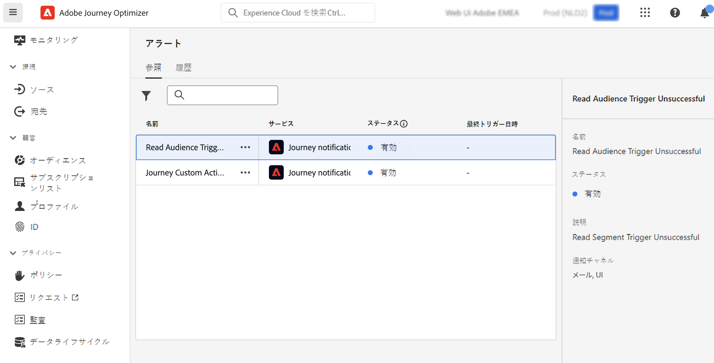

# アラートの基本を学ぶ {#alerts}

Journey Optimizer は Adobe Experience Platform のアラート機能を活用します。これにより、ユーザーインターフェイスからシステムアラートにアクセスできます。使用可能なアラートを確認し、購読できます。

操作の特定の条件（システムがしきい値に達した場合に問題が発生する可能性があるなど）に達すると、その条件を購読している組織内のユーザーにアラートメッセージが配信されます。これらのメッセージは、アラートが解決されるまで、事前に定義された時間間隔で繰り返すことができます。

Adobe Experience Platform のアラートについて詳しくは、[ドキュメント](https://experienceleague.adobe.com/docs/experience-platform/observability/alerts/overview.html?lang=ja)を参照してください。
アラートを購読して設定する方法については、この[ページ](https://experienceleague.adobe.com/docs/experience-platform/observability/alerts/ui.html?lang=ja)を参照してください。

>[!AVAILABILITY]
>
>「オーディエンスを読み取りのトリガーに失敗」アラートの設計変更が進行中なので、このアラートは現在一時停止されており、ユーザーインターフェイスから一時的に削除されています。これらの変更がリリースされると、アラートが再び表示され、購読できるようになります。
>

左側のメニューの&#x200B;**管理**&#x200B;で、「**アラート**」をクリックします。

<!--A pre-configured alert for Journey Optimizer is available. This alert will warn you if a read segment node has not processed any profile during the defined time frame.

-->

予期しない動作が発生した場合は、インターフェイスの右上隅にあるメールを通じて、アラートのサブスクライバーにアラート通知が送信されます。

<!---->

[Adobe Experience Platform UI でアラートルールを表示](https://experienceleague.adobe.com/docs/experience-platform/observability/alerts/ui.html?lang=ja)すると、各ルールを個別に登録できます。ただし、[I/O イベント通知](https://experienceleague.adobe.com/docs/experience-platform/observability/alerts/subscribe.html?lang=ja)を通じてアラートの購読を登録する場合、アラートルールは、異なるサブスクリプションパッケージにまとめられます。

<!--The I/O event subscription name corresponding to the Read segment alert is: "Journey read segment Delays, Failures and Errors".

>[!WARNING]
>
>These alerts apply only to live journeys. Alerts will not be triggered for journeys in test mode.-->
