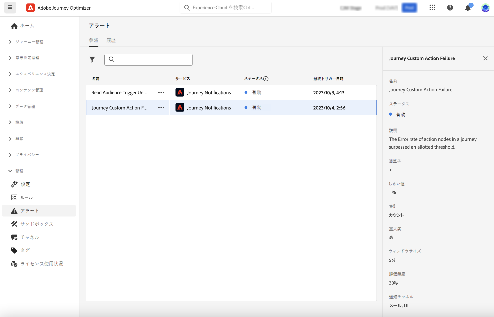

# アラートの基本を学ぶ {#alerts}

Journey Optimizer は Adobe Experience Platform のアラート機能を活用します。これにより、ユーザーインターフェイスからシステムアラートにアクセスできます。使用可能なアラートを確認し、購読できます。

操作の特定の条件（システムがしきい値に達した場合に問題が発生する可能性があるなど）に達すると、その条件を購読している組織内のユーザーにアラートメッセージが配信されます。

<!--These messages can repeat over a pre-defined time interval until the alert has been resolved.-->

Adobe Experience Platform のアラートについて詳しくは、[ドキュメント](https://experienceleague.adobe.com/docs/experience-platform/observability/alerts/overview.html?lang=ja)を参照してください。

アラートを購読して設定する方法については、この[ページ](https://experienceleague.adobe.com/docs/experience-platform/observability/alerts/ui.html?lang=ja)を参照してください。

>[!AVAILABILITY]
>
>「オーディエンストリガーの読み取りに失敗しました」アラートに対して、一部のデザインの変更が進行中なので、このアラートは現在のところ一時停止され、ユーザーインターフェイスから一時的に削除されています。 これらの変更がリリースされると、アラートが再び表示され、購読できるようになります。

左側のメニューの&#x200B;**管理**&#x200B;で、「**アラート**」をクリックします。Journey Optimizer の事前設定済みのアラートを使用できます。このアラートは、カスタムアクションが失敗した場合に警告を表示します。 過去 5 分間に特定のカスタムアクションで 1%以上のエラーが発生した場合、エラーが発生したと考えます。 これは 30 秒ごとに評価されます。

<!--A pre-configured alert for Journey Optimizer is available. This alert will warn you if a read segment node has not processed any profile during the defined time frame.

-->

予期しない動作が発生した場合は、ユーザーの環境設定に基づいて、電子メールを通じて、またはJourney Optimizer内のインターフェイスの右上隅にあるアラートの購読者にアラート通知が送信されます。

アラートが解決されると、「解決済み」通知が表示されます。 カスタムアクションアラートの場合、次の 2 つの理由が考えられます。
* 過去 5 分間、そのカスタムアクションに関するエラー（または 1%しきい値を下回るエラー）は発生しませんでした。
* そのカスタムアクションに到達したプロファイルはありません。

[Adobe Experience Platform UI でアラートルールを表示](https://experienceleague.adobe.com/docs/experience-platform/observability/alerts/ui.html?lang=ja)すると、各ルールを個別に登録できます。ただし、[I/O イベント通知](https://experienceleague.adobe.com/docs/experience-platform/observability/alerts/subscribe.html?lang=ja)を通じてアラートを登録する場合、アラートルールは異なる登録パッケージに整理されます。カスタムアクションアラートに対応する I/O イベントのサブスクリプション名は、「ジャーニーカスタムアクション失敗」です。

<!--The I/O event subscription name corresponding to the Read segment alert is: "Journey read segment Delays, Failures and Errors".-->

>[!WARNING]
>
>これらのアラートは、ライブジャーニーにのみ適用されます。テストモードのジャーニーでは、アラートはトリガーされません。

