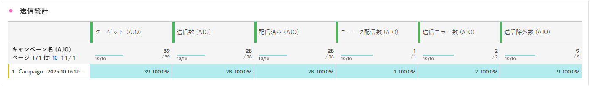
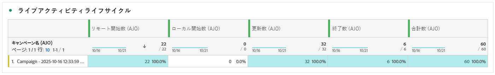
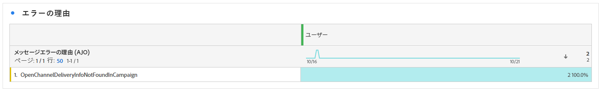
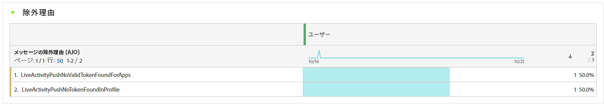

# ライブアクティビティキャンペーンレポート {#campaign-global-report-cja-activity}

>[!BEGINSHADEBOX]

キャンペーンから「**[!UICONTROL レポート]**」ボタンをクリックし、「**[!UICONTROL すべての時間レポートを表示]**」を選択して、ライブ活動キャンペーンレポートにアクセスできます。 [詳細情報](report-gs-cja.md)

>[!ENDSHADEBOX]

## 送信統計 {#sending-statistics-mobile}

**[!UICONTROL 送信統計]** テーブルには、ライブアクティビティキャンペーンに関連する主要指標の詳細な概要が表示されます。 ターゲットオーディエンスのサイズや正常に配信されたプッシュ通知の数などの重要な情報が表示され、ライブのプッシュ通知の全体的なリーチとパフォーマンスを評価するのに役立ちます。

+++ 詳しくは、送信統計指標を参照してください

* **[!UICONTROL ターゲット]**：ライブアクティビティ中にターゲットされたプロファイルの合計数。

* **[!UICONTROL 送信数]**：ターゲットプロファイルに送信しようとしたプッシュ通知の合計数。

* **[!UICONTROL 配信済み]**：試行された送信の合計数に対して、デバイスに正常に配信されたプッシュ通知の数。

* **[!UICONTROL 送信エラー]**：エラー（無効なトークンや接続の問題など）が原因で送信できなかったプッシュ通知の合計数。

* **[!UICONTROL 除外の送信]**:Adobe Journey Optimizerによって送信から除外されたプロファイルの数（オプトアウトステータスや実施要件ルールなどによる）。

+++

## ライブアクティビティのライフサイクル {#lifecycle}

**[!UICONTROL ライブアクティビティのライフサイクル]** テーブルには、ライブアクティビティの進行状況の推移を包括的に表示できます。 アクティビティの開始時刻、更新時刻、終了時刻などの主要なイベントを可視化し、ユーザーエンゲージメントとライブアクティビティキャンペーンの全体的なライフサイクルをより深く理解するのに役立ちます。

+++ ライブアクティビティのライフサイクル指標の詳細

* **[!UICONTROL リモート開始]**：リモートで開始されたライブアクティビティの数。通常、サーバーまたはバックエンドシステムによってトリガーされます。

* **[!UICONTROL ローカルスタート]**：ユーザーのデバイス上でローカルに開始されたライブアクティビティの数。多くの場合、ユーザーのインタラクションやクライアントサイドのトリガーによって発生します。

**[!UICONTROL 更新]**：デバイスに送信されたライブアクティビティ更新の合計数。 アップデートには、ステータスの変更、新しいコンテンツ、進捗に関する通知などがあります。

**[!UICONTROL 終了]**：完了時に自動的に、または定義されたトリガーまたはタイムアウトを通じて手動で、終了したライブアクティビティの数。

**[!UICONTROL 合計数]**：開始、更新、終了を含むすべてのライブアクティビティのライフサイクルイベントの全体的な合計。ライブアクティビティのボリュームを完全に測定します。

+++

## エラーの理由 {#error-reasons}

**[!UICONTROL エラー理由]** テーブルを使用すると、ライブアクティビティの送信プロセス中に発生した特定のエラーを識別し、発生した問題を簡単に分析できます。

## 除外された理由 {#excluded-reasons}

この **[!UICONTROL 除外された理由]** テーブルには、ターゲットオーディエンスからユーザープロファイルを除外し、ライブアクティビティを受け取れなくした様々な要因が視覚的に表示されます。
