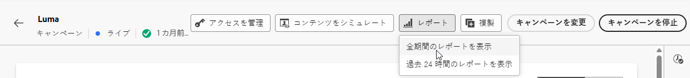
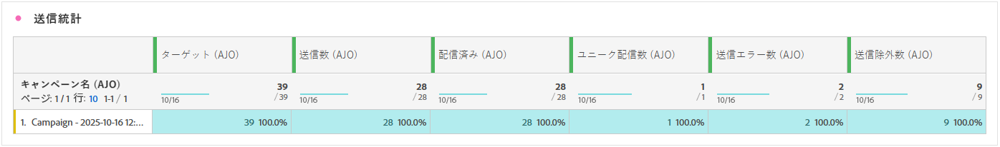
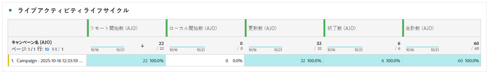
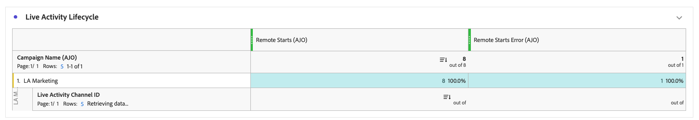
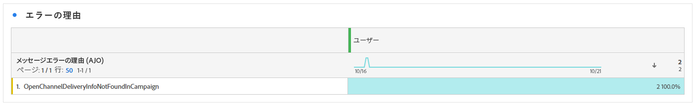
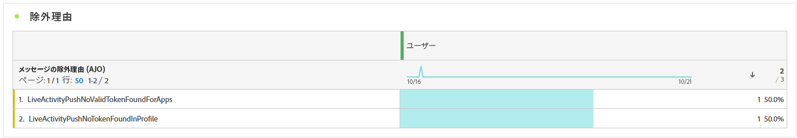

# ライブアクティビティキャンペーンレポート {#campaign-global-report-cja-activity}

>[!BEGINSHADEBOX]

ライブアクティビティキャンペーンレポートにアクセスするには、キャンペーンの「**[!UICONTROL レポート]**」ボタンをクリックし、「**[!UICONTROL 全期間のレポートを表示]**」を選択します。[詳細情報](report-gs-cja.md)



>[!ENDSHADEBOX]

## 送信統計 {#sending-statistics-mobile}



**[!UICONTROL 送信統計]** テーブルには、ライブアクティビティキャンペーンに関連する主要指標の詳細な概要が表示されます。 ターゲットオーディエンスのサイズや正常に配信されたライブアクティビティの数などの重要な情報が表示され、ライブアクティビティの全体的なリーチとパフォーマンスを評価するのに役立ちます。

+++ 詳しくは、送信統計指標を参照してください

* **[!UICONTROL ターゲット]**：除外、抑制または同意削除が適用される前にオーディエンスに対して選定されたプロファイルの数。

* **[!UICONTROL 送信数]**：ターゲットプロファイルに送信しようとしたライブアクティビティイベントの合計数。

* **[!UICONTROL 配信済み]**：送信を試みた合計数に対して、デバイスに正常に配信されたライブアクティビティイベントの数。

* **[!UICONTROL 送信エラー]**：エラー（無効なトークンや接続の問題など）が原因で送信できなかったライブアクティビティイベントの合計数。

* **[!UICONTROL 送信除外数]**：Adobe Journey Optimizer により送信から除外されたプロファイルの数（例：オプトアウトステータスや実施要件ルールにより）。

+++

## ライブアクティビティライフサイクル {#lifecycle}

**[!UICONTROL ライブアクティビティのライフサイクル]** テーブルには、ライブアクティビティの経時的な進捗を示す包括的なビューが表示されます。 アクティビティの開始時刻、更新時刻、終了時刻などの主要なイベントを可視化し、ユーザーエンゲージメントとライブアクティビティキャンペーンの全体的なライフサイクルをより深く理解するのに役立ちます。

レポートは、トランザクションキャンペーンとマーケティングキャンペーンのどちらを使用しているかによって異なります。

### トランザクションライブアクティビティ



トランザクションキャンペーンの場合、ライブアクティビティ キャンペーンレポートには、リモート開始、ローカル開始、更新、終了を含む、すべてのライフサイクルイベントが表示されます。

+++ トランザクションキャンペーンを使用したライブアクティビティのライフサイクル指標について詳しくは、こちらを参照してください

* **[!UICONTROL リモート開始]**：リモートで開始されたライブアクティビティ開始イベントの合計数。通常、サーバーシステムまたはバックエンドシステムによってトリガーされます。

* **[!UICONTROL ローカルスタート]**：ユーザーのデバイス上でローカルに開始されたライブアクティビティ開始イベントの合計数。多くの場合、ユーザーのインタラクションまたはクライアントサイドのトリガーに起因します。

* **[!UICONTROL アップデート数]**：デバイスに送信されたライブアクティビティのアップデートの合計数。アップデートには、ステータスの変更、新しいコンテンツ、進行状況の通知を含めることができます。

* **[!UICONTROL 終了]**：デバイスに送信されたライブアクティビティ終了イベントの合計数。

* **[!UICONTROL 合計カウント]**：ライブアクティビティのボリュームの完全な測定値を提供する、開始、更新、終了を含むすべてのライブアクティビティライフサイクルイベントの全体的な合計。

+++

### マーケティングライブアクティビティ



マーケティングキャンペーンでは、ブロードキャストのユースケースに対してライブアクティビティを使用し、複数のデバイスに更新を同時に送信します。

マーケティングキャンペーンのiOS ライブアクティビティの場合、レポートには、開始時に **[!UICONTROL リモート開始]** イベントと **[!UICONTROL リモート開始エラー]** のみが表示されます。 APN ではフィードバックを提供せずにすべてのデバイスに更新が配布されるので、**[!UICONTROL Updates]** および **[!UICONTROL Ends]** イベントは追跡されません。 **[!UICONTROL アップデート]** および **[!UICONTROL 終了]** イベントを表示するには、[Appleのプッシュ通知コンソール ](https://developer.apple.com/notifications/push-notifications-console/) を使用します。

+++ マーケティングキャンペーンを使用したライブアクティビティのライフサイクル指標の詳細を説明します

* **[!UICONTROL リモート開始]**：リモートで開始されたライブアクティビティ開始イベントの合計数。通常、サーバーシステムまたはバックエンドシステムによってトリガーされます。

* **[!UICONTROL リモート開始エラー]**：ライブアクティビティをリモートで開始しようとしたときに発生したエラーの合計数（無効なトークンや接続の問題など）。

+++

#### API を使用したアップデートとエンドカウントの取得 {#retrieving-updates-end-api}

Appleのプッシュ通知コンソールを使用する代わりに、ヘッドレス API 呼び出しで更新と終了のカウントを取得することもできます。

ブロードキャストのユースケースで更新または終了 API 呼び出しを実行する場合、応答には `controlBreakdown` セクションが含まれ、ライブアクティビティの実行に対して実行された更新および終了の呼び出しの数を示すカウンターが表示されます。 このブロックは、ライフサイクルデータを持たない従来の実行には存在しません。 必要に応じて、GET エンドポイントを使用して、実行ステータスを明示的に取得することもできます。

**更新/応答の終了（200 OK）**

```json
{
  "executionId": "HA-exec-abc",
  "campaignId": "campaign-abc-123",
  "campaignVersionId": "v1",
  "audienceId": "audience-segment-id",
  "status": "processing",
  "targetedProfileCount": 150000,
  "createdAt": "2026-02-27T10:00:00Z",
  "executionLifecycle": {
    "lastControlAt": "2026-02-27T10:45:00Z",
    "controlBreakdown": {
      "update": 5,
      "end": 1
    }
  }
}
```

**実行状況（GET）**

```
GET /im/executions/audience/{executionId}
```

## エラーの理由 {#error-reasons}



**[!UICONTROL エラー理由]** テーブルを使用すると、ライブアクティビティの送信プロセス中に発生した特定のエラーを識別し、発生した問題を簡単に分析できます。

## 除外された理由 {#excluded-reasons}



**[!UICONTROL 除外された理由]**&#x200B;テーブルには、ユーザープロファイルがターゲットオーディエンスから除外され、ライブアクティビティを受信できない原因となった様々な要因が視覚的に表示されます。
