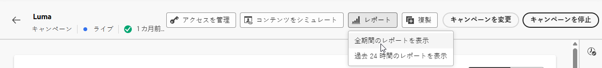
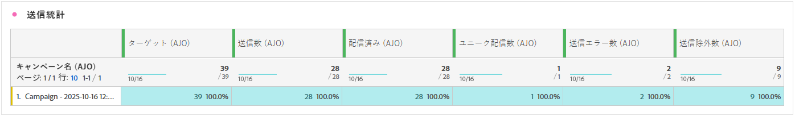
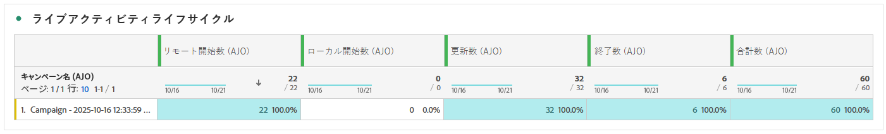
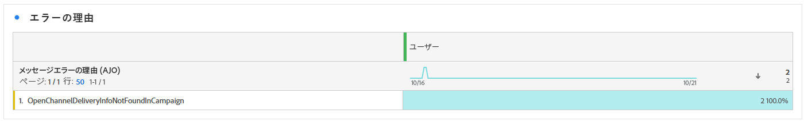
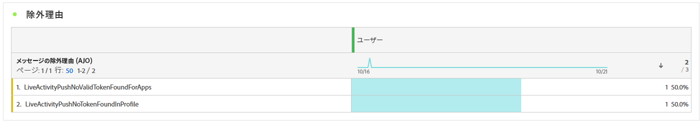

# ライブアクティビティキャンペーンレポート {#campaign-global-report-cja-activity}

>[!BEGINSHADEBOX]

ライブアクティビティキャンペーンレポートにアクセスするには、キャンペーンの「**[!UICONTROL レポート]**」ボタンをクリックし、「**[!UICONTROL 全期間のレポートを表示]**」を選択します。 [詳細情報](report-gs-cja.md)



>[!ENDSHADEBOX]

## 送信統計 {#sending-statistics-mobile}



**[!UICONTROL 送信統計]** テーブルには、ライブアクティビティキャンペーンに関連する主要指標の詳細な概要が表示されます。 ターゲットオーディエンスのサイズや、正常に配信されたライブアクティビティの数などの重要な情報が表示され、ライブアクティビティの全体的なリーチとパフォーマンスを評価するのに役立ちます。

+++ 詳しくは、送信統計指標を参照してください

* **[!UICONTROL ターゲット]**：除外、抑制、または同意の削除が適用されるまでにオーディエンスに適格だったプロファイルの数。

* **[!UICONTROL 送信]**：ターゲットプロファイルに送信しようとしたライブアクティビティイベントの合計数。

* **[!UICONTROL 配信済み]**：デバイスに正常に配信されたライブアクティビティイベントの数（試行された送信の合計数に対する）。

* **[!UICONTROL 送信エラー]**: エラー（無効なトークンや接続の問題など）が原因で送信できなかったライブアクティビティイベントの合計数。

* **[!UICONTROL 送信除外数]**：Adobe Journey Optimizer により送信から除外されたプロファイルの数（例：オプトアウトステータスや実施要件ルールにより）。

+++

## ライブアクティビティライフサイクル {#lifecycle}

**[!UICONTROL ライブアクティビティのライフサイクル]** テーブルには、ライブアクティビティの時間の経過に関する包括的なビューが表示されます。 アクティビティがいつ開始、更新、終了したかなどの重要なイベントを可視化し、ユーザーエンゲージメントとライブアクティビティキャンペーン全体のライフサイクルをより深く理解できます。

レポートは、トランザクションキャンペーンとマーケティングキャンペーンのどちらを使用しているかによって異なります。

### トランザクションライブアクティビティ



トランザクションキャンペーンの場合、ライブアクティビティキャンペーンレポートには、リモート開始、ローカル開始、更新、終了など、すべてのライフサイクルイベントが表示されます。

+++ トランザクションキャンペーンを使用したライブアクティビティライフサイクル指標の詳細

* **[!UICONTROL リモート開始]**: リモートで開始されたライブアクティビティ開始イベントの合計数。通常、サーバーまたはバックエンドシステムによってトリガーされます。

* **[!UICONTROL ローカル開始]**: ユーザーのデバイスでローカルに開始されたライブアクティビティ開始イベントの合計数。多くの場合、ユーザーの操作またはクライアントサイドのトリガーに起因します。

* **[!UICONTROL アップデート数]**：デバイスに送信されたライブアクティビティのアップデートの合計数。 アップデートには、ステータスの変更、新しいコンテンツ、進行状況の通知を含めることができます。

* **[!UICONTROL 終了]**: デバイスに送信されたライブアクティビティ終了イベントの合計数。

* **[!UICONTROL 合計カウント]**：ライブアクティビティのボリュームの完全な測定値を提供する、開始、更新、終了を含むすべてのライブアクティビティライフサイクルイベントの全体的な合計。

+++

### マーケティングライブアクティビティ


マーケティングキャンペーンでは、ブロードキャストのユースケースにライブアクティビティを使用し、複数のデバイスに同時にアップデートを送信します。

Marketing CampaignsのiOS Live アクティビティの場合、レポートには、開始時に&#x200B;**[!UICONTROL Remote Starts]**&#x200B;件のイベントと&#x200B;**[!UICONTROL Remote starts errors]**&#x200B;件のみが表示されます。 APNがフィードバックを提供せずにすべてのデバイスにアップデートを配信するため、**[!UICONTROL 更新]**&#x200B;および&#x200B;**[!UICONTROL 終了]**&#x200B;のイベントは追跡されません。 **[!UICONTROL 更新]**&#x200B;および&#x200B;**[!UICONTROL 終了]** イベントを表示するには、[Apple プッシュ通知コンソール &#x200B;](https://developer.apple.com/notifications/push-notifications-console/)を使用します。

+++ マーケティングキャンペーンのライブアクティビティライフサイクル指標の詳細

* **[!UICONTROL リモート開始]**: リモートで開始されたライブアクティビティ開始イベントの合計数。通常、サーバーまたはバックエンドシステムによってトリガーされます。

* **[!UICONTROL リモートで開始エラー]**: ライブ アクティビティをリモートで開始しようとしたときに発生したエラーの合計数（無効なトークンや接続性の問題など）。

+++

#### APIを介した更新と終了数の取得 {#retrieving-updates-end-api}

Appleのプッシュ通知コンソールを使用する代わりに、ヘッドレス API呼び出しを使用してアップデートと終了回数を取得できます。

ブロードキャストのユースケースに対して更新または終了API呼び出しを実行する場合、応答には`controlBreakdown` セクションが含まれ、ライブアクティビティ実行に対して実行された更新呼び出しと終了呼び出しの数を示すカウンターが提供されます。 このブロックは、ライフサイクルデータのないレガシー実行には存在しません。 また、必要に応じて、GET エンドポイントを使用して実行ステータスを明示的に取得することもできます。

**更新/応答終了（200 OK）**

```json
{
  "executionId": "HA-exec-abc",
  "campaignId": "campaign-abc-123",
  "campaignVersionId": "v1",
  "audienceId": "audience-segment-id",
  "status": "processing",
  "targetedProfileCount": 150000,
  "createdAt": "2026-02-27T10:00:00Z",
  "executionLifecycle": {
    "lastControlAt": "2026-02-27T10:45:00Z",
    "controlBreakdown": {
      "update": 5,
      "end": 1
    }
  }
}
```

**実行ステータス （GET）**

```
GET /im/executions/audience/{executionId}
```

## エラーの理由 {#error-reasons}



「**[!UICONTROL エラーの理由]**」テーブルを使用すると、ライブアクティビティの送信プロセス中に発生した特定のエラーを特定でき、発生した問題を詳細に分析できます。

## 除外された理由 {#excluded-reasons}



**[!UICONTROL 除外された理由]**&#x200B;テーブルには、ユーザープロファイルがターゲットオーディエンスから除外され、ライブアクティビティを受信できない原因となった様々な要因が視覚的に表示されます。
