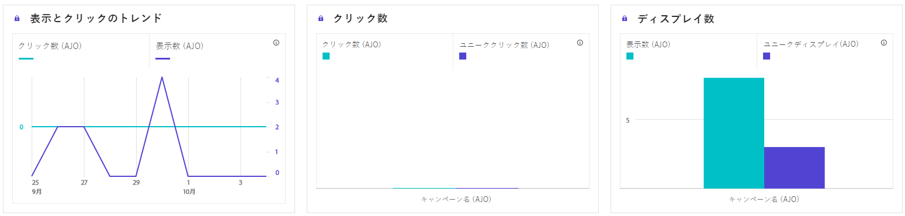
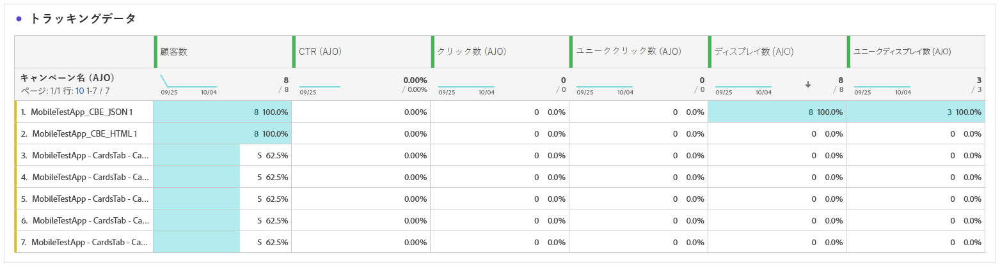
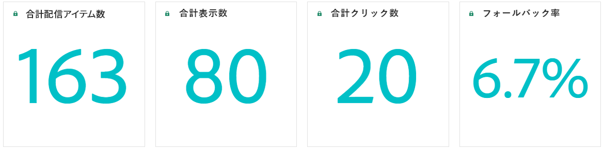
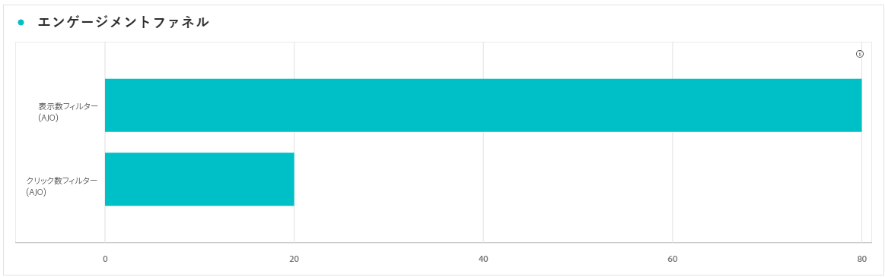
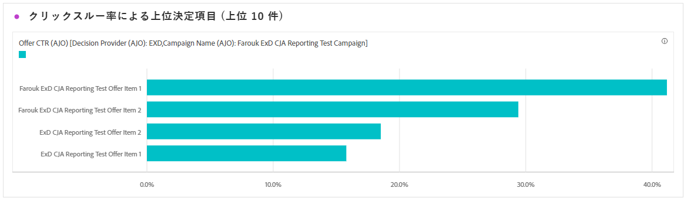
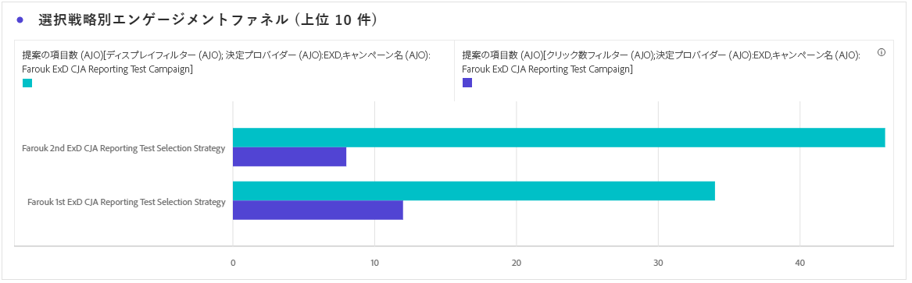
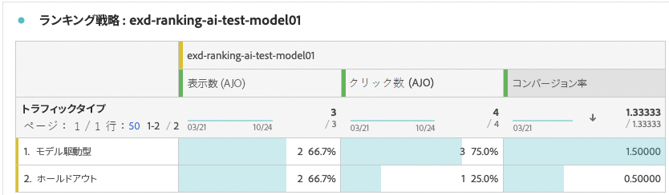
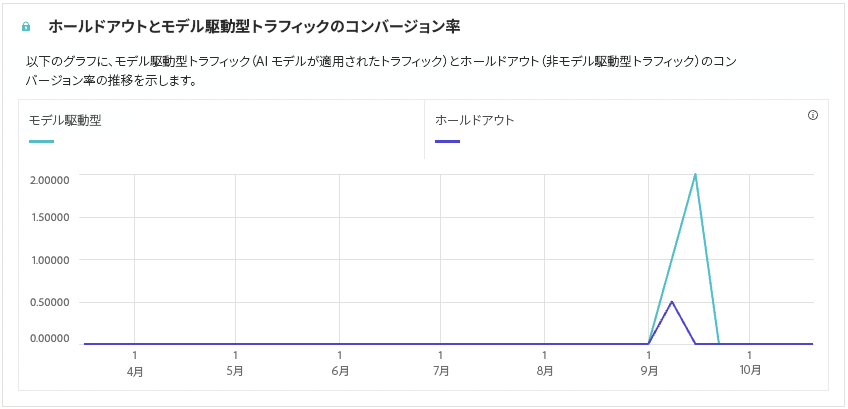

# コードベースのキャンペーンレポート {#campaign-global-report-cja-code}

>[!BEGINSHADEBOX]

コードベースのキャンペーンレポートにアクセスするには、キャンペーンの「**[!UICONTROL レポート]**」ボタンをクリックし、「**[!UICONTROL 全期間のレポートを表示]**」を選択します。 [詳細情報](report-gs-cja.md)

>[!ENDSHADEBOX]

>[!NOTE]
>
>コードベースのエクスペリエンスは、ユーザーがサイトやアプリにアクセスしてオプトインするインバウンドインタラクションとして機能します。 したがって、アウトバウンドメッセージの配信用に選択されたプロファイルを追跡する&#x200B;**ターゲット**&#x200B;指標や&#x200B;**オーディエンス**&#x200B;指標は、コードベースのキャンペーンでは増分しません。

## 表示してクリック {#impressions-code}

**[!UICONTROL 表示してクリック]**&#x200B;のグラフには、プロファイルのコードベースエクスペリエンスへのエンゲージメントに関する詳細な分析が表示され、プロファイルがコンテンツとどのようにやり取りするかについての貴重なインサイトを得ることができます。

+++ 詳しくは、インプレッションとクリック指標を参照してください

* **[!UICONTROL ユニーククリック数]**：エクスペリエンスのコンテンツをクリックしたプロファイルの数。

* **[!UICONTROL クリック数]**：エクスペリエンスのコンテンツがクリックされた回数。

* **[!UICONTROL 表示数]**：エクスペリエンスが開かれた回数。

* **[!UICONTROL ユニーク表示数]**：エクスペリエンスが開かれた回数。1 つのプロファイルによる複数回のインタラクションは考慮されません。

+++

## トラッキングデータ {#track-data-code}

**[!UICONTROL トラッキングデータ]**&#x200B;のテーブルには、コードベースエクスペリエンスと結びつけられたプロファイルアクティビティの詳細なスナップショットが表示され、エンゲージメントとエクスペリエンスの効果に関する重要なインサイトを得ることができます。

+++ 詳しくは、トラッキングデータ指標を参照してください

* **[!UICONTROL ユーザー]**：エクスペリエンスのターゲットプロファイルに適格な、ユーザープロファイルの数。

* **[!UICONTROL クリックスルー率（CTR）]**：エクスペリエンスに対して何らかのアクションを起こしたユーザーの割合。

* **[!UICONTROL クリック数]**：エクスペリエンスのコンテンツがクリックされた回数。

* **[!UICONTROL ユニーククリック数]**：エクスペリエンスのコンテンツをクリックしたプロファイルの数。

* **[!UICONTROL 表示数]**：エクスペリエンスが開かれた回数。

* **[!UICONTROL ユニーク表示数]**：エクスペリエンスが開かれた回数。1 つのプロファイルによる複数回のインタラクションは考慮されません。

+++

## トラッキング対象リンクラベル {#track-link-code}

**[!UICONTROL トラッキング対象リンクラベル]**&#x200B;テーブルには、コードベースエクスペリエンス内のリンクラベルの包括的な概要が表示され、最も多くの訪問者トラフィックを生成するリンクラベルがハイライト表示されます。 この機能を使用すると、一番人気のリンクを識別し、優先順位を付けることができます。

+++ 詳しくは、トラッキング対象リンクラベル指標を参照してください

* **[!UICONTROL ユニーククリック数]**：コードベースエクスペリエンスのコンテンツをクリックしたプロファイルの数。

* **[!UICONTROL クリック数]**：コードベースエクスペリエンスのコンテンツがクリックされた回数。

* **[!UICONTROL 表示数]**：エクスペリエンスが開かれた回数。

* **[!UICONTROL ユニーク表示数]**：エクスペリエンスが開かれた回数。1 つのプロファイルによる複数回のインタラクションは考慮されません。

+++

## 決定レポート {#decisioning-reporting}

### 決定 KPI {#decisioning-kpis}

**決定 KPI** は、次のような指標を含め、訪問者のエクスペリエンスへのエンゲージメントに関する主なインサイトを提供します。

* **[!UICONTROL 合計項目数]**：指定された期間内に、パーソナライズされたエクスペリエンスまたは決定プロセスの一部となった個々の項目の合計数。

* **[!UICONTROL 合計表示数]**：

* **[!UICONTROL 合計クリック数]**：指定された期間中にユーザーが項目、リンク、製品、その他のインタラクティブ要素をクリックした合計回数。

* **[!UICONTROL フォールバック率]**：選択戦略が適合せず、結果として一般的なオプションまたはあまり具体的ではないオプションが表示されたインスタンスの割合。

### エンゲージメントファネル {#engagement-funnel}

**[!UICONTROL エンゲージメントファネル]**&#x200B;の表は、ファネルの各ステージがユーザーのインタラクションをどの程度効果的に促進するかを評価することにより、パーソナライズされたエクスペリエンスのパフォーマンスを監視します。

* **[!UICONTROL 表示数]**：様々なタッチポイントをまたいで、パーソナライズされたエクスペリエンスがユーザーに表示または提示された合計回数。

* **[!UICONTROL クリック数]**：ユーザーがパーソナライズされたエクスペリエンスをクリックし、そのエクスペリエンスが表示された合計回数。

### クリックスルー率別の上位の決定項目 {#top-decision}

**[!UICONTROL CTR 別の上位の決定項目]**&#x200B;の表には、クリックスルー率に基づく個々の項目のパフォーマンスがハイライト表示されます。 この指標は、どの項目がユーザーを引き付け、インタラクションを促進する上で最も効果的かを評価するのに役立ちます。

* **[!UICONTROL クリックスルー率（CTR）]**：リンク、広告、レコメンデーションをクリックしたユーザーの割合と、それが表示された回数との比較。

### 選択戦略別のエンゲージメントファネル {#engagement-funnel-selection}

**[!UICONTROL 選択戦略別のエンゲージメントファネル]**&#x200B;の表は、様々な選択戦略が、パーソナライズされたエクスペリエンスを用いて、どのようにユーザーと関わっているかを監視および分析するのに役立ちます。

* **[!UICONTROL 表示数]**：様々なタッチポイントをまたいで、パーソナライズされたエクスペリエンスがユーザーに表示または提示された合計回数。

* **[!UICONTROL クリック数]**：ユーザーがパーソナライズされたエクスペリエンスをクリックし、そのエクスペリエンスが表示された合計回数。

### 決定項目パフォーマンス {#decision-items-performance}

**[!UICONTROL 決定項目パフォーマンス]**&#x200B;の表では、ユーザーを引き付け、購入、クリック、その他の応答などの目的のアクションを推進する上で、各項目がどの程度うまく機能しているかを評価します。

* **[!UICONTROL 表示数]**：様々なタッチポイントをまたいで、パーソナライズされたエクスペリエンスがユーザーに表示または提示された合計回数。

* **[!UICONTROL クリック数]**：ユーザーがパーソナライズされたエクスペリエンスをクリックし、そのエクスペリエンスが表示された合計回数。

### ランキング戦略 {#ranking-strategy}

>[!NOTE]
>
>**[!UICONTROL ランキング戦略]**&#x200B;の表は、[AI モデル](../experience-decisioning/ranking/ai-models.md)がキャンペーンに組み込まれた場合にのみ使用できるようになります。<!--[Learn more](../experience-decisioning/ranking/ranking-formulas.md)-->

**[!UICONTROL ランキング戦略]**&#x200B;の表は、2 つのトラフィックタイプを比較して、パーソナライズされたエクスペリエンス内での AI 駆動型のランキングモデルのパフォーマンスに関するインサイトを提供します。

* **モデル駆動型**：ユーザーは、AI モデルによってランク付けされたコンテンツを受け取り、関連性とエンゲージメントに合わせて最適化されます。

* **ホールドアウト**：ユーザーは、モデルの探索フェーズ中にランダムに提供されるコンテンツを受け取ります。

表示される主要指標は次のとおりです。

* **[!UICONTROL 表示数]**：様々なタッチポイントをまたいで、パーソナライズされたエクスペリエンスがユーザーに表示または提示された合計回数。

* **[!UICONTROL クリック数]**：ユーザーがパーソナライズされたエクスペリエンスをクリックし、そのエクスペリエンスが表示された合計回数。

* **[!UICONTROL コンバージョン率]**：ユーザーのアクション（クリックなど）につながった表示の割合。ユーザーのエンゲージメントに関するモデルの成功を示します。

>[!NOTE]
>
>現在、[上昇率測定](../experience-decisioning/ranking/auto-optimization-model.md#lift)レポートは、[パーソナライズされた最適化](../experience-decisioning/ranking/personalized-optimization-model.md) AI モデルでのみ使用できます。 上昇率測定レポートが必要な場合は、代わりにパーソナライズされた最適化モデルを使用します。

### ホールドアウトとモデル主導のトラフィックのコンバージョン率 {#conversion-rate}

>[!NOTE]
>
>**[!UICONTROL ホールドアウトとモデル駆動型トラフィックのコンバージョン率]**&#x200B;のグラフは、[AI モデル](../experience-decisioning/ranking/ai-models.md)がキャンペーンに組み込まれた場合にのみ使用できるようになります。<!--[Learn more](../experience-decisioning/ranking/ranking-formulas.md)-->

**[!UICONTROL ホールドアウトおよびモデル駆動型トラフィックのコンバージョン率]**&#x200B;のグラフは、次の 2 種類のトラフィックのコンバージョン率の推移を示します。

* **モデル駆動型**：ユーザーは、AI モデルによってランク付けされたコンテンツを受け取り、関連性とエンゲージメントに合わせて最適化されます。

* **ホールドアウト**：ユーザーは、モデルの探索フェーズ中にランダムに提供されるコンテンツを受け取ります。

>[!CAUTION]
>
>[ランキング式](../experience-decisioning/ranking/ranking-formulas.md)に組み込まれた AI モデルを使用する際、コンバージョン率レポートにデータが反映されません。
