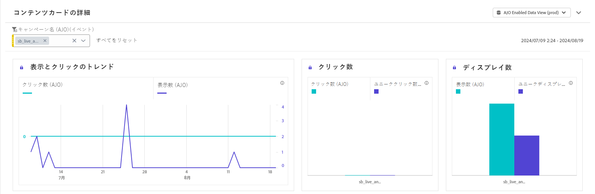
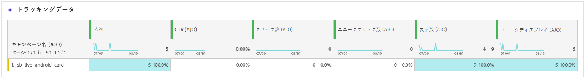

# コンテンツカードキャンペーンレポート {#campaign-global-report-cja-content}

>[!BEGINSHADEBOX]

**このページ：** Adobe Journey Optimizerのコンテンツカードキャンペーンレポートを読んで、コンテンツカードの表示傾向、クリック傾向、トラッキングデータ、トラッキングラベルを分析する方法を説明します。

>[!ENDSHADEBOX]

>[!BEGINSHADEBOX]

コンテンツカードキャンペーンレポートにアクセスするには、キャンペーンの「**[!UICONTROL レポート]**」ボタンをクリックしてから、「**[!UICONTROL 全期間のレポートを表示]**」を選択します。 [詳細情報](report-gs-cja.md)

>[!ENDSHADEBOX]

## 表示してクリックのトレンド {#display-click}

**[!UICONTROL 表示してクリックのトレンド]**&#x200B;のグラフは、メッセージの全体的なリーチと、メッセージに関与するユニークプロファイルの数の両方を理解するのに役立ちます。

+++ 表示とクリックの指標の詳細情報

* **[!UICONTROL クリック数]**：コンテントカードのコンテンツがクリックされた回数。

* **[!UICONTROL 表示数]**：メッセージが開封された回数。

* **[!UICONTROL ユニーク表示数]**：メッセージが開封された回数。1 つのプロファイルによる複数回のインタラクションは考慮されません。

+++

## トラッキングデータ {#tracking-data}

**[!UICONTROL トラッキングデータ]**&#x200B;のテーブルには、コンテンツカードと結びつけられたプロファイルアクティビティの詳細なスナップショットが表示され、エンゲージメントとコンテンツカードの効果に関する重要なインサイトを得ることができます。

+++ 詳しくは、トラッキングデータ指標を参照してください

* **[!UICONTROL 人物]**：コンテンツカードのターゲットプロファイルに適格な、ユーザープロファイルの数。

* **[!UICONTROL クリックスルー率（CTR）]**：コンテンツカードに対して何らかのアクションを起こしたユーザーの割合。

* **[!UICONTROL クリック数]**：コンテンツカードのコンテンツがクリックされた回数。

* **[!UICONTROL ユニーククリック数]**：コンテンツカードのコンテンツをクリックしたプロファイルの数。

* **[!UICONTROL 表示数]**：メッセージが開封された回数。

* **[!UICONTROL ユニーク表示数]**：メッセージが開封された回数。1 つのプロファイルによる複数回のインタラクションは考慮されません。

+++

## 追跡されたラベル {#tracked-labels}

**[!UICONTROL 追跡されたラベル]**&#x200B;テーブルには、コンテンツカード内のリンクラベルの包括的な概要が表示され、最も多くの訪問者トラフィックを生成するリンクラベルがハイライト表示されます。 この機能を使用すると、一番人気のリンクを識別し、優先順位を付けることができます。

+++ 追跡されたラベル指標の詳細情報

* **[!UICONTROL ユニーククリック数]**：コンテンツカードのコンテンツをクリックしたプロファイルの数。

* **[!UICONTROL クリック数]**：コンテンツカードのコンテンツがクリックされた回数。

* **[!UICONTROL 表示数]**：メッセージが開封された回数。

* **[!UICONTROL ユニーク表示数]**：メッセージが開封された回数。1 つのプロファイルによる複数回のインタラクションは考慮されません。

+++
