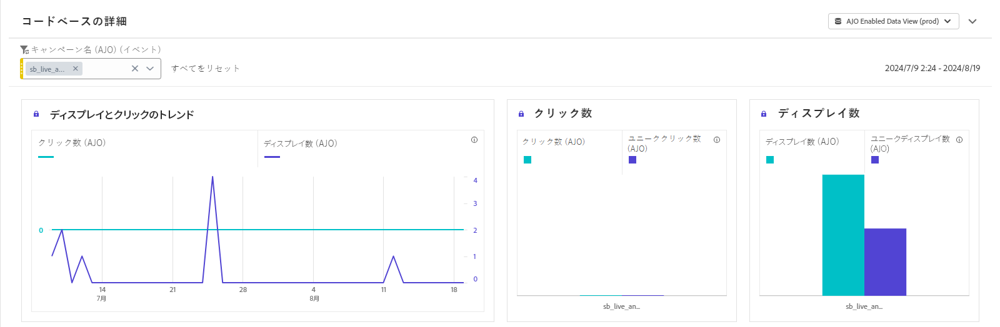

# コンテンツカードキャンペーンレポート {#campaign-global-report-cja-content}

>[!BEGINSHADEBOX]

キャンペーンから「**[!UICONTROL レポート]**」ボタンをクリックし、「**[!UICONTROL すべての時間レポートを表示]**」を選択すると、コンテンツカードキャンペーンレポートにアクセスできます。 [詳細情報](report-gs-cja.md)

>[!ENDSHADEBOX]

## 表示してクリックのトレンド {#display-click}

**[!UICONTROL 表示してクリックのトレンド]**&#x200B;のグラフは、メッセージの全体的なリーチと、メッセージに関与するユニークプロファイルの数の両方を理解するのに役立ちます。

+++ 「表示してクリック」指標の詳細情報

* **[!UICONTROL クリック数]**：コンテントカードのコンテンツがクリックされた回数。

* **[!UICONTROL 表示数]**：メッセージが開封された回数。

* **[!UICONTROL ユニーク表示数]**：メッセージが開封された回数。1 つのプロファイルによる複数回のインタラクションは考慮されません。

+++

## トラッキングデータ {#tracking-data}

**[!UICONTROL トラッキングデータ]**&#x200B;のテーブルには、コンテンツカードと結びつけられたプロファイルアクティビティの詳細なスナップショットが表示され、エンゲージメントとコンテンツカードの効果に関する重要なインサイトを得ることができます。

+++ トラッキングデータ指標の詳細情報

* **[!UICONTROL 人物]**：コンテンツカードのターゲットプロファイルに適格な、ユーザープロファイルの数。

* **[!UICONTROL クリックスルー率（CTR）]**：コンテンツカードに対して何らかのアクションを起こしたユーザーの割合。

* **[!UICONTROL クリック数]**：コンテンツカードのコンテンツがクリックされた回数。

* **[!UICONTROL ユニーククリック数]**：コンテンツカードのコンテンツをクリックしたプロファイルの数。

* **[!UICONTROL 表示数]**：メッセージが開封された回数。

* **[!UICONTROL ユニーク表示数]**：メッセージが開封された回数。1 つのプロファイルによる複数回のインタラクションは考慮されません。

+++

## 追跡されたラベル {#tracked-labels}

**[!UICONTROL 追跡されたラベル]**&#x200B;テーブルには、コンテンツカード内のリンクラベルの包括的な概要が表示され、最も多くの訪問者トラフィックを生成するリンクラベルがハイライト表示されます。この機能を使用すると、最も人気のあるリンクを識別し、優先順位を付けることができます。

+++ 「追跡されたラベル」指標の詳細情報

* **[!UICONTROL ユニーククリック数]**：コンテンツカードのコンテンツをクリックしたプロファイルの数。

* **[!UICONTROL クリック数]**：コンテンツカードのコンテンツがクリックされた回数。

* **[!UICONTROL 表示数]**：メッセージが開封された回数。

* **[!UICONTROL ユニーク表示数]**：メッセージが開封された回数。1 つのプロファイルによる複数回のインタラクションは考慮されません。

+++
