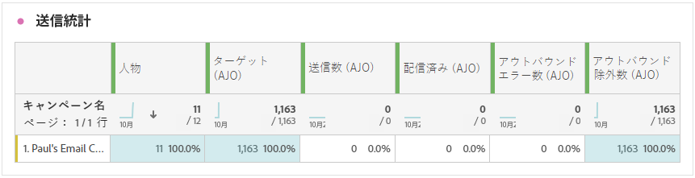
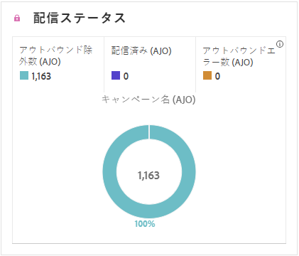

# ダイレクトメールキャンペーンレポート {#campaign-global-report-cja-direct}

>[!BEGINSHADEBOX]

**このページ：** Adobe Journey Optimizerのダイレクトメールキャンペーンレポートを読んで、ダイレクトメールメッセージの送信統計、配信状況、エラーの理由、除外の理由を確認する方法を説明します。

>[!ENDSHADEBOX]

>[!BEGINSHADEBOX]

ダイレクトメールキャンペーンレポートにアクセスするには、キャンペーンの「**[!UICONTROL レポート]**」ボタンをクリックし、「**[!UICONTROL 全期間のレポートを表示]**」を選択します。 [詳細情報](report-gs-cja.md)

>[!ENDSHADEBOX]

## 送信統計 {#sending-statistics-directmail}

**[!UICONTROL 送信統計]**&#x200B;のテーブルには、ダイレクトメールキャンペーンに関する重要なデータの包括的な概要が表示されます。 ターゲットオーディエンスのサイズや正常に配信されたダイレクトメールの数などの主要指標の詳細を説明し、ダイレクトメールの効果とリーチに関する有益なインサイトを提供します。

+++ 詳しくは、送信統計指標を参照してください

* **[!UICONTROL ユーザー]**：メッセージのターゲットプロファイルに適格な、ユーザープロファイルの数。

* **[!UICONTROL ターゲット]**：除外、抑制、または同意の削除が適用されるまでにオーディエンスに適格だったプロファイルの数。 再エントリが有効になっているジャーニーでは、プロファイルが複数回ターゲットにされる場合があります。

* **[!UICONTROL 送信数]**：ダイレクトメールメッセージ用の送信の合計数。

* **[!UICONTROL 配信済み]**：送信されたメッセージの合計数に対して、正常に送信されたダイレクトメールメッセージの数。

* **[!UICONTROL アウトバウンドエラー数]**：送信プロセス中に発生し、プロファイルにメッセージを送信できなかったエラーの合計数。

* **[!UICONTROL アウトバウンド除外数]**：Adobe Journey Optimizer によって除外されたプロファイルの数。

+++

## 配信ステータス {#delivery-status-directmail}

**[!UICONTROL 配信ステータス]**&#x200B;のグラフには、キャンペーンの送信されたダイレクトメールメッセージに関するデータの包括的な見解が表示され、配信済みメールとエラー数などの主要指標に関するインサイトを得ることができます。 これにより、ダイレクトメールメッセージ送信プロセスの詳細な分析が可能になり、キャンペーンの効率とパフォーマンスに関する重要な情報を得ることができます。

+++ 配信ステータス指標についての詳細情報

* **[!UICONTROL 配信済み]**：送信されたダイレクトメールメッセージの合計数に対する、正常に送信されたダイレクトメールメッセージの数。

* **[!UICONTROL アウトバウンドエラー数]**：送信プロセス中に発生し、プロファイルにダイレクトメールメッセージを送信できなかったエラーの合計数。

* **[!UICONTROL アウトバウンド除外数]**：Adobe Journey Optimizer によって除外されたプロファイルの数。

+++

## エラーの理由 {#error-reasons-directmail}

**[!UICONTROL エラーの理由]**&#x200B;のテーブルを使用すると、ダイレクトメールメッセージの送信プロセス中に発生した特定のエラーを識別し、発生した問題を徹底的に分析できるようになります。

## 除外された理由 {#exclude-reasons-directmail}

**[!UICONTROL 除外された理由]**&#x200B;のテーブルには、ターゲットオーディエンスからユーザープロファイルを除外した結果、ダイレクトメールメッセージを受信できない原因となった様々な要因を視覚的に表示します。

除外理由の包括的なリストについては、[このページ](exclusion-list.md)を参照してください。
