# メールキャンペーンレポート {#campaign-global-report-cja-email}

>[!BEGINSHADEBOX]

**このページでは、** Adobe Journey Optimizerの電子メールキャンペーンレポートを読んで、電子メールのKPI、クリックと配信ファネル、トラッキング統計、バウンスとエラーの理由、ドメイン、件名、リンクごとのエンゲージメントを分析する方法について説明します。

>[!ENDSHADEBOX]

>[!INFO]
>
>Appleでは、ネイティブメールアプリの新しいプライバシー保護機能（メールプライバシー保護を含む）が導入されたため、送信者は、Appleのメールプライバシー保護を有効にしたプロファイルのデータを収集するためにトラッキングピクセルを使用できなくなります。その結果、トラッキングピクセルを使用してメールの開封率を追跡するAdobe Journey Optimizer機能が影響を受ける可能性があります。
> [Apple iOSのプライバシー変更がメールマーケティングに与える影響について](https://experienceleaguecommunities.adobe.com/t5/adobe-campaign-classic-blogs/the-impact-of-apple-ios-privacy-changes-on-email-marketing-and/ba-p/699780?profile.language=ja)詳しく見る。
> 
> より正確なインサイトを得るには、開封率ではなくクリック数とコンバージョン指標に焦点を当てることをお勧めします。

>[!BEGINSHADEBOX]

メールキャンペーンレポートにアクセスするには、キャンペーンの「**[!UICONTROL レポート]**」ボタンをクリックし、「**[!UICONTROL 全期間のレポートを表示]**」を選択します。 [詳細情報](report-gs-cja.md)

>[!ENDSHADEBOX]

## メール KPI

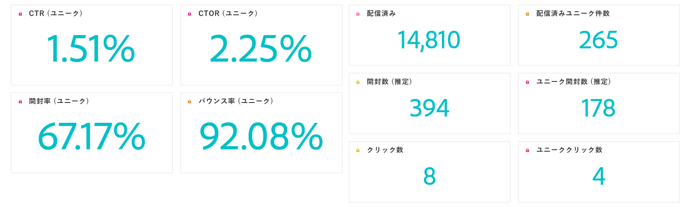

**[!UICONTROL メール]**&#x200B;主要業績評価指標（KPI）は、メールキャンペーンのパフォーマンスとエンゲージメントレベルを反映する、ユニークな集計指標に焦点を当てたダッシュボードを提供します。

+++ メール KPI 指標の詳細情報

* **[!UICONTROL ユニーククリックスルー率]**：配信されたユニークメールの数に対する、メール内の 1 つ以上のリンクをクリックしたユニークプロファイルの割合。

* **[!UICONTROL クリックスルー開封率（CTOR）]**：メッセージに対して何らかのアクションを起こしたプロファイルの割合。

* **[!UICONTROL ユニーク開封率]**：配信されたユニークメールの数に対する、メールを 1 回以上開封したユニークプロファイルの割合。

* **[!UICONTROL ユニークバウンス率]**：ユニーク送信の合計数に基づいて、メールが 1 回以上バウンスしたユニークプロファイルの割合。

* **[!UICONTROL 配信済み]**：送信されたメッセージの総数に対する、正常に送信されたメッセージの数。

* **[!UICONTROL ユニーク配信済み]**：1 つ以上のメッセージを正常に受信したユニークプロファイルの数。

* **[!UICONTROL 推定開封数]**：プロファイルによる直接開封数とメールサーバーによってトリガーされた自動開封数の両方を考慮したメール開封数の合計数の推定値。 この指標は、手動でメールを開封した受信者から計算した開封率を、メールサーバーでのみメールを開封した受信者に適用することで、プライバシーまたはセキュリティスキャンのためにメールサーバーによってトリガーされた開封率を調整します。

* **[!UICONTROL ユニーク推定開封数]**：メールを開封した可能性のあるユニークメール受信者数の推定値。 この指標は、手動でメールを開封したユニークプロファイルから計算したユニーク開封率を、メールサーバーでのみメールを開封したユニークプロファイルに適用することで、プライバシーまたはセキュリティスキャンのためにメールサーバーによってトリガーされた個々のエンゲージメントをより正確にカウントすることを目的としています。

* **[!UICONTROL クリック数]**：同じプロファイルによる複数回のクリックを含む、メッセージ内のリンクがクリックされた合計回数。

* **[!UICONTROL ユニーククリック数]**：メッセージでコンテンツをクリックしたユニークプロファイルの数。

+++

## ユニーククリックファネル

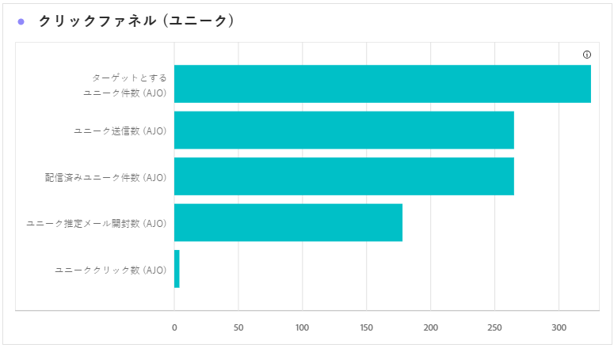

**[!UICONTROL クリックファネル]**&#x200B;グラフには、プロファイルがメールコンテンツに関与したプロファイルに関する詳細な分析が表示され、配信からクリックまでのインタラクションの各ステージに関する貴重なインサイトが得られるので、メッセージがユーザーエンゲージメントをどの程度効果的に推進しているかを理解するのに役立ちます。

+++ クリックファネル指標の詳細情報

* **[!UICONTROL 一意のターゲット設定]**：除外、抑制、または同意の削除が適用される前にオーディエンスに適格だった一意のプロファイルの数。

* **[!UICONTROL ユニーク送信数]**：1 つ以上のメールの送信が試行されたユニークプロファイルの数。

* **[!UICONTROL ユニーク配信済み]**：1 つ以上のメッセージを正常に受信したユニークプロファイルの数。

* **[!UICONTROL ユニーク推定開封数]**：メールを開封した可能性のあるユニークメール受信者数の推定値。 この指標は、手動でメールを開封したユニークプロファイルから計算したユニーク開封率を、メールサーバーでのみメールを開封したユニークプロファイルに適用することで、プライバシーまたはセキュリティスキャンのためにメールサーバーによってトリガーされた個々のエンゲージメントをより正確にカウントすることを目的としています。

* **[!UICONTROL ユニーククリック数]**：メッセージでコンテンツをクリックしたユニークプロファイルの数。

+++

## ユニーク配信ステータス

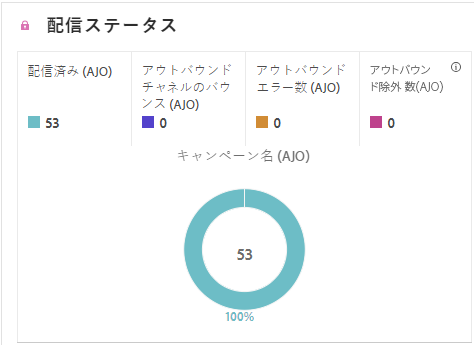

**[!UICONTROL 配信ステータス]**&#x200B;のグラフには、キャンペーンの送信されたメールに関するデータの包括的な見解が表示され、配信済みメールとバウンス数などの主要指標に関するインサイトを得ることができます。 これにより、メール送信プロセスの詳細な分析が可能になり、キャンペーンの効率とパフォーマンスに関する重要な情報を得ることができます。

+++ 配信ステータス指標についての詳細情報

* **[!UICONTROL ユニーク送信エラー数]**：アウトバウンドプロセス中に 1 つ以上の送信エラーが発生したユニークプロファイルの数。

* **[!UICONTROL ユニーク配信済み]**：1 つ以上のメッセージを正常に受信したユニークプロファイルの数。

* **[!UICONTROL ユニーク送信除外数]**：定義済みルールまたはオーディエンス条件によりメッセージの受信から除外されたユニークプロファイルの数。

* **[!UICONTROL ユニークバウンス数]**：送信プロセス中に 1 つ以上のメッセージがバウンスされたユニークプロファイルの数。

+++

## 配信済みとクリックのトレンド {#delivered-click}

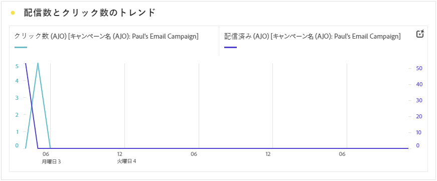

**[!UICONTROL 配信済みとクリックのトレンド]**&#x200B;グラフには、プロファイルのメールへのエンゲージメントに関する詳細な分析が表示され、プロファイルがコンテンツとどのようにやり取りするかについての貴重なインサイトを得ることができます。 グラフでは、2 つの軸を使用して、配信されたメールとクリック数を並べて表示するので、送信されたメールの数と比較して、異常なパターンやエンゲージメントの変化を見つけやすくなります。

+++ 配信済みとクリックのトレンド指標についての詳細情報

* **[!UICONTROL 配信済み]**：送信されたメッセージの合計数に対する、正常に送信されたメッセージの数。

* **[!UICONTROL クリック数]**：メールでコンテンツがクリックされた回数。

+++

## 一意の送信統計 {#unique-sending-statistics-email}

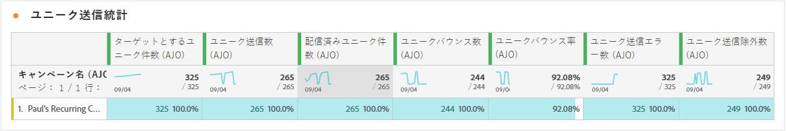

**[!UICONTROL ユニーク送信統計]** テーブルには、キャンペーンのユニークなメールパフォーマンス指標の詳細な概要が表示されます。 ユニークなターゲティング、配信、バウンス、除外といった個別のプロファイルに焦点を当て、メールがどのようにオーディエンスに届き、関与しているかについて、より深いインサイトを提供します。

+++ ユニーク送信統計指標の詳細情報

* **[!UICONTROL 一意のターゲット設定]**：除外、抑制、または同意の削除が適用される前にオーディエンスに適格だった一意のプロファイルの数。

* **[!UICONTROL ユニーク送信数]**：1 つ以上のメールの送信が試行されたユニークプロファイルの数。

* **[!UICONTROL ユニーク配信済み]**：1 つ以上のメールを正常に受信したユニークプロファイルの数。

* **[!UICONTROL ユニークバウンス数]**：1 つ以上のメールがバウンスとなったユニークプロファイルの数。

* **[!UICONTROL ユニークバウンス率]**：ユニーク送信の合計数に基づいて、メールが 1 回以上バウンスしたユニークプロファイルの割合。

* **[!UICONTROL ユニーク送信エラー数]**：アウトバウンドプロセス中に 1 つ以上の送信エラーが発生したユニークプロファイルの数。

* **[!UICONTROL ユニーク送信除外数]**：実施要件ルール、オーディエンスのセグメント化またはプロファイルステータスによりメッセージの受信から除外されたユニークプロファイルの数。

+++

## ユニークトラッキング統計 {#unique-tracking-statistics-email}

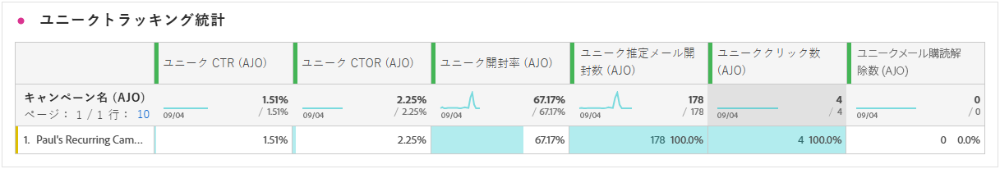

**[!UICONTROL ユニークトラッキング統計]**&#x200B;テーブルには、キャンペーン内のメールに対するプロファイルレベルのエンゲージメントに焦点を当てたビューが表示されます。 このテーブルには、エンゲージメントの主要なステージを通じて、個々のプロファイルがメールコンテンツに対して起こした何らかのアクションに関する貴重なインサイトを提供するユニーク指標がハイライト表示されます。

+++ トラッキング統計指標の詳細情報

* **[!UICONTROL ユニーククリックスルー率（CTR）]**：配信されたユニークメールの数に対する、メール内の 1 つ以上のリンクをクリックしたユニークプロファイルの割合。

* **[!UICONTROL ユニーククリックスルー開封率（CTOR）]**：ユニークの開封数に基づいて、メールを開封した後にリンクをクリックしたユニークプロファイルの割合。

* **[!UICONTROL ユニーク開封率]**：配信されたユニークメールの数に対する、メールを 1 回以上開封したユニークプロファイルの割合。

* **[!UICONTROL ユニーククリック数]**：メールでコンテンツを 1 つ以上クリックしたユニークプロファイルの数。

* **[!UICONTROL ユニーク推定メール開封数]**：メールを開封した可能性のあるユニークメール受信者数の推定値。 この指標は、手動でメールを開封したユニークプロファイルから計算したユニーク開封率を、メールサーバーでのみメールを開封したユニークプロファイルに適用することで、プライバシーまたはセキュリティスキャンのためにメールサーバーによってトリガーされた個々のエンゲージメントをより正確にカウントすることを目的としています。

* **[!UICONTROL ユニークメール購読解除数]**：メール内または関連するランディングページ上の購読解除リンクをクリックしたユニークプロファイルの数。

+++

## 送信統計 {#sending-statistics-email}

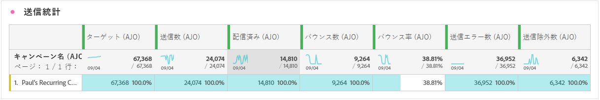

**[!UICONTROL 送信統計]**&#x200B;のテーブルには、キャンペーン内のメールに関する重要なデータの包括的な概要が表示されます。 メールとのインタラクション数や正常に配信されたメール数などの主要指標が詳しく示され、メールとキャンペーンの効果とリーチに関する貴重なインサイトを得ることができます。

+++ 詳しくは、送信統計指標を参照してください

* **[!UICONTROL ターゲット]**：除外、抑制、または同意の削除が適用されるまでにオーディエンスに適格だったプロファイルの数。 再エントリが有効になっているジャーニーでは、プロファイルが複数回ターゲットにされる場合があります。

* **[!UICONTROL 送信数]**：メール送信の合計数。

* **[!UICONTROL 配信済み]**：送信されたメッセージの総数に対する、正常に送信されたメッセージの合計数。

* **[!UICONTROL バウンス数]**：送信されたメッセージの合計数に対する、送信プロセス中および自動返信処理中に累積したエラーの合計数。

* **[!UICONTROL バウンス率]**：送信されたメールの合計数に対する、バウンスとなったメールの割合。

* **[!UICONTROL 送信エラー数]**：送信プロセス中に発生し、プロファイルへの送信の妨げとなったエラーの合計数。

* **[!UICONTROL 送信除外数]**：Adobe Journey Optimizer によって除外されたプロファイルの合計数。

+++

## トラッキング統計 {#tracking-statistics-email}

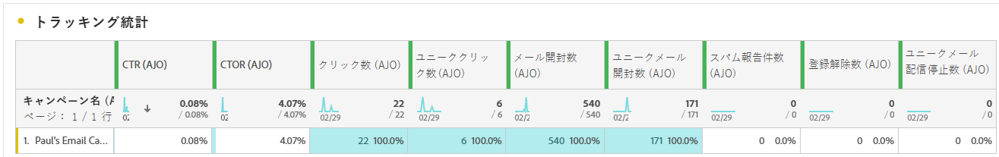

**[!UICONTROL メール - トラッキング統計]**&#x200B;のテーブルには、キャンペーンに含まれるメールに関連するプロファイルアクティビティの詳細な説明が表示されます。 これには、開封数、クリック数、その他の関連するエンゲージメント指標など、プロファイルがメールコンテンツとどのようにやり取りしたかを包括的に示す指標が含まれます。

+++ トラッキング統計指標の詳細情報

* **[!UICONTROL クリックスルー率（CTR）]**：メールに対して何らかのアクションを起こしたユーザーの割合。

* **[!UICONTROL クリックスルー開封率（CTOR）]**：メールが開封された回数。

* **[!UICONTROL 開封率]**：配信されたメールの数に対する、メールを少なくとも1回開いたプロファイルの割合。

* **[!UICONTROL 推定メール開封数]**：プロファイルによる直接開封数とメールサーバーによってトリガーされた自動開封数の両方を考慮したメール開封数の合計数の推定値。 この指標は、手動でメールを開封した受信者から計算した開封率を、メールサーバーでのみメールを開封した受信者に適用することで、プライバシーまたはセキュリティスキャンのためにメールサーバーによってトリガーされた開封率を調整します。

* **[!UICONTROL クリック数]**：メールでコンテンツがクリックされた回数。

* **[!UICONTROL 推定クリック数]**: メッセージ内でコンテンツがクリックされた回数（識別されたボットと人間ではないインタラクション （NHI） トラフィックを除く）。

* **[!UICONTROL スパムの苦情数]**：メッセージがスパムまたはジャンクとして宣言された回数。

* **[!UICONTROL 購読解除数]**：購読解除リンクまたは関連するランディングページのクリック数。

+++

## メールドメイン {#email-domains}

**[!UICONTROL メールドメイン]**&#x200B;のテーブルには、ドメイン別に分類されたメールの詳細な分類が表示され、メールキャンペーンのパフォーマンス指標に関する広範なインサイトが提供されます。 この包括的な分析により、メールコンテンツに対する様々なドメインの動作を理解できます。

+++ メールドメイン指標についての詳細情報

* **[!UICONTROL ユニーク配信済み]**：1 つ以上のメールを正常に受信したユニークプロファイルの数。

* **[!UICONTROL 推定メール開封数]**：プロファイルによる直接開封数とメールサーバーによってトリガーされた自動開封数の両方を考慮したメール開封数の合計数の推定値。 この指標は、手動でメールを開封した受信者から計算した開封率を、メールサーバーでのみメールを開封した受信者に適用することで、プライバシーまたはセキュリティスキャンのためにメールサーバーによってトリガーされた開封率を調整します。

* **[!UICONTROL ユニーククリック数]**：メールでコンテンツを 1 つ以上クリックしたユニークプロファイルの数。

* **[!UICONTROL ユニークバウンス数]**：1 つ以上のメールがバウンスとなったユニークプロファイルの数。

* **[!UICONTROL ユニーク送信エラー数]**：アウトバウンドプロセス中に 1 つ以上の送信エラーが発生したユニークプロファイルの数。

* **[!UICONTROL ユニーク送信除外数]**：実施要件ルール、オーディエンスのセグメント化またはプロファイルステータスによりメッセージの受信から除外されたユニークプロファイルの数。

+++

## 追跡されたラベル {#track-link-label}

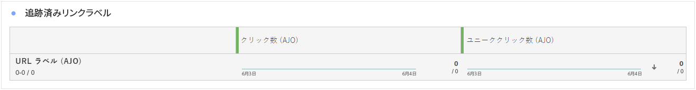

**[!UICONTROL トラッキングラベル]** テーブルには、メール内のリンクラベルの包括的な概要が表示され、最も高い訪問者トラフィックを生み出すラベルが強調表示されます。 この機能を使用すると、一番人気のリンクを識別し、優先順位を付けることができます。

+++ 詳しくは、トラッキング対象リンクラベル指標を参照してください

* **[!UICONTROL ユニーククリック数]**：メールでコンテンツをクリックしたプロファイルの数。

* **[!UICONTROL クリック数]**：メールでコンテンツがクリックされた回数。

* **[!UICONTROL 推定クリック数]**: メッセージ内でコンテンツがクリックされた回数（識別されたボットと人間ではないインタラクション （NHI） トラフィックを除く）。

+++

## トラッキング対象リンク URL {#track-link-url}

**[!UICONTROL トラッキング対象リンク URL]** のテーブルには、メール内で最も多くの訪問者トラフィックを集めている URL の包括的な概要が表示されます。 これにより、最も人気のあるリンクを特定し、優先順位を付けて、メール内の特定のコンテンツに対するプロファイルのエンゲージメントへの理解を深めることができます。

+++ 詳しくは、トラッキング対象リンク URL 指標を参照してください

* **[!UICONTROL ユニーククリック数]**：メールでコンテンツをクリックしたプロファイルの数。

* **[!UICONTROL クリック数]**：メールでコンテンツがクリックされた回数。

* **[!UICONTROL 推定クリック数]**: メッセージ内でコンテンツがクリックされた回数（識別されたボットと人間ではないインタラクション （NHI） トラフィックを除く）。

+++

## メールの件名 {#email-subjects}

**[!UICONTROL メールの件名]**&#x200B;のテーブルには、訪問者のトラフィックが最も多かったメールの件名の完全な概要が表示されます。 このリソースでは、オーディエンスのエンゲージメントのダイナミクスに関する貴重なインサイトが提供されます。

+++ メールの件名指標についての詳細情報

* **[!UICONTROL ユニーク開封率]**：配信されたユニークメールの数に対する、メールを 1 回以上開封したユニークプロファイルの割合。

* **[!UICONTROL ユニーク推定メール開封数]**：メールを開封した可能性のあるユニークメール受信者数の推定値。 この指標は、手動でメールを開封したユニークプロファイルから計算したユニーク開封率を、メールサーバーでのみメールを開封したユニークプロファイルに適用することで、プライバシーまたはセキュリティスキャンのためにメールサーバーによってトリガーされた個々のエンゲージメントをより正確にカウントすることを目的としています。

* **[!UICONTROL 開封率]**：同じプロファイルによる複数の開封数を含む、配信されたメールの合計数に対するメール開封率。

* **[!UICONTROL 推定メール開封数]**：プロファイルによる直接開封数とメールサーバーによってトリガーされた自動開封数の両方を考慮したメール開封数の合計数の推定値。 この指標は、手動でメールを開封した受信者から計算した開封率を、メールサーバーでのみメールを開封した受信者に適用することで、プライバシーまたはセキュリティスキャンのためにメールサーバーによってトリガーされた開封率を調整します。

+++

## 除外された理由 {#excluded-reasons}

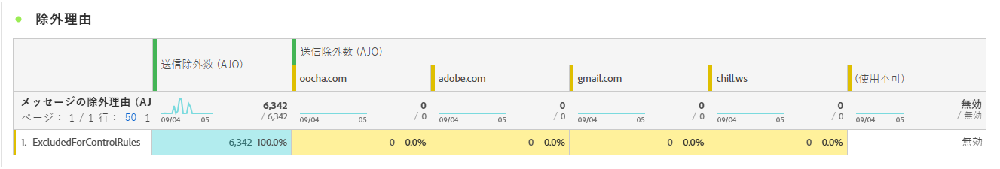

**[!UICONTROL 除外された理由]**&#x200B;のテーブルには、ターゲットオーディエンスからユーザープロファイルを除外した結果、メッセージが受信されなかった様々な要因の包括的な見解が表示されます。

除外の理由の包括的なリストについては、[このページ](exclusion-list.md)を参照してください。

## バウンスの理由 {#bounce-reasons-email}

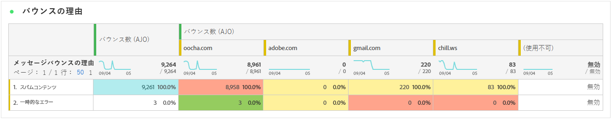

**[!UICONTROL バウンスの理由]**&#x200B;のテーブルには、バウンスメッセージに関連する使用可能なデータが集計され、メールのバウンスの背後にある特定の理由とカテゴリに関する詳細なインサイトが提供されます。

バウンスについて詳しくは、[抑制リスト](../reports/suppression-list.md)のページを参照してください。

## エラーの理由 {#error-reasons-email}

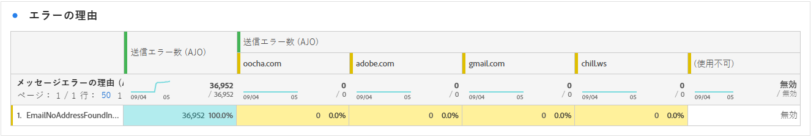

**[!UICONTROL エラーの理由]**&#x200B;のテーブルには、送信プロセス中に発生した特定のエラーが表示され、エラーの特性と発生に関する貴重な情報を得ることができます。
