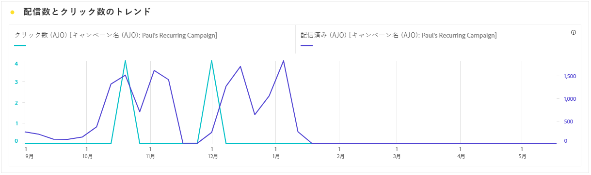

# メールキャンペーンレポート {#campaign-global-report-cja-email}

>[!INFO]
>
>Apple ではメールプライバシー保護を含むネイティブのメールアプリに新しいプライバシー保護機能を導入したので、送信者はトラッキングピクセルを使用して、Apple のメールプライバシー保護を有効にしているプロファイルに関するデータを収集できなくなりました。その結果、トラッキングピクセルを使用してメールの開封数を追跡する Adobe Journey Optimizer の機能に影響を与える場合があります。
> [Apple iOS のプライバシー変更がメールマーケティングに与える影響について詳しくは、こちら](https://experienceleaguecommunities.adobe.com/t5/adobe-campaign-classic-blogs/the-impact-of-apple-ios-privacy-changes-on-email-marketing-and/ba-p/699780?profile.language=ja)を参照してください。
> 
> より正確なインサイトを得るには、開封率ではなくクリック数とコンバージョン指標に焦点を当てることをお勧めします。

>[!BEGINSHADEBOX]

メールキャンペーンレポートにアクセスするには、キャンペーンの「**[!UICONTROL レポート]**」ボタンをクリックし、「**[!UICONTROL 全期間のレポートを表示]**」を選択します。[詳細情報](report-gs-cja.md)

>[!ENDSHADEBOX]

## メール KPI

**[!UICONTROL メール]** 主要業績評価指標（KPI）は、メールキャンペーンのパフォーマンスとエンゲージメントレベルを反映する、一意の集計指標に関する焦点を絞ったダッシュボードを提供します。

+++ メール KPI 指標の詳細を説明します

* **[!UICONTROL ユニーククリックスルー率]**：メール内のリンクを少なくとも 1 つクリックしたユニークプロファイルの割合（一意に配信されたメールの数に対する）。

* **[!UICONTROL クリックスルー開封率（CTOR）]**：メッセージに対して何らかのアクションを起こしたプロファイルの割合。

* **[!UICONTROL ユニーク開封率]**：配信された一意のメール数に対する、メールを少なくとも 1 回開封した一意のプロファイルの割合。

* **[!UICONTROL ユニークバウンス率]**：ユニーク送信の合計数に基づいた、メールが少なくとも 1 回バウンスしたユニークプロファイルの割合。

* **[!UICONTROL 配信済み]**：送信されたメッセージの総数に対する、正常に送信されたメッセージの数。

* **[!UICONTROL ユニーク配信済み数]**：正常に 1 つ以上のメッセージを受信した一意のプロファイルの数。

* **[!UICONTROL 推定開封数]**：プロファイルによる直接開封数と、メールサーバーによってトリガーされる自動開封数の両方に対応するメール開封数の推定値。 この指標では、手動でメールを開封した受信者から計算した開封率を、メールサーバーでのみメールを開いた受信者に適用することで、プライバシーまたはセキュリティスキャンのために、メールサーバーによってトリガーされた開封率を調整します。

* **[!UICONTROL ユニーク推定開封数]**：メールを開封した可能性のある一意のメール受信者数の推定値。 この指標は、手動でメールを開封した固有のプロファイルから計算した一意の開封率を、メールサーバーでのみメールを開封したプロファイルに適用することで、プライバシーやセキュリティスキャンのために、メールサーバーによってトリガーされた個々のエンゲージメントの数をより正確に把握することを目的としています。

* **[!UICONTROL クリック数]**：メッセージ内の任意のリンクがクリックされた合計回数（同じプロファイルによる複数のクリックを含む）。

* **[!UICONTROL ユニーククリック数]**：メッセージのコンテンツをクリックした一意のプロファイルの数。

+++

## ユニーククリックファネル

**[!UICONTROL クリックファネル]** グラフは、プロファイルがメールコンテンツとどのように関わっているかを詳細に分析し、配信からクリックまで、インタラクションの各ステージに関する貴重なインサイトを提供し、メッセージがユーザーエンゲージメントをどの程度効果的に推進しているかを理解するのに役立ちます。

+++ クリックファネル指標の詳細

* **[!UICONTROL ユニークターゲット]**：送信プロセス中にターゲットとした一意のプロファイルの数。

* **[!UICONTROL ユニーク送信]**:1 つ以上のメールを送信しようとした一意のプロファイルの数。

* **[!UICONTROL ユニーク配信済み数]**：正常に 1 つ以上のメッセージを受信した一意のプロファイルの数。

* **[!UICONTROL ユニーク推定開封数]**：メールを開封した可能性のあるユニーク受信者数の推定値。 この指標は、手動でメールを開封した固有のプロファイルから計算した一意の開封率を、メールサーバーでのみメールを開封したプロファイルに適用することで、プライバシーやセキュリティスキャンのために、メールサーバーによってトリガーされた個々のエンゲージメントの数をより正確に把握することを目的としています。

* **[!UICONTROL ユニーククリック数]**：メッセージのコンテンツをクリックした一意のプロファイルの数。

+++

## ユニーク配信ステータス

**[!UICONTROL 配信ステータス]**&#x200B;のグラフには、キャンペーンの送信されたメールに関するデータの包括的な見解が表示され、配信済みメールとバウンス数などの主要指標に関するインサイトを得ることができます。これにより、メール送信プロセスの詳細な分析が可能になり、キャンペーンの効率とパフォーマンスに関する重要な情報を得ることができます。

+++ 配信ステータス指標についての詳細情報

* **[!UICONTROL 一意の送信エラー]**：アウトバウンドプロセス中に送信エラーが 1 つ以上発生した一意のプロファイルの数。

* **[!UICONTROL ユニーク配信済み数]**：正常に 1 つ以上のメッセージを受信した一意のプロファイルの数。

* **[!UICONTROL 一意の送信除外]**：定義済みのルールまたはオーディエンス条件によりメッセージの受信から除外された一意のプロファイルの数。

* **[!UICONTROL ユニークバウンス数]**：送信プロセス中に、1 つ以上のメッセージがバウンスした一意のプロファイルの数。

+++

## 配信済みとクリックのトレンド {#delivered-click}

**[!UICONTROL 配信済みとクリックのトレンド]** グラフは、プロファイルのメールへのエンゲージメントを詳細に分析し、プロファイルがコンテンツとどのようにやり取りするかについての貴重なインサイトを提供します。 グラフでは、2 つの軸を使用して配信されたメールとクリック数を並べて表示するので、送信されたメールの数と比較して、異常なパターンやエンゲージメントの変化を見つけやすくなります。

+++ 配信済みとクリックのトレンド指標についての詳細情報

* **[!UICONTROL 配信済み]**：送信されたメッセージの合計数に対する、正常に送信されたメッセージの数。

* **[!UICONTROL クリック数]**：メールでコンテンツがクリックされた回数。

+++

## ユニーク送信統計 {#unique-sending-statistics-email}

**[!UICONTROL ユニーク送信統計]** テーブルには、キャンペーンにおける一意のメールパフォーマンス指標の詳細な概要が表示されます。 固有のターゲット設定、配信先、バウンス、除外などの個々のプロファイルに焦点を当て、メールがオーディエンスにどのように届き、惹かれているかについて、より深いインサイトを提供します。

+++ ユニーク送信統計指標の詳細を説明します

* **[!UICONTROL ユニークターゲット]**：送信プロセス中にターゲットとした一意のプロファイルの数。

* **[!UICONTROL ユニーク送信]**:1 つ以上のメールを送信しようとした一意のプロファイルの数。

* **[!UICONTROL ユニーク配信済み数]**:1 つ以上のメールを正常に受信した一意のプロファイルの数。

* **[!UICONTROL ユニークバウンス数]**:1 つ以上のメールでバウンスが生じたユニークプロファイルの数。

* **[!UICONTROL ユニークバウンス率]**：ユニーク送信の合計数に基づいた、メールが少なくとも 1 回バウンスしたユニークプロファイルの割合。

* **[!UICONTROL 一意の送信エラー]**：アウトバウンドプロセス中に 1 つ以上の送信エラーが発生した一意のプロファイルの数。

* **[!UICONTROL ユニーク送信除外]**：実施要件ルール、オーディエンスのセグメント化またはプロファイルステータスが原因でメッセージの受信から除外された一意のプロファイルの数。

+++

## 一意のトラッキング統計 {#unique-tracking-statistics-email}

**[!UICONTROL 一意のトラッキング統計]** テーブルには、キャンペーン内のメールに対するプロファイルレベルのエンゲージメントに焦点を当てたビューが表示されます。 主要なエンゲージメントステージをまたいで、個々のプロファイルがメールコンテンツとどのようにやり取りするかについての貴重なインサイトを提供する独自の指標に焦点を当てています。

+++ 詳しくは、トラッキング統計指標を参照してください

* **[!UICONTROL ユニーククリックスルー率（CTR）]**：メール内のリンクを少なくとも 1 つクリックしたユニークプロファイルの割合（一意に配信されたメールの数に対する）。

* **[!UICONTROL ユニーククリックスルー開封率（CTOR）]**：メールを開封した後にリンクをクリックした一意のプロファイルの割合で、一意の開封数に基づいています。

* **[!UICONTROL ユニーク開封率]**：配信された一意のメール数に対する、メールを少なくとも 1 回開封した一意のプロファイルの割合。

* **[!UICONTROL ユニーククリック数]**：メールのコンテンツの少なくとも 1 つをクリックしたユニークプロファイルの数。

* **[!UICONTROL ユニーク推定メール開封数]**：メールを開封した可能性のあるユニークメール受信者数の推定値。 この指標は、手動でメールを開封した固有のプロファイルから計算した一意の開封率を、メールサーバーでのみメールを開封したプロファイルに適用することで、プライバシーやセキュリティスキャンのために、メールサーバーによってトリガーされた個々のエンゲージメントの数をより正確に把握することを目的としています。

* **[!UICONTROL ユニークメール購読解除]**：メールまたは関連するランディングページで購読解除リンクをクリックした一意のプロファイルの数。

+++

## 送信統計 {#sending-statistics-email}

**[!UICONTROL 送信統計]**&#x200B;のテーブルには、キャンペーン内のメールに関する重要なデータの包括的な概要が表示されます。メールとのインタラクション数や正常に配信されたメール数などの主要指標が詳しく示され、メールとキャンペーンの効果とリーチに関する貴重なインサイトを得ることができます。

+++ 詳しくは、送信統計指標を参照してください

* **[!UICONTROL ターゲット]**：送信プロセス中に処理されたメールの合計数。

* **[!UICONTROL 送信数]**：メール送信の合計数。

* **[!UICONTROL 配信済み]**：送信されたメッセージの合計数に対して、正常に送信できたメールの合計数。

* **[!UICONTROL バウンス数]**：送信されたメッセージの合計数に対する、送信プロセス中および自動返信処理中に累積したエラーの合計数。

* **[!UICONTROL バウンス率]**：送信されたメールの合計数に対する、バウンスが発生したメールの割合。

* **[!UICONTROL 送信エラー]**：送信プロセス中に発生し、プロファイルに送信できなかったエラーの合計数。

* **[!UICONTROL 除外を送信]**:Adobe Journey Optimizerによって除外されたプロファイルの合計数。

+++

## トラッキング統計 {#tracking-statistics-email}

**[!UICONTROL メール - トラッキング統計]**&#x200B;のテーブルには、キャンペーンに含まれるメールに関連するプロファイルアクティビティの詳細な説明が表示されます。これには、開封数、クリック数、その他の関連するエンゲージメント指標など、プロファイルがメールコンテンツとどのようにやり取りしたかを包括的に示す指標が含まれます。

+++ 詳しくは、トラッキング統計指標を参照してください

* **[!UICONTROL クリックスルー率（CTR）]**：メールに対して何らかのアクションを起こしたユーザーの割合。

* **[!UICONTROL クリックスルー開封率（CTOR）]**：メールが開封された回数。

* **[!UICONTROL 推定メール開封数]**：プロファイルによる直接開封数と、メールサーバーによってトリガーされる自動開封数の両方に対応するメール開封数の推定値。 この指標では、手動でメールを開封した受信者から計算した開封率を、メールサーバーでのみメールを開いた受信者に適用することで、プライバシーまたはセキュリティスキャンのために、メールサーバーによってトリガーされた開封率を調整します。

* **[!UICONTROL クリック数]**：メールでコンテンツがクリックされた回数。

* **[!UICONTROL スパムのの苦情数]**：メッセージがスパムまたはジャンクとして宣言された回数。

* **[!UICONTROL 購読解除]**：購読解除リンクまたは関連するランディングページでのクリック数。

+++

## メールドメイン {#email-domains}

**[!UICONTROL メールドメイン]**&#x200B;のテーブルには、ドメイン別に分類されたメールの詳細な分類が表示され、メールキャンペーンのパフォーマンス指標に関する広範なインサイトが提供されます。この包括的な分析により、メールコンテンツに対する様々なドメインの動作を理解できます。

+++ メールドメイン指標についての詳細情報

* **[!UICONTROL ユニーク配信済み数]**:1 つ以上のメールを正常に受信した一意のプロファイルの数。

* **[!UICONTROL 推定メール開封数]**：プロファイルによる直接開封数と、メールサーバーによってトリガーされる自動開封数の両方に対応するメール開封数の推定値。 この指標では、手動でメールを開封した受信者から計算した開封率を、メールサーバーでのみメールを開いた受信者に適用することで、プライバシーまたはセキュリティスキャンのために、メールサーバーによってトリガーされた開封率を調整します。

* **[!UICONTROL ユニーククリック数]**：メールのコンテンツの少なくとも 1 つをクリックしたユニークプロファイルの数。

* **[!UICONTROL ユニークバウンス数]**:1 つ以上のメールでバウンスが生じたユニークプロファイルの数。

* **[!UICONTROL 一意の送信エラー]**：アウトバウンドプロセス中に 1 つ以上の送信エラーが発生した一意のプロファイルの数。

* **[!UICONTROL ユニーク送信除外]**：実施要件ルール、オーディエンスのセグメント化またはプロファイルステータスが原因でメッセージの受信から除外された一意のプロファイルの数。

+++

## トラッキング対象リンクラベル {#track-link-label}

**[!UICONTROL トラッキング対象リンクラベル]**&#x200B;テーブルでは、メール内のリンクラベルの包括的な概要を確認できます。最も多くの訪問者トラフィックを生成するリンクラベルはハイライト表示されます。この機能を使用すると、一番人気のリンクを識別し、優先順位を付けることができます。

+++ 詳しくは、トラッキング対象リンクラベル指標を参照してください

* **[!UICONTROL ユニーククリック数]**：メールでコンテンツをクリックしたプロファイルの数。

* **[!UICONTROL クリック数]**：メールでコンテンツがクリックされた回数。

+++

## トラッキング対象リンク URL {#track-link-url}

**[!UICONTROL トラッキング対象リンク URL]** のテーブルには、メール内で最も多くの訪問者トラフィックを集めている URL の包括的な概要が表示されます。これにより、最も人気のあるリンクを特定し、優先順位を付けて、メール内の特定のコンテンツに対するプロファイルのエンゲージメントへの理解を深めることができます。

+++ 詳しくは、トラッキング対象リンク URL 指標を参照してください

* **[!UICONTROL ユニーククリック数]**：メールでコンテンツをクリックしたプロファイルの数。

* **[!UICONTROL クリック数]**：メールでコンテンツがクリックされた回数。

+++

## メールの件名 {#email-subjects}

**[!UICONTROL メールの件名]**&#x200B;のテーブルには、訪問者のトラフィックが最も多かったメールの件名の完全な概要が表示されます。このリソースでは、オーディエンスのエンゲージメントのダイナミクスに関する貴重なインサイトが提供されます。

+++ メールの件名指標についての詳細情報

* **[!UICONTROL ユニーク開封率]**：配信された一意のメール数に対する、メールを少なくとも 1 回開封した一意のプロファイルの割合。

* **[!UICONTROL ユニーク推定メール開封数]**：メールを開封した可能性のあるユニークメール受信者数の推定値。 この指標は、手動でメールを開封した固有のプロファイルから計算した一意の開封率を、メールサーバーでのみメールを開封したプロファイルに適用することで、プライバシーやセキュリティスキャンのために、メールサーバーによってトリガーされた個々のエンゲージメントの数をより正確に把握することを目的としています。

* **[!UICONTROL 開封率]**：配信されたメールの合計数に対する、メールの開封数の割合（同じプロファイルによる複数の開封数を含む）。

* **[!UICONTROL 推定メール開封数]**：プロファイルによる直接開封数と、メールサーバーによってトリガーされる自動開封数の両方に対応するメール開封数の推定値。 この指標では、手動でメールを開封した受信者から計算した開封率を、メールサーバーでのみメールを開いた受信者に適用することで、プライバシーまたはセキュリティスキャンのために、メールサーバーによってトリガーされた開封率を調整します。

+++

## 除外された理由 {#excluded-reasons}

**[!UICONTROL 除外された理由]**&#x200B;のテーブルには、ターゲットオーディエンスからユーザープロファイルを除外した結果、メッセージが受信されなかった様々な要因の包括的な見解が表示されます。

除外の理由の包括的なリストについては、[このページ](exclusion-list.md)を参照してください。

## バウンスの理由 {#bounce-reasons-email}

**[!UICONTROL バウンスの理由]**&#x200B;のテーブルには、バウンスメッセージに関連する使用可能なデータが集計され、メールのバウンスの背後にある特定の理由とカテゴリに関する詳細なインサイトが提供されます。

バウンスについて詳しくは、[抑制リスト](../reports/suppression-list.md)のページを参照してください。

## エラーの理由 {#error-reasons-email}

**[!UICONTROL エラーの理由]**&#x200B;のテーブルには、送信プロセス中に発生した特定のエラーが表示され、エラーの特性と発生に関する貴重な情報を得ることができます。
