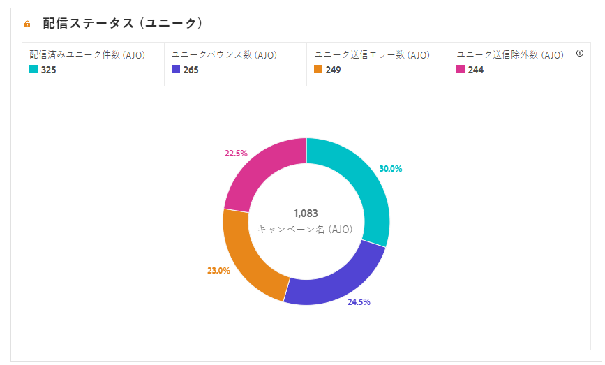
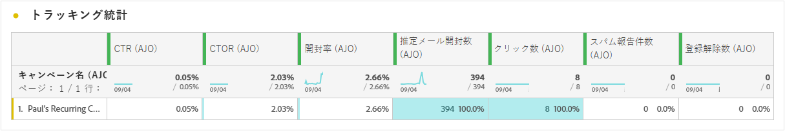

# メールキャンペーンレポート {#campaign-global-report-cja-email}

## 配信済みとクリックのトレンド {#delivered-click}

**[!UICONTROL 配信済みとクリックのトレンド]**&#x200B;のグラフには、プロファイルのメールへのエンゲージメントに関する詳細な分析が表示され、プロファイルがコンテンツとどのようにやり取りするかに関する貴重なインサイトを得ることができます。

+++ 配信済み指標とクリックトレンド指標の詳細情報

* **[!UICONTROL 配信済み]**：送信されたメッセージの合計数に対する、正常に送信されたメッセージの数。

* **[!UICONTROL クリック数]**：メールでコンテンツがクリックされた回数。

+++

## 配信ステータス {#delivery-status}

**[!UICONTROL 配信ステータス]**&#x200B;のグラフには、キャンペーンの送信されたメールに関するデータの包括的な見解が表示され、配信済みメールとバウンス数などの主要指標に関するインサイトを得ることができます。これにより、メール送信プロセスの詳細な分析が可能になり、キャンペーンの効率とパフォーマンスに関する重要な情報を得ることができます。

+++ 配信ステータス指標の詳細情報

* **[!UICONTROL 配信済み]**：送信されたメッセージの合計数に対する、正常に送信されたメッセージの数。

* **[!UICONTROL アウトバウンドチャネルのバウンス数]**：送信されたメッセージの合計数に対する、送信プロセス中および自動返信処理中に累積したエラーの合計数。

* **[!UICONTROL アウトバウンドエラー数]**：送信プロセス中に発生し、プロファイルにメッセージを送信できなかったエラーの合計数。

* **[!UICONTROL アウトバウンド除外数]**：Adobe Journey Optimizer によって除外されたプロファイルの数。

+++

## 送信統計 {#sending-statistics-email}

**[!UICONTROL 送信統計]**&#x200B;のテーブルには、キャンペーン内のメールに関する重要なデータの包括的な概要が表示されます。メールとのインタラクション数や正常に配信されたメール数などの主要指標が詳しく示され、メールとキャンペーンの効果とリーチに関する貴重なインサイトを得ることができます。

+++ 送信統計指標の詳細情報

* **[!UICONTROL ユーザー]**：メッセージのターゲットプロファイルに適格な、ユーザープロファイルの数。

* **[!UICONTROL ターゲット]**：送信プロセス中に処理されたメールの合計数。

* **[!UICONTROL 送信数]**：メール送信の合計数。

* **[!UICONTROL 配信済み]**：送信されたメッセージの総数に対する、正常に送信されたメッセージの数。

* **[!UICONTROL アウトバウンドチャネルのバウンス数]**：送信されたメッセージの合計数に対する、送信プロセス中および自動返信処理中に累積したエラーの合計数。

* **[!UICONTROL アウトバウンドエラー数]**：送信プロセス中に発生し、プロファイルにメッセージを送信できなかったエラーの合計数。

* **[!UICONTROL アウトバウンド除外数]**：Adobe Journey Optimizer によって除外されたプロファイルの数。

+++

## トラッキング統計 {#tracking-statistics-email}

**[!UICONTROL メール - トラッキング統計]**&#x200B;のテーブルには、キャンペーンに含まれるメールに関連するプロファイルアクティビティの詳細な説明が表示されます。これには、開封数、クリック数、その他の関連するエンゲージメント指標など、プロファイルがメールコンテンツとどのようにやり取りしたかを包括的に示す指標が含まれます。

+++ トラッキング統計指標の詳細情報

* **[!UICONTROL クリックスルー率（CTR）]**：メールに対して何らかのアクションを起こしたユーザーの割合。

* **[!UICONTROL クリックスルー開封率（CTOR）]**：メールが開封された回数。

* **[!UICONTROL クリック数]**：メールでコンテンツがクリックされた回数。

* **[!UICONTROL ユニーククリック数]**：メールでコンテンツをクリックしたプロファイルの数。

* **[!UICONTROL メール開封数]**：キャンペーンでメールが開封された回数。

* **[!UICONTROL ユニークメール開封数]**：開封されたメールの割合。

* **[!UICONTROL スパムのの苦情数]**：メッセージがスパムまたはジャンクとして宣言された回数。

* **[!UICONTROL 登録解除]**：登録解除リンクのクリック数。

+++

## メールドメイン {#email-domains}

**[!UICONTROL メールドメイン]**&#x200B;のテーブルには、ドメイン別に分類されたメールの詳細な分類が表示され、メールキャンペーンのパフォーマンス指標に関する広範なインサイトが提供されます。この包括的な分析により、メールコンテンツに対する様々なドメインの動作を理解できます。

+++ メールドメイン指標の詳細情報

* **[!UICONTROL 送信数]**：メールの送信の合計数。

* **[!UICONTROL 配信済み]**：送信されたメッセージの合計数に対する、正常に送信されたメッセージの数。

* **[!UICONTROL メール開封数]**：キャンペーンでメールが開封された回数。

* **[!UICONTROL クリック数]**：メールでコンテンツがクリックされた回数。

* **[!UICONTROL アウトバウンドチャネルのバウンス数]**：送信メールの合計数に対する、送信プロセス中および自動返信処理中に累積したエラーの合計数。

* **[!UICONTROL アウトバウンドエラー数]**：送信プロセス中に発生し、プロファイルにメッセージを送信できなかったエラーの合計数。
+++

## トラッキング対象リンクラベル {#track-link-label}

**[!UICONTROL トラッキング対象リンクラベル]**&#x200B;テーブルでは、メール内のリンクラベルの包括的な概要を確認できます。最も多くの訪問者トラフィックを生成するリンクラベルはハイライト表示されます。この機能を使用すると、最も人気のあるリンクを識別し、優先順位を付けることができます。

+++ トラッキング対象リンクラベル指標の詳細情報

* **[!UICONTROL ユニーククリック数]**：メールでコンテンツをクリックしたプロファイルの数。

* **[!UICONTROL クリック数]**：メールでコンテンツがクリックされた回数。

+++

## トラッキング対象リンク URL {#track-link-url}

**[!UICONTROL トラッキング対象リンク URL]** のテーブルには、メール内で最も多くの訪問者トラフィックを集めている URL の包括的な概要が表示されます。これにより、最も人気のあるリンクを特定し、優先順位を付けて、メール内の特定のコンテンツに対するプロファイルのエンゲージメントへの理解を深めることができます。

+++ トラッキング対象リンク URL 指標の詳細情報

* **[!UICONTROL ユニーククリック数]**：メールでコンテンツをクリックしたプロファイルの数。

* **[!UICONTROL クリック数]**：メールでコンテンツがクリックされた回数。

* **[!UICONTROL 表示数]**：メールが開封された回数。

* **[!UICONTROL ユニーク表示数]**：メールが開封された回数。1 つのプロファイルによる複数回のインタラクションは考慮されません。

+++

## メールの件名 {#email-subjects}

**[!UICONTROL メールの件名]**&#x200B;のテーブルには、訪問者のトラフィックが最も多かったメールの件名の完全な概要が表示されます。このリソースでは、オーディエンスのエンゲージメントのダイナミクスに関する貴重なインサイトが提供されます。

+++ メールの件名指標の詳細情報

* **[!UICONTROL 人物]**：メッセージのターゲットプロファイルに適格な、ユーザープロファイルの数。

+++

## 除外された理由 {#excluded-reasons}

**[!UICONTROL 除外された理由]**&#x200B;のテーブルには、ターゲットオーディエンスからユーザープロファイルを除外した結果、メッセージが受信されなかった様々な要因の包括的な見解が表示されます。

除外の理由の包括的なリストについては、[このページ](exclusion-list.md)を参照してください。

## バウンスの理由 {#bounce-reasons-email}

**[!UICONTROL バウンスの理由]**&#x200B;のテーブルには、バウンスメッセージに関連する使用可能なデータが集計され、メールのバウンスの背後にある特定の理由とカテゴリに関する詳細なインサイトが提供されます。

バウンスについて詳しくは、[抑制リスト](../reports/suppression-list.md)のページを参照してください。

## エラーの理由 {#error-reasons-email}

**[!UICONTROL エラーの理由]**&#x200B;のテーブルには、送信プロセス中に発生した特定のエラーが表示され、エラーの特性と発生に関する貴重な情報を得ることができます。
