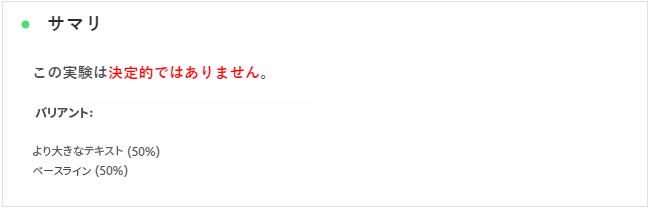
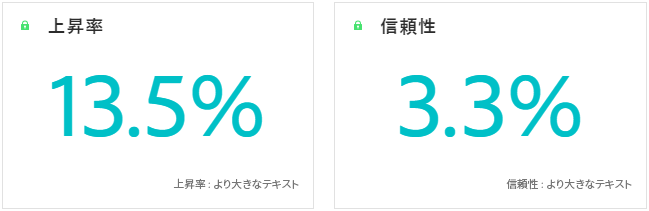
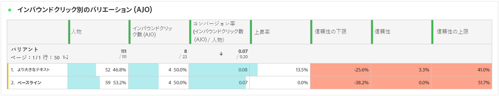
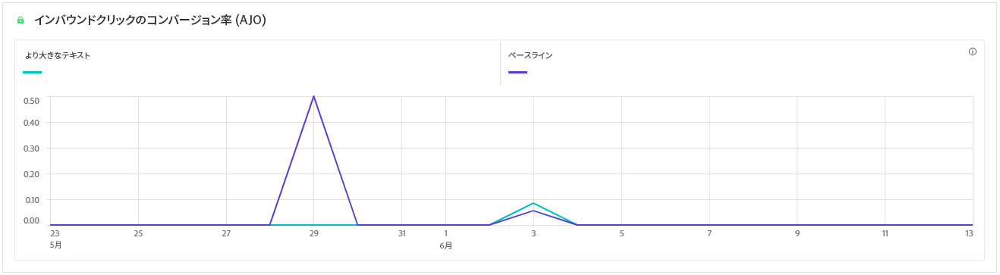

# 実験キャンペーンレポート {#campaign-global-report-cja-experimentation}

>[!BEGINSHADEBOX]

**このページでは、** Adobe Journey Optimizerの実験キャンペーンレポートを読んで、選択した成功指標の上昇率、信頼度、コンバージョン率などの指標を使用してバリエーションのパフォーマンスを比較する方法について説明します。

>[!ENDSHADEBOX]

>[!CONTEXTUALHELP]
>id="ajo_campaigns_content_experiment_click"
>title="成功指標"
>abstract="実験の作成時に以前に選択した成功指標の合計値を、プロファイル数で割った値です。"

## 実験 {#experimentation}

「**[!UICONTROL 実験]**」タブには、各バリアントのパフォーマンスに関する主要なインサイトが表示され、最も成功したものを特定します。

最もパフォーマンスの高い処理の判定には時間がかかる場合があります。 実験が成功しなかった場合は、**決定的でない**&#x200B;に設定されます。

### 実験 KPI {#experimentation-kpis}

**[!UICONTROL 実験]**&#x200B;の主要業績評価指標（KPI）は包括的なダッシュボードとして機能し、実験に関連する重要な指標の分析を提供します。

+++ 詳しくは、実験 KPI 指標を参照してください

* **[!UICONTROL 上昇率]**：ベースラインに対する特定の処理のコンバージョン率の向上率を測定します。

* **[!UICONTROL 信頼性]**：ある処理がベースライン処理と同じであることを示す証拠。 [詳細情報](../content-management/experiment-calculations.md#adobes-statistical-methodology-any-time-valid-confidence-sequences)

+++

### 成功指標別のバリアント {#variant-inbound}

成功指標ごとの&#x200B;**バリアント** テーブルは、実験の設定時に選択した成功指標に基づいて、各バリアントがどのように機能するかを示します。
これらの結果の詳細と解釈方法については、[このページ ](../content-management/get-started-experiment.md#interpret-results)を参照してください。

+++ 成功指標別のバリアントの詳細情報

* **[!UICONTROL ユーザー]**：メッセージのターゲットプロファイルに適格な、ユーザープロファイルの数。

* **[!UICONTROL インバウンドクリック数]**：実験の作成時に以前に選択した成功指標の合計値。

* **[!UICONTROL コンバージョン率]**：実験の作成時に以前に選択した成功指標の合計値を、プロファイル数で割った値です。

* **[!UICONTROL 上昇率]**：ベースラインに対する特定の処理のコンバージョン率の向上率を測定します。

* **[!UICONTROL 信頼下限]**：選択した信頼区間内での、処理とベースライン間のコンバージョン率の差の最小推定値。

* **[!UICONTROL 信頼性]**：ある処理がベースライン処理と同じであることを示す証拠。 [詳細情報](../content-management/experiment-calculations.md#adobes-statistical-methodology-any-time-valid-confidence-sequences)

* **[!UICONTROL 信頼上限]**：選択した信頼区間内での、処理とベースライン間のコンバージョン率の差の最高推定値。

+++

### 成功指標のコンバージョン率 {#conversion-rate}

**[!UICONTROL 信頼区間]**&#x200B;グラフには、選択した成功指標に対してベースラインと最もパフォーマンスの高い処理を比較し、改善の可能性のある範囲が表示されます。 [学習を増やす](../content-management/experiment-calculations.md#adobes-statistical-methodology-any-time-valid-confidence-sequences)。