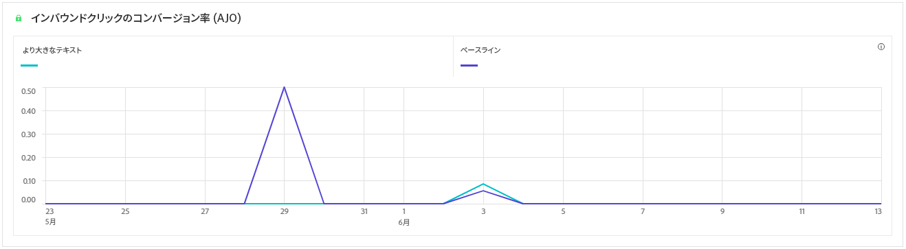

# 実験キャンペーンレポート {#campaign-global-report-cja-experimentation}

>[!CONTEXTUALHELP]
>id="ajo_campaigns_content_experiment_click"
>title="成功指標"
>abstract="実験の作成時に以前に選択した成功指標の合計値を、プロファイル数で割った値です。"

## 実験 {#experimentation}

「**[!UICONTROL 実験]**」タブには、各バリアントのパフォーマンスに関する主要なインサイトが表示され、最も成功したものを特定します。

最もパフォーマンスの高い処理の判定には時間がかかる場合があります。実験が成功しなかった場合は、**決定的でない**&#x200B;に設定されます。

### 実験 KPI {#experimentation-kpis}

**[!UICONTROL 実験]**&#x200B;の主要業績評価指標（KPI）は包括的なダッシュボードとして機能し、実験に関連する重要な指標の分析を提供します。

+++ 詳しくは、実験 KPI 指標を参照してください

* **[!UICONTROL 上昇率]**：ベースラインに対する特定の処理のコンバージョン率の向上率を測定します。

* **[!UICONTROL 信頼性]**：ある処理がベースライン処理と同じであることを示す証拠。[詳細情報](../content-management/experiment-calculations.md#understand-confidence)

+++

### 成功別バリアント指標 {#variant-inbound}

**成功指標別のバリアント** の表には、実験を設定する際に選択した成功指標に基づいて、各バリアントがどのように実行されるかを示します。
これらの結果の詳細と解釈について詳しくは、[このページ](../content-management/get-started-experiment.md#interpret-results)を参照してください。

+++ 成功指標ごとのバリアントの詳細を説明します

* **[!UICONTROL ユーザー]**：メッセージのターゲットプロファイルに適格な、ユーザープロファイルの数。

* **[!UICONTROL インバウンドクリック数]**：実験の作成時に以前選択した成功指標の合計値。

* **[!UICONTROL コンバージョン率]**：実験の作成時に以前に選択した成功指標の合計値を、プロファイル数で割った値です。

* **[!UICONTROL 上昇率]**：ベースラインに対する特定の処理のコンバージョン率の向上率を測定します。

* **[!UICONTROL 信頼下限]**：選択した信頼区間の中で、処理とベースラインの間のコンバージョン率差の最小推定値。

* **[!UICONTROL 信頼性]**：ある処理がベースライン処理と同じであることを示す証拠。[詳細情報](../content-management/experiment-calculations.md#understand-confidence)

* **[!UICONTROL 信頼上限]**：選択した信頼区間における、処理とベースラインの間のコンバージョン率差の最高推定値。

+++

### 成功指標のコンバージョン率 {#conversion-rate}

**[!UICONTROL 信頼区間]** グラフは、選択可能な改善範囲を示し、ベースラインを、選択した成功指標に対して最もパフォーマンスの高い処理と比較します。 [詳細情報](../content-management/experiment-calculations.md#confidence-intervals)