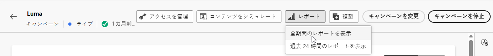
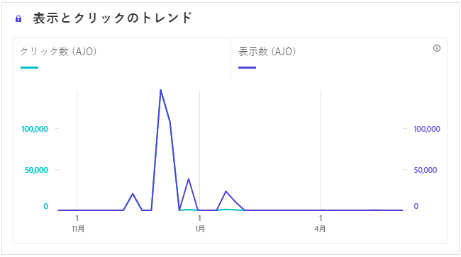
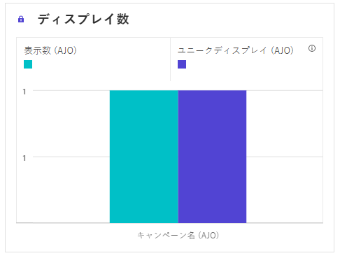
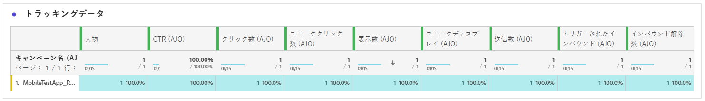
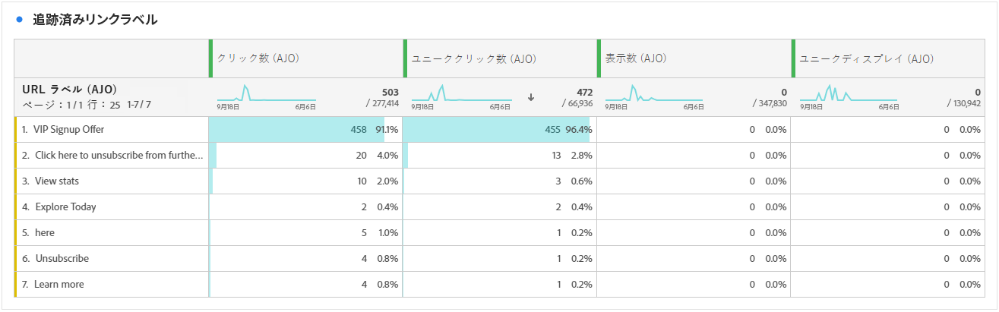
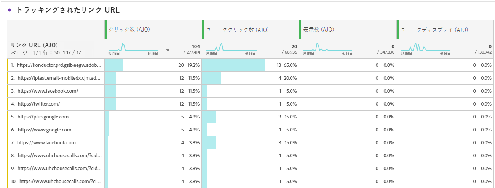

# アプリ内キャンペーンレポート {#campaign-global-report-cja-inapp}

>[!IMPORTANT]
>
>アプリ内キャンペーンおよびジャーニーについてレポートする前に、[ このページ ](../in-app/inapp-configuration.md#experiment-prerequisites) に記載されているレポートの前提条件を必ず満たすようにしてください。

>[!BEGINSHADEBOX]

キャンペーンから「**[!UICONTROL レポート]**」ボタンをクリックし、「**[!UICONTROL すべての時間レポートを表示]**」を選択して、アプリ内キャンペーンレポートにアクセスできます。 [詳細情報](report-gs-cja.md)

>[!ENDSHADEBOX]

## 表示してクリックのトレンド {#impression-click-trend}

**[!UICONTROL インプレッションとクリックのトレンド]**&#x200B;のグラフには、プロファイルのアプリ内メッセージへのエンゲージメントに関する詳細な分析が表示され、プロファイルがコンテンツとどのようにやり取りするかについての貴重なインサイトを得ることができます。

+++ インプレッションとクリックのトレンド指標の詳細

* **[!UICONTROL クリック数]**：アプリ内メッセージでコンテンツがクリックされた回数。

* **[!UICONTROL 表示数]**：メッセージが開封された回数。

+++

## クリック数 {#clicks-inapp}

**[!UICONTROL クリック数]**&#x200B;のグラフには、アプリ内クリック指標と、コンテンツのクリック総数と、コンテンツをクリックした固有のプロファイル数の両方が表示されます。

+++ クリック数指標の詳細

* **[!UICONTROL ユニーククリック数]**：アプリ内メッセージでコンテンツをクリックしたプロファイルの数。

* **[!UICONTROL クリック数]**：アプリ内メッセージでコンテンツがクリックされた回数。

+++

## 表示 {#display-inapp}

**[!UICONTROL 表示数]**&#x200B;グラフは、メッセージの全体的なリーチと、メッセージに対して何らかのインタラクションを行ったユニークプロファイルの数の両方を理解するのに役立ちます。

+++ 表示指標の詳細

* **[!UICONTROL 表示数]**：メッセージが開封された回数。

* **[!UICONTROL ユニーク表示数]**：メッセージが開封された回数。1 つのプロファイルによる複数回のインタラクションは考慮されません。

+++

## トラッキングデータ {#tracking-data-inapp}

**[!UICONTROL プッシュ - トラッキング統計]**&#x200B;のテーブルには、アプリ内メッセージと結びつけられたプロファイルアクティビティの詳細なスナップショットが表示され、エンゲージメントとアプリ内メッセージの効果に関する重要なインサイトを得ることができます。

+++ トラッキングデータ指標の詳細情報

* **[!UICONTROL 人物]**：アプリ内メッセージのターゲットプロファイルに適格な、ユーザープロファイルの数。

* **[!UICONTROL クリックスルー率（CTR）]**：アプリ内メッセージに対して何らかのアクションを起こしたユーザーの割合。

* **[!UICONTROL クリックスルー開封率（CTOR）]**：アプリ内メッセージが開封された回数。

* **[!UICONTROL クリック数]**：アプリ内メッセージでコンテンツがクリックされた回数。

* **[!UICONTROL ユニーククリック数]**：アプリ内メッセージでコンテンツをクリックしたプロファイルの数。

* **[!UICONTROL 表示数]**：メッセージが開封された回数。

* **[!UICONTROL ユニーク表示数]**：メッセージが開封された回数。1 つのプロファイルによる複数回のインタラクションは考慮されません。。

* **[!UICONTROL 送信数]**：アプリ内メッセージ用の送信の合計数。

* **[!UICONTROL インバウンドトリガー]**：ユーザーのインタラクションまたは事前定義済みイベントによってアプリ内メッセージがトリガーされた回数。

* **[!UICONTROL インバウンド却下]**：ユーザーがアプリ内メッセージを操作せずに却下した回数。

+++

## トラッキング対象リンクラベル {#track-link-label-inapp}

**[!UICONTROL トラッキング対象リンクラベル]**&#x200B;テーブルでは、アプリ内メッセージ内のリンクラベルの包括的な概要を確認できます。最も多くの訪問者トラフィックを生成するリンクラベルはハイライト表示されます。この機能を使用すると、最も人気のあるリンクを識別し、優先順位を付けることができます。

+++ トラッキングされるリンクラベルの指標の詳細

* **[!UICONTROL ユニーククリック数]**：アプリ内メッセージのコンテンツをクリックしたプロファイルの数。

* **[!UICONTROL クリック数]**：アプリ内メッセージでコンテンツがクリックされた回数。

* **[!UICONTROL 表示数]**：メッセージが開封された回数。

* **[!UICONTROL ユニーク表示数]**：メッセージが開封された回数。1 つのプロファイルによる複数回のインタラクションは考慮されません。

+++

## トラッキング対象リンク URL {#track-link-url-inapp}

**[!UICONTROL トラッキング対象リンク URL]** のテーブルには、アプリ内メッセージ内で最も多くの訪問者トラフィックを集めている URL の包括的な概要が表示されます。これにより、最も人気のあるリンクを特定し、優先順位を付けるて、アプリ内メッセージ内の特定のコンテンツに対するプロファイルのエンゲージメントをより深く理解することができます。

+++ トラッキングされるリンク URL の指標についての詳細情報

* **[!UICONTROL ユニーククリック数]**：アプリ内メッセージのコンテンツをクリックしたプロファイルの数。

* **[!UICONTROL クリック数]**：アプリ内メッセージでコンテンツがクリックされた回数。

+++
