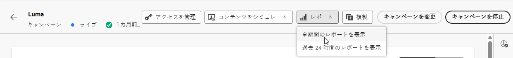

# プッシュ通知キャンペーンレポート {#campaign-global-report-cja-push}

>[!BEGINSHADEBOX]

プッシュ通知キャンペーンレポートにアクセスするには、キャンペーンの「**[!UICONTROL レポート]**」ボタンをクリックし、「**[!UICONTROL 全期間のレポートを表示]**」を選択します。[詳細情報](report-gs-cja.md)

>[!ENDSHADEBOX]

## 送信統計 {#sending-statistics-push}

**[!UICONTROL 送信統計]**&#x200B;のテーブルは、プッシュ通知キャンペーンに関する重要なデータの包括的な概要を示します。ターゲットオーディエンスのサイズや正常に配信されたプッシュ通知の数などの主要指標が詳しく示され、プッシュ通知の効果とリーチに関する有益なインサイトを得ることができます。

+++ 詳しくは、送信統計指標を参照してください

* **[!UICONTROL ターゲット]**：分析中に処理されたプッシュ通知の合計数。

* **[!UICONTROL 送信数]**：プッシュ通知送信の合計数。

* **[!UICONTROL 配信済み]**：送信されたプッシュ通知の合計数に対する、正常に送信されたプッシュ通知の数。

* **[!UICONTROL ユニーク配信済み]**：1 つ以上のプッシュ通知を正常に受信したプロファイルの数。

* **[!UICONTROL アウトバウンドエラー数]**：プロファイルにメッセージを送信できなかったエラーの合計数。

* **[!UICONTROL アウトバウンド除外数]**：Adobe Journey Optimizer によって除外されたプロファイルの数。

+++

## トラッキング統計 {#tracking-statistics-push}

**[!UICONTROL トラッキング統計]**&#x200B;のテーブルには、プッシュ通知に関連するプロファイルアクティビティの詳細なスナップショットが表示され、エンゲージメントとプッシュ通知の効果に関する重要なインサイトを得ることができます。

+++ 詳しくは、トラッキング統計指標を参照してください

* **[!UICONTROL クリックスルー率（CTR）]**：プッシュ通知に対して何らかのアクションを起こしたユーザーの割合。

* **[!UICONTROL クリック数]**：プッシュ通知のコンテンツがクリックされた回数。

* **[!UICONTROL ユニーククリック数]**：のコンテンツをクリックしたプロファイルの数。

* **[!UICONTROL プッシュカスタムアクション数]**：プッシュ通知に応答してプロファイルが実行したカスタムアクションの数。

+++

## 追跡されたラベル {#track-link-label-push}

**[!UICONTROL トラッキング対象リンクラベル]**&#x200B;テーブルでは、プッシュ通知内のリンクラベルの包括的な概要を確認できます。プッシュ通知内で最も多くの訪問者トラフィックを生成するリンクラベルはハイライト表示されます。この機能を使用すると、一番人気のリンクを識別し、優先順位を付けることができます。

+++ 詳しくは、トラッキング対象リンクラベル指標を参照してください

* **[!UICONTROL ユニーククリック数]**：プッシュ通知のコンテンツをクリックしたプロファイルの数。

* **[!UICONTROL クリック数]**：プッシュ通知のコンテンツがクリックされた回数。

+++

## トラッキング対象リンク URL {#track-link-url-push}

**[!UICONTROL トラッキング対象リンク URL]** のテーブルは、プッシュ通知内で最も多くの訪問者トラフィックを集めている URL の包括的な概要を示します。これにより、最も人気のあるリンクを特定し、優先順位を付けて、プッシュ通知内の特定のコンテンツに対するプロファイルのエンゲージメントをより深く理解することができます。

+++ 詳しくは、トラッキング対象リンク URL 指標を参照してください

* **[!UICONTROL ユニーククリック数]**：プッシュ通知のコンテンツをクリックしたプロファイルの数。

* **[!UICONTROL クリック数]**：プッシュ通知のコンテンツがクリックされた回数。

+++

## バウンスの理由 {#bounce-reasons-push}

**[!UICONTROL バウンスの理由]**&#x200B;のテーブルには、バウンスしたプッシュ通知に関するデータの包括的な概要が表示され、プッシュ通知バウンスのインスタンスの背後にある特定の理由に関する貴重なインサイトを得ることができます。

## エラーの理由 {#error-reasons-push}

**[!UICONTROL エラーの理由]**&#x200B;テーブルを使用すると、プッシュ通知の送信プロセス中に発生した特定のエラーを識別し、発生した問題を徹底的に分析できるようになります。

## 除外された理由 {#exclude-reasons-push}

**[!UICONTROL 除外された理由]**&#x200B;テーブルは、ターゲットオーディエンスからユーザープロファイルが除外されてプッシュ通知を受信できなくなった様々な要因を、視覚的に示します。

除外理由の包括的なリストについては、[このページ](exclusion-list.md)を参照してください。
