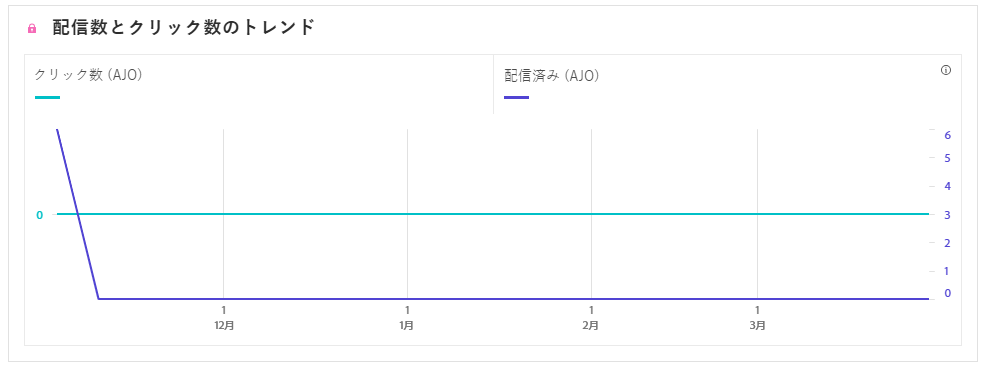
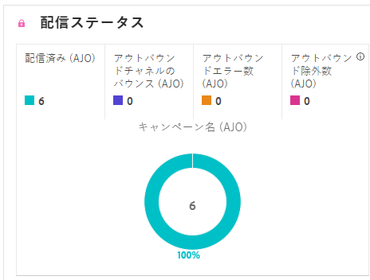

# SMS キャンペーンレポート {#campaign-global-report-cja-sms}

>[!BEGINSHADEBOX]

**このページでは、** Adobe Journey OptimizerのSMS キャンペーンレポートを読んで、配信の傾向、配信状況、追跡されたリンク、インバウンドメッセージ、SMS メッセージのバウンス、エラー、除外の理由を分析する方法について説明します。

>[!ENDSHADEBOX]

>[!BEGINSHADEBOX]

SMS キャンペーンレポートにアクセスするには、キャンペーンの「**[!UICONTROL レポート]**」ボタンをクリックし、「**[!UICONTROL 全期間のレポートを表示]**」を選択します。 [詳細情報](report-gs-cja.md)

>[!ENDSHADEBOX]

## 配信済みとクリックのトレンド {#delivered-click-sms}

**[!UICONTROL 配信済みとクリックのトレンド]**&#x200B;のグラフには、プロファイルのメールへのエンゲージメントに関する詳細な分析が表示され、プロファイルがコンテンツとどのようにやり取りするかに関する貴重なインサイトを得ることができます。

+++ 配信済みとクリックのトレンド指標についての詳細情報

* **[!UICONTROL 配信済み]**：SMS メッセージの合計数に対する、正常に送信された SMS メッセージの数。

* **[!UICONTROL クリック数]**：SMS メッセージでコンテンツがクリックされた回数。

+++

## 配信ステータス {#delivery-status-sms}

**[!UICONTROL 配信ステータス]**&#x200B;のテーブルには、SMS キャンペーンに関連するプロファイルアクティビティの詳細なアカウントが表示されます。 これには、配信済み、クリック数、その他の関連するエンゲージメント指標など、プロファイルが SMS コンテンツとどのようにやり取りするかを包括的に示す指標が含まれます。

+++ 配信ステータス指標についての詳細情報

* **[!UICONTROL 配信済み]**：SMS メッセージの合計数に対する、正常に送信された SMS メッセージの数。

* **[!UICONTROL バウンス]**：送信されたSMS メッセージの合計数に関する、送信プロセスおよび自動返品処理の間に累積されたエラーの合計。

* **[!UICONTROL 送信エラー]**：発生したエラーの合計数で、プロファイルに送信できないようになっています。

* **[!UICONTROL Send exclusions]**: Adobe Journey Optimizerによって除外されたプロファイルの数。

+++

## キャンペーンの概要 {#campaign-global}

**[!UICONTROL キャンペーンの概要]** テーブルは、キャンペーン内のSMS パフォーマンスのダッシュボードとして機能します。 ターゲティングされたプロファイル、クリック率とクリック率（ボットと人間以外のインタラクショントラフィックを除く推定クリック数を含む）、バウンス、送信エラー、除外などの配信結果をまとめたものです。

+++ 詳しくは、キャンペーンの概要指標を参照してください。

* **[!UICONTROL ユーザー]**：メッセージのターゲットプロファイルに適格な、ユーザープロファイルの数。

* **[!UICONTROL クリックスルー率]**：メッセージに対して何らかのアクションを起こしたユーザーの割合。

* **[!UICONTROL クリック数]**：メッセージでコンテンツがクリックされた回数。

* **[!UICONTROL ユニーククリック]**: モバイルメッセージ内のコンテンツの少なくとも1つをクリックしたユニークプロファイルの数。

* **[!UICONTROL 推定クリック数]**: メッセージ内でコンテンツがクリックされた回数（識別されたボットと人間ではないインタラクション （NHI） トラフィックを除く）。

* **[!UICONTROL 配信済み]**：送信されたメッセージの総数に対する、正常に送信されたメッセージの数。

* **[!UICONTROL バウンス]**：送信されたメッセージの合計数に対する、送信プロセスおよび自動返品処理の間に累積されたエラーの合計数。

* **[!UICONTROL 送信エラー]**：送信プロセス中に発生したエラーの合計数で、プロファイルに送信できないようになっています。

* **[!UICONTROL Send Exclusions]**: Adobe Journey Optimizerによって除外されたプロファイルの数。 [除外のカウント方法の詳細情報](exclusion-list.md#exclusion-list)。

+++

## 追跡されたラベル {#track-label-sms}

**[!UICONTROL トラッキングラベル]** テーブルには、SMS メッセージ内のリンクラベルの包括的な概要が表示され、最も高い訪問者トラフィックを生み出すラベルが強調表示されます。 この機能を使用すると、一番人気のリンクを識別し、優先順位を付けることができます。

+++ 詳しくは、トラッキング対象リンクラベル指標を参照してください

* **[!UICONTROL クリック数]**：SMS メッセージでコンテンツがクリックされた回数。

* **[!UICONTROL 推定クリック数]**: メッセージ内でコンテンツがクリックされた回数（識別されたボットと人間ではないインタラクション （NHI） トラフィックを除く）。

* **[!UICONTROL ユニーククリック]**: モバイルメッセージ内のコンテンツの少なくとも1つをクリックしたユニークプロファイルの数。

+++

## トラッキング対象リンク URL {#track-link-url-sms}

**[!UICONTROL トラッキング対象リンク URL]** のテーブルには、SMS メッセージ内で最も多くの訪問者トラフィックを集めている URL の包括的な概要が表示されます。 これにより、最も人気のあるリンクを特定し、優先順位を付けることができ、SMS メッセージ内の特定のコンテンツに対するプロファイルのエンゲージメントをより深く理解することができます。

+++ 詳しくは、トラッキング対象リンク URL 指標を参照してください

* **[!UICONTROL クリック数]**：SMS メッセージでコンテンツがクリックされた回数。

* **[!UICONTROL 推定クリック数]**: メッセージ内でコンテンツがクリックされた回数（識別されたボットと人間ではないインタラクション （NHI） トラフィックを除く）。

* **[!UICONTROL ユニーククリック]**: モバイルメッセージ内のコンテンツの少なくとも1つをクリックしたユニークプロファイルの数。

* **[!UICONTROL 表示数]**：メッセージが開封された回数。

* **[!UICONTROL ユニーク表示数]**：メッセージが開封された回数。1 つのプロファイルによる複数回のインタラクションは考慮されません。

+++

## SMS インバウンドメッセージ {#sms-inbound}

**[!UICONTROL SMS インバウンドメッセージ]**&#x200B;のテーブルには、最も多くの訪問者トラフィックを集めている SMS メッセージの詳細な概要が表示されます。 このリソースでは、オーディエンスのエンゲージメントのダイナミクスに関する貴重なインサイトが提供されます。

+++ 詳しくは、SMS インバウンドメッセージ指標を参照してください

* **[!UICONTROL 人物]**：SMS メッセージのターゲットプロファイルに適格な、ユーザープロファイルの数。

+++

## SMS メッセージタイプ {#sms-message-type}

**[!UICONTROL SMS メッセージタイプ]**&#x200B;のテーブルには、最も多くの訪問者トラフィックを集めている SMS メッセージタイプの完全な概要が表示されます。 このリソースでは、オーディエンスのエンゲージメントのダイナミクスに関する貴重なインサイトが提供されます。

+++ 詳しくは、SMS メッセージタイプ指標を参照してください

* **[!UICONTROL 人物]**：SMS メッセージのターゲットプロファイルに適格な、ユーザープロファイルの数。

+++

## SMS プロバイダー {#sms-providers}

**[!UICONTROL SMS プロバイダー]**&#x200B;のテーブルには、最も多くの訪問者トラフィックを集めている SMS プロバイダーの完全な概要が表示されます。 このリソースでは、オーディエンスのエンゲージメントのダイナミクスに関する貴重なインサイトが提供されます。

+++ 詳しくは、SMS プロバイダー指標を参照してください

* **[!UICONTROL 人物]**：SMS メッセージのターゲットプロファイルに適格な、ユーザープロファイルの数。

+++

## バウンスの理由 {#bounce-reasons-sms}

**[!UICONTROL バウンスの理由]**&#x200B;のテーブルには、バウンスした SMS メッセージに関するデータの包括的な概要が表示され、SMS メッセージバウンスの事例の背後にある特定の理由に関する貴重なインサイトを得ることができます。

## エラーの理由 {#error-reasons-sms}

**[!UICONTROL エラー理由]**&#x200B;のテーブルを使用すると、SMS メッセージの送信プロセス中に発生した特定のエラーを識別し、発生した問題を徹底的に分析できるようになります。

## 除外された理由 {#excluded-reasons-sms}

**[!UICONTROL 除外された理由]**&#x200B;のテーブルには、ターゲットオーディエンスからユーザープロファイルを除外した結果、SMS メッセージを受信できない原因となった様々な要因が視覚的に表示されます。

除外理由の包括的なリストについては、[このページ](exclusion-list.md)を参照してください。
