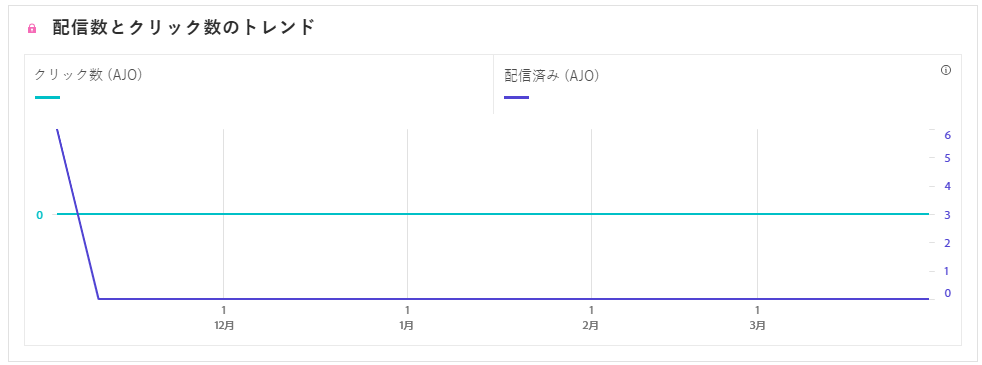
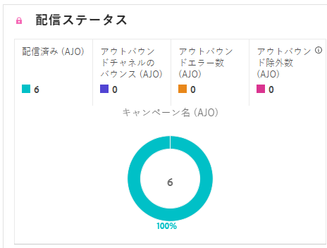

# SMS キャンペーンレポート {#campaign-global-report-cja-sms}

## 配信済みとクリックのトレンド {#delivered-click-sms}

**[!UICONTROL 配信済みとクリックのトレンド]**&#x200B;のグラフには、プロファイルのメールへのエンゲージメントに関する詳細な分析が表示され、プロファイルがコンテンツとどのようにやり取りするかに関する貴重なインサイトを得ることができます。

+++ 配信済み指標とクリックトレンド指標の詳細情報

* **[!UICONTROL 配信済み]**：SMS メッセージの合計数に対する、正常に送信された SMS メッセージの数。

* **[!UICONTROL クリック数]**：SMS メッセージでコンテンツがクリックされた回数。

+++

## 配信ステータス {#delivery-status-sms}

**[!UICONTROL 配信ステータス]**&#x200B;のテーブルには、SMS キャンペーンに関連するプロファイルアクティビティの詳細なアカウントが表示されます。これには、配信済み、クリック数、その他の関連するエンゲージメント指標など、プロファイルが SMS コンテンツとどのようにやり取りするかを包括的に示す指標が含まれます。

+++ 配信ステータス指標の詳細情報

* **[!UICONTROL 配信済み]**：SMS メッセージの合計数に対する、正常に送信された SMS メッセージの数。

* **[!UICONTROL アウトバウンドチャネルのバウンス数]**：送信された SMS メッセージの合計数に対する、送信プロセス中および自動返信処理中に累積したエラーの合計数。

* **[!UICONTROL アウトバウンドエラー数]**：プロファイルにメッセージを送信できなかったエラーの合計数。

* **[!UICONTROL アウトバウンド除外数]**：Adobe Journey Optimizer によって除外されたプロファイルの数。

+++

## トラッキング対象リンクラベル {#track-link-label-sms}

**[!UICONTROL トラッキング対象リンクラベル]**&#x200B;テーブルでは、SMS メッセージ内のリンクラベルの包括的な概要を確認できます。最も多くの訪問者トラフィックを生成するリンクラベルはハイライト表示されます。この機能を使用すると、最も人気のあるリンクを識別し、優先順位を付けることができます。

+++ トラッキング対象リンクラベル指標の詳細情報

* **[!UICONTROL ユニーククリック数]**：SMS メッセージでコンテンツをクリックしたプロファイルの数。

* **[!UICONTROL クリック数]**：SMS メッセージでコンテンツがクリックされた回数。

+++

## トラッキング対象リンク URL {#track-link-url-sms}

**[!UICONTROL トラッキング対象リンク URL]** のテーブルには、SMS メッセージ内で最も多くの訪問者トラフィックを集めている URL の包括的な概要が表示されます。これにより、最も人気のあるリンクを特定し、優先順位を付けることができ、SMS メッセージ内の特定のコンテンツに対するプロファイルのエンゲージメントをより深く理解することができます。

+++ トラッキング対象リンク URL 指標の詳細情報

* **[!UICONTROL ユニーククリック数]**：SMS メッセージでコンテンツをクリックしたプロファイルの数。

* **[!UICONTROL クリック数]**：SMS メッセージでコンテンツがクリックされた回数。

* **[!UICONTROL 表示数]**：メッセージが開封された回数。

* **[!UICONTROL ユニーク表示数]**：メッセージが開封された回数。1 つのプロファイルによる複数回のインタラクションは考慮されません。

+++

## SMS インバウンドメッセージ {#sms-inbound}

**[!UICONTROL SMS インバウンドメッセージ]**&#x200B;のテーブルには、最も多くの訪問者トラフィックを集めている SMS メッセージの詳細な概要が表示されます。このリソースでは、オーディエンスのエンゲージメントのダイナミクスに関する貴重なインサイトが提供されます。

+++ SMS インバウンドメッセージ指標の詳細情報

* **[!UICONTROL 人物]**：SMS メッセージのターゲットプロファイルに適格な、ユーザープロファイルの数。

+++

## SMS メッセージタイプ {#sms-message-type}

**[!UICONTROL SMS メッセージタイプ]**&#x200B;のテーブルには、最も多くの訪問者トラフィックを集めている SMS メッセージタイプの完全な概要が表示されます。このリソースでは、オーディエンスのエンゲージメントのダイナミクスに関する貴重なインサイトが提供されます。

+++ SMS メッセージタイプ指標の詳細情報

* **[!UICONTROL 人物]**：SMS メッセージのターゲットプロファイルに適格な、ユーザープロファイルの数。

+++

## SMS プロバイダー {#sms-providers}

**[!UICONTROL SMS プロバイダー]**&#x200B;のテーブルには、最も多くの訪問者トラフィックを集めている SMS プロバイダーの完全な概要が表示されます。このリソースでは、オーディエンスのエンゲージメントのダイナミクスに関する貴重なインサイトが提供されます。

+++ SMS プロバイダー指標の詳細情報

* **[!UICONTROL 人物]**：SMS メッセージのターゲットプロファイルに適格な、ユーザープロファイルの数。

+++

## バウンスの理由 {#bounce-reasons-sms}

**[!UICONTROL バウンスの理由]**&#x200B;のテーブルには、バウンスした SMS メッセージに関するデータの包括的な概要が表示され、SMS メッセージバウンスの事例の背後にある特定の理由に関する貴重なインサイトを得ることができます。

## エラーの理由 {#error-reasons-sms}

**[!UICONTROL エラー理由]**&#x200B;のテーブルを使用すると、SMS メッセージの送信プロセス中に発生した特定のエラーを識別し、発生した問題を徹底的に分析できるようになります。

## 除外された理由 {#excluded-reasons-sms}

**[!UICONTROL 除外された理由]**&#x200B;のテーブルには、ターゲットオーディエンスからユーザープロファイルを除外した結果、SMS メッセージを受信できない原因となった様々な要因が視覚的に表示されます。

除外理由の包括的なリストについては、[このページ](exclusion-list.md)を参照してください。
