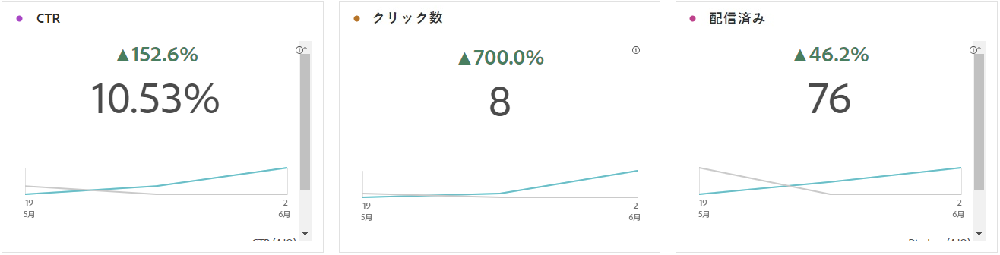
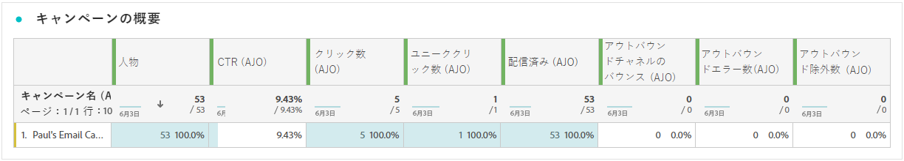
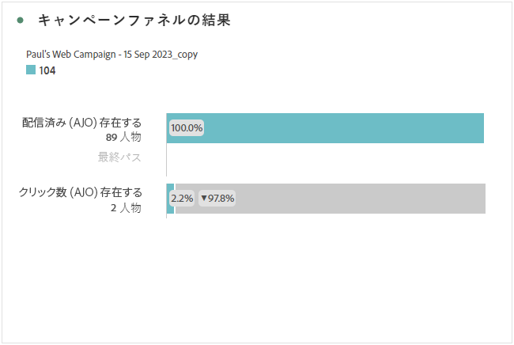
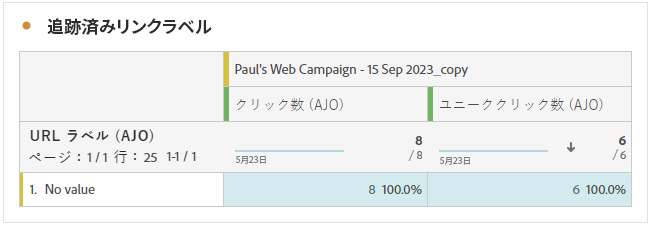

# キャンペーンレポート {#campaign-global-report-cja}

>[!BEGINSHADEBOX]

**このページ：** Adobe Journey Optimizerのキャンペーンレポートを読んで、キャンペーンのKPI、キャンペーンの概要とfunnel、追跡リンク、キャンペーンで使用されているすべてのチャネルのターゲティングパフォーマンスを確認する方法を説明します。

>[!ENDSHADEBOX]

>[!BEGINSHADEBOX]

キャンペーンレポートにアクセスするには、キャンペーンの「**[!UICONTROL レポート]**」ボタンをクリックし、「**[!UICONTROL 全期間のレポートを表示]**」を選択します。 [詳細情報](report-gs-cja.md)

>[!ENDSHADEBOX]

## キャンペーンの KPI {#campaign-kpis}

**[!UICONTROL キャンペーン]**&#x200B;の主要業績評価指標（KPI）は、キャンペーンに関連する重要な指標の分析を提供する、包括的なダッシュボードとして機能します。 これには、クリック数や配信されたメッセージ数などの詳細が含まれ、キャンペーンの効果とエンゲージメントのレベルを包括的に把握できます。

KPI は、キャンペーンで使用されるチャネルによって異なります。

+++ 詳しくは、キャンペーンの KPI 指標を参照してください。

* **[!UICONTROL クリックスルー率]**：メッセージに対して何らかのアクションを起こしたユーザーの割合。

* **[!UICONTROL クリック数]**：メッセージでコンテンツがクリックされた回数。

* **[!UICONTROL 配信済み]**：送信されたメッセージの総数に対する、正常に送信されたメッセージの数。

* **[!UICONTROL 表示数]**：メッセージが開封された回数。

+++

>[!AVAILABILITY]
>調整されたキャンペーンでは、SMS、メール、プッシュの各チャネルのみがサポートされます。 その他のチャネル（アプリ、web、ダイレクトメールなど） はオーケストレーションされたキャンペーンでは使用できず、レポートには表示されません。

### キャンペーンの概要 {#delivery-global}

**[!UICONTROL キャンペーンの概要]**&#x200B;のテーブルは、キャンペーンに関連する主要指標の詳細な分類が表示さる、包括的なダッシュボードとして機能します。 これには、配信されたプロファイル数やアクション数など、キャンペーンのパフォーマンスとエンゲージメントを完全に把握できる重要な情報が含まれます。

指標は、キャンペーンで使用されるチャネルによって異なります。

+++ 詳しくは、キャンペーンの概要指標を参照してください。

* **[!UICONTROL ユーザー]**：メッセージのターゲットプロファイルに適格な、ユーザープロファイルの数。

* **[!UICONTROL クリックスルー率]**：メッセージに対して何らかのアクションを起こしたユーザーの割合。

* **[!UICONTROL クリック数]**：メッセージでコンテンツがクリックされた回数。

* **[!UICONTROL ユニーククリック数]**：メッセージでコンテンツをクリックしたプロファイルの数。

* **[!UICONTROL 配信済み]**：送信されたメッセージの総数に対する、正常に送信されたメッセージの数。

* **[!UICONTROL アウトバウンドチャネルのバウンス数]**：送信されたメッセージの合計数に対して、送信プロセスおよび自動返信処理の間に累積したエラーの合計数。

* **[!UICONTROL アウトバウンドエラー数]**：送信プロセス中に発生し、プロファイルにメッセージを送信できなかったエラーの合計数。

* **[!UICONTROL アウトバウンド除外数]**：Adobe Journey Optimizer によって除外されたプロファイルの数。 [除外のカウント方法の詳細情報](exclusion-list.md#exclusion-list)。

* **[!UICONTROL 表示数]**：メッセージが開封された回数。

* **[!UICONTROL ユニーク表示数]**：メッセージが開封された回数。1 つのプロファイルによる複数回のインタラクションは考慮されません。

+++

### キャンペーンファネルの結果 {#campaign-funnel}

**[!UICONTROL キャンペーンファネルの結果]**&#x200B;のグラフには、プロファイルのメッセージに対するエンゲージメントに関する詳細な分析が表示され、様々なプロファイルがコンテンツとどのようにやり取りしたかに関する貴重なインサイトを得ることができます。

+++ 詳しくは、キャンペーンファネルの結果指標を参照してください。

* **[!UICONTROL 配信済み]**：送信されたメッセージの総数に対する、正常に送信されたメッセージの数。

* **[!UICONTROL クリック数]**：メッセージでコンテンツがクリックされた回数。
+++

### トラッキング対象リンクラベル {#campaign-track}

**[!UICONTROL トラッキング対象リンクラベル]**&#x200B;のテーブルには、メッセージに含まれている URL との訪問者のエンゲージメントに関する基本的なインサイトが提供され、ほとんどのインタラクションを引き付けているリンクに関する貴重な情報を得ることができます。

+++ 詳しくは、トラッキング対象リンクラベル指標を参照してください。

* **[!UICONTROL ユニーククリック数]**：メッセージのコンテンツをクリックしたプロファイルの数。

* **[!UICONTROL クリック数]**：メッセージのコンテンツがクリックされた回数。

+++

## ターゲティングの概要 {#targeting}

コンテンツの&#x200B;**[!UICONTROL ターゲティングルール]**&#x200B;を設定すると、**[!UICONTROL ターゲティングの概要]**&#x200B;の表に主要なエンゲージメント指標の詳細なビューが表示され、各ルールのターゲットプロファイルがコンテンツとどのようにやり取りしたかが示されます。

➡️ [ターゲティングルールの詳細情報](../content-management/optimization-targeting.md)

+++ ターゲティングの概要指標の詳細情報

* **[!UICONTROL 人物]**：イベントのターゲットプロファイルに適格な、ユーザープロファイルの数。

* **[!UICONTROL ユニーククリック数]**：メールでコンテンツをクリックしたプロファイルの数。

* **[!UICONTROL ユニーククリック率]**：1 回以上クリックしたターゲットプロファイルの割合。

+++
