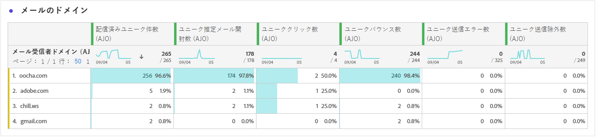
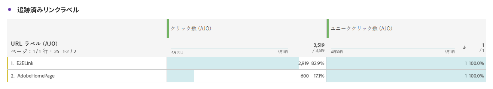
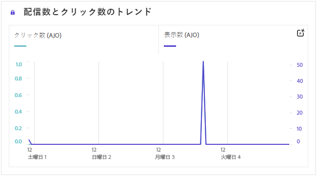
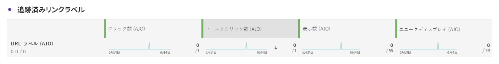
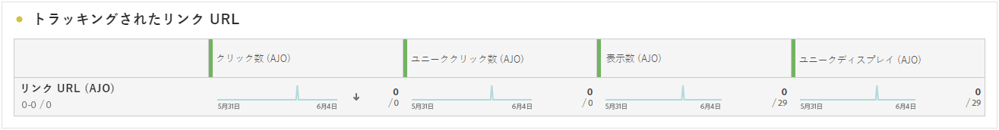

# キャンペーンレポート {#campaign-global-report-cja}

この **キャンペーンレポート** は包括的なダッシュボードとして機能し、キャンペーンに関連付けられた主要指標の詳細な分析を提供します。 クリック数、配信されたメッセージ、プロファイル番号、実行されたアクションなどのデータが含まれます。 キャンペーンの有効性とエンゲージメントレベルの完全な概要を提供することで、レポートはキャンペーンの全体的なパフォーマンスを確実に理解できるようにします。

キャンペーンレポートは、 **[!UICONTROL 報告書]** ボタン。

この **キャンペーンレポート** 選択したチャネルに応じて、ページは次のタブで表示されます。

* [Campaign](#campaign-global)
* [実験](#experimentation)
* [メール](#email-global)
* [SMS](#sms)
* [プッシュ通知](#push-notification)
* [ダイレクトメール](#direct-mail)
* [Web](#web)

Customer Journey Analyticsワークスペースの詳細と、データをフィルタリングして分析する方法については、を参照してください。 [このページ](https://experienceleague.adobe.com/en/docs/analytics-platform/using/cja-workspace/home).

## Campaign {#campaign-global}

### キャンペーン KPI {#campaign-kpis}

この **[!UICONTROL キャンペーン]** 主要業績評価指標（KPI）は、包括的なダッシュボードとして機能し、キャンペーンに関連する重要な指標の分析を提供します。 これには、クリック数や配信されたメッセージ数などの詳細が含まれ、キャンペーンの有効性とエンゲージメントレベルに関する包括的なインサイトを提供します。

KPI は、キャンペーンで使用するチャネルによって異なります。

+++ Campaign KPI 指標の詳細

* **[!UICONTROL クリックスルー率]**：メッセージに対してインタラクションを行ったユーザーの割合。

* **[!UICONTROL クリック数]**：メッセージでコンテンツがクリックされた回数。

* **[!UICONTROL 配信済み]**：送信されたメッセージの総数に対する、正常に送信されたメッセージの数。

* **[!UICONTROL ディスプレイ]**：メッセージが開かれた回数。

+++

### キャンペーンの概要 {#delivery-global}

この **[!UICONTROL キャンペーンの概要]** テーブルは、キャンペーンに関連する主要指標の詳細な分類を提供する、包括的なダッシュボードとして機能します。 これには、配信されたプロファイル数やアクション数など、キャンペーンのパフォーマンスとエンゲージメントを完全に把握できる重要な情報が含まれます。

指標は、キャンペーンで使用されるチャネルによって異なることに注意してください。

+++ Campaign の概要指標の詳細

* **[!UICONTROL 人物]**：メッセージのターゲットプロファイルと認定されるユーザープロファイルの数。

* **[!UICONTROL クリックスルー率]**：メッセージに対してインタラクションを行ったユーザーの割合。

* **[!UICONTROL クリック数]**：メッセージでコンテンツがクリックされた回数。

* **[!UICONTROL ユニーククリック数]**：メッセージのコンテンツをクリックしたプロファイルの数。

* **[!UICONTROL 配信済み]**：送信されたメッセージの総数に対する、正常に送信されたメッセージの数。

* **[!UICONTROL アウトバウンドチャネルのバウンス]**：送信プロセスと自動返信処理の間に、送信されたメッセージの合計数に関して累積したエラーの合計数。

* **[!UICONTROL アウトバウンドエラー]**：送信プロセス中に発生し、プロファイルに送信できなかったエラーの合計数。

* **[!UICONTROL アウトバウンド除外]**:Adobe Journey Optimizerによって除外されたプロファイルの数。

* **[!UICONTROL ディスプレイ]**：メッセージが開かれた回数。

* **[!UICONTROL 一意のディスプレイ]**：メッセージが開かれた回数。1 つのプロファイルの複数のインタラクションは考慮されません。

+++

### キャンペーンファネルの結果 {#campaign-funnel}

この **[!UICONTROL キャンペーンファネルの結果]** グラフは、プロファイルのメッセージに対するエンゲージメントの詳細な分析を表示し、様々なプロファイルがコンテンツとどのように相互作用したかに関する貴重なインサイトを提供します。

+++ キャンペーンファネルの結果指標の詳細

* **[!UICONTROL 配信済み]**：送信されたメッセージの総数に対する、正常に送信されたメッセージの数。

* **[!UICONTROL クリック数]**：メッセージでコンテンツがクリックされた回数。
+++

### 追跡されたリンクラベル {#campaign-track}

この **[!UICONTROL 追跡されたリンクラベル]** テーブルは、メッセージに含まれる URL に対する訪問者のエンゲージメントに関する重要なインサイトを提供し、どのリンクが最もインタラクションを引き付けるかに関する貴重な情報を提供します。

+++ トラッキングされるリンクラベルの指標について詳しくはこちらを参照

* **[!UICONTROL ユニーククリック数]**：メッセージのコンテンツをクリックしたプロファイルの数。

* **[!UICONTROL クリック数]**：メッセージでコンテンツがクリックされた回数。

+++

## 実験 {#experimentation}

「**[!UICONTROL 実験]**」タブには、各バリアントのパフォーマンスに関する主要なインサイトが表示され、最も成功したものを特定します。

最もパフォーマンスの高い処理の判定には時間がかかる場合があります。 実験が成功しなかった場合は、に設定されます。 **決定的でない**.

### 実験 KPI {#experimentation-kpis}

この **[!UICONTROL 実験]** 主要業績評価指標（KPI）は、包括的なダッシュボードとして機能し、実験に関連する重要な指標の分析を提供します。

+++ 実験 KPI 指標の詳細

* **[!UICONTROL 上昇率]**：ベースラインに対する特定の処理のコンバージョン率の向上率を測定します。

* **[!UICONTROL 信頼性]**：ある処理がベースライン処理と同じであることを示す証拠。[詳細情報](../content-management/experiment-calculations.md#understand-confidence)

+++

### インバウンドクリック数によるバリアント {#variant-inbound}

この **[!UICONTROL インバウンドクリック数によるバリアント]** ウィジェットは、各バリアントのパフォーマンスの詳細を説明します。
これらの結果の詳細と解釈について詳しくは、[このページ](../content-management/get-started-experiment.md#interpret-results)を参照してください。

+++ インバウンドクリック数指標によるバリアントの詳細を説明します

* **[!UICONTROL 人物]**：メッセージのターゲットプロファイルと認定されるユーザープロファイルの数。

* **[!UICONTROL インバウンドクリック]**：アウトバウンドチャネルでのクリック総数。

* **[!UICONTROL コンバージョン率]**：実験の作成時に以前に選択した成功指標の合計値を、プロファイル数で割った値です。

* **[!UICONTROL 上昇率]**：ベースラインに対する特定の処理のコンバージョン率の向上率を測定します。

* **[!UICONTROL 信頼性]**：ある処理がベースライン処理と同じであることを示す証拠。[詳細情報](../content-management/experiment-calculations.md#understand-confidence)

<!--
* **[!UICONTROL Confidence Upper bound]**:
* **[!UICONTROL Confidence Lower bound]**:
-->
+++

### インバウンドクリック数のコンバージョン率 {#conversion-rate}

**[!UICONTROL 信頼区間]**&#x200B;グラフは、改善に関する不確実性を測定します。ベースラインと最もパフォーマンスの高い処理との間のパフォーマンス差の割合を詳細に示します。[詳細情報](../content-management/experiment-calculations.md#confidence-intervals)

## メール {#email-global}

### 配信済みとクリックのトレンド {#delivered-click}

この **[!UICONTROL 配信済みとクリックのトレンド]** グラフは、プロファイルのメールへのエンゲージメントに関する詳細な分析を表示し、プロファイルがコンテンツとどのようにやり取りするかについての貴重なインサイトを提供します。

+++ 配信済み指標とクリックトレンド指標の詳細を学ぶ

* **[!UICONTROL 配信済み]**：送信されたメッセージの合計数に対する、正常に送信されたメッセージの数。

* **[!UICONTROL クリック数]**：メールでコンテンツがクリックされた回数。

+++

### 配信ステータス {#delivery-status}

この **[!UICONTROL 配信ステータス]** グラフは、キャンペーンで送信されたメールに関連するデータの包括的な表示を提供し、配信やバウンスなどの主要指標に関するインサイトを提供します。 これにより、メール送信プロセスを詳細に分析し、キャンペーンの効率とパフォーマンスに関する貴重な情報を提供できます。

+++ 配信ステータス指標について詳しくはこちらを参照

* **[!UICONTROL 配信済み]**：送信されたメッセージの合計数に対する、正常に送信されたメッセージの数。

* **[!UICONTROL アウトバウンドチャネルのバウンス]**：送信プロセスと自動返信処理の間に、送信されたメッセージの合計数に関して累積したエラーの合計数。

* **[!UICONTROL アウトバウンドエラー]**：送信プロセス中に発生し、プロファイルに送信できなかったエラーの合計数。

* **[!UICONTROL アウトバウンド除外]**:Adobe Journey Optimizerによって除外されたプロファイルの数。

+++

### 送信統計 {#sending-statistics-email}

この **[!UICONTROL 送信統計]** 表には、キャンペーンでのメールに関する基本的なデータの包括的な概要が表示されます。 メールとのインタラクションや正常に配信されたメール数などの主要指標を詳細に示し、メールやキャンペーンの有効性やリーチに関する貴重なインサイトを提供します。

+++ 送信統計指標の詳細を説明します

* **[!UICONTROL 人物]**：メッセージのターゲットプロファイルと認定されるユーザープロファイルの数。

* **[!UICONTROL ターゲット]**：送信プロセス中に処理されたメールの合計数。

* **[!UICONTROL 送信数]**：メールの送信の合計数。

* **[!UICONTROL 配信済み]**：送信されたメッセージの総数に対する、正常に送信されたメッセージの数。

* **[!UICONTROL アウトバウンドチャネルのバウンス]**：送信プロセスと自動返信処理の間に、送信されたメッセージの合計数に関して累積したエラーの合計数。

* **[!UICONTROL アウトバウンドエラー]**：送信プロセス中に発生し、プロファイルに送信できなかったエラーの合計数。

* **[!UICONTROL アウトバウンド除外]**:Adobe Journey Optimizerによって除外されたプロファイルの数。

+++

### トラッキング統計 {#tracking-statistics-email}

この **[!UICONTROL 電子メール – トラッキング統計]** テーブルには、キャンペーンに含まれるメールに関連するプロファイルアクティビティの詳細なアカウントが表示されます。 これには、開封数、クリック数、その他の関連するエンゲージメント指標など、プロファイルがメールコンテンツとどのようにやり取りするかを包括的に示す指標が含まれます。

+++ トラッキング統計指標の詳細

* **[!UICONTROL クリックスルー率（CTR）]**：メールに対してインタラクションを行ったユーザーの割合。

* **[!UICONTROL クリックスルー開封率（CTOR）]**：メールが開封された回数。

* **[!UICONTROL クリック数]**：メールでコンテンツがクリックされた回数。

* **[!UICONTROL ユニーククリック数]**：メールでコンテンツをクリックしたプロファイルの数。

* **[!UICONTROL メールの開封数]**：キャンペーンでメールが開封された回数。

* **[!UICONTROL ユニークメール開封数]**：開封されたメールの割合。

* **[!UICONTROL スパムのの苦情数]**：メッセージがスパムまたはジャンクとして宣言された回数。

* **[!UICONTROL 登録解除]**：登録解除リンクのクリック数。

+++

### メールドメイン {#email-domains}

この **[!UICONTROL メールドメイン]** テーブルには、ドメイン別に分類されたメールの詳細な分類が表示され、メールキャンペーンのパフォーマンス指標に関する広範なインサイトが得られます。 この包括的な分析により、メールコンテンツに応じた様々なドメインの動作を理解できます。

+++ メールドメインの指標の詳細情報

* **[!UICONTROL 送信数]**：メールの送信の合計数。

* **[!UICONTROL 配信済み]**：送信されたメッセージの合計数に対する、正常に送信されたメッセージの数。

* **[!UICONTROL メールの開封数]**：キャンペーンでメールが開封された回数。

* **[!UICONTROL クリック数]**：メールでコンテンツがクリックされた回数。

* **[!UICONTROL アウトバウンドチャネルのバウンス]**：送信プロセスと自動返信処理の間に、送信されたメールの合計数に関して累積したエラーの合計数。

* **[!UICONTROL アウトバウンドエラー]**：送信プロセス中に発生し、プロファイルに送信できなかったエラーの合計数。
+++

### トラッキング対象リンクラベル {#track-link-label}

この **[!UICONTROL 追跡されたリンクラベル]** テーブルには、メール内のリンクラベルの包括的な概要が表示され、訪問者トラフィックが最も多いラベルがハイライト表示されます。 この機能を使用すると、最も人気のあるリンクを特定し、優先順位を付けることができます。

+++ トラッキングされるリンクラベルの指標について学ぶ

* **[!UICONTROL ユニーククリック数]**：メールでコンテンツをクリックしたプロファイルの数。

* **[!UICONTROL クリック数]**：メールでコンテンツがクリックされた回数。

+++

### トラッキング対象リンク URL {#track-link-url}

この **[!UICONTROL トラッキングされるリンクの URL]** 表には、訪問者トラフィックを最も多く引き付けるメール内の URL の包括的な概要が表示されます。 これにより、最も人気のあるリンクを特定し、優先順位を付けることができ、メール内の特定のコンテンツに対するプロファイルのエンゲージメントをより深く理解することができます。

+++ トラッキングされるリンク URL の指標について詳しくはこちらを参照

* **[!UICONTROL ユニーククリック数]**：メールでコンテンツをクリックしたプロファイルの数。

* **[!UICONTROL クリック数]**：メールでコンテンツがクリックされた回数。

* **[!UICONTROL ディスプレイ]**：メールが開封された回数。

* **[!UICONTROL 一意のディスプレイ]**：メールが開かれた回数。1 つのプロファイルの複数のインタラクションは考慮されません。

+++

### メールの件名 {#email-subjects}

この **[!UICONTROL メールの件名]** 表は、訪問者のトラフィックが最も多いメール件名の完全な概要を示しています。 このリソースは、オーディエンゲージメントのダイナミクスに関する貴重なインサイトを提供します。

+++ メール件名指標の詳細

* **[!UICONTROL 人物]**：メールのターゲットプロファイルとして認定されるユーザープロファイルの数。

+++

### 除外された理由 {#excluded-reasons}

この **[!UICONTROL 除外された理由]** テーブルには、ターゲットオーディエンスからユーザープロファイルが除外され、メッセージが受信されなくなったさまざまな要因の包括的なビューが表示されます。

除外の理由の包括的なリストについては、[このページ](exclusion-list.md)を参照してください。

### バウンスの理由 {#bounce-reasons-email}

この **[!UICONTROL バウンスの理由]** 表は、バウンスメッセージに関して使用可能なデータをコンパイルし、メールバウンスの背後にある特定の理由に関する詳細なインサイトを提供します。

バウンスについて詳しくは、[抑制リスト](../reports/suppression-list.md)のページを参照してください。

### エラーの理由 {#error-reasons-email}

この **[!UICONTROL エラー理由]** テーブルは、送信プロセス中に発生した特定のエラーを可視化し、エラーの性質と発生に関する貴重な情報を提供します。

## SMS {#sms}

### 配信済みとクリックのトレンド {#delivered-click-sms}

この **[!UICONTROL 配信済みとクリックのトレンド]** グラフは、プロファイルのメールへのエンゲージメントに関する詳細な分析を表示し、プロファイルがコンテンツとどのようにやり取りするかについての貴重なインサイトを提供します。

+++ 配信済み指標とクリックトレンド指標の詳細を学ぶ

* **[!UICONTROL 配信完了]**:SMS メッセージの合計数に対して、正常に送信された SMS メッセージの数。

* **[!UICONTROL クリック数]**：SMS メッセージでコンテンツがクリックされた回数。

+++

### 配信ステータス {#delivery-status-sms}

この **[!UICONTROL 配信ステータス]** テーブルには、SMS キャンペーンに関連するプロファイル活動の詳細なアカウントが表示されます。 これには、配信済み、クリック数、その他の関連するエンゲージメント指標に関する指標が含まれ、プロファイルと SMS コンテンツのやり取りの包括的なビューを提供します。

+++ 配信ステータス指標について詳しくはこちらを参照

* **[!UICONTROL 配信完了]**:SMS メッセージの合計数に対して、正常に送信された SMS メッセージの数。

* **[!UICONTROL アウトバウンドチャネルのバウンス]**：送信プロセスと自動返信処理の間に、送信された SMS メッセージの合計数に関して累積したエラーの合計数。

* **[!UICONTROL アウトバウンドエラー]**：発生したエラーにより、プロファイルに送信できなかった数の合計。

* **[!UICONTROL アウトバウンド除外]**:Adobe Journey Optimizerによって除外されたプロファイルの数。

+++

### トラッキング対象リンクラベル {#track-link-label-sms}

この **[!UICONTROL 追跡されたリンクラベル]** 表は、SMS メッセージ内のリンクラベルの包括的な概要を提供し、訪問者トラフィックが最も多いメッセージをハイライト表示します。 この機能を使用すると、最も人気のあるリンクを特定し、優先順位を付けることができます。

+++ トラッキングされるリンクラベルの指標について学ぶ

* **[!UICONTROL ユニーククリック数]**:SMS メッセージのコンテンツをクリックしたプロファイルの数。

* **[!UICONTROL クリック数]**：SMS メッセージでコンテンツがクリックされた回数。

+++

### トラッキング対象リンク URL {#track-link-url-sms}

この **[!UICONTROL トラッキングされるリンクの URL]** 表は、最も高い訪問者トラフィックを引き付ける SMS メッセージ内の URL の包括的な概要を示します。 これにより、最も人気のあるリンクを特定して優先順位を付け、SMS メッセージ内の特定のコンテンツに対するプロファイルエンゲージメントの理解を深めることができます。

+++ トラッキングされるリンク URL の指標について詳しくはこちらを参照

* **[!UICONTROL ユニーククリック数]**:SMS メッセージのコンテンツをクリックしたプロファイルの数。

* **[!UICONTROL クリック数]**：SMS メッセージでコンテンツがクリックされた回数。

* **[!UICONTROL ディスプレイ]**：メッセージが開かれた回数。

* **[!UICONTROL 一意のディスプレイ]**：メッセージが開かれた回数。1 つのプロファイルの複数のインタラクションは考慮されません。

+++

### SMS インバウンドメッセージ {#sms-inbound}

この **[!UICONTROL SMS インバウンドメッセージ]** 表は、最も訪問者トラフィックの多い SMS メッセージの完全な概要を示しています。 このリソースは、オーディエンゲージメントのダイナミクスに関する貴重なインサイトを提供します。

+++ SMS インバウンドメッセージ指標の詳細

* **[!UICONTROL 人物]**:SMS メッセージのターゲットプロファイルとして認定されるユーザープロファイルの数。

+++

### SMS メッセージタイプ {#sms-message-type}

この **[!UICONTROL SMS メッセージタイプ]** 表は、最も訪問者トラフィックの多い SMS メッセージタイプの完全な概要を示しています。 このリソースは、オーディエンゲージメントのダイナミクスに関する貴重なインサイトを提供します。

+++ SMS メッセージタイプ指標の詳細

* **[!UICONTROL 人物]**:SMS メッセージのターゲットプロファイルとして認定されるユーザープロファイルの数。

+++

### SMS プロバイダー {#sms-providers}

この **[!UICONTROL SMS プロバイダー]** 表は、最も訪問者トラフィックの多い SMS プロバイダーの完全な概要を示しています。 このリソースは、オーディエンゲージメントのダイナミクスに関する貴重なインサイトを提供します。

+++ SMS プロバイダーの指標について詳しくはこちらを参照

* **[!UICONTROL 人物]**:SMS メッセージのターゲットプロファイルとして認定されるユーザープロファイルの数。

+++

### バウンスの理由 {#bounce-reasons-sms}

この **[!UICONTROL バウンスの理由]** 表は、バウンスした SMS メッセージに関連するデータの包括的な概要を提供し、SMS メッセージバウンスのインスタンスの背後にある特定の理由に関する貴重なインサイトを提供します。

### エラーの理由 {#error-reasons-sms}

この **[!UICONTROL エラー理由]** テーブルを使用すると、SMS メッセージの送信プロセス中に発生した特定のエラーを識別し、発生した問題の徹底的な分析を容易にすることができます。

### 除外された理由 {#excluded-reasons-sms}

この **[!UICONTROL 理由を除外]** 表は、ターゲットオーディエンスからユーザープロファイルを除外し、SMS メッセージを受信できなかった様々な要因を視覚的に示しています。

除外理由の包括的なリストについては、[このページ](exclusion-list.md)を参照してください。

## プッシュ通知 {#push-notification}

### 送信統計 {#sending-statistics-push}

この **[!UICONTROL 送信統計]** 表には、プッシュ通知キャンペーンに関する重要なデータの包括的な概要が表示されます。 ターゲットオーディエンスのサイズや正常に配信されたプッシュ通知の数などの主要指標を詳細に示し、プッシュ通知の有効性やリーチに関する貴重なインサイトを提供します。

+++ 送信統計指標の詳細を説明します

* **[!UICONTROL 人物]**：プッシュ通知用のターゲットプロファイルとして認定されるユーザープロファイルの数。

* **[!UICONTROL ターゲット]**：分析中に処理されたプッシュ通知の合計数。

* **[!UICONTROL 送信数]**：プッシュ通知用の送信の合計数。

* **[!UICONTROL 配信済み]**：送信されたプッシュ通知の合計数に対する、正常に送信されたプッシュ通知の数。

* **[!UICONTROL アウトバウンドチャネルのバウンス]**：送信プロセスと自動返信処理の間に、プッシュ通知の合計数に関して累積したエラーの合計数。

* **[!UICONTROL アウトバウンドエラー]**：発生したエラーにより、プロファイルに送信できなかった数の合計。

* **[!UICONTROL アウトバウンド除外]**:Adobe Journey Optimizerによって除外されたプロファイルの数。

+++

### トラッキング統計 {#tracking-statistics-push}

この **[!UICONTROL トラッキング統計]** テーブルには、プッシュ通知に関連付けられたプロファイルアクティビティの詳細なスナップショットが表示され、エンゲージメントとプッシュ通知の有効性に関する基本的なインサイトが提供されます。

+++ トラッキング統計指標の詳細

* **[!UICONTROL クリックスルー率（CTR）]**：プッシュ通知を操作したユーザーの割合。

* **[!UICONTROL クリックスルー開封率（CTOR）]**：プッシュ通知が開かれた回数。

* **[!UICONTROL クリック数]**：プッシュ通知のコンテンツがクリックされた回数。

* **[!UICONTROL ユニーククリック数]**：プッシュ通知のコンテンツをクリックしたプロファイルの数。

<!--
* **[!UICONTROL Push custom actions]**: 
-->
+++

### トラッキング対象リンクラベル {#track-link-label-push}

この **[!UICONTROL 追跡されたリンクラベル]** 表には、プッシュ通知内のリンクラベルの包括的な概要が表示され、訪問者トラフィックが最も多いラベルがハイライト表示されます。 この機能を使用すると、最も人気のあるリンクを特定し、優先順位を付けることができます。

+++ トラッキングされるリンクラベルの指標について学ぶ

* **[!UICONTROL ユニーククリック数]**：プッシュ通知のコンテンツをクリックしたプロファイルの数。

* **[!UICONTROL クリック数]**：プッシュ通知のコンテンツがクリックされた回数。

+++

### トラッキング対象リンク URL {#track-link-url-push}

この **[!UICONTROL トラッキングされるリンクの URL]** 表には、訪問者トラフィックを最も多く引き付けるプッシュ通知内の URL の包括的な概要が表示されます。 これにより、最も人気のあるリンクを特定して優先順位を付け、プッシュ通知の特定のコンテンツに対するプロファイルエンゲージメントの理解を深めることができます。

+++ トラッキングされるリンク URL の指標について詳しくはこちらを参照

* **[!UICONTROL ユニーククリック数]**：プッシュ通知のコンテンツをクリックしたプロファイルの数。

* **[!UICONTROL クリック数]**：プッシュ通知のコンテンツがクリックされた回数。

+++

### バウンスの理由 {#bounce-reasons-push}

この **[!UICONTROL バウンスの理由]** 表は、バウンスプッシュ通知に関連するデータの包括的な概要を示し、プッシュ通知バウンスインスタンスの背後にある特定の理由に関する貴重なインサイトを提供します。

### エラーの理由 {#error-reasons-push}

この **[!UICONTROL エラー理由]** テーブルを使用すると、プッシュ通知の送信プロセス中に発生した特定のエラーを識別し、発生した問題の徹底的な分析を容易にすることができます。

### 除外された理由 {#exclude-reasons-push}

この **[!UICONTROL 理由を除外]** 表は、ターゲットオーディエンスからユーザープロファイルを除外し、プッシュ通知を受信できなかった様々な要因を視覚的に示しています。

除外理由の包括的なリストについては、[このページ](exclusion-list.md)を参照してください。

## アプリ内 {#in-app}

### インプレッションとクリックのトレンド {#impression-click-trend}

この **[!UICONTROL インプレッションとクリックのトレンド]** グラフは、プロファイルのアプリ内メッセージへのエンゲージメントに関する詳細な分析を表示し、プロファイルがコンテンツとどのようにやり取りするかについての貴重なインサイトを提供します。

+++ インプレッションとクリックのトレンド指標について詳しくはこちらを参照

* **[!UICONTROL クリック数]**：アプリ内メッセージでコンテンツがクリックされた回数。

* **[!UICONTROL ディスプレイ]**：メッセージが開かれた回数。

+++

### クリック数 {#clicks-inapp}

この **[!UICONTROL クリック数]** グラフには、コンテンツがクリックされた合計数と、コンテンツをクリックした一意のプロファイル数の両方を示すアプリ内クリック指標が表示されます。

+++ クリック数指標の詳細

* **[!UICONTROL ユニーククリック数]**：アプリ内メッセージのコンテンツをクリックしたプロファイルの数

* **[!UICONTROL クリック数]**：アプリ内メッセージでコンテンツがクリックされた回数。

+++

### 表示 {#display-inapp}

この **[!UICONTROL ディスプレイ]** グラフは、メッセージの全体的なリーチと、メッセージに関与する一意のプロファイルの数の両方を理解するのに役立ちます。

+++ 表示指標の詳細

* **[!UICONTROL ディスプレイ]**：メッセージが開かれた回数。

* **[!UICONTROL 一意のディスプレイ]**：メッセージが開かれた回数。1 つのプロファイルの複数のインタラクションは考慮されません。

+++

### トラッキングデータ {#tracking-data-inapp}

この **[!UICONTROL トラッキングデータ]** 表には、アプリ内メッセージに関連付けられたプロファイルアクティビティの詳細なスナップショットが表示され、エンゲージメントとアプリ内メッセージの有効性に関する重要なインサイトが提供されます。

+++ トラッキングデータ指標の詳細情報

* **[!UICONTROL 人物]**：アプリ内メッセージのターゲットプロファイルとして認定されるユーザープロファイルの数。

* **[!UICONTROL クリックスルー率（CTR）]**：アプリ内メッセージを操作したユーザーの割合。

* **[!UICONTROL クリックスルー開封率（CTOR）]**：アプリ内メッセージが開かれた回数。

* **[!UICONTROL クリック数]**：アプリ内メッセージでコンテンツがクリックされた回数。

* **[!UICONTROL ユニーククリック数]**：アプリ内メッセージのコンテンツをクリックしたプロファイルの数。

* **[!UICONTROL ディスプレイ]**：メッセージが開かれた回数。

* **[!UICONTROL 一意のディスプレイ]**：メッセージが開かれた回数。1 つのプロファイルの複数のインタラクションは考慮されません。

* **[!UICONTROL 送信数]**：アプリ内メッセージの送信の合計数。

<!--
* **[!UICONTROL Inbound triggered]**: 

* **[!UICONTROL Inbound dismisses]**: 
-->
+++

### トラッキング対象リンクラベル {#track-link-label-inapp}

この **[!UICONTROL 追跡されたリンクラベル]** 表には、アプリ内メッセージ内のリンクラベルの包括的な概要が表示され、訪問者トラフィックが最も多いメッセージがハイライト表示されます。 この機能を使用すると、最も人気のあるリンクを特定し、優先順位を付けることができます。

+++ トラッキングされるリンクラベルの指標について学ぶ

* **[!UICONTROL ユニーククリック数]**：アプリ内メッセージのコンテンツをクリックしたプロファイルの数。

* **[!UICONTROL クリック数]**：アプリ内メッセージでコンテンツがクリックされた回数。

* **[!UICONTROL ディスプレイ]**：メッセージが開かれた回数。

* **[!UICONTROL 一意のディスプレイ]**：メッセージが開かれた回数。1 つのプロファイルの複数のインタラクションは考慮されません。

+++

### トラッキング対象リンク URL {#track-link-url-inapp}

この **[!UICONTROL トラッキングされるリンクの URL]** 表には、訪問者トラフィックを最も多く引き付けるアプリ内メッセージ内の URL の包括的な概要が表示されます。 これにより、最も人気のあるリンクを特定して優先順位を付け、アプリ内メッセージの特定のコンテンツに対するプロファイルエンゲージメントの理解を深めることができます。

+++ トラッキングされるリンク URL の指標について詳しくはこちらを参照

* **[!UICONTROL ユニーククリック数]**：アプリ内メッセージのコンテンツをクリックしたプロファイルの数。

* **[!UICONTROL クリック数]**：アプリ内メッセージでコンテンツがクリックされた回数。

+++

## ダイレクトメール {#direct-mail}

### 送信統計 {#sending-statistics-directmail}

この **[!UICONTROL 送信統計]** 表には、ダイレクトメールキャンペーンに関する重要なデータの包括的な概要が表示されます。 ターゲットオーディエンスのサイズや正常に配信されたダイレクトメールの数などの主要指標を詳細に示し、ダイレクトメールメッセージの有効性とリーチに関する貴重なインサイトを提供します。

+++ 送信統計指標の詳細を説明します

* **[!UICONTROL 人物]**：メッセージのターゲットプロファイルと認定されるユーザープロファイルの数。

* **[!UICONTROL ターゲット]**：送信プロセス中に処理されたダイレクトメールメッセージの合計数。

* **[!UICONTROL 送信数]**：ダイレクトメールメッセージの送信の合計数。

* **[!UICONTROL 配信完了]**：送信されたメッセージの合計数に対して、正常に送信されたダイレクトメールメッセージの数。

* **[!UICONTROL アウトバウンドエラー]**：送信プロセス中に発生し、プロファイルに送信できなかったエラーの合計数。

* **[!UICONTROL アウトバウンド除外]**:Adobe Journey Optimizerによって除外されたプロファイルの数。

+++

### 配信ステータス {#delivery-status-directmail}

この **[!UICONTROL 配信ステータス]** グラフは、キャンペーンで送信されたダイレクトメールメッセージに関連するデータの包括的な表示を提供し、配信されたエラーやエラーなどの主要指標に関するインサイトを提供します。 これにより、ダイレクトメールメッセージの送信プロセスを詳細に分析し、キャンペーンの効率とパフォーマンスに関する貴重な情報を提供できます。

+++ 配信ステータス指標について詳しくはこちらを参照

* **[!UICONTROL 配信完了]**：送信されたダイレクトメールメッセージの合計数に対して、正常に送信されたダイレクトメールメッセージの数。

* **[!UICONTROL アウトバウンドエラー]**：送信プロセス中に発生し、ダイレクトメールメッセージがプロファイルに送信できなかったエラーの合計数。

* **[!UICONTROL 境界なし除外]**:Adobe Journey Optimizerによって除外されたプロファイルの数。

+++

### エラーの理由 {#error-reasons-directmail}

この **[!UICONTROL エラー理由]** テーブルを使用すると、ダイレクトメールメッセージの送信プロセス中に発生した特定のエラーを識別し、発生した問題の徹底的な分析を容易にすることができます。

### 除外された理由 {#exclude-reasons-directmail}

この **[!UICONTROL 理由を除外]** 表は、ターゲットオーディエンスからユーザープロファイルを除外し、ダイレクトメールメッセージを受信できなかった様々な要因を視覚的に示しています。

除外理由の包括的なリストについては、[このページ](exclusion-list.md)を参照してください。

## Web {#web}

### インプレッションとクリックのトレンド {#impressions-web}

この **[!UICONTROL インプレッションとクリックのトレンド]** グラフは、プロファイルの web ページへのエンゲージメントに関する詳細な分析を表示し、プロファイルがコンテンツとどのようにやり取りするかについての貴重なインサイトを提供します。

+++ インプレッションとクリックのトレンド指標について詳しくはこちらを参照

* **[!UICONTROL クリック数]**:Web ページでコンテンツがクリックされた回数。

* **[!UICONTROL ディスプレイ]**：メッセージが開かれた回数。

+++

### クリック数 {#clicks-web}

この **[!UICONTROL クリック数]** グラフには、コンテンツがクリックされた合計数と、コンテンツをクリックした一意のプロファイル数の両方を示す、web ページのクリック指標が表示されます。

+++ クリック数指標の詳細

* **[!UICONTROL ユニーククリック数]**:Web ページのコンテンツをクリックしたプロファイルの数。

* **[!UICONTROL クリック数]**:Web ページでコンテンツがクリックされた回数。

+++

### 表示 {#displays-web}

この **[!UICONTROL ディスプレイ]** グラフは、メッセージの全体的なリーチと、メッセージに関与する一意のプロファイルの数の両方を理解するのに役立ちます。

+++ 表示指標の詳細

* **[!UICONTROL ディスプレイ]**：メッセージが開かれた回数。

* **[!UICONTROL 一意のディスプレイ]**：メッセージが開かれた回数。1 つのプロファイルの複数のインタラクションは考慮されません。

+++

### トラッキングデータ {#track-data-web}

この **[!UICONTROL トラッキングデータ]** 表には、web ページに関連付けられたプロファイルアクティビティの詳細なスナップショットが表示され、エンゲージメントと web ページの有効性に関する基本的なインサイトが提供されます。

+++ トラッキングデータ指標の詳細情報

* **[!UICONTROL 人物]**:Web ページのターゲットプロファイルと認定されるユーザープロファイルの数。

* **[!UICONTROL クリックスルー率（CTR）]**:web ページを操作したユーザーの割合。

* **[!UICONTROL クリック数]**:Web ページでコンテンツがクリックされた回数。

* **[!UICONTROL ユニーククリック数]**:Web ページのコンテンツをクリックしたプロファイルの数。

* **[!UICONTROL ディスプレイ]**:web ページが開かれた回数。

* **[!UICONTROL 一意のディスプレイ]**:Web ページが開かれた回数。1 つのプロファイルの複数のインタラクションは考慮されません。

+++

### トラッキング対象リンクラベル {#track-link-web}

この **[!UICONTROL 追跡されたリンクラベル]** 表では、web ページ内のリンクラベルの包括的な概要が提供され、訪問者トラフィックが最も多いラベルがハイライト表示されます。 この機能を使用すると、最も人気のあるリンクを特定し、優先順位を付けることができます。

+++ トラッキングされるリンクラベルの指標について学ぶ

* **[!UICONTROL ユニーククリック数]**:Web ページのコンテンツをクリックしたプロファイルの数。

* **[!UICONTROL クリック数]**:Web ページでコンテンツがクリックされた回数。

* **[!UICONTROL ディスプレイ]**：メッセージが開かれた回数。

* **[!UICONTROL 一意のディスプレイ]**：メッセージが開かれた回数。1 つのプロファイルの複数のインタラクションは考慮されません。

+++

### トラッキング対象リンク URL {#track-url-web}

この **[!UICONTROL トラッキングされるリンクの URL]** 表では、訪問者トラフィックを最も多く引き付ける web ページ内の URL の包括的な概要を説明しています。 これにより、最も人気のあるリンクを特定して優先順位を付け、web ページ内の特定のコンテンツに対するプロファイルエンゲージメントの理解を深めることができます。

+++ トラッキングされるリンク URL の指標について詳しくはこちらを参照

* **[!UICONTROL ユニーククリック数]**:Web ページのコンテンツをクリックしたプロファイルの数。

* **[!UICONTROL クリック数]**:Web ページでコンテンツがクリックされた回数。

* **[!UICONTROL ディスプレイ]**：メッセージが開かれた回数。

* **[!UICONTROL 一意のディスプレイ]**：メッセージが開かれた回数。1 つのプロファイルの複数のインタラクションは考慮されません。

+++
