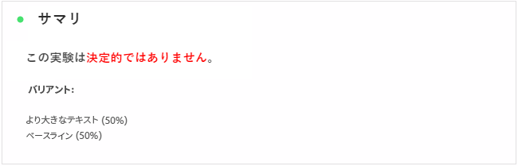
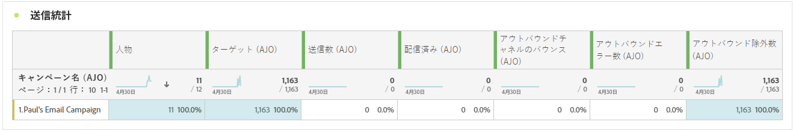
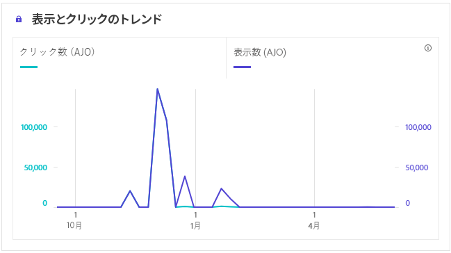
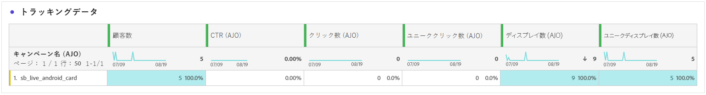
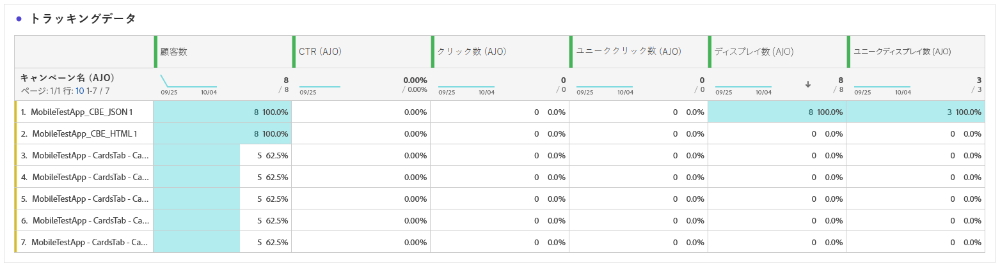

# キャンペーンレポート {#campaign-global-report-cja}

**キャンペーンレポート**&#x200B;は、キャンペーンに関連する主要指標の詳細な分析を提供する、包括的なダッシュボードとして機能します。クリック数、配信されたメッセージ数、プロファイル数、実行されたアクション数などのデータが含まれます。このレポートでは、キャンペーンの効果とエンゲージメントレベルの完全な概要が提供されるので、キャンペーンの全体的なパフォーマンスを徹底的に理解できます。

キャンペーンレポートには、「**[!UICONTROL レポート]**」ボタンを使用して、キャンペーンから直接アクセスできます。

選択したチャネルに応じて、次のタブを含む&#x200B;**キャンペーンレポート**&#x200B;ページが表示されます。

* [キャンペーン](#campaign-global)
* [実験](#experimentation)
* [メール](#email-global)
* [SMS](#sms)
* [プッシュ通知](#push-notification)
* [ダイレクトメール](#direct-mail)
* [Web](#web)
* [コンテンツカード](#content-card)
* [コードベースのエクスペリエンス](#code-based)

Customer Journey Analytics ワークスペースの詳細と、データのフィルタリングおよび分析方法については、[このページ](https://experienceleague.adobe.com/ja/docs/analytics-platform/using/cja-workspace/home)を参照してください。

## キャンペーン {#campaign-global}

### キャンペーンの KPI {#campaign-kpis}

**[!UICONTROL キャンペーン]**&#x200B;の主要業績評価指標（KPI）は、キャンペーンに関連する重要な指標の分析を提供する、包括的なダッシュボードとして機能します。これには、クリック数や配信されたメッセージ数などの詳細が含まれ、キャンペーンの効果とエンゲージメントのレベルを包括的に把握できます。

KPI は、キャンペーンで使用されるチャネルによって異なります。

+++ キャンペーンの KPI 指標の詳細情報

* **[!UICONTROL クリックスルー率]**：メッセージに対して何らかのアクションを起こしたユーザーの割合。

* **[!UICONTROL クリック数]**：メッセージでコンテンツがクリックされた回数。

* **[!UICONTROL 配信済み]**：送信されたメッセージの総数に対する、正常に送信されたメッセージの数。

* **[!UICONTROL 表示数]**：メッセージが開封された回数。

+++

### キャンペーンの概要 {#delivery-global}

**[!UICONTROL キャンペーンの概要]**&#x200B;のテーブルは、キャンペーンに関連する主要指標の詳細な分類が表示さる、包括的なダッシュボードとして機能します。これには、配信されたプロファイル数やアクション数など、キャンペーンのパフォーマンスとエンゲージメントを完全に把握できる重要な情報が含まれます。

指標は、キャンペーンで使用されるチャネルによって異なります。

+++ キャンペーンの概要指標の詳細情報

* **[!UICONTROL 人物]**：メッセージのターゲットプロファイルに適格な、ユーザープロファイルの数。

* **[!UICONTROL クリックスルー率]**：メッセージに対して何らかのアクションを起こしたユーザーの割合。

* **[!UICONTROL クリック数]**：メッセージでコンテンツがクリックされた回数。

* **[!UICONTROL ユニーククリック数]**：メッセージでコンテンツをクリックしたプロファイルの数。

* **[!UICONTROL 配信済み]**：送信されたメッセージの総数に対する、正常に送信されたメッセージの数。

* **[!UICONTROL アウトバウンドチャネルのバウンス数]**：送信されたメッセージの合計数に対して、送信プロセスおよび自動返信処理の間に累積したエラーの合計数。

* **[!UICONTROL アウトバウンドエラー数]**：送信プロセス中に発生し、プロファイルにメッセージを送信できなかったエラーの合計数。

* **[!UICONTROL アウトバウンド除外数]**：Adobe Journey Optimizer によって除外されたプロファイルの数。

* **[!UICONTROL 表示数]**：メッセージが開封された回数。

* **[!UICONTROL ユニーク表示数]**：メッセージが開封された回数。1 つのプロファイルによる複数回のインタラクションは考慮されません。

+++

### キャンペーンファネルの結果 {#campaign-funnel}

**[!UICONTROL キャンペーンファネルの結果]**&#x200B;のグラフには、プロファイルのメッセージに対するエンゲージメントに関する詳細な分析が表示され、様々なプロファイルがコンテンツとどのようにやり取りしたかに関する貴重なインサイトを得ることができます。

+++ キャンペーンファネルの結果指標の詳細情報

* **[!UICONTROL 配信済み]**：送信されたメッセージの総数に対する、正常に送信されたメッセージの数。

* **[!UICONTROL クリック数]**：メッセージでコンテンツがクリックされた回数。
+++

### トラッキング対象リンクラベル {#campaign-track}

**[!UICONTROL トラッキング対象リンクラベル]**&#x200B;のテーブルには、メッセージに含まれている URL との訪問者のエンゲージメントに関する基本的なインサイトが提供され、ほとんどのインタラクションを引き付けているリンクに関する貴重な情報を得ることができます。

+++ トラッキング対象リンクラベル指標の詳細情報

* **[!UICONTROL ユニーククリック数]**：メッセージのコンテンツをクリックしたプロファイルの数。

* **[!UICONTROL クリック数]**：メッセージのコンテンツがクリックされた回数。

+++

## 実験 {#experimentation}

「**[!UICONTROL 実験]**」タブには、各バリアントのパフォーマンスに関する主要なインサイトが表示され、最も成功したものを特定します。

最もパフォーマンスの高い処理の判定には時間がかかる場合があります。実験が成功しなかった場合は、**決定的でない**&#x200B;に設定されます。

### 実験 KPI {#experimentation-kpis}

**[!UICONTROL 実験]**&#x200B;の主要業績評価指標（KPI）は包括的なダッシュボードとして機能し、実験に関連する重要な指標の分析を提供します。

+++ 実験 KPI 指標の詳細情報

* **[!UICONTROL 上昇率]**：ベースラインに対する特定の処理のコンバージョン率の向上率を測定します。

* **[!UICONTROL 信頼性]**：ある処理がベースライン処理と同じであることを示す証拠。[詳細情報](../content-management/experiment-calculations.md#understand-confidence)

+++

### インバウンドクリック数によるバリアント {#variant-inbound}

**[!UICONTROL インバウンドクリック数によるバリアント]**ウィジェットは、各バリアントのパフォーマンスの詳細を説明します。
これらの結果の詳細と解釈について詳しくは、[このページ](../content-management/get-started-experiment.md#interpret-results)を参照してください。

+++ インバウンドクリック数指標によるバリアントの詳細情報

* **[!UICONTROL ユーザー]**：メッセージのターゲットプロファイルに適格な、ユーザープロファイルの数。

* **[!UICONTROL インバウンドクリック数]**：アウトバウンドチャネルでのクリック総数。

* **[!UICONTROL コンバージョン率]**：実験の作成時に以前に選択した成功指標の合計値を、プロファイル数で割った値です。

* **[!UICONTROL 上昇率]**：ベースラインに対する特定の処理のコンバージョン率の向上率を測定します。

* **[!UICONTROL 信頼性]**：ある処理がベースライン処理と同じであることを示す証拠。[詳細情報](../content-management/experiment-calculations.md#understand-confidence)

<!--
* **[!UICONTROL Confidence Upper bound]**:

* **[!UICONTROL Confidence Lower bound]**:
-->
+++

### インバウンドクリック数のコンバージョン率 {#conversion-rate}

**[!UICONTROL 信頼区間]**&#x200B;グラフは、改善に関する不確実性を測定します。ベースラインと最もパフォーマンスの高い処理との間のパフォーマンス差の割合を詳細に示します。[詳細情報](../content-management/experiment-calculations.md#confidence-intervals)

## メール {#email-global}

### 配信済みとクリックのトレンド {#delivered-click}

**[!UICONTROL 配信済みとクリックのトレンド]**&#x200B;のグラフには、プロファイルのメールへのエンゲージメントに関する詳細な分析が表示され、プロファイルがコンテンツとどのようにやり取りするかに関する貴重なインサイトを得ることができます。

+++ 配信済み指標とクリックトレンド指標の詳細情報

* **[!UICONTROL 配信済み]**：送信されたメッセージの合計数に対する、正常に送信されたメッセージの数。

* **[!UICONTROL クリック数]**：メールでコンテンツがクリックされた回数。

+++

### 配信ステータス {#delivery-status}

**[!UICONTROL 配信ステータス]**&#x200B;のグラフには、キャンペーンの送信されたメールに関するデータの包括的な見解が表示され、配信済みメールとバウンス数などの主要指標に関するインサイトを得ることができます。これにより、メール送信プロセスの詳細な分析が可能になり、キャンペーンの効率とパフォーマンスに関する重要な情報を得ることができます。

+++ 配信ステータス指標の詳細情報

* **[!UICONTROL 配信済み]**：送信されたメッセージの合計数に対する、正常に送信されたメッセージの数。

* **[!UICONTROL アウトバウンドチャネルのバウンス数]**：送信されたメッセージの合計数に対する、送信プロセス中および自動返信処理中に累積したエラーの合計数。

* **[!UICONTROL アウトバウンドエラー数]**：送信プロセス中に発生し、プロファイルにメッセージを送信できなかったエラーの合計数。

* **[!UICONTROL アウトバウンド除外数]**：Adobe Journey Optimizer によって除外されたプロファイルの数。

+++

### 送信統計 {#sending-statistics-email}

**[!UICONTROL 送信統計]**&#x200B;のテーブルには、キャンペーン内のメールに関する重要なデータの包括的な概要が表示されます。メールとのインタラクション数や正常に配信されたメール数などの主要指標が詳しく示され、メールとキャンペーンの効果とリーチに関する貴重なインサイトを得ることができます。

+++ 送信統計指標の詳細情報

* **[!UICONTROL ユーザー]**：メッセージのターゲットプロファイルに適格な、ユーザープロファイルの数。

* **[!UICONTROL ターゲット]**：送信プロセス中に処理されたメールの合計数。

* **[!UICONTROL 送信数]**：メール送信の合計数。

* **[!UICONTROL 配信済み]**：送信されたメッセージの総数に対する、正常に送信されたメッセージの数。

* **[!UICONTROL アウトバウンドチャネルのバウンス数]**：送信されたメッセージの合計数に対する、送信プロセス中および自動返信処理中に累積したエラーの合計数。

* **[!UICONTROL アウトバウンドエラー数]**：送信プロセス中に発生し、プロファイルにメッセージを送信できなかったエラーの合計数。

* **[!UICONTROL アウトバウンド除外数]**：Adobe Journey Optimizer によって除外されたプロファイルの数。

+++

### トラッキング統計 {#tracking-statistics-email}

**[!UICONTROL メール - トラッキング統計]**&#x200B;のテーブルには、キャンペーンに含まれるメールに関連するプロファイルアクティビティの詳細な説明が表示されます。これには、開封数、クリック数、その他の関連するエンゲージメント指標など、プロファイルがメールコンテンツとどのようにやり取りしたかを包括的に示す指標が含まれます。

+++ トラッキング統計指標の詳細情報

* **[!UICONTROL クリックスルー率（CTR）]**：メールに対して何らかのアクションを起こしたユーザーの割合。

* **[!UICONTROL クリックスルー開封率（CTOR）]**：メールが開封された回数。

* **[!UICONTROL クリック数]**：メールでコンテンツがクリックされた回数。

* **[!UICONTROL ユニーククリック数]**：メールでコンテンツをクリックしたプロファイルの数。

* **[!UICONTROL メール開封数]**：キャンペーンでメールが開封された回数。

* **[!UICONTROL ユニークメール開封数]**：開封されたメールの割合。

* **[!UICONTROL スパムのの苦情数]**：メッセージがスパムまたはジャンクとして宣言された回数。

* **[!UICONTROL 登録解除]**：登録解除リンクのクリック数。

+++

### メールドメイン {#email-domains}

**[!UICONTROL メールドメイン]**&#x200B;のテーブルには、ドメイン別に分類されたメールの詳細な分類が表示され、メールキャンペーンのパフォーマンス指標に関する広範なインサイトが提供されます。この包括的な分析により、メールコンテンツに対する様々なドメインの動作を理解できます。

+++ メールドメイン指標の詳細情報

* **[!UICONTROL 送信数]**：メールの送信の合計数。

* **[!UICONTROL 配信済み]**：送信されたメッセージの合計数に対する、正常に送信されたメッセージの数。

* **[!UICONTROL メール開封数]**：キャンペーンでメールが開封された回数。

* **[!UICONTROL クリック数]**：メールでコンテンツがクリックされた回数。

* **[!UICONTROL アウトバウンドチャネルのバウンス数]**：送信メールの合計数に対する、送信プロセス中および自動返信処理中に累積したエラーの合計数。

* **[!UICONTROL アウトバウンドエラー数]**：送信プロセス中に発生し、プロファイルにメッセージを送信できなかったエラーの合計数。
+++

### トラッキング対象リンクラベル {#track-link-label}

**[!UICONTROL トラッキング対象リンクラベル]**&#x200B;テーブルでは、メール内のリンクラベルの包括的な概要を確認できます。最も多くの訪問者トラフィックを生成するリンクラベルはハイライト表示されます。この機能を使用すると、最も人気のあるリンクを識別し、優先順位を付けることができます。

+++ トラッキング対象リンクラベル指標の詳細情報

* **[!UICONTROL ユニーククリック数]**：メールでコンテンツをクリックしたプロファイルの数。

* **[!UICONTROL クリック数]**：メールでコンテンツがクリックされた回数。

+++

### トラッキング対象リンク URL {#track-link-url}

**[!UICONTROL トラッキング対象リンク URL]** のテーブルには、メール内で最も多くの訪問者トラフィックを集めている URL の包括的な概要が表示されます。これにより、最も人気のあるリンクを特定し、優先順位を付けて、メール内の特定のコンテンツに対するプロファイルのエンゲージメントへの理解を深めることができます。

+++ トラッキング対象リンク URL 指標の詳細情報

* **[!UICONTROL ユニーククリック数]**：メールでコンテンツをクリックしたプロファイルの数。

* **[!UICONTROL クリック数]**：メールでコンテンツがクリックされた回数。

* **[!UICONTROL 表示数]**：メールが開封された回数。

* **[!UICONTROL ユニーク表示数]**：メールが開封された回数。1 つのプロファイルによる複数回のインタラクションは考慮されません。

+++

### メールの件名 {#email-subjects}

**[!UICONTROL メールの件名]**&#x200B;のテーブルには、訪問者のトラフィックが最も多かったメールの件名の完全な概要が表示されます。このリソースでは、オーディエンスのエンゲージメントのダイナミクスに関する貴重なインサイトが提供されます。

+++ メールの件名指標の詳細情報

* **[!UICONTROL 人物]**：メッセージのターゲットプロファイルに適格な、ユーザープロファイルの数。

+++

### 除外された理由 {#excluded-reasons}

**[!UICONTROL 除外された理由]**&#x200B;のテーブルには、ターゲットオーディエンスからユーザープロファイルを除外した結果、メッセージが受信されなかった様々な要因の包括的な見解が表示されます。

除外の理由の包括的なリストについては、[このページ](exclusion-list.md)を参照してください。

### バウンスの理由 {#bounce-reasons-email}

**[!UICONTROL バウンスの理由]**&#x200B;のテーブルには、バウンスメッセージに関連する使用可能なデータが集計され、メールのバウンスの背後にある特定の理由とカテゴリに関する詳細なインサイトが提供されます。

バウンスについて詳しくは、[抑制リスト](../reports/suppression-list.md)のページを参照してください。

### エラーの理由 {#error-reasons-email}

**[!UICONTROL エラーの理由]**&#x200B;のテーブルには、送信プロセス中に発生した特定のエラーが表示され、エラーの特性と発生に関する貴重な情報を得ることができます。

## SMS {#sms}

### 配信済みとクリックのトレンド {#delivered-click-sms}

**[!UICONTROL 配信済みとクリックのトレンド]**&#x200B;のグラフには、プロファイルのメールへのエンゲージメントに関する詳細な分析が表示され、プロファイルがコンテンツとどのようにやり取りするかに関する貴重なインサイトを得ることができます。

+++ 配信済み指標とクリックトレンド指標の詳細情報

* **[!UICONTROL 配信済み]**：SMS メッセージの合計数に対する、正常に送信された SMS メッセージの数。

* **[!UICONTROL クリック数]**：SMS メッセージでコンテンツがクリックされた回数。

+++

### 配信ステータス {#delivery-status-sms}

**[!UICONTROL 配信ステータス]**&#x200B;のテーブルには、SMS キャンペーンに関連するプロファイルアクティビティの詳細なアカウントが表示されます。これには、配信済み、クリック数、その他の関連するエンゲージメント指標など、プロファイルが SMS コンテンツとどのようにやり取りするかを包括的に示す指標が含まれます。

+++ 配信ステータス指標の詳細情報

* **[!UICONTROL 配信済み]**：SMS メッセージの合計数に対する、正常に送信された SMS メッセージの数。

* **[!UICONTROL アウトバウンドチャネルのバウンス数]**：送信された SMS メッセージの合計数に対する、送信プロセス中および自動返信処理中に累積したエラーの合計数。

* **[!UICONTROL アウトバウンドエラー数]**：プロファイルにメッセージを送信できなかったエラーの合計数。

* **[!UICONTROL アウトバウンド除外数]**：Adobe Journey Optimizer によって除外されたプロファイルの数。

+++

### トラッキング対象リンクラベル {#track-link-label-sms}

**[!UICONTROL トラッキング対象リンクラベル]**&#x200B;テーブルでは、SMS メッセージ内のリンクラベルの包括的な概要を確認できます。最も多くの訪問者トラフィックを生成するリンクラベルはハイライト表示されます。この機能を使用すると、最も人気のあるリンクを識別し、優先順位を付けることができます。

+++ トラッキング対象リンクラベル指標の詳細情報

* **[!UICONTROL ユニーククリック数]**：SMS メッセージでコンテンツをクリックしたプロファイルの数。

* **[!UICONTROL クリック数]**：SMS メッセージでコンテンツがクリックされた回数。

+++

### トラッキング対象リンク URL {#track-link-url-sms}

**[!UICONTROL トラッキング対象リンク URL]** のテーブルには、SMS メッセージ内で最も多くの訪問者トラフィックを集めている URL の包括的な概要が表示されます。これにより、最も人気のあるリンクを特定し、優先順位を付けることができ、SMS メッセージ内の特定のコンテンツに対するプロファイルのエンゲージメントをより深く理解することができます。

+++ トラッキング対象リンク URL 指標の詳細情報

* **[!UICONTROL ユニーククリック数]**：SMS メッセージでコンテンツをクリックしたプロファイルの数。

* **[!UICONTROL クリック数]**：SMS メッセージでコンテンツがクリックされた回数。

* **[!UICONTROL 表示数]**：メッセージが開封された回数。

* **[!UICONTROL ユニーク表示数]**：メッセージが開封された回数。1 つのプロファイルによる複数回のインタラクションは考慮されません。

+++

### SMS インバウンドメッセージ {#sms-inbound}

**[!UICONTROL SMS インバウンドメッセージ]**&#x200B;のテーブルには、最も多くの訪問者トラフィックを集めている SMS メッセージの詳細な概要が表示されます。このリソースでは、オーディエンスのエンゲージメントのダイナミクスに関する貴重なインサイトが提供されます。

+++ SMS インバウンドメッセージ指標の詳細情報

* **[!UICONTROL 人物]**：SMS メッセージのターゲットプロファイルに適格な、ユーザープロファイルの数。

+++

### SMS メッセージタイプ {#sms-message-type}

**[!UICONTROL SMS メッセージタイプ]**&#x200B;のテーブルには、最も多くの訪問者トラフィックを集めている SMS メッセージタイプの完全な概要が表示されます。このリソースでは、オーディエンスのエンゲージメントのダイナミクスに関する貴重なインサイトが提供されます。

+++ SMS メッセージタイプ指標の詳細情報

* **[!UICONTROL 人物]**：SMS メッセージのターゲットプロファイルに適格な、ユーザープロファイルの数。

+++

### SMS プロバイダー {#sms-providers}

**[!UICONTROL SMS プロバイダー]**&#x200B;のテーブルには、最も多くの訪問者トラフィックを集めている SMS プロバイダーの完全な概要が表示されます。このリソースでは、オーディエンスのエンゲージメントのダイナミクスに関する貴重なインサイトが提供されます。

+++ SMS プロバイダー指標の詳細情報

* **[!UICONTROL 人物]**：SMS メッセージのターゲットプロファイルに適格な、ユーザープロファイルの数。

+++

### バウンスの理由 {#bounce-reasons-sms}

**[!UICONTROL バウンスの理由]**&#x200B;のテーブルには、バウンスした SMS メッセージに関するデータの包括的な概要が表示され、SMS メッセージバウンスの事例の背後にある特定の理由に関する貴重なインサイトを得ることができます。

### エラーの理由 {#error-reasons-sms}

**[!UICONTROL エラー理由]**&#x200B;のテーブルを使用すると、SMS メッセージの送信プロセス中に発生した特定のエラーを識別し、発生した問題を徹底的に分析できるようになります。

### 除外された理由 {#excluded-reasons-sms}

**[!UICONTROL 除外された理由]**&#x200B;のテーブルには、ターゲットオーディエンスからユーザープロファイルを除外した結果、SMS メッセージを受信できない原因となった様々な要因が視覚的に表示されます。

除外理由の包括的なリストについては、[このページ](exclusion-list.md)を参照してください。

## プッシュ通知 {#push-notification}

### 送信統計 {#sending-statistics-push}

**[!UICONTROL 送信統計]**&#x200B;のテーブルは、プッシュ通知キャンペーンに関する重要なデータの包括的な概要を示します。ターゲットオーディエンスのサイズや正常に配信されたプッシュ通知の数などの主要指標が詳しく示され、プッシュ通知の効果とリーチに関する有益なインサイトを得ることができます。

+++ 送信統計指標の詳細情報

* **[!UICONTROL ユーザー]**：プッシュ通知のターゲットプロファイルとして適合するユーザープロファイルの数。

* **[!UICONTROL ターゲット]**：分析中に処理されたプッシュ通知の合計数。

* **[!UICONTROL 送信数]**：プッシュ通知送信の合計数。

* **[!UICONTROL 配信済み]**：送信されたプッシュ通知の合計数に対する、正常に送信されたプッシュ通知の数。

* **[!UICONTROL アウトバウンドチャネルのバウンス数]**：プッシュ通知の合計数に対する、送信プロセス中および自動返信処理中に累積したエラーの合計数。

* **[!UICONTROL アウトバウンドエラー数]**：プロファイルにメッセージを送信できなかったエラーの合計数。

* **[!UICONTROL アウトバウンド除外数]**：Adobe Journey Optimizer によって除外されたプロファイルの数。

+++

### トラッキング統計 {#tracking-statistics-push}

**[!UICONTROL トラッキング統計]**&#x200B;のテーブルには、プッシュ通知に関連するプロファイルアクティビティの詳細なスナップショットが表示され、エンゲージメントとプッシュ通知の効果に関する重要なインサイトを得ることができます。

+++ トラッキング統計指標の詳細情報

* **[!UICONTROL クリックスルー率（CTR）]**：プッシュ通知に対して何らかのアクションを起こしたユーザーの割合。

* **[!UICONTROL クリックスルー開封率（CTOR）]**：プッシュ通知が開封された回数。

* **[!UICONTROL クリック数]**：プッシュ通知のコンテンツがクリックされた回数。

* **[!UICONTROL ユニーククリック数]**：のコンテンツをクリックしたプロファイルの数。

<!--
* **[!UICONTROL Push custom actions]**: 
-->
+++

### トラッキング対象リンクラベル {#track-link-label-push}

**[!UICONTROL トラッキング対象リンクラベル]**&#x200B;テーブルでは、プッシュ通知内のリンクラベルの包括的な概要を確認できます。プッシュ通知内で最も多くの訪問者トラフィックを生成するリンクラベルはハイライト表示されます。この機能を使用すると、最も人気のあるリンクを識別し、優先順位を付けることができます。

+++ トラッキング対象リンクラベル指標の詳細情報

* **[!UICONTROL ユニーククリック数]**：プッシュ通知のコンテンツをクリックしたプロファイルの数。

* **[!UICONTROL クリック数]**：プッシュ通知のコンテンツがクリックされた回数。

+++

### トラッキング対象リンク URL {#track-link-url-push}

**[!UICONTROL トラッキング対象リンク URL]** のテーブルは、プッシュ通知内で最も多くの訪問者トラフィックを集めている URL の包括的な概要を示します。これにより、最も人気のあるリンクを特定し、優先順位を付けて、プッシュ通知内の特定のコンテンツに対するプロファイルのエンゲージメントをより深く理解することができます。

+++ トラッキング対象リンク URL 指標の詳細情報

* **[!UICONTROL ユニーククリック数]**：プッシュ通知のコンテンツをクリックしたプロファイルの数。

* **[!UICONTROL クリック数]**：プッシュ通知のコンテンツがクリックされた回数。

+++

### バウンスの理由 {#bounce-reasons-push}

**[!UICONTROL バウンスの理由]**&#x200B;のテーブルには、バウンスしたプッシュ通知に関するデータの包括的な概要が表示され、プッシュ通知バウンスのインスタンスの背後にある特定の理由に関する貴重なインサイトを得ることができます。

### エラーの理由 {#error-reasons-push}

**[!UICONTROL エラーの理由]**&#x200B;テーブルを使用すると、プッシュ通知の送信プロセス中に発生した特定のエラーを識別し、発生した問題を徹底的に分析できるようになります。

### 除外された理由 {#exclude-reasons-push}

**[!UICONTROL 除外された理由]**&#x200B;テーブルは、ターゲットオーディエンスからユーザープロファイルが除外されてプッシュ通知を受信できなくなった様々な要因を、視覚的に示します。

除外理由の包括的なリストについては、[このページ](exclusion-list.md)を参照してください。

## アプリ内 {#in-app}

### インプレッションとクリックのトレンド {#impression-click-trend}

**[!UICONTROL インプレッションとクリックのトレンド]**&#x200B;のグラフには、プロファイルのアプリ内メッセージへのエンゲージメントに関する詳細な分析が表示され、プロファイルがコンテンツとどのようにやり取りするかについての貴重なインサイトを得ることができます。

+++ インプレッションとクリックのトレンド指標の詳細情報

* **[!UICONTROL クリック数]**：アプリ内メッセージでコンテンツがクリックされた回数。

* **[!UICONTROL 表示数]**：メッセージが開封された回数。

+++

### クリック数 {#clicks-inapp}

**[!UICONTROL クリック数]**&#x200B;のグラフには、アプリ内クリック指標と、コンテンツのクリック総数と、コンテンツをクリックした固有のプロファイル数の両方が表示されます。

+++ クリック数指標の詳細情報

* **[!UICONTROL ユニーククリック数]**：アプリ内メッセージでコンテンツをクリックしたプロファイルの数。

* **[!UICONTROL クリック数]**：アプリ内メッセージでコンテンツがクリックされた回数。

+++

### 表示 {#display-inapp}

**[!UICONTROL 表示数]**&#x200B;グラフは、メッセージの全体的なリーチと、メッセージに対して何らかのインタラクションを行ったユニークプロファイルの数の両方を理解するのに役立ちます。

+++ 表示指標の詳細情報

* **[!UICONTROL 表示数]**：メッセージが開封された回数。

* **[!UICONTROL ユニーク表示数]**：メッセージが開封された回数。1 つのプロファイルによる複数回のインタラクションは考慮されません。

+++

### トラッキングデータ {#tracking-data-inapp}

**[!UICONTROL プッシュ - トラッキング統計]**&#x200B;のテーブルには、アプリ内メッセージと結びつけられたプロファイルアクティビティの詳細なスナップショットが表示され、エンゲージメントとアプリ内メッセージの効果に関する重要なインサイトを得ることができます。

+++ トラッキングデータ指標の詳細情報

* **[!UICONTROL 人物]**：アプリ内メッセージのターゲットプロファイルに適格な、ユーザープロファイルの数。

* **[!UICONTROL クリックスルー率（CTR）]**：アプリ内メッセージに対して何らかのアクションを起こしたユーザーの割合。

* **[!UICONTROL クリックスルー開封率（CTOR）]**：アプリ内メッセージが開封された回数。

* **[!UICONTROL クリック数]**：アプリ内メッセージでコンテンツがクリックされた回数。

* **[!UICONTROL ユニーククリック数]**：アプリ内メッセージでコンテンツをクリックしたプロファイルの数。

* **[!UICONTROL 表示数]**：メッセージが開封された回数。

* **[!UICONTROL ユニーク表示数]**：メッセージが開封された回数。1 つのプロファイルによる複数回のインタラクションは考慮されません。。

* **[!UICONTROL 送信数]**：アプリ内メッセージ用の送信の合計数。

<!--
* **[!UICONTROL Inbound triggered]**: 

* **[!UICONTROL Inbound dismisses]**: 
-->
+++

### トラッキング対象リンクラベル {#track-link-label-inapp}

**[!UICONTROL トラッキング対象リンクラベル]**&#x200B;テーブルでは、アプリ内メッセージ内のリンクラベルの包括的な概要を確認できます。最も多くの訪問者トラフィックを生成するリンクラベルはハイライト表示されます。この機能を使用すると、最も人気のあるリンクを識別し、優先順位を付けることができます。

+++ トラッキング対象リンクラベル指標の詳細情報

* **[!UICONTROL ユニーククリック数]**：アプリ内メッセージのコンテンツをクリックしたプロファイルの数。

* **[!UICONTROL クリック数]**：アプリ内メッセージでコンテンツがクリックされた回数。

* **[!UICONTROL 表示数]**：メッセージが開封された回数。

* **[!UICONTROL ユニーク表示数]**：メッセージが開封された回数。1 つのプロファイルによる複数回のインタラクションは考慮されません。

+++

### トラッキング対象リンク URL {#track-link-url-inapp}

**[!UICONTROL トラッキング対象リンク URL]** のテーブルには、アプリ内メッセージ内で最も多くの訪問者トラフィックを集めている URL の包括的な概要が表示されます。これにより、最も人気のあるリンクを特定し、優先順位を付けるて、アプリ内メッセージ内の特定のコンテンツに対するプロファイルのエンゲージメントをより深く理解することができます。

+++ トラッキング対象リンク URL 指標の詳細情報

* **[!UICONTROL ユニーククリック数]**：アプリ内メッセージのコンテンツをクリックしたプロファイルの数。

* **[!UICONTROL クリック数]**：アプリ内メッセージでコンテンツがクリックされた回数。

+++

## ダイレクトメール {#direct-mail}

### 送信統計 {#sending-statistics-directmail}

**[!UICONTROL 送信統計]**&#x200B;のテーブルには、ダイレクトメールキャンペーンに関する重要なデータの包括的な概要が表示されます。ターゲットオーディエンスのサイズや正常に配信されたダイレクトメールの数などの主要指標の詳細を説明し、ダイレクトメールの効果とリーチに関する有益なインサイトを提供します。

+++ 送信統計指標の詳細情報

* **[!UICONTROL 人物]**：メッセージのターゲットプロファイルに適格な、ユーザープロファイルの数。

* **[!UICONTROL ターゲット]**：送信プロセス中に処理されたダイレクトメールメッセージの合計数。

* **[!UICONTROL 送信数]**：ダイレクトメールメッセージ用の送信の合計数。

* **[!UICONTROL 配信済み]**：送信されたメッセージの合計数に対して、正常に送信されたダイレクトメールメッセージの数。

* **[!UICONTROL アウトバウンドエラー数]**：送信プロセス中に発生し、プロファイルにメッセージを送信できなかったエラーの合計数。

* **[!UICONTROL アウトバウンド除外数]**：Adobe Journey Optimizer によって除外されたプロファイルの数。

+++

### 配信ステータス {#delivery-status-directmail}

**[!UICONTROL 配信ステータス]**&#x200B;のグラフには、キャンペーンの送信されたダイレクトメールメッセージに関するデータの包括的な見解が表示され、配信済みメールとエラー数などの主要指標に関するインサイトを得ることができます。これにより、ダイレクトメールメッセージ送信プロセスの詳細な分析が可能になり、キャンペーンの効率とパフォーマンスに関する重要な情報を得ることができます。

+++ 配信ステータス指標の詳細情報

* **[!UICONTROL 配信済み]**：送信されたダイレクトメールメッセージの合計数に対する、正常に送信されたダイレクトメールメッセージの数。

* **[!UICONTROL アウトバウンドエラー数]**：送信プロセス中に発生し、プロファイルにダイレクトメールメッセージを送信できなかったエラーの合計数。

* **[!UICONTROL アウトバウンド除外数]**：Adobe Journey Optimizer によって除外されたプロファイルの数。

+++

### エラーの理由 {#error-reasons-directmail}

**[!UICONTROL エラーの理由]**&#x200B;のテーブルを使用すると、ダイレクトメールメッセージの送信プロセス中に発生した特定のエラーを識別し、発生した問題を徹底的に分析できるようになります。

### 除外された理由 {#exclude-reasons-directmail}

**[!UICONTROL 除外された理由]**&#x200B;のテーブルには、ターゲットオーディエンスからユーザープロファイルを除外した結果、ダイレクトメールメッセージを受信できない原因となった様々な要因を視覚的に表示します。

除外理由の包括的なリストについては、[このページ](exclusion-list.md)を参照してください。

## Web {#web}

### インプレッションとクリックのトレンド {#impressions-web}

**[!UICONTROL インプレッションとクリックのトレンド]**&#x200B;のグラフには、プロファイルの web ページへのエンゲージメントに関する詳細な分析が表示され、プロファイルがコンテンツとどのようにやり取りするかについての貴重なインサイトを得ることができます。

+++ インプレッションとクリックのトレンド指標の詳細情報

* **[!UICONTROL クリック数]**：Web ページ内のコンテンツがクリックされた回数。

* **[!UICONTROL 表示数]**：メッセージが開封された回数。

+++

### クリック数 {#clicks-web}

**[!UICONTROL クリック数]**&#x200B;のグラフには、コンテンツがクリックされた合計数と、コンテンツをクリックしたユニークプロファイル数の両方を示す、web ページのクリック指標が表示されます。

+++ クリック数指標の詳細情報

* **[!UICONTROL ユニーククリック数]**：Web ページ内のコンテンツをクリックしたプロファイルの数。

* **[!UICONTROL クリック数]**：Web ページ内のコンテンツがクリックされた回数。

+++

### 表示数 {#displays-web}

**[!UICONTROL 表示数]**&#x200B;グラフは、メッセージの全体的なリーチと、メッセージに関与するユニークプロファイルの数の両方を理解するのに役立ちます。

+++ 表示指標の詳細情報

* **[!UICONTROL 表示数]**：メッセージが開封された回数。

* **[!UICONTROL ユニーク表示数]**：メッセージが開封された回数。1 つのプロファイルによる複数回のインタラクションは考慮されません。

+++

### トラッキングデータ {#track-data-web}

**[!UICONTROL トラッキングデータ]**&#x200B;のテーブルには、web ページに関連付けられているプロファイルアクティビティの詳細なスナップショットが表示され、エンゲージメントと web ページの効果に関する重要なインサイトを得ることができます。

+++ トラッキングデータ指標の詳細情報

* **[!UICONTROL 人物]**：Web ページのターゲットプロファイルに適格な、ユーザープロファイルの数。

* **[!UICONTROL クリックスルー率（CTR）]**：Web ページに対して何らかのアクションを起こしたユーザーの割合。

* **[!UICONTROL クリック数]**：Web ページ内のコンテンツがクリックされた回数。

* **[!UICONTROL ユニーククリック数]**：Web ページ内のコンテンツをクリックしたプロファイルの数。

* **[!UICONTROL 表示数]**：Web ページが開かれた回数。

* **[!UICONTROL ユニーク表示数]**：Web ページが開かれた回数。1 つのプロファイルによる複数回のインタラクションは考慮されません。

+++

### トラッキング対象リンクラベル {#track-link-web}

**[!UICONTROL トラッキング対象リンクラベル]**&#x200B;テーブルでは、web ページ内のリンクラベルの包括的な概要を確認できます。最も多くの訪問者トラフィックを生成するリンクラベルはハイライト表示されます。この機能を使用すると、最も人気のあるリンクを識別し、優先順位を付けることができます。

+++ トラッキング対象リンクラベル指標の詳細情報

* **[!UICONTROL ユニーククリック数]**：Web ページ内のコンテンツをクリックしたプロファイルの数。

* **[!UICONTROL クリック数]**：Web ページ内のコンテンツがクリックされた回数。

* **[!UICONTROL 表示数]**：メッセージが開封された回数。

* **[!UICONTROL ユニーク表示数]**：メッセージが開封された回数。1 つのプロファイルによる複数回のインタラクションは考慮されません。

+++

### トラッキング対象リンク URL {#track-url-web}

**[!UICONTROL トラッキング対象リンク URL]** のテーブルには、web ページ内で最も多くの訪問者トラフィックを集めている URL の包括的な概要が表示されます。これにより、最も人気のあるリンクを特定し、優先順位を付けて、web ページ内の特定のコンテンツに対するプロファイルのエンゲージメントをより深く理解することができます。

+++ トラッキング対象リンク URL 指標の詳細情報

* **[!UICONTROL ユニーククリック数]**：Web ページ内のコンテンツをクリックしたプロファイルの数。

* **[!UICONTROL クリック数]**：Web ページ内のコンテンツがクリックされた回数。

* **[!UICONTROL 表示数]**：メッセージが開封された回数。

* **[!UICONTROL ユニーク表示数]**：メッセージが開封された回数。1 つのプロファイルによる複数回のインタラクションは考慮されません。

+++

## コンテンツカード {#content-card}

### トレンドを表示およびクリック {#display-click}

**[!UICONTROL 表示とクリックのトレンド]** グラフは、メッセージの全体的なリーチと、メッセージに関与する一意のプロファイルの数の両方を理解するのに役立ちます。

+++ 詳しくは、ディスプレイとクリックの指標を参照してください

* **[!UICONTROL クリック数]**：コンテンツカードでコンテンツがクリックされた回数。

* **[!UICONTROL 表示数]**：メッセージが開封された回数。

* **[!UICONTROL ユニーク表示数]**：メッセージが開封された回数。1 つのプロファイルによる複数回のインタラクションは考慮されません。

+++

### トラッキングデータ {#tracking-data}

**[!UICONTROL トラッキングデータ]** テーブルは、コンテンツカードに関連付けられたプロファイルアクティビティの詳細なスナップショットを提供し、エンゲージメントとコンテンツカードの有効性に関する重要なインサイトを提供します。

+++ トラッキングデータ指標の詳細情報

* **[!UICONTROL 人物]**：コンテンツカードのターゲットプロファイルと認定されるユーザープロファイルの数。

* **[!UICONTROL クリックスルー率（CTR）]**：コンテンツカードを操作したユーザーの割合。

* **[!UICONTROL クリック数]**：コンテンツカードでコンテンツがクリックされた回数。

* **[!UICONTROL ユニーククリック数]**：コンテンツカードのコンテンツをクリックしたプロファイルの数。

* **[!UICONTROL 表示数]**：メッセージが開封された回数。

* **[!UICONTROL ユニーク表示数]**：メッセージが開封された回数。1 つのプロファイルによる複数回のインタラクションは考慮されません。

+++

### 追跡されたラベル {#tracked-labels}

**[!UICONTROL トラッキングされるラベル]** テーブルには、コンテンツカード内のリンクラベルの包括的な概要が表示され、訪問者トラフィックが最も多いラベルがハイライト表示されます。 この機能を使用すると、最も人気のあるリンクを識別し、優先順位を付けることができます。

+++ トラッキングされるラベル指標について詳しくは、こちらを参照してください

* **[!UICONTROL ユニーククリック数]**：コンテンツカードのコンテンツをクリックしたプロファイルの数。

* **[!UICONTROL クリック数]**：コンテンツカードでコンテンツがクリックされた回数。

* **[!UICONTROL 表示数]**：メッセージが開封された回数。

* **[!UICONTROL ユニーク表示数]**：メッセージが開封された回数。1 つのプロファイルによる複数回のインタラクションは考慮されません。

+++

## コードベースのエクスペリエンス {#code-based}

### 表示してクリック {#impressions-code}

**[!UICONTROL 表示とクリック]** グラフは、プロファイルのコードベースのエクスペリエンスに対するエンゲージメントの詳細な分析を表示し、プロファイルがコンテンツとどのようにやり取りするかについての貴重なインサイトを提供します。

+++ インプレッションとクリック指標の詳細

* **[!UICONTROL ユニーククリック数]**：エクスペリエンスのコンテンツをクリックしたプロファイルの数。

* **[!UICONTROL クリック数]**：エクスペリエンスでコンテンツがクリックされた回数。

* **[!UICONTROL ディスプレイ]**：エクスペリエンスが開かれた回数。

* **[!UICONTROL ユニーク表示]**：エクスペリエンスが開かれた回数。1 つのプロファイルの複数のインタラクションは考慮されません。

+++

### トラッキングデータ {#track-data-code}

**[!UICONTROL トラッキングデータ]** テーブルは、コードベースのエクスペリエンスに関連付けられたプロファイルアクティビティの詳細なスナップショットを提供し、エンゲージメントとエクスペリエンスの有効性に関する重要なインサイトを提供します。

+++ トラッキングデータ指標の詳細情報

* **[!UICONTROL 人物]**：エクスペリエンスのターゲットプロファイルと認定されるユーザープロファイルの数。

* **[!UICONTROL クリックスルー率（CTR）]**：エクスペリエンスに対して何らかのアクションを起こしたユーザーの割合。

* **[!UICONTROL クリック数]**：エクスペリエンスでコンテンツがクリックされた回数。

* **[!UICONTROL ユニーククリック数]**：エクスペリエンスのコンテンツをクリックしたプロファイルの数。

* **[!UICONTROL ディスプレイ]**：エクスペリエンスが開かれた回数。

* **[!UICONTROL ユニーク表示]**：エクスペリエンスが開かれた回数。1 つのプロファイルでの複数のインタラクションは考慮されません。

+++

### トラッキング対象リンクラベル {#track-link-code}

**[!UICONTROL トラッキングされるリンクラベル]** テーブルには、コードベースのエクスペリエンス内のリンクラベルの包括的な概要が表示され、訪問者トラフィックが最も多いエクスペリエンスが強調表示されます。 この機能を使用すると、最も人気のあるリンクを識別し、優先順位を付けることができます。

+++ トラッキング対象リンクラベル指標の詳細情報

* **[!UICONTROL ユニーククリック数]**：コードベースのエクスペリエンスのコンテンツをクリックしたプロファイルの数。

* **[!UICONTROL クリック数]**：コードベースのエクスペリエンスでコンテンツがクリックされた回数。

* **[!UICONTROL ディスプレイ]**：エクスペリエンスが開かれた回数。

* **[!UICONTROL ユニーク表示]**：エクスペリエンスが開かれた回数。1 つのプロファイルの複数のインタラクションは考慮されません。

+++
