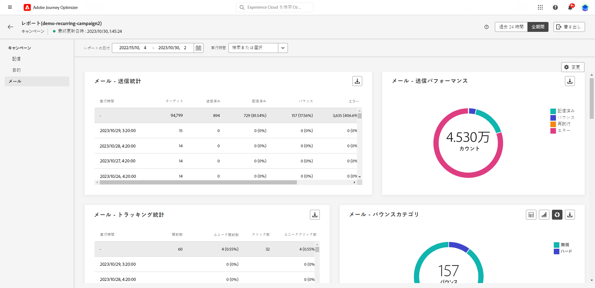
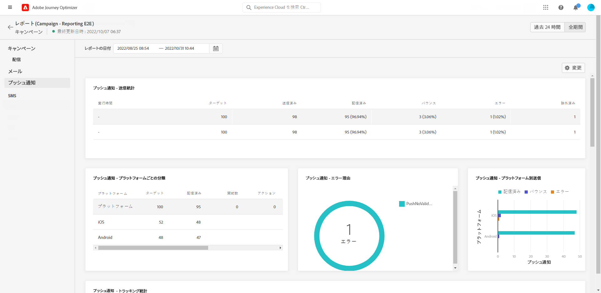
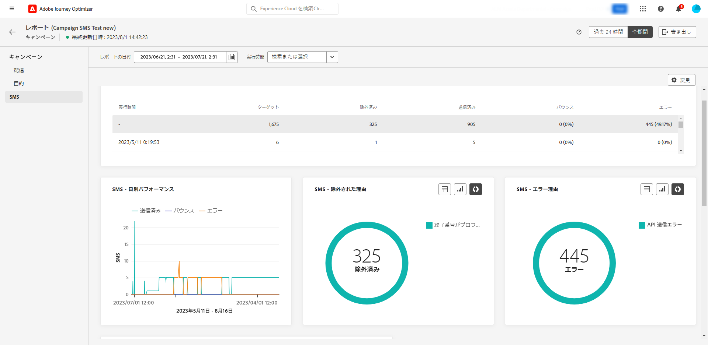

# キャンペーンのグローバルレポート {#campaign-global-report}

キャンペーンのグローバルレポートには、「**[!UICONTROL 全期間]**」ボタンを使用して、キャンペーンから直接アクセスできます。

キャンペーンの&#x200B;**[!UICONTROL グローバルレポート]**&#x200B;ページは次のタブで表示されます。

* [キャンペーン](#campaign-global)
* [メール](#email-global)
* [プッシュ](#push-global)
* [SMS](#sms-global)

キャンペーンの&#x200B;**[!UICONTROL グローバルレポート]**&#x200B;は、キャンペーンの成功とエラーの詳細を示す様々なウィジェットに分かれています。必要に応じて、各ウィジェットのサイズを変更したり削除したりできます。詳しくは、この[節](../reports/global-report.md#modify-dashboard)を参照してください。

Adobe Journey Optimizerで使用可能なすべての指標の詳細なリストについては、[このページ](global-report.md#list-of-components-global.md)を参照してください。

## 「キャンペーン」タブ {#campaign-global}

### 配信 {#delivery-global}

**[!UICONTROL キャンペーンの統計]**&#x200B;ウィジェットには、キャンペーンに関連する主な情報の詳細が表示されます。

* **[!UICONTROL エントリしたプロファイル]**：ジャーニーを開始したプロファイルの数。

* **[!UICONTROL 配信されたアクション]**：ジャーニー内のアクションが配信されたユニーク回数の合計。

* **[!UICONTROL アクションが % で失敗しました]**：アクションが配信されたユニーク回数の合計に対する、ジャーニーでアクションが失敗したユニーク回数の合計。

## 「メール」タブ {#email-global}

キャンペーンの&#x200B;**[!UICONTROL グローバルレポート]**&#x200B;の「**[!UICONTROL メール]**」タブには、キャンペーンで送信されるメール配信に関連する主な情報の詳細が表示されます。

+++メールレポートで使用できる様々な指標およびウィジェットについて詳しくは、こちらを参照してください。

**[!UICONTROL メール送信統計]**&#x200B;グラフは、成功した配信の詳細を示します。

* **[!UICONTROL ターゲット]**：配信の分析中に処理されたメッセージの合計数。

* **[!UICONTROL 送信済み]**：配信に対する送信の合計数。

* **[!UICONTROL 配信済み]**：送信されたメッセージの合計数に対して、正常に配達できたメッセージの数。

* **[!UICONTROL 配信率]**：正常に送信されたメッセージの割合。

* **[!UICONTROL バウンス]**：送信されたメッセージの総数に対して、配信と自動返信の処理中に発生したエラーの累計。

* **[!UICONTROL バウンス率]**：送信メールに対するバウンスメールの割合。

* **[!UICONTROL エラー]**：配信中に発生し、プロファイルへの送信の妨げとなったエラーの合計数。

* **[!UICONTROL エラー率]**：送信されたメールに対して、配信中にエラーが発生して送信できなかったメールの割合。

* **[!UICONTROL 再試行]**：再試行のキュー内のメール数。

* **[!UICONTROL 除外]**：Adobe Journey Optimizer によって除外されたプロファイルの数。

**[!UICONTROL メール - トラッキング統計情報]**&#x200B;のウィジェットには、配信の受信者アクティビティに使用できるデータが表示されます。

* **[!UICONTROL 開封数]**：配信でメッセージが開かれた回数。

* **[!UICONTROL ユニーク開封数]**：開封された配信の割合。

* **[!UICONTROL 開封率]**：配信されたメール数に対して、開封されたメールの合計数。

* **[!UICONTROL クリック数]**：メールのコンテンツがクリックされた回数。

* **[!UICONTROL ユニーククリック数]**：メールのコンテンツをクリックした受信者の数。

* **[!UICONTROL ユニーククリック率]**：配信に対してアクションを起こしたユーザーの割合。

* **[!UICONTROL 購読解除]** : 購読解除リンクのクリック数。

* **[!UICONTROL スパムのの苦情数]**：メッセージがスパムまたはジャンクとして宣言された回数。

**[!UICONTROL 送信統計情報]**&#x200B;グラフを使用すると、次のような送信済みメールに関するデータを確認できます。

* **[!UICONTROL 配信済み]**：送信されたメッセージの合計数に対して、正常に配達できたメッセージの数。

* **[!UICONTROL バウンス]**：送信されたメッセージの総数に対して、配信と自動返信の処理中に発生したエラーの累計。

* **[!UICONTROL 再試行]**：再試行のキュー内のメール数。

* **[!UICONTROL エラー]**：配信中に発生し、プロファイルへの送信の妨げとなったエラーの合計数。

**[!UICONTROL バウンスの理由]**&#x200B;ウィジェットおよび&#x200B;**[!UICONTROL バウンスのカテゴリ]**&#x200B;ウィジェットには、次のようなバウンスメッセージに関するデータが含まれています。

* **[!UICONTROL ハードバウンス]**：永続的なエラー（メールアドレスの間違いなど）の合計数。このエラーは、アドレスが無効であることを明示的に示すエラーメッセージ（例：「不明なユーザー」）を伴います。

* **[!UICONTROL ソフトバウンス数]**：一時的なエラー（インボックスが満杯など）の合計数。

* **[!UICONTROL 無視]**：一時的なエラー（不在など）や技術的なエラー（送信者のタイプが postmaster の場合など）の合計数。

バウンスの詳細については、[抑制リスト](../reports/suppression-list.md)のページを参照してください。

「**[!UICONTROL エラー理由]**」のグラフと表を使用すると、配信中に発生したエラーを確認できます。

この&#x200B;**[!UICONTROL 除外された理由]**&#x200B;グラフおよびテーブルには、ターゲットプロファイルから除外されたユーザープロファイルがメッセージを受信できなかった様々な理由が表示されます。

「**[!UICONTROL メール - 上位の URL]**」のグラフと表は、配信されたメールの中で最もアクセス頻度の高い URL の詳細を示しています。

「**[!UICONTROL メール - 上位の受信者ドメイン]**」のグラフと表は、受信者が電子メールを開くために最も多く使用しているドメインの詳細を示しています。

>[!NOTE]
>
>この&#x200B;**[!UICONTROL 最適化済みと最適化されていない]**&#x200B;および&#x200B;**[!UICONTROL 送信時間の最適化]**&#x200B;ウィジェットは、配信で「送信時間の最適化」オプションが有効になっている場合にのみ使用できます。送信時間の最適化について詳しくは、[このページ](../messages/send-time-optimization.md)を参照してください。

この&#x200B;**[!UICONTROL 最適化済みと最適化されていない]**&#x200B;グラフは、メッセージが最適化されているかどうかに関する主な情報の詳細を示します。

* **[!UICONTROL 送信済み]**：配信に対する送信の合計数。
* **[!UICONTROL 開封数]**：配信でメッセージが開かれた回数。
* **[!UICONTROL クリック数]**：メールのコンテンツがクリックされた回数。

この&#x200B;**[!UICONTROL 送信時間の最適化]**&#x200B;は、送信方法（最適化または標準）に応じて、配信の成功を詳細に示します。

* **[!UICONTROL 配信済み]**：送信されたメッセージの合計数に対して、正常に配達できたメッセージの数。
* **[!UICONTROL バウンス]**：送信されたメッセージの総数に対して、配信と自動返信の処理中に発生したエラーの累計。
+++

## 「プッシュ通知」タブ {#push-global}

キャンペーンの&#x200B;**[!UICONTROL グローバルレポート]**&#x200B;の「**[!UICONTROL プッシュ通知]**」タブには、キャンペーンで送信されたプッシュ配信に関する主な情報が詳しく表示されます。

+++プッシュレポートで使用できる様々な指標およびウィジェットの詳細を説明します。

「**[!UICONTROL プッシュ通知 - 送信統計]**」テーブルは、プッシュ通知に関連するメイン情報の詳細をグラフと KPI で示します。

* **[!UICONTROL ターゲット]**：配信の分析中に処理されたメッセージの合計数。

* **[!UICONTROL 送信済み]**：配信に対する送信の合計数。

* **[!UICONTROL 配信済み]**：送信されたメッセージの合計数に対して、正常に配達できたメッセージの数。

* **[!UICONTROL 配信率]**：正常に送信されたメッセージの割合。

* **[!UICONTROL バウンス]**：送信されたメッセージの総数に対して、配信と自動返信の処理中に発生したエラーの累計。

* **[!UICONTROL バウンス率]**：送信されたプッシュ通知と比較した、バウンスしたプッシュ通知の割合。

* **[!UICONTROL エラー]**：配信中に発生し、プロファイルへの送信の妨げとなったエラーの合計数。

* **[!UICONTROL エラー率]**：送信されたプッシュ通知と比較した、配信中に発生した送信を妨げるエラーの割合。

* **[!UICONTROL 除外]**：Adobe Journey Optimizer によって除外されたプロファイルの数。

「**[!UICONTROL プッシュ - トラッキング統計]**」には、配信の受信者アクティビティに使用できるデータが含まれます。

* **[!UICONTROL 開封数]**：配信でメッセージが開封された回数。

* **[!UICONTROL 開封率]**：開封されたプッシュ通知の割合。

* **[!UICONTROL アクション]**：配信されたプッシュ通知に対するアクション（ボタンのクリックや解除など）の合計数。

* **[!UICONTROL エンゲージメント]**：このプッシュ通知に対する開封数とアクション数（「プロファイルがプッシュを開封した」、「ボタンがクリックされた」など）の合計。

* **[!UICONTROL エンゲージメント率]**：このプッシュ通知の開封とアクションの割合（プロファイルによるプッシュの開封や、ボタンのクリックなど）。

「**[!UICONTROL プッシュ通知の概要]**」グラフには、次のような送信済みプッシュ通知に使用できるデータが含まれています。

* **[!UICONTROL 開封数]**：配信でメッセージが開封された回数。

* **[!UICONTROL アクション]**：配信されたプッシュ通知に対するアクション（ボタンのクリックや解除など）の合計数。

* **[!UICONTROL バウンス]**：送信されたメッセージの総数に対して、配信と自動返信の処理中に発生したエラーの累計。

* **[!UICONTROL 配信済み]**：送信されたメッセージの合計数に対して、正常に配達できたメッセージの数。

* **[!UICONTROL エラー]**：配信中に発生し、プロファイルへの送信の妨げとなったエラーの合計数。

>[!NOTE]
>
>この&#x200B;**[!UICONTROL 最適化済みと最適化されていない]**&#x200B;および&#x200B;**[!UICONTROL 送信時間の最適化]**&#x200B;ウィジェットは、配信で「送信時間の最適化」オプションが有効になっている場合にのみ使用できます。送信時間の最適化について詳しくは、[このページ](../messages/send-time-optimization.md)を参照してください。

この&#x200B;**[!UICONTROL 最適化済みと最適化されていない]**&#x200B;グラフは、メッセージが最適化されているかどうかに関する主な情報の詳細を示します。

* **[!UICONTROL 配信済み]**：送信されたメッセージの合計数に対して、正常に配達できたメッセージの数。
* **[!UICONTROL 開封数]**：配信でメッセージが開かれた回数。
* **[!UICONTROL アクション]**：配信されたプッシュ通知に対するアクション（ボタンのクリックや解除など）の合計数。

この&#x200B;**[!UICONTROL 送信時間の最適化]**&#x200B;は、送信方法（最適化または標準）に応じて、配信の成功を詳細に示します。

* **[!UICONTROL 配信済み]**：送信されたメッセージの合計数に対して、正常に配達できたメッセージの数。
* **[!UICONTROL バウンス]**：送信されたメッセージの総数に対して、配信と自動返信の処理中に発生したエラーの累計。

「**[!UICONTROL エラー理由]**」のグラフと表を使用すると、配信中に発生したエラーを確認できます。

この&#x200B;**[!UICONTROL 除外された理由]**&#x200B;グラフおよびテーブルには、ターゲットプロファイルから除外されたユーザープロファイルがメッセージを受信できなかった様々な理由が表示されます。

**[!UICONTROL プラットフォームごとのトラッキング]**、**[!UICONTROL プラットフォームごとの送信]**、**[!UICONTROL プラットフォームごとの分類]**のグラフとテーブルには、オペレーティングシステムに応じたプッシュ通知の成功の詳細が表示されます。
+++

## 「SMS」タブ {#sms-global}

キャンペーンの&#x200B;**[!UICONTROL グローバルレポート]**&#x200B;の「**[!UICONTROL SMS]**」タブには、キャンペーンで送信された SMS 配信に関する主な情報が詳しく表示されます。

+++SMS レポートで使用できる様々な指標およびウィジェットの詳細を説明します。

**[!UICONTROL SMS - 送信統計]**&#x200B;テーブルは、配信の成功の詳細を示します。

* **[!UICONTROL ターゲット]** : この配信のターゲットプロファイルとして認定されるユーザープロファイルの数。

* **[!UICONTROL 除外]** : ターゲットプロファイルから除外されメッセージを受信しなかったユーザープロファイルの数。

* **[!UICONTROL 送信済み]**：配信用に送信した合計数。

* **[!UICONTROL 配信済み]**：送信されたメッセージの合計数に対して、正常に配達できたメッセージの数。

* **[!UICONTROL バウンス]**：送信されたメッセージの総数に対して、配信と自動返信の処理中に発生したエラーの累計。

* **[!UICONTROL エラー]**：配信中に発生し、プロファイルへの送信の妨げとなったエラーの合計数。

**[!UICONTROL SMS の日別パフォーマンス]**&#x200B;ウィジェットは、メッセージに関連する主な情報の詳細をグラフで表示します。

* **[!UICONTROL 送信済み]**：配信に対する送信の合計数。

* **[!UICONTROL 配信済み]**：送信されたメッセージの合計数に対して、正常に配達できたメッセージの数。

* **[!UICONTROL バウンス]**：送信されたメッセージの総数に対して、配信と自動返信の処理中に発生したエラーの累計。

* **[!UICONTROL エラー]**：配信中に発生し、プロファイルへの送信の妨げとなったエラーの合計数。

**[!UICONTROL 除外された理由]**、**[!UICONTROL バウンスの理由]**&#x200B;および&#x200B;**[!UICONTROL エラーの理由]**のグラフとテーブルを使用すると、配信中に発生したエラーと除外を確認できます。
+++

## その他のリソース

* [キャンペーンの基本を学ぶ](../campaigns/get-started-with-campaigns.md)
* [キャンペーンの作成](../campaigns/create-campaign.md)
* [API トリガーキャンペーンの作成](../campaigns/api-triggered-campaigns.md)
* [キャンペーンの変更または停止](../campaigns/modify-stop-campaign.md)
* [キャンペーンのライブレポート](campaign-live-report.md)
