# キャンペーンのグローバルレポート {#campaign-global-report}

>[!CONTEXTUALHELP]
>id="ajo_campaign_global_report"
>title="キャンペーンのグローバルレポート"
>abstract="キャンペーンのグローバルレポートを使用すると、選択した期間におけるキャンペーンの効果を測定できます。 レポートは、キャンペーンの成功とエラーの詳細を示す様々なウィジェットに分かれています。各レポートダッシュボードは、ウィジェットのサイズ変更や削除を行うことで変更できます。"

>[!AVAILABILITY]
>
>現在のレポートエクスペリエンスは、10 月リリースの時点で廃止されます。 この日以降、新しいレポートエクスペリエンスが標準となります。 スムーズな移行を確実に行うために、新機能を理解しておくことをお勧めします。 [Journey Optimizerの新しいレポートインターフェイスの概要 ](report-gs-cja.md)

「**全期間**」タブからアクセスできるグローバルレポートには、少なくとも 2 時間前に発生したイベントと、選択した期間のイベントが表示されます。これに対し、ライブレポートには、過去 24 時間以内に発生したイベントが焦点となり、イベント発生から最小 2 分の時間間隔で表示されます。

キャンペーンのグローバルレポートへは、「**[!UICONTROL レポートを表示]**」ボタンを使用して、キャンペーンから直接アクセスできます。

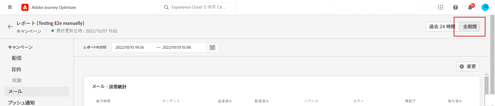

キャンペーンの&#x200B;**[!UICONTROL グローバルレポート]**&#x200B;ページは次のタブで表示されます。

* [キャンペーン](#campaign-global)
* [メール](#email-global)
* [アプリ内](#inapp-global)
* [プッシュ](#push-global)
* [SMS](#sms-global)
* [Web](#web-tab)
* [ダイレクトメール](#direct-mail-global)

キャンペーンの&#x200B;**[!UICONTROL グローバルレポート]**&#x200B;は、キャンペーンの成功とエラーの詳細を示す様々なウィジェットに分かれています。必要に応じて、各ウィジェットのサイズを変更したり削除したりできます。詳しくは、この[節](../reports/global-report.md#modify-dashboard)を参照してください。

Adobe Journey Optimizerで使用可能なすべての指標の詳細なリストについては、[このページ](global-report.md#list-of-components-global.md)を参照してください。

## 「キャンペーン」タブ {#campaign-global}

### 配信 {#delivery-global}

>[!CONTEXTUALHELP]
>id="ajo_campaign_delivery_global"
>title="キャンペーンの統計"
>abstract="キャンペーンの統計ウィジェットには、入力したプロファイルや配信したアクションなど、キャンペーンに関連する主な情報の詳細が表示されます。"

**[!UICONTROL キャンペーンの統計]**&#x200B;の KPI は、包括的なダッシュボードとして機能し、キャンペーンに関連する主要指標の詳細な分類を提供します。これには、配信されたプロファイル数やアクション数など、キャンペーンのパフォーマンスとエンゲージメントを完全に把握できる重要な情報が含まれます。

+++ キャンペーンの統計指標の詳細情報

* **[!UICONTROL オーディエンス]**：ターゲットプロファイルの数。

* **[!UICONTROL 配信済みアクション]**：アクションが配信されたユニーク回数の合計数。

* **[!UICONTROL アクション失敗率]**：アクションが配信されたユニーク回数の合計に対する、アクションが失敗したユニーク回数の割合。

+++

<!--
### Objectives report {#objectives-global}

The **[!UICONTROL Objectives]** tab allows you to better fine-tune your deliveries' reports by targeting one specific metric.

The **[!UICONTROL Objectives]** listed are linked to **[!UICONTROL Datasets]** that define a connection to a system in order to retrieve additional information. A list of built-in **[!UICONTROL Objectives]** is available but you can add your own by adding new **[!UICONTROL Dataset]**. For the detailed procedure, refer to this [section](../content-management/reporting-configuration.md).

After selecting the Objectives you want to target on, the two **[!UICONTROL Performance overview]** and **[!UICONTROL Campaign objective]** widgets will provide a detailed summary of your delivery performance. 

With the **[!UICONTROL Campaign objective]** widget, you can also choose to compare your main objective with another metric.
-->

### 実験レポート {#experimentation-global}

>[!CONTEXTUALHELP]
>id="ajo_campaigns_content_experiment_click"
>title="成功指標"
>abstract="実験の作成時に以前に選択した成功指標の合計値を、プロファイル数で割った値です。"

「**[!UICONTROL 実験]**」タブには、各バリアントのパフォーマンスに関する主要なインサイトが表示され、最も成功したものを特定します。

最もパフォーマンスの高い処理の判定には時間がかかる場合があり、このアイコン  が表示されます。

+++実験レポートで使用できる様々な指標およびウィジェットの詳細を説明します。

**[!UICONTROL 実験結果]**&#x200B;ウィジェットは、各バリアントのパフォーマンスの詳細を説明します。ベースラインを変更するには、**[!UICONTROL ベースライン]**&#x200B;ドロップダウンから処理の 1 つを選択します。最も優れた処理には、星のアイコンが表示されます。

これらの結果の詳細と解釈について詳しくは、[このページ](../content-management/get-started-experiment.md#interpret-results)を参照してください。

このテーブルは、次の指標を表しています。

* **[!UICONTROL ベースライン上の上昇率]**：ベースラインに対する特定の処理のコンバージョン率の向上率を測定します。

* **[!UICONTROL 信頼性]**：ある処理がベースライン処理と同じであることを示す証拠。[詳細情報](../content-management/experiment-calculations.md#understand-confidence)

* **[!UICONTROL ユニークアウトバウンドクリック数]**：アウトバウンドチャネルでのクリック総数。

* **[!UICONTROL プロファイル]**：この処理の対象となるプロファイルの数。

* **[!UICONTROL ユニークアウトバウンドクリック数／プロファイル数]**：実験の作成時に以前に選択した成功指標の合計値を、プロファイル数で割った値です。

**[!UICONTROL 信頼区間]**&#x200B;グラフは、改善に関する不確実性を測定します。ベースラインと最もパフォーマンスの高い処理との間のパフォーマンス差の割合を詳細に示します。[詳細情報](../content-management/experiment-calculations.md#confidence-intervals)

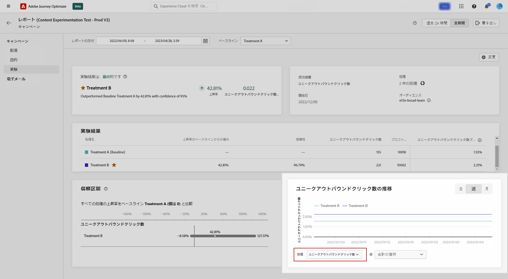

最後のウィジェットは、以前に処理用に選択した&#x200B;**[!UICONTROL 成功指標]**&#x200B;に関連するデータを提供します。**[!UICONTROL 指標]**&#x200B;ドロップダウンメニューから別のターゲット指標を選択して、代替データを追跡することもできます。

>[!CAUTION]
>
>実験でフィルタリングされた指標を使用する場合は、実験の比較ページのドロップダウンから指標の選択を変更すると、フィルター値が保持されないことに注意してください。例えば、「クリック数」から「ユニーククリック数」に切り替えると、適用されたフィルターが失われ、比較が不正確または無効になります。

+++

## 「メール」タブ {#email-global}

### メール - 送信統計 {#sending-statistics-email}

>[!CONTEXTUALHELP]
>id="ajo_campaign_global_email_sending_statistics"
>title="メール - 送信統計"
>abstract="メール - 送信統計テーブルは、ターゲットや配信など、メールに関する重要なデータを要約します。"

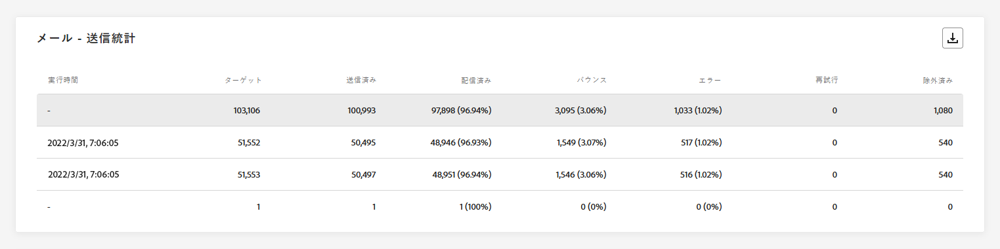

**[!UICONTROL メール送信統計]**&#x200B;のテーブルは、メールキャンペーンに関する重要なデータの包括的な概要を示します。ターゲットオーディエンスのサイズや正常に配信されたメールの数などの主要指標の詳細を説明し、メールの効果とリーチに関する有益なインサイトを提供します。

+++ メール送信統計の指標の詳細情報

* **[!UICONTROL ターゲット]**：送信プロセス中に処理されたメールの合計数。

* **[!UICONTROL 送信済み]**：メールの送信の合計数。

* **[!UICONTROL 配信済み]**：送信されたメッセージの総数に対する、正常に送信されたメッセージの数。

* **[!UICONTROL 配信率]**：正常に送信されたメッセージの割合。

* **[!UICONTROL バウンス数]**：送信されたメッセージの合計数に対して、送信プロセスおよび自動返信処理の間に累積したエラーの合計数。

* **[!UICONTROL バウンス率]**：送信メールに対するバウンスメールの割合。

* **[!UICONTROL エラー]**：送信プロセス中に発生し、プロファイルへの送信の妨げとなったエラーの合計数。

* **[!UICONTROL エラー率]**：送信されたメールに対して、送信プロセス中にエラーが発生して送信できなかったメールの割合。

* **[!UICONTROL 再試行]**：再試行のキュー内のメール数。

* **[!UICONTROL 除外済み]**：Adobe Journey Optimizer によって除外されたプロファイルの数。

+++

### メール - トラッキング統計 {#tracking-statistics-email}

>[!CONTEXTUALHELP]
>id="ajo_campaign_global_email_tracking_statistics"
>title="メール - トラッキング統計"
>abstract="メール - トラッキング統計テーブルには、メールのプロファイルアクティビティに関するデータが表示されます。"

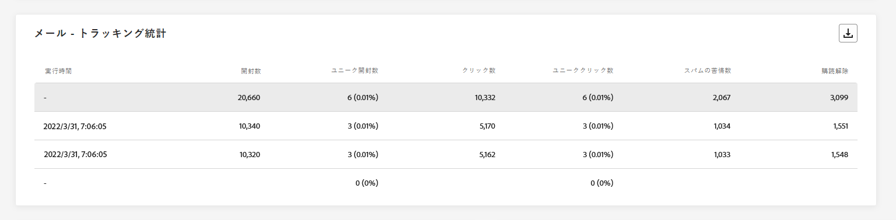

**[!UICONTROL メール - トラッキング統計]**&#x200B;のテーブルには、メールキャンペーンに関連するプロファイルアクティビティの詳細な説明が表示されます。これには、開封数、クリック数、その他の関連するエンゲージメント指標など、プロファイルがメールコンテンツとどのようにやり取りするかを包括的に示す指標が含まれます。

+++ メール - トラッキング統計指標の詳細情報

* **[!UICONTROL 開封数]**：メールが開封された回数。

* **[!UICONTROL ユニーク開封数]**：開封されたメールのパーセンテージ。

* **[!UICONTROL 開封率]**：配信されたメール数に対して、開封されたメールの合計数。

* **[!UICONTROL クリック数]**：メールでコンテンツがクリックされた回数。

* **[!UICONTROL ユニーククリック数]**：メールでコンテンツをクリックしたプロファイルの数。

* **[!UICONTROL ユニーククリック率]**：メールでやり取りを行ったユーザーの割合。

* **[!UICONTROL 購読解除]** : 購読解除リンクのクリック数。

* **[!UICONTROL スパムのの苦情数]**：メッセージがスパムまたはジャンクとして宣言された回数。

+++

### メール - 送信パフォーマンス {#sending-performance-email}

>[!CONTEXTUALHELP]
>id="ajo_campaign_global_email_sending_performance"
>title="メール - 送信パフォーマンス"
>abstract="メール - 送信パフォーマンスのグラフでは、送信されたメールに関する包括的なデータが表示され、配信やバウンスなどの主要指標に関するインサイトを提供し、メール配信プロセスを詳細に分析できます。"

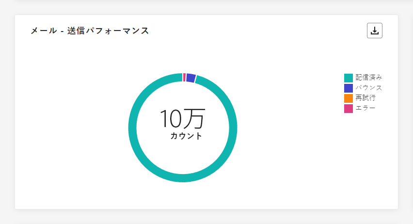

**[!UICONTROL メール - 送信パフォーマンス]**&#x200B;のグラフは、送信されたメールに関連するデータの包括的な見解を提供し、配信やバウンスなどの主要指標に関するインサイトを提供します。これにより、メール送信プロセスの詳細な分析が可能になり、メールキャンペーンの効率とパフォーマンスに関する重要な情報が提供されます。

+++ メール - 送信パフォーマンス指標の詳細情報

* **[!UICONTROL 配信済み]**：送信されたメッセージの合計数に対する、正常に送信されたメッセージの数。

* **[!UICONTROL バウンス数]**：送信されたメールの合計数に対して、送信プロセス中および自動返信処理中に累積したエラーの合計数。

* **[!UICONTROL 再試行]**：再試行のキュー内のメール数。

* **[!UICONTROL エラー]**：送信プロセス中に発生し、プロファイルへの送信の妨げとなったエラーの合計数。

+++

### メール - バウンスの理由とカテゴリ {#bounces-email}

>[!CONTEXTUALHELP]
>id="ajo_campaign_global_email_bounce_categories"
>title="メール - バウンスカテゴリ"
>abstract="メール - バウンスカテゴリのグラフとテーブルには、一時的なエラーと永続的なエラーの両方に関するデータが表示されます。"

>[!CONTEXTUALHELP]
>id="ajo_campaign_global_email_bounce_reasons"
>title="メール - バウンス理由"
>abstract="メール - バウンス理由のグラフとテーブルには、バウンスされたメッセージに関連して使用可能なデータが含まれます。"

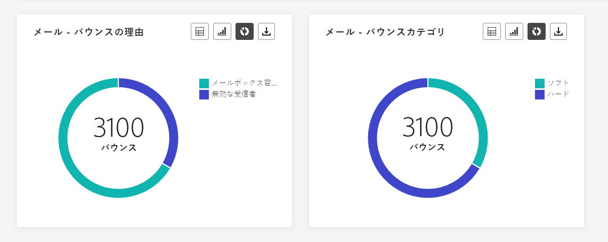

**[!UICONTROL メール - バウンスの理由]**&#x200B;および&#x200B;**[!UICONTROL メール - バウンスのカテゴリ]**&#x200B;のウィジェットは、バウンスメッセージに関連する使用可能なデータを集計し、メールバウンスの背後にある特定の理由とカテゴリに関する詳細なインサイトを提供します。

バウンスについて詳しくは、[抑制リスト](../reports/suppression-list.md)のページを参照してください。

+++ メール - バウンスカテゴリ指標の詳細情報

* **[!UICONTROL ハードバウンス]**：永続的なエラー（メールアドレスの間違いなど）の合計数。このエラーは、アドレスが無効であることを明示的に示すエラーメッセージ（例：「不明なユーザー」）を伴います。

* **[!UICONTROL ソフトバウンス数]**：一時的なエラー（インボックスが満杯など）の合計数。

* **[!UICONTROL 無視]**：一時的なエラー（不在など）や技術的なエラー（送信者のタイプが postmaster の場合など）の合計数。

+++

### メール - エラー理由 {#errors-email}

>[!CONTEXTUALHELP]
>id="ajo_campaign_global_email_error_reasons"
>title="メール - エラー理由"
>abstract="メール - エラー理由のグラフとテーブルを使用すると、送信プロセス中に発生した特定のエラーを識別できます。"

**[!UICONTROL エラーの理由]**&#x200B;のグラフとテーブルには、送信プロセス中に発生した特定のエラーを表示し、エラーの特性と発生に関する貴重な情報を提供します。

テーブル、棒グラフまたは円グラフに切り替えることができます。

### メール - 除外された理由 {#excluded-email}

>[!CONTEXTUALHELP]
>id="ajo_campaign_global_email_excluded_reasons"
>title="メール - 除外された理由"
>abstract="この除外された理由のグラフとテーブルには、ユーザープロファイルがターゲットオーディエンスから除外され、メッセージが受信されない原因となった様々な要因が表示されます。"

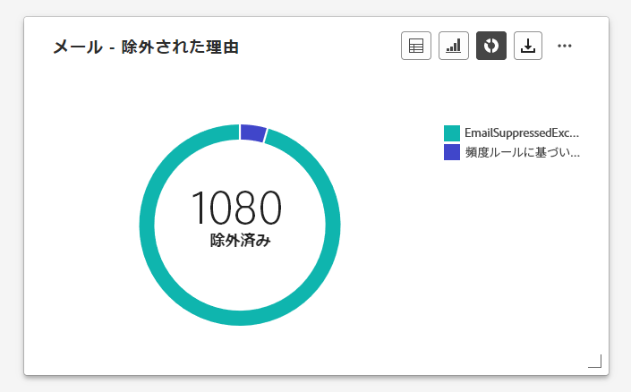

**[!UICONTROL 除外理由]**&#x200B;のグラフとテーブルは、ターゲットのオーディエンスからユーザープロファイルを除外した結果、メッセージを受信できない原因となった様々な要因の包括的なビューを示します。

除外理由の包括的なリストについては、[このページ](exclusion-list.md)を参照してください。

### ドメイン別に送信および配信 {#sent-domains}

>[!CONTEXTUALHELP]
>id="ajo_campaign_global_email_sent_domains"
>title="ドメイン別に送信および配信"
>abstract="ドメイン別に送信および配信のテーブルとグラフは、ドメイン別に分類されたメールの分類を提供し、メール通信の全体的なパフォーマンスに関する詳細なインサイトを提供します。"

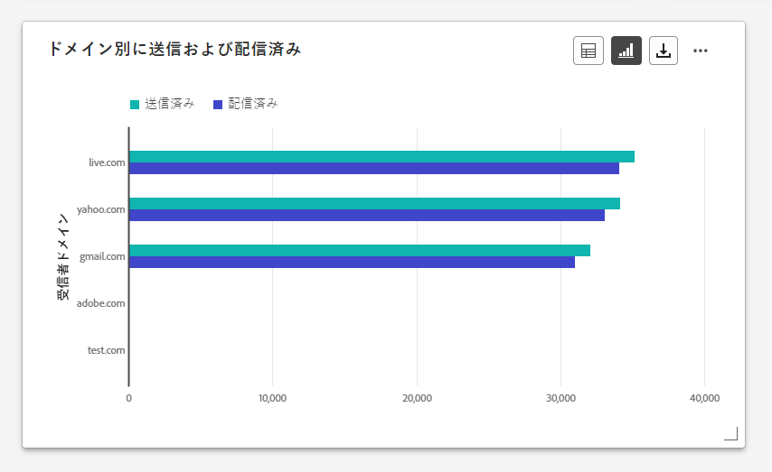

**[!UICONTROL ドメイン別に送信および配信]**&#x200B;のテーブルとグラフは、ドメインレベルでのメールの詳細な分類を表示し、メールのパフォーマンスに関する包括的なインサイトを提供します。

+++ ドメイン別に送信および配信指標の詳細情報

* **[!UICONTROL 送信済み]**：メールの送信の合計数。

* **[!UICONTROL 配信済み]**：送信されたメッセージの合計数に対する、正常に送信されたメッセージの数。

+++

### ドメイン別バウンス数とエラー数 {#bounces-domains}

>[!CONTEXTUALHELP]
>id="ajo_campaign_global_email_bounces_domains"
>title="ドメイン別バウンス数とエラー数"
>abstract="ドメイン別バウンス数とエラー数のグラフとテーブルは、ドメインレベルでの詳細な分類を示し、メールの送信プロセス中に発生した特定のエラーに関するインサイトを提供します。"

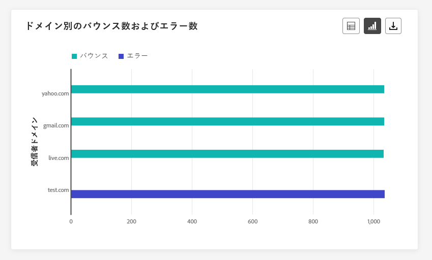

**[!UICONTROL ドメイン別のバウンス数およびエラー数]**&#x200B;のグラフとテーブルには、送信プロセス中に発生した特定のエラーのドメインレベルでの分類が表示され、発生した問題を詳しく分析できます。

+++ ドメイン別のバウンス数およびエラー数指標の詳細情報

* **[!UICONTROL バウンス数]**：送信メールの合計数に対する、送信プロセス中および自動返信処理中に累積したエラーの合計数。

* **[!UICONTROL エラー数]**：送信プロセス中に発生し、プロファイルにメールを送信できない原因となったエラーの合計数。

+++

### ドメイン別の開封数およびクリック数 {#opens-domains}

>[!CONTEXTUALHELP]
>id="ajo_campaign_global_email_open_domains"
>title="ドメイン別の開封数およびクリック数"
>abstract="ドメイン別の開封数およびクリック数のテーブルとグラフは、ドメインレベルで詳細な分類を提供し、オーディエンスがメールとどのようにやり取りするかを包括的に示します。"

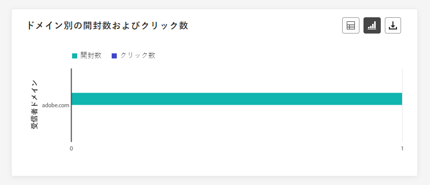

**[!UICONTROL ドメイン別の開封数およびクリック数]**&#x200B;のグラフとテーブルでは、プロファイルのメールに対するエンゲージメントのドメインレベルの分類を示し、様々なドメインがコンテンツとどのようにやり取りするかに関する有益なインサイトを提供します。

+++ ドメイン別の開封数およびクリック数指標の詳細情報

* **[!UICONTROL 開封数]**：メールが開封された回数。

* **[!UICONTROL クリック数]**：メールのコンテンツがクリックされた回数。

+++

### ドメイン別のバウンス理由 {#bounce-reasons-domains}

>[!CONTEXTUALHELP]
>id="ajo_campaign_global_email_bounces_reasons_domains"
>title="ドメイン別のバウンス理由"
>abstract="ドメイン別のバウンス理由のグラフとテーブルは、ドメインレベルでの分類を示し、一時的なエラーと永続的なエラーの両方に関する包括的なインサイトを提供します。この詳細な分析では、バウンスメッセージの原因に関する貴重な情報を提供します。"

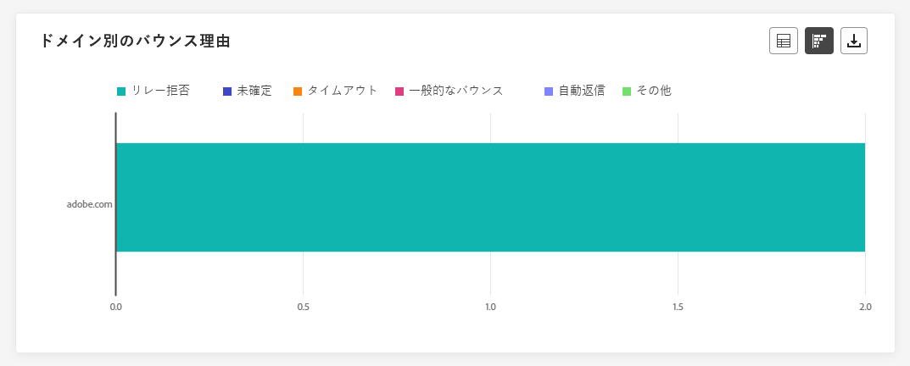

**[!UICONTROL ドメイン別バウンス理由]**&#x200B;のグラフとテーブルでは、一時的なエラーと永続的なエラーの両方に関するデータをドメインレベルで分類し、バウンスメッセージの原因に関する詳細なインサイトを提供します。

+++ ドメイン別のバウンス理由の詳細情報

* **[!UICONTROL 開封数]**：メールが開封された回数。

* **[!UICONTROL クリック数]**：メールのコンテンツがクリックされた回数。

+++

### メール - 上位 URL {#top-url-email}

>[!CONTEXTUALHELP]
>id="ajo_campaign_global_email_top_url"
>title="メール - 上位 URL"
>abstract="メール - 上位 URL のグラフとテーブルには、訪問者のトラフィックが最も多いメール内の URL の包括的な概要が表示され、一番人気のあるリンクを特定できます。"

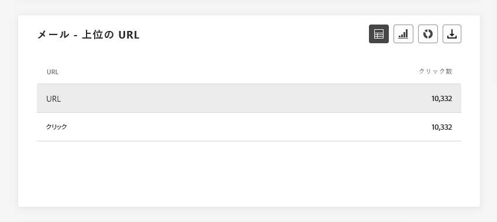

**[!UICONTROL メール - 上位 URL]** のグラフとテーブルは、メール内で最も多くの訪問者トラフィックを集めている URL の包括的な概要を提供します。これにより、最も人気のあるリンクを特定し、優先順位を付けることができ、メール内の特定のコンテンツに対するプロファイルのエンゲージメントをより深く理解することができます。

### メール - 最適な受信者ドメイン {#top-recipient-email}

>[!CONTEXTUALHELP]
>id="ajo_campaign_global_email_best_recipient"
>title="メール - 最適な受信者ドメイン"
>abstract="メール - 最適な受信者ドメインのグラフとテーブルには、受信者がメールを開くために最も頻繁に使用するドメインの詳細な分類が表示され、受信者の行動に関する貴重なインサイトが得られます。"

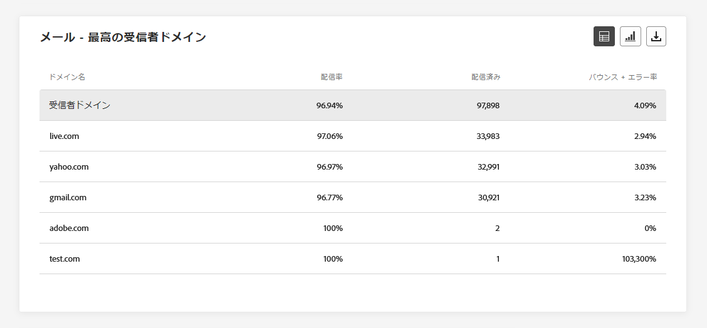

>[!CAUTION]
>
> **[!UICONTROL メール - 最適な受信者ドメイン]**&#x200B;ウィジェットの正解率は 99.95％です。

**[!UICONTROL メール - 最適な受信者ドメイン]**&#x200B;のグラフとテーブルには、プロファイルがメールを開く際に最も頻繁に使用するドメインの詳細な分類が表示されます。これにより、プロファイルの行動に関する重要なインサイトが得られ、好まれるプラットフォームを理解するのに役立ちます。

+++ メール - 最適な受信者ドメイン指標の詳細情報

* **[!UICONTROL 配信済み]**：送信されたメッセージの合計数に対する、正常に送信されたメッセージの数。

* **[!UICONTROL 配信率]**：正常に送信されたメッセージの割合。

* **[!UICONTROL バウンス数とエラー率]**：送信メール数に対するバウンスメール数の割合。

+++

### メール - 最適化 {#optimized-email}

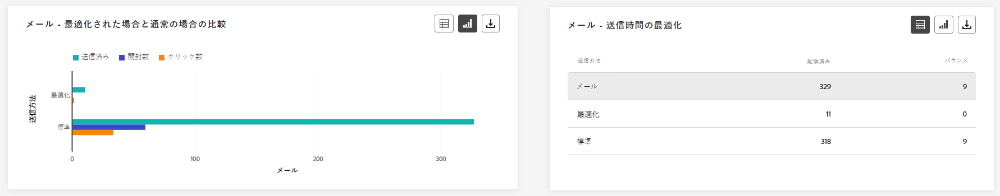

>[!NOTE]
>
>**[!UICONTROL 最適化と非最適化の比較]**&#x200B;ウィジェットと&#x200B;**[!UICONTROL 送信時間の最適化]**&#x200B;ウィジェットは、メールの「送信時間の最適化」オプションがアクティブ化されている場合にのみ使用できます。送信時間の最適化について詳しくは、[このページ](../building-journeys/journeys-message.md#send-time-optimization)を参照してください。

**[!UICONTROL 最適化と非最適化の比較]**&#x200B;および&#x200B;**[!UICONTROL 送信時間の最適化]**&#x200B;ウィジェットでは、メッセージが最適化されているかどうかに関係なく、メッセージに関する主な情報が詳しく表示されます。

+++ 送信時間の最適化指標の詳細情報

* **[!UICONTROL 送信済み]**：送信の合計数。

* **[!UICONTROL 開封数]**：メッセージが開封された回数。

* **[!UICONTROL クリック数]**：メールのコンテンツがクリックされた回数。

* **[!UICONTROL 配信済み]**：送信されたメッセージの合計数に対して、正常に配達できたメッセージの数。

* **[!UICONTROL バウンス数]**：送信されたメッセージの合計数に対して、送信プロセスおよび自動返信処理の間に累積したエラーの合計数。

+++

### メール - オファー {#email-offers}

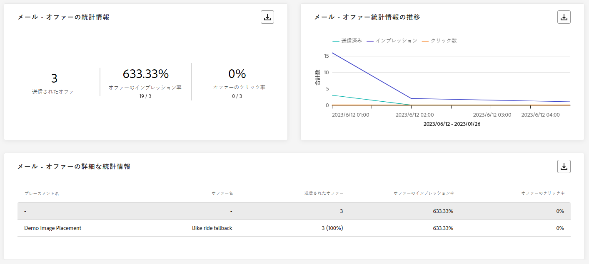

**[!UICONTROL オファー統計]**&#x200B;ウィジェット、**[!UICONTROL オファー統計の推移]**&#x200B;ウィジェット、**[!UICONTROL オファー詳細統計]**&#x200B;ウィジェットは、ターゲットのオーディエンスへのオファーの成功と影響を測定します。

+++ メール - オファー指標の詳細情報

* **[!UICONTROL 送信されたオファー]**：オファーの送信の合計数。

* **[!UICONTROL オファーのインプレッション]**：メールのオファーが開封された回数。

* **[!UICONTROL オファーのクリック数]**：メールのオファーがクリックされた回数。

* **[!UICONTROL プレースメント名]**：オファーを表示するために使用するプレースメントの名前。プレースメントについて詳しくは、この[ページ](../offers/offer-library/creating-placements.md)を参照してください。

* **[!UICONTROL オファー名]**：配信に追加されたオファーの名前。プレースメントについて詳しくは、この[ページ](../offers/offer-library/creating-personalized-offers.md)を参照してください。

* **[!UICONTROL 送信されたオファー]**：オファーの送信の総数。

* **[!UICONTROL オファーのインプレッション率]**：送信されたオファーの数に対する、開封されたオファーの割合。

+++

## 「アプリ内」タブ {#inapp-global}

キャンペーンの&#x200B;**[!UICONTROL グローバル レポート]**&#x200B;の「**[!UICONTROL アプリ内]**」タブには、キャンペーンで送信されたアプリ内メッセージに関する主な情報が詳しく表示されます。

### アプリ内パフォーマンス {#in-app-performance}

>[!CONTEXTUALHELP]
>id="ajo_campaign_global_inapp_performance"
>title="アプリ内パフォーマンス"
>abstract="アプリ内パフォーマンス KPI は、アプリ内メッセージに対する訪問者のエンゲージメントに関する重要なインサイトを提供します。"

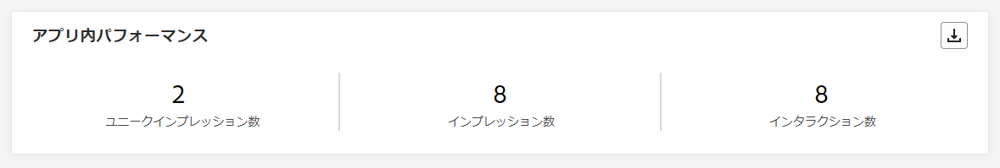

**[!UICONTROL アプリ内パフォーマンス]** KPI は、アプリ内メッセージへの訪問者のエンゲージメントについて重要なインサイトを提供し、アプリ内キャンペーンの有効性と影響を評価するための重要な指標を提供します。

+++ アプリ内パフォーマンス指標の詳細情報

* **[!UICONTROL ユニークインプレッション数]**：アプリ内メッセージが配信されたユニークユーザーの数。

* **[!UICONTROL インプレッション数]**：すべてのユーザーに配信されたアプリ内メッセージの合計数。

* **[!UICONTROL インタラクション数]**：アプリ内メッセージとのエンゲージメントの合計数。これには、クリック、解除またはその他のやり取りなど、ユーザーが実行したすべてのアクションが含まれます。

+++

### タイプ別インタラクション数 {#interactions-type}

>[!CONTEXTUALHELP]
>id="ajo_campaign_global_inapp_interactions"
>title="タイプ別インタラクション数"
>abstract="タイプ別インタラクション数グラフと表は、クリック、破棄、インタラクションを追跡して、ユーザーがアプリ内メッセージに対してどのような操作をしたかを示します。"

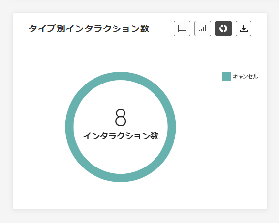

**[!UICONTROL タイプ別のインタラクション数]**&#x200B;のグラフとテーブルは、クリック、解除またはその他のエンゲージメントなどのアクションを追跡し、プロファイルがアプリ内メッセージでどのようなやり取りを行ったかに関する詳細な説明を提供します。

### アプリ内の概要 {#in-app-summary}

>[!CONTEXTUALHELP]
>id="ajo_campaign_global_inapp_summary"
>title="アプリ内の概要"
>abstract="アプリの内概要グラフは、指定した期間におけるアプリ内のインプレッション数とインタラクション数の進行状況を示します。"

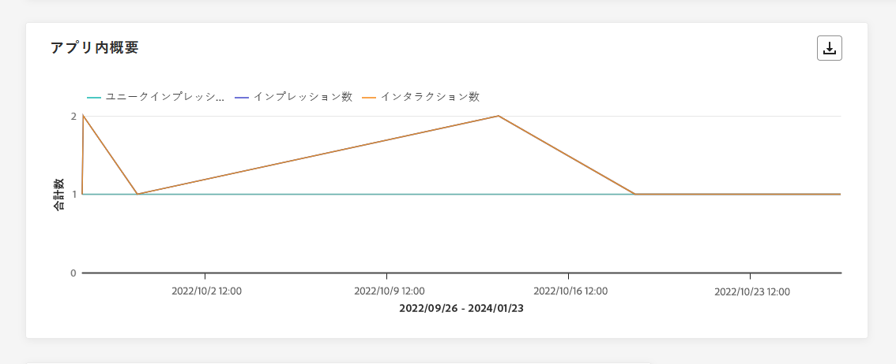

**[!UICONTROL アプリ内の概要]**&#x200B;のグラフは、指定した期間におけるアプリ内のインプレッション数とインタラクション数の進行状況を示し、アプリ内メッセージのパフォーマンスの包括的な概要を示します。

+++ アプリ内の概要指標の詳細情報

* **[!UICONTROL ユニークインプレッション数]**：アプリ内メッセージが配信されたユニークユーザーの数。

* **[!UICONTROL インプレッション数]**：すべてのユーザーに配信されたアプリ内メッセージの合計数。

* **[!UICONTROL インタラクション数]**：アプリ内メッセージとのエンゲージメントの合計数。これには、クリック、解除またはその他のやり取りなど、ユーザーが実行したすべてのアクションが含まれます。

+++

## 「プッシュ通知」タブ {#push-global}

キャンペーンの&#x200B;**[!UICONTROL グローバル レポート]**&#x200B;の「**[!UICONTROL プッシュ通知]**」タブには、キャンペーンで送信されたプッシュ通知に関する主な情報が詳細に表示されます。

### プッシュ通知 - 送信統計 {#push-sending-statistics}

>[!CONTEXTUALHELP]
>id="ajo_campaign_global_push_sending_statistics"
>title="プッシュ通知 - 送信統計"
>abstract="プッシュ通知 - 送信統計テーブルは、ターゲットメッセージや配信メッセージなどのプッシュ通知に関する重要なデータを要約します。"

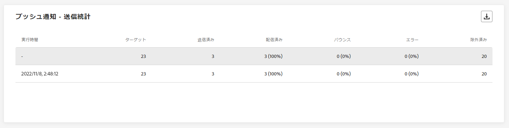

**[!UICONTROL プッシュ通知 - 送信統計]**&#x200B;のテーブルは、ターゲットメッセージ数や正常に配信されたメッセージ数などの主要指標を含む、プッシュ通知に関する重要なデータの簡潔な概要を示します。

+++ プッシュ通知 - 送信統計指標の詳細情報

* **[!UICONTROL 実行時間]**：繰り返しプッシュ通知の各実行の開始時間。1 つまたは複数の繰り返しプッシュ通知のみをターゲットにするには、**[!UICONTROL 実行時間]**&#x200B;ドロップダウンから選択します。

* **[!UICONTROL ターゲット]**：分析中に処理されたプッシュ通知の合計数。

* **[!UICONTROL 送信済み]**：プッシュ通知送信の合計数。

* **[!UICONTROL 配信済み]**：送信されたプッシュ通知の合計数に対する、正常に送信されたプッシュ通知の数。

* **[!UICONTROL 配信率]**：正常に送信されたプッシュ通知の割合。

* **[!UICONTROL バウンス数]**：プッシュ通知の合計数に対する、送信プロセス中および自動返信処理中に累積したエラーの合計数。

* **[!UICONTROL バウンス率]**：送信済みのプッシュ通知に対する、バウンスしたプッシュ通知の割合。

* **[!UICONTROL エラー]**：プロファイルへの送信を妨げるエラーが発生した合計数。

* **[!UICONTROL エラー率]**：送信されたプッシュ通知に対する、送信を妨げている間に発生したエラーの割合。

* **[!UICONTROL 除外済み]**：Adobe Journey Optimizer によって除外されたプロファイルの数。

+++

### プッシュ通知 - トラッキング統計 {#push-tracking-statistics}

>[!CONTEXTUALHELP]
>id="ajo_campaign_global_push_tracking_statistics"
>title="プッシュ通知 - トラッキング統計"
>abstract="プッシュ通知 - トラッキング統計では、プッシュ通知のプロファイルアクティビティに関するデータを提供します。"

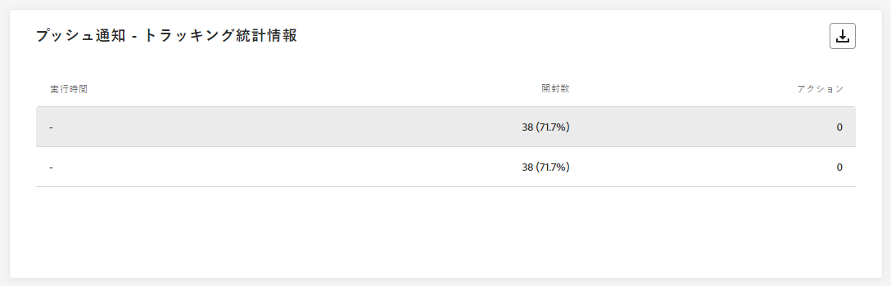

**[!UICONTROL プッシュ通知 - トラッキング統計]**&#x200B;のウィジェットは、プッシュ通知に関連するプロファイルアクティビティの詳細なスナップショットを提供し、エンゲージメントとプッシュ通知の効果に関する重要なインサイトを提供します。

+++ プッシュ通知 - トラッキング統計指標の詳細情報

* **[!UICONTROL 実行時間]**：繰り返しプッシュ通知の各実行の開始時間。1 つまたは複数の繰り返しプッシュ通知のみをターゲットにするには、**[!UICONTROL 実行時間]**&#x200B;ドロップダウンから選択します。

* **[!UICONTROL 開封数]**：プッシュ通知が開封された回数。

* **[!UICONTROL アクション]**：配信されたプッシュ通知に対するアクション（ボタンのクリックや解除など）の合計数。

+++

### プッシュ通知 - 送信の概要 {#push-summary}

>[!CONTEXTUALHELP]
>id="ajo_campaign_global_push_sending_summary"
>title="プッシュ通知 - 送信の概要"
>abstract="プッシュ通知 - 送信の概要グラフには、送信されたプッシュ通知に使用可能なデータが表示されます。"

**[!UICONTROL プッシュ通知 - 送信の概要]**&#x200B;のグラフは、プッシュ通知アクティビティの分析を動的に表示します。このグラフでは、送信されたプッシュ通知の包括的な分類を示します。

+++ プッシュ通知 - 送信の概要指標の詳細情報

* **[!UICONTROL 開封数]**：プッシュ通知が開封された回数。

* **[!UICONTROL アクション]**：配信されたプッシュ通知に対するアクション（ボタンのクリックや解除など）の合計数。

* **[!UICONTROL バウンス数]**：送信されたプッシュ通知の合計数に対する、累計エラー数および自動返信処理の合計数。

* **[!UICONTROL 配信済み]**：送信されたプッシュ通知の合計数に対する、正常に送信されたプッシュ通知の数。

* **[!UICONTROL エラー]**：プロファイルへの送信の妨げとなったエラーの合計数。

+++

### プッシュ通知 - 最適化 {#push-optimized}

>[!NOTE]
>
>**[!UICONTROL 最適化と非最適化の比較]**&#x200B;ウィジェットと&#x200B;**[!UICONTROL 送信時間の最適化]**&#x200B;ウィジェットは、プッシュ通知の「送信時間の最適化」オプションがアクティブ化されている場合にのみ使用できます。送信時間の最適化について詳しくは、[このページ](../building-journeys/journeys-message.md#send-time-optimization)を参照してください。

**[!UICONTROL 最適化と非最適化の比較]**&#x200B;および&#x200B;**[!UICONTROL 送信時間の最適化]**&#x200B;ウィジェットでは、メッセージが最適化されているかどうかに関係なく、メッセージに関する主な情報が詳しく表示されます。

+++ プッシュ通知 - 送信時間最適化指標の詳細情報

* **[!UICONTROL 配信済み]**：送信されたプッシュ通知の合計数に対する、正常に送信されたプッシュ通知の数。

* **[!UICONTROL 開封数]**：プッシュ通知が開封された回数。

* **[!UICONTROL アクション]**：配信されたプッシュ通知に対するアクション（ボタンのクリックや解除など）の合計数。

* **[!UICONTROL バウンス数]**：送信されたプッシュ通知の合計数に対して、送信プロセスおよび自動返信処理の間に累積したエラーの合計数。

+++

### プッシュ通知 - エラー理由 {#error-reasons-push}

>[!CONTEXTUALHELP]
>id="ajo_campaign_global_push_error_reasons"
>title="プッシュ通知 - エラー理由"
>abstract="エラー理由のグラフとテーブルを使用すると、送信プロセス中に発生した特定のエラーを識別できます。"

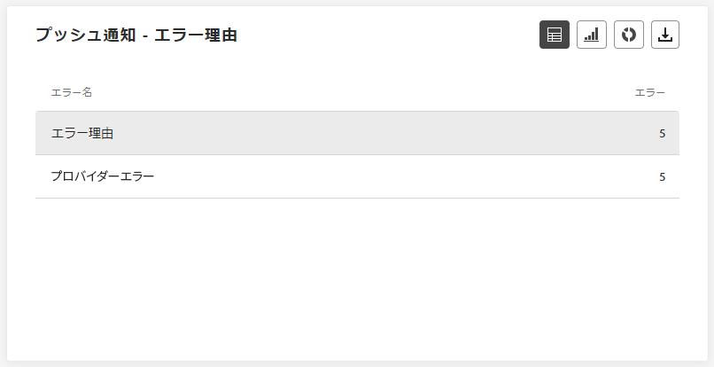

**[!UICONTROL エラー理由]**&#x200B;のテーブルとグラフは、プッシュ通知の送信プロセス中に発生した特定のエラーを識別することができ、進行中に発生した問題に関する詳細なインサイトを提供します。

### プッシュ通知 - 除外された理由 {#excluded-push}

>[!CONTEXTUALHELP]
>id="ajo_campaign_global_push_excluded_reasons"
>title="プッシュ通知 - 除外された理由"
>abstract="この除外された理由のグラフとテーブルには、ユーザープロファイルがターゲットオーディエンスから除外され、メッセージが受信されない原因となった様々な要因が表示されます。"

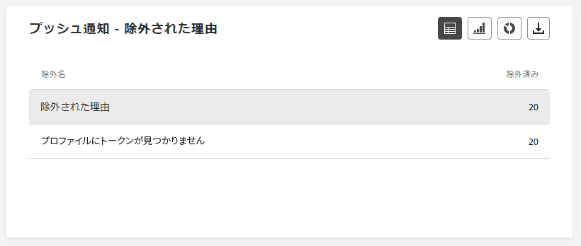

**[!UICONTROL 除外された理由]**&#x200B;のグラフとテーブルには、ターゲットプロファイルから除外されたユーザープロファイルがプッシュ通知を受信できない様々な理由が表示されます。

除外理由の包括的なリストについては、[このページ](exclusion-list.md)を参照してください。

### プッシュ通知 - プラットフォームごとの分類 {#breakdown-platform-push}

>[!CONTEXTUALHELP]
>id="ajo_campaign_global_push_breakdown_platform"
>title="プッシュ通知 - プラットフォームごとの分類"
>abstract="プッシュ通知 - プラットフォームごとの分類のグラフとテーブルには、プロファイルのオペレーティングシステムに基づいたプッシュ通知の成功の分類が表示されます。"

**[!UICONTROL プッシュ通知 - プラットフォーム別分類]**&#x200B;のグラフとテーブルには、プッシュ通知の成功の詳細な分析が表示され、プロファイルのオペレーティングシステムに基づいたインサイトが得られます。この分類により、様々なプラットフォームでのプッシュ通知のパフォーマンスをさらに把握できます。

+++ プッシュ通知 - プラットフォームごとの分類指標の詳細情報

* **[!UICONTROL ターゲット]**：分析中に処理されたプッシュ通知の合計数。

* **[!UICONTROL 配信済み]**：送信されたプッシュ通知の合計数に対する、正常に送信されたプッシュ通知の数。

* **[!UICONTROL 開封数]**：プッシュ通知が開封された回数。

* **[!UICONTROL アクション]**：配信されたプッシュ通知に対するアクション（ボタンのクリックや解除など）の合計数。

* **[!UICONTROL バウンス数]**：送信されたプッシュ通知の合計数に対する、累計エラー数および自動返信処理の合計数。

* **[!UICONTROL エラー]**：プロファイルへの送信の妨げとなったエラーの合計数。

* **[!UICONTROL 除外済み]**：Adobe Journey Optimizer によって除外されたプロファイルの数。

+++

## 「SMS」タブ {#sms-global}

キャンペーンの&#x200B;**[!UICONTROL グローバルレポート]**&#x200B;の「**[!UICONTROL SMS]**」タブには、キャンペーンで送信された SMS メッセージに関する主な情報が詳しく表示されます。

### SMS - 送信統計 {#sms-sending-statistics}

>[!CONTEXTUALHELP]
>id="ajo_campaign_global_sms_sending_statistics"
>title="SMS - 送信統計"
>abstract="SMS - 送信統計テーブルは、ターゲットメッセージや配信メッセージなど、SMS メッセージに関する重要なデータを要約します。"

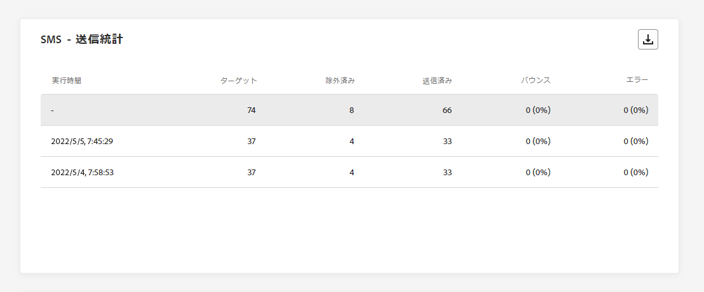

**[!UICONTROL SMS - 送信統計]**&#x200B;のテーブルは、ターゲットのメッセージ数や正常に配信されたメッセージ数などの主要指標を含む、SMS メッセージに関する重要なデータの簡潔な概要を示しています。

+++ SMS － 送信統計の指標の詳細情報

* **[!UICONTROL 実行時間]**：繰り返し SMS メッセージの各実行の開始時間。1 つまたは複数の繰り返し SMS メッセージのみをターゲットにするには、**[!UICONTROL 実行時間]**&#x200B;ドロップダウンから選択します。

* **[!UICONTROL ターゲット]**：ターゲットプロファイルとして適合するユーザープロファイルの数。

* **[!UICONTROL 除外済み]**：ターゲットプロファイルから除外されメッセージを受信しなかったユーザープロファイルの数。

* **[!UICONTROL 送信済み]**：SMS メッセージ用の送信の合計数。

* **[!UICONTROL バウンス数]**：送信された SMS メッセージの合計数に対する、送信プロセス中および自動返信処理中に累積したエラーの合計数。

* **[!UICONTROL エラー]**：プロファイルへの送信の妨げとなったエラーの合計数。

+++

### SMS - トラッキング統計 {#sms-tracking-statistics}

>[!CONTEXTUALHELP]
>id="ajo_campaign_sms_tracking_statistics"
>title="SMS - トラッキング統計"
>abstract="SMS - トラッキング統計ウィジェットは、訪問者の URL とのやり取りに関する重要な情報の包括的な概要を提供します。"

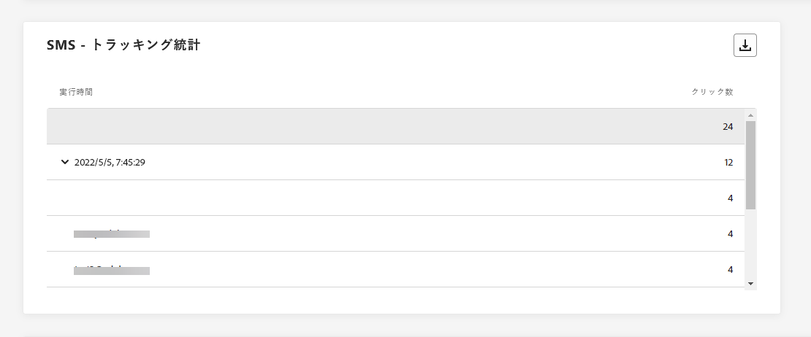

**[!UICONTROL SMS - トラッキング統計]**&#x200B;ウィジェットでは、訪問者の URL へのエンゲージメントに関する主要情報の詳細な概要が表示され、SMS メッセージの有効性に関するインサイトを得ることができます。

+++ SMS ‐ トラッキング統計指標の詳細情報

* **[!UICONTROL 実行時間]**：繰り返し SMS の実行開始時間。1 つまたは複数の繰り返し SMS のみをターゲットにするには、**[!UICONTROL 実行時間]**&#x200B;ドロップダウンから選択します。

* **[!UICONTROL クリック数]**：SMS メッセージでコンテンツがクリックされた回数。

+++

### SMS - 日別パフォーマンス {#sms-perfomance-date}

>[!CONTEXTUALHELP]
>id="ajo_campaign_global_sms_performance"
>title="SMS - 日別パフォーマンス"
>abstract="SMS - 日別パフォーマンスウィジェットには、メッセージに関する主な情報がグラフィックで表示されます。"

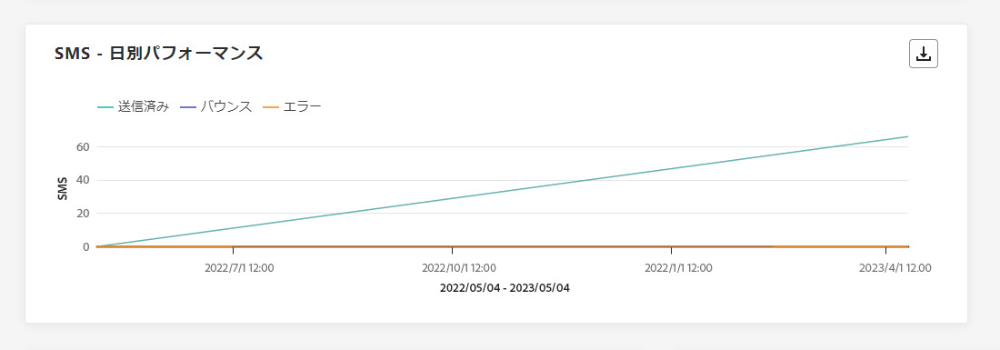

**[!UICONTROL SMS 日別パフォーマンス]**&#x200B;ウィジェットでは、メッセージに関する主要情報の概要が詳細なグラフで表示され、特定の期間におけるパフォーマンスの傾向に関するインサイトを得ることができます。

+++ SMS - 日別パフォーマンス指標の詳細情報

* **[!UICONTROL 送信済み]**：SMS メッセージ送信の合計数。

* **[!UICONTROL バウンス数]**：送信された SMS メッセージの合計数に対する、送信プロセス中および自動返信処理中に累積したエラーの合計数。

* **[!UICONTROL エラー]**：プロファイルへの送信の妨げとなったエラーの合計数。

+++

### SMS - エラー理由 {#sms-error}

>[!CONTEXTUALHELP]
>id="ajo_campaign_global_sms_error_reasons"
>title="SMS - エラー理由"
>abstract="SMS - エラー理由のグラフとテーブルを使用すると、送信プロセス中に発生した特定のエラーを識別できます。"

**[!UICONTROL エラーの理由]**&#x200B;グラフおよびテーブルは、SMS メッセージの送信プロセス中に発生した特定のエラーを識別できるようにし、発生した問題の徹底的な分析を促進します。

### SMS - 除外された理由 {#sms-excluded-reasons}

>[!CONTEXTUALHELP]
>id="ajo_campaign_global_sms_excluded_reasons"
>title="SMS - 除外された理由"
>abstract="この除外された理由のグラフとテーブルには、ユーザープロファイルがターゲットオーディエンスから除外され、メッセージが受信されない原因となった様々な要因が表示されます。"

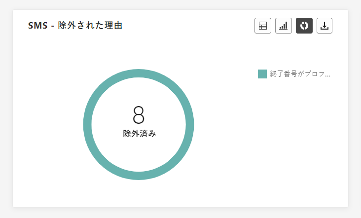

**[!UICONTROL 除外された理由]**&#x200B;グラフおよびテーブルは、ターゲットオーディエンスからユーザープロファイルが除外されることで、SMS メッセージを受信できなくなった様々な要因を視覚的に示しています。

除外理由の包括的なリストについては、[このページ](exclusion-list.md)を参照してください。

### SMS - バウンスの理由 {#sms-bounces-reasons}

>[!CONTEXTUALHELP]
>id="ajo_campaign_global_sms_bounces_reasons"
>title="SMS - バウンスの理由"
>abstract="バウンス理由のグラフとテーブルには、バウンスされたメッセージに関連して使用可能なデータが含まれます。"

**[!UICONTROL バウンスの理由]**&#x200B;グラフおよびテーブルは、バウンスした SMS メッセージに関するデータの包括的な概要を示し、SMS メッセージバウンスの事例の背後にある特定の理由に関する貴重なインサイトを提供します。

### SMS - リンク別のクリック数 {#sms-clicks-links}

>[!CONTEXTUALHELP]
>id="ajo_campaign_global_sms_clicks_links"
>title="SMS - リンク別のクリック数"
>abstract="SMS - リンク別のクリック数ウィジェットは、メッセージ内の URL に対する訪問者のエンゲージメントに関する重要なインサイトを提供します。"

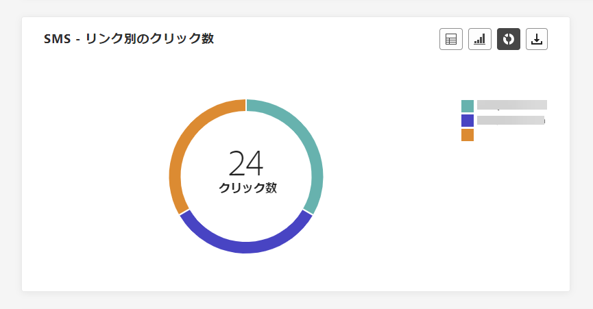

**[!UICONTROL SMS - リンク別のクリック数]**&#x200B;ウィジェットは、メッセージに含まれている URL との訪問者のエンゲージメントに関する基本的なインサイトを提供し、ほとんどのインタラクションを引き付けているリンクに関する貴重な情報を提供します。

## 「Web」タブ {#web-tab}

キャンペーンの&#x200B;**[!UICONTROL グローバルレポート]**&#x200B;の「**[!UICONTROL Web]**」タブには、web ページに関連する主な情報の詳細が表示されます。

### Web パフォーマンス {#web-performance}

>[!CONTEXTUALHELP]
>id="ajo_campaign_global_web_performance"
>title="Web パフォーマンス"
>abstract="Web パフォーマンス KPI では、web エクスペリエンスに対する訪問者のエンゲージメントに関する包括的な情報を提供します。"

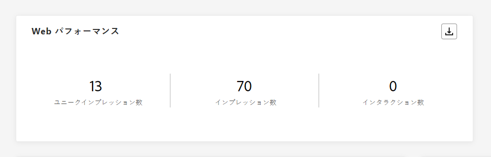

**[!UICONTROL Web パフォーマンス]** KPI は、インプレッション数やインタラクション数などの主要指標を含め、web ページに対する訪問者のエンゲージメントに関する包括的なインサイトを提供します。

+++ Web パフォーマンス指標の詳細情報

* **[!UICONTROL ユニークインプレッション数]**：web エクスペリエンスが配信されたユニークユーザーの数。

* **[!UICONTROL インプレッション数]**：すべてのユーザーに配信された web エクスペリエンスの合計数。

* **[!UICONTROL インタラクション数]**：web ページにおけるエンゲージメントの割合。これには、クリックやその他のインタラクションなど、ユーザーが実行したすべてのアクションが含まれます。

+++

### Web の概要 {#web-summary}

>[!CONTEXTUALHELP]
>id="ajo_campaign_global_web_summary"
>title="Web の概要"
>abstract="Web の概要グラフは、指定した期間におけるインプレッション数、ユニークインプレッション数、インタラクション数などの web エクスペリエンスの進行状況を示します。"

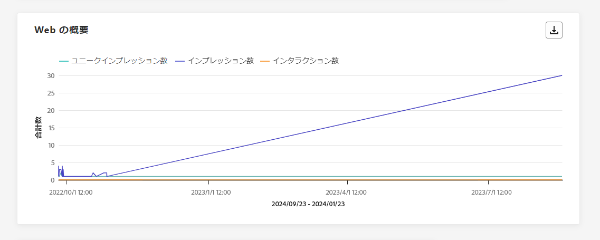

**[!UICONTROL Web の概要]**&#x200B;グラフでは、該当する期間の web エクスペリエンス（インプレッション数、ユニークインプレッション数、インタラクション数）の変化を確認できます。

+++ Web の概要指標の詳細情報

* **[!UICONTROL ユニークインプレッション数]**：web エクスペリエンスが配信されたユニークユーザーの数。

* **[!UICONTROL インプレッション数]**：すべてのユーザーに配信された web エクスペリエンスの合計数。

* **[!UICONTROL インタラクション数]**：web ページに対するエンゲージメントの合計数。これには、クリックやその他のインタラクションなど、ユーザーが実行したすべてのアクションが含まれます。

+++

### 要素別インタラクション数 {#web-interactions}

>[!CONTEXTUALHELP]
>id="ajo_campaign_global_web_interactions"
>title="要素別インタラクション数"
>abstract="要素別インタラクション数テーブルには、web ページ上の様々な要素に対する訪問者のエンゲージメントに関する主な情報が表示されます。"

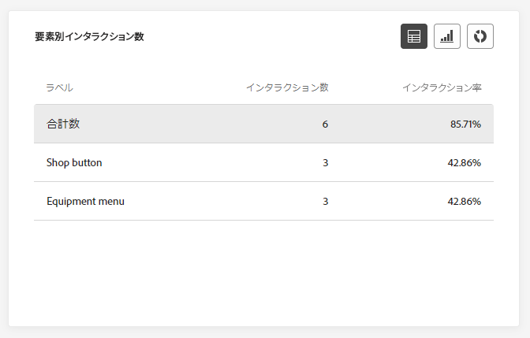

**[!UICONTROL 要素別インタラクション数]**&#x200B;テーブルは、web ページ上の様々な要素に対する訪問者のエンゲージメントに関する包括的な情報を示し、ユーザーのインタラクションと好みに関する有益なインサイトを提供します。

+++ 「要素別インタラクション数」指標の詳細

* **[!UICONTROL インタラクション数]**：web ページに対するエンゲージメントの合計数。これには、クリックやその他のインタラクションなど、ユーザーが実行したすべてのアクションが含まれます。

* **[!UICONTROL インタラクション数]**：web ページにおけるエンゲージメントの割合。これには、クリックやその他のインタラクションなど、ユーザーが実行したすべてのアクションが含まれます。

+++

## 「ダイレクトメール」タブ {#direct-mail-global}

キャンペーンの&#x200B;**[!UICONTROL グローバルレポート]**&#x200B;の「**[!UICONTROL ダイレクトメール]**」タブには、ダイレクトメールメッセージに関連する主な情報の詳細が表示されます。

### ダイレクトメール - 送信統計 {#direct-mail-sending-statistics}

>[!CONTEXTUALHELP]
>id="ajo_campaign_global_direct_sending_statistics"
>title="ダイレクトメール - 送信統計"
>abstract="ダイレクトメール - 送信統計テーブルは、ターゲットメッセージや配信メッセージなど、ダイレクトメールメッセージに関する重要なデータを要約します。"

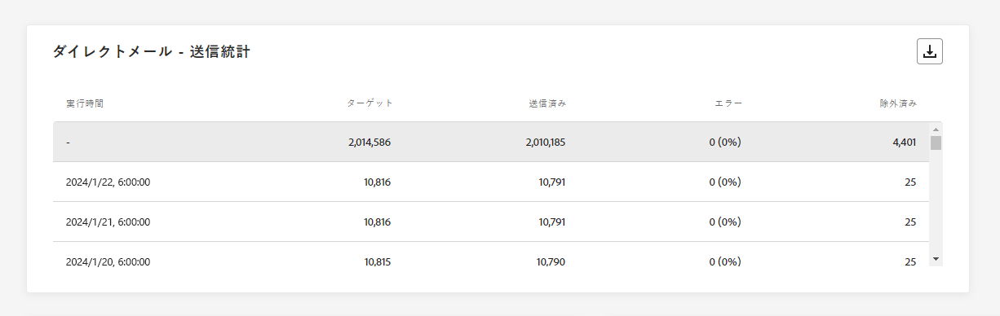

**[!UICONTROL ダイレクトメール - 送信統計]**&#x200B;テーブルは、ターゲットメッセージ数や正常に配信されたメッセージの数などの主要指標を含む、ダイレクトメールメッセージに関する重要なデータの簡潔な概要を示しています。

+++ ダイレクトメール - 送信統計指標の詳細情報

* **[!UICONTROL 実行時間]**：繰り返しダイレクトメールの各実行の開始時間。1 つまたは複数の繰り返しダイレクトメールのみをターゲットにするには、**[!UICONTROL 実行時間]**&#x200B;ドロップダウンから選択します。

* **[!UICONTROL ターゲット]**：ダイレクトメールメッセージのターゲットプロファイルとして適合するユーザープロファイルの数。

* **[!UICONTROL 送信済み]**：ダイレクトメールメッセージ用の送信の合計数。

* **[!UICONTROL エラー]**：送信プロセス中に発生し、プロファイルへの送信の妨げとなったエラーの合計数。

* **[!UICONTROL 除外済み]**：ターゲットプロファイルから除外され、ダイレクトメールメッセージを受信しなかったユーザープロファイルの数。

+++

### ダイレクトメール - エラー理由 {#direct-mail-error}

>[!CONTEXTUALHELP]
>id="ajo_campaign_global_direct_error_reasons"
>title="ダイレクトメール - エラー理由"
>abstract="ダイレクトメール - エラー理由のグラフとテーブルを使用すると、送信プロセス中に発生した特定のエラーを識別できます。"

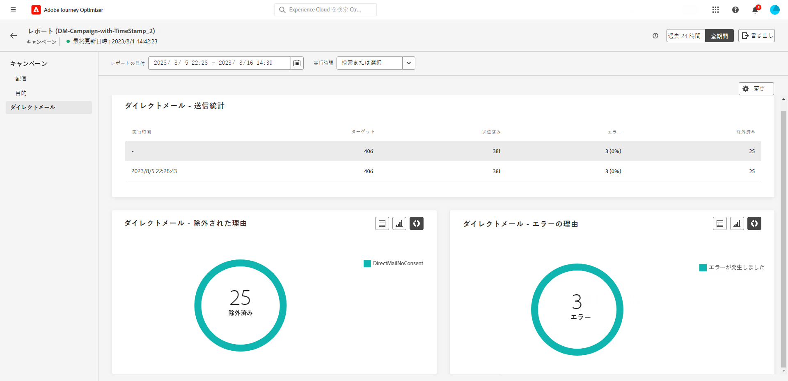

**[!UICONTROL ダイレクトメール - エラーの理由]**&#x200B;グラフおよびテーブルでは、ダイレクトメールメッセージの送信プロセス中に発生した特定のエラーを識別する手段を提供し、発生した問題を詳細に分析できるようにします。

### ダイレクトメール - 除外された理由 {#direct-mail-excluded}

>[!CONTEXTUALHELP]
>id="ajo_campaign_global_direct_excluded_reasons"
>title="ダイレクトメール - 除外された理由"
>abstract="このダイレクトメール - 除外された理由のグラフとテーブルには、ユーザープロファイルがターゲットプロファイルから除外され、メッセージが受信されない原因となった様々な要因が表示されます。"

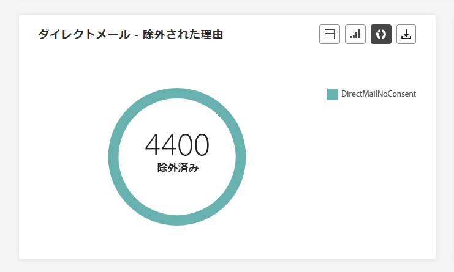

**[!UICONTROL ダイレクトメール - 除外された理由]**&#x200B;グラフおよびテーブルでは、ターゲットオーディエンスからユーザープロファイルが除外され、ダイレクトメールメッセージを受信できなかった様々な要因を視覚的に示します。

除外理由の包括的なリストについては、[このページ](exclusion-list.md)を参照してください。

## その他のリソース

* [キャンペーンの基本を学ぶ](../campaigns/get-started-with-campaigns.md)
* [キャンペーンの作成](../campaigns/create-campaign.md)
* [API トリガーキャンペーンの作成](../campaigns/api-triggered-campaigns.md)
* [キャンペーンの変更または停止](../campaigns/modify-stop-campaign.md)
* [キャンペーンのライブレポート](campaign-live-report.md)
