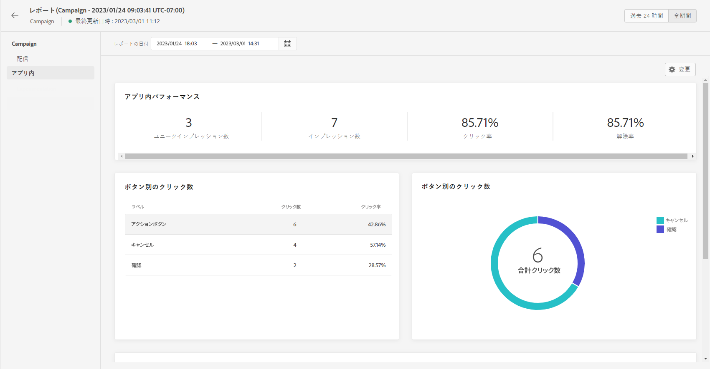
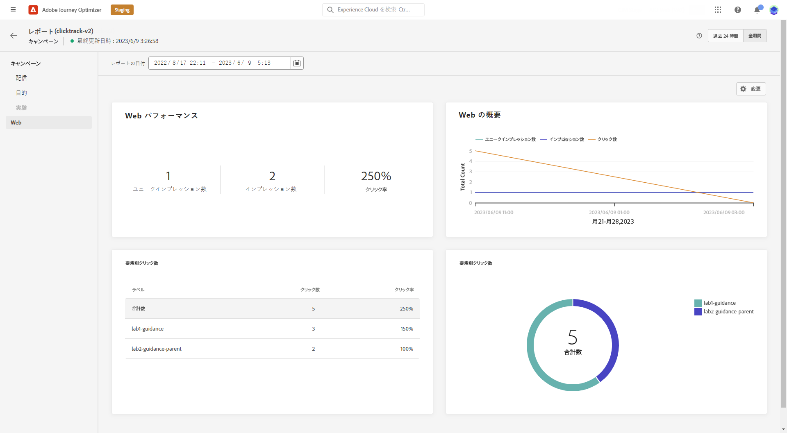

# キャンペーンのグローバルレポート {#campaign-global-report}

>[!CONTEXTUALHELP]
>id="ajo_campaign_global_report"
>title="キャンペーンのグローバルレポート"
>abstract="キャンペーンのグローバルレポートを使用すると、選択した期間におけるキャンペーンの効果を測定できます。 レポートは、キャンペーンの成功とエラーの詳細を示す様々なウィジェットに分かれています。各レポートダッシュボードは、ウィジェットのサイズ変更や削除を行うことで変更できます。"

「**全期間**」タブからアクセスできるグローバルレポートには、少なくとも 2 時間前に発生したイベントと、選択した期間のイベントが表示されます。これに対し、ライブレポートには、過去 24 時間以内に発生したイベントが焦点となり、イベント発生から最小 2 分の時間間隔で表示されます。

キャンペーンのグローバルレポートへは、「**[!UICONTROL レポートを表示]**」ボタンを使用して、キャンペーンから直接アクセスできます。

キャンペーンの&#x200B;**[!UICONTROL グローバルレポート]**&#x200B;ページは次のタブで表示されます。

* [キャンペーン](#campaign-global)
* [メール](#email-global)
* [アプリ内](#inapp-global)
* [プッシュ](#push-global)
* [SMS](#sms-global)
* [Web](#web-tab)
* [ダイレクトメール](#direct-mail-global)

キャンペーンの&#x200B;**[!UICONTROL グローバルレポート]**&#x200B;は、キャンペーンの成功とエラーの詳細を示す様々なウィジェットに分かれています。必要に応じて、各ウィジェットのサイズを変更したり削除したりできます。詳しくは、この[節](../reports/global-report.md#modify-dashboard)を参照してください。

Adobe Journey Optimizerで使用可能なすべての指標の詳細なリストについては、[このページ](global-report.md#list-of-components-global.md)を参照してください。

## 「キャンペーン」タブ {#campaign-global}

### 配信 {#delivery-global}

>[!CONTEXTUALHELP]
>id="ajo_campaign_delivery_global"
>title="キャンペーンの統計"
>abstract="キャンペーンの統計ウィジェットには、入力したプロファイルや配信したアクションなど、キャンペーンに関連する主な情報の詳細が表示されます。"

**[!UICONTROL キャンペーンの統計]**&#x200B;ウィジェットには、キャンペーンに関連する主な情報の詳細が表示されます。

* **[!UICONTROL エントリしたプロファイル]**：ジャーニーを開始したプロファイルの数。

* **[!UICONTROL 配信されたアクション]**：ジャーニー内のアクションが配信されたユニーク回数の合計。

* **[!UICONTROL アクションが % で失敗しました]**：アクションが配信されたユニーク回数の合計に対する、ジャーニーでアクションが失敗したユニーク回数の合計。

<!--
### Objectives report {#objectives-global}

The **[!UICONTROL Objectives]** tab allows you to better fine-tune your deliveries' reports by targeting one specific metric.

The **[!UICONTROL Objectives]** listed are linked to **[!UICONTROL Datasets]** that define a connection to a system in order to retrieve additional information. A list of built-in **[!UICONTROL Objectives]** is available but you can add your own by adding new **[!UICONTROL Dataset]**. For the detailed procedure, refer to this [section](../campaigns/reporting-configuration.md).

After selecting the Objectives you want to target on, the two **[!UICONTROL Performance overview]** and **[!UICONTROL Campaign objective]** widgets will provide a detailed summary of your delivery performance. 

With the **[!UICONTROL Campaign objective]** widget, you can also choose to compare your main objective with another metric.
-->

### 実験レポート {#experimentation-global}

>[!CONTEXTUALHELP]
>id="ajo_campaigns_content_experiment_click"
>title="成功指標"
>abstract="実験の作成時に以前に選択した成功指標の合計値を、プロファイル数で割った値です。"

「**[!UICONTROL 実験]**」タブには、各バリアントのパフォーマンスに関する主要なインサイトが表示され、最も成功したものを特定します。

最もパフォーマンスの高い処理の判定には時間がかかる場合があり、このアイコン  が表示されます。

+++実験レポートで使用できる様々な指標およびウィジェットの詳細を説明します。

**[!UICONTROL 実験結果]**&#x200B;ウィジェットは、各バリアントのパフォーマンスの詳細を説明します。ベースラインを変更するには、**[!UICONTROL ベースライン]**&#x200B;ドロップダウンから処理の 1 つを選択します。最も優れた処理には、星のアイコンが表示されます。

このテーブルは、次の指標を表しています。

* **[!UICONTROL ベースライン上の上昇率]**：ベースラインに対する特定の処理のコンバージョン率の向上率を測定します。

* **[!UICONTROL 信頼性]**：ある処理がベースライン処理と同じであることを示す証拠。[詳細情報](../campaigns/experiment-calculations.md#understand-confidence)

* **[!UICONTROL ユニークアウトバウンドクリック数]**：アウトバウンドチャネルでのクリック総数。

* **[!UICONTROL プロファイル]**：この処理の対象となるプロファイルの数。

* **[!UICONTROL ユニークアウトバウンドクリック数／プロファイル数]**：実験の作成時に以前に選択した成功指標の合計値を、プロファイル数で割った値です。

**[!UICONTROL 信頼区間]**&#x200B;グラフは、改善に関する不確実性を測定します。ベースラインと最もパフォーマンスの高い処理との間のパフォーマンス差の割合を詳細に示します。[詳細情報](../campaigns/experiment-calculations.md#confidence-intervals)

最後のウィジェットは、以前に処理用に選択した&#x200B;**[!UICONTROL 成功指標]**&#x200B;に関連するデータを提供します。**[!UICONTROL 指標]**&#x200B;ドロップダウンメニューから別のターゲット指標を選択して、代替データを追跡することもできます。

>[!CAUTION]
>
>実験でフィルタリングされた指標を使用する場合は、実験の比較ページのドロップダウンから指標の選択を変更すると、フィルター値が保持されないことに注意してください。例えば、「クリック数」から「ユニーククリック数」に切り替えると、適用されたフィルターが失われ、比較が不正確または無効になります。

+++

これらの結果の詳細と解釈について詳しくは、[このページ](../campaigns/get-started-experiment.md#interpret-results)を参照してください。

## 「メール」タブ {#email-global}

>[!CONTEXTUALHELP]
>id="ajo_campaign_global_email_sending_statistics"
>title="メール - 送信統計"
>abstract="メール - 送信統計テーブルは、ターゲットや配信など、メールに関する重要なデータを要約します。"

>[!CONTEXTUALHELP]
>id="ajo_campaign_global_email_tracking_statistics"
>title="メール - トラッキング統計"
>abstract="メール - トラッキング統計テーブルには、メールのプロファイルアクティビティに関するデータが表示されます。"

>[!CONTEXTUALHELP]
>id="ajo_campaign_global_email_sending_performance"
>title="メール - 送信パフォーマンス"
>abstract="メール - 送信パフォーマンスグラフには、送信されたメールに関する包括的なデータが表示され、配信やバウンスなどの主要指標に関する洞察がインサイトされ、メール配信プロセスの詳細な分析が可能になります。"

>[!CONTEXTUALHELP]
>id="ajo_campaign_global_email_bounce_categories"
>title="メール - バウンスカテゴリ"
>abstract="メール - バウンスカテゴリのグラフとテーブルには、一時的なエラーと永続的なエラーの両方に関するデータが表示されます。"

>[!CONTEXTUALHELP]
>id="ajo_campaign_global_email_bounce_reasons"
>title="メール - バウンス理由"
>abstract="メール - バウンス理由のグラフとテーブルには、バウンスされたメッセージに関連して使用可能なデータが含まれます。"

>[!CONTEXTUALHELP]
>id="ajo_campaign_global_email_error_reasons"
>title="メール - エラー理由"
>abstract="メール - エラー理由のグラフとテーブルを使用すると、送信プロセス中に発生した特定のエラーを識別できます。"

>[!CONTEXTUALHELP]
>id="ajo_campaign_global_email_excluded_reasons"
>title="メール - 除外された理由"
>abstract="この除外された理由のグラフとテーブルには、ユーザープロファイルがターゲットオーディエンスから除外され、メッセージが受信されない原因となった様々な要因が表示されます。"

>[!CONTEXTUALHELP]
>id="ajo_campaign_global_email_top_url"
>title="メール - 上位の URL"
>abstract="メール - 上位 URL のグラフとテーブルには、訪問者のトラフィックが最も多いメール内の URL の包括的な概要が表示され、一番人気のあるリンクを特定できます。"

>[!CONTEXTUALHELP]
>id="ajo_campaign_global_email_best_recipient"
>title="メール - 最適な受信者ドメイン"
>abstract="メール - 最適な受信者ドメインのグラフとテーブルには、受信者がメールを開くために最も頻繁に使用するドメインの詳細な分類が表示され、受信者の行動に関する貴重なインサイトが得られます。"

キャンペーンの&#x200B;**[!UICONTROL グローバルレポート]**&#x200B;の「**[!UICONTROL メール]**」タブには、キャンペーンで送信されるメール配信に関連する主な情報の詳細が表示されます。

+++メールレポートで使用できる様々な指標およびウィジェットについて詳しくは、こちらを参照してください。

**[!UICONTROL メール送信統計]**&#x200B;グラフには、メールの成功の詳細が表示されます。

* **[!UICONTROL ターゲット]**：送信プロセス中に処理されたメッセージの合計数。

* **[!UICONTROL 送信済み]**：メール用の送信の合計数。

* **[!UICONTROL 配信済み]**：送信されたメッセージの合計数に対して、正常に配達できたメッセージの数。

* **[!UICONTROL 配信率]**：正常に送信されたメッセージの割合。

* **[!UICONTROL バウンス数]**：送信されたメッセージの合計数に対して、送信プロセスおよび自動返信処理の間に累積したエラーの合計数。

* **[!UICONTROL バウンス率]**：送信メールに対するバウンスメールの割合。

* **[!UICONTROL エラー]**：送信プロセス中に発生し、プロファイルへの送信の妨げとなったエラーの合計数。

* **[!UICONTROL エラー率]**：送信されたメールに対して、送信プロセス中にエラーが発生して送信できなかったメールの割合。

* **[!UICONTROL 再試行]**：再試行のキュー内のメール数。

* **[!UICONTROL 除外済み]**：Adobe Journey Optimizer によって除外されたプロファイルの数。

**[!UICONTROL メール - トラッキング統計]**&#x200B;ウィジェットには、メールのプロファイルアクティビティに関する使用可能なデータが含まれます。

* **[!UICONTROL 開封数]**：メールが開封された回数。

* **[!UICONTROL ユニーク開封数]**：開封されたメールのパーセンテージ。

* **[!UICONTROL 開封率]**：配信されたメール数に対して、開封されたメールの合計数。

* **[!UICONTROL クリック数]**：メールのコンテンツがクリックされた回数。

* **[!UICONTROL ユニーククリック数]**：メールのコンテンツをクリックしたプロファイルの数。

* **[!UICONTROL ユニーククリック率]**：メールでインタラクションを行ったユーザーの割合。

* **[!UICONTROL 購読解除]** : 購読解除リンクのクリック数。

* **[!UICONTROL スパムのの苦情数]**：メッセージがスパムまたはジャンクとして宣言された回数。

**[!UICONTROL 送信パフォーマンス]**&#x200B;グラフには、送信されたメールで使用可能な、次のようなデータが含まれます。

* **[!UICONTROL 配信済み]**：送信されたメッセージの合計数に対して、正常に配達できたメッセージの数。

* **[!UICONTROL バウンス数]**：送信されたメッセージの合計数に対して、送信プロセスおよび自動返信処理の間に累積したエラーの合計数。

* **[!UICONTROL 再試行]**：再試行のキュー内のメール数。

* **[!UICONTROL エラー]**：送信プロセス中に発生し、プロファイルへの送信の妨げとなったエラーの合計数。

**[!UICONTROL バウンスの理由]**&#x200B;ウィジェットおよび&#x200B;**[!UICONTROL バウンスのカテゴリ]**&#x200B;ウィジェットには、次のようなバウンスメッセージに関するデータが含まれています。

* **[!UICONTROL ハードバウンス]**：永続的なエラー（メールアドレスの間違いなど）の合計数。このエラーは、アドレスが無効であることを明示的に示すエラーメッセージ（例：「不明なユーザー」）を伴います。

* **[!UICONTROL ソフトバウンス数]**：一時的なエラー（インボックスが満杯など）の合計数。

* **[!UICONTROL 無視]**：一時的なエラー（不在など）や技術的なエラー（送信者のタイプが postmaster の場合など）の合計数。

バウンスの詳細については、[抑制リスト](../reports/suppression-list.md)のページを参照してください。

**[!UICONTROL エラー理由]**&#x200B;のグラフとテーブルを使用すると、送信プロセス中に発生したエラーを確認できます。

この&#x200B;**[!UICONTROL 除外された理由]**&#x200B;グラフおよびテーブルには、ターゲットプロファイルから除外されたユーザープロファイルがメッセージを受信できなかった様々な理由が表示されます。

**[!UICONTROL メール - 上位の URL]** のグラフとテーブルには、メールから最もアクセスされている URL の詳細が表示されます。

**[!UICONTROL メール - 上位の受信者ドメイン]**&#x200B;のグラフとテーブルには、メールを開くためにプロファイルで最も使用されているドメインの詳細が表示されます。

>[!CAUTION]
>
> **[!UICONTROL メール - 上位の受信者ドメイン]**&#x200B;ウィジェットの正解率は 99.95％です。

この&#x200B;**[!UICONTROL 最適化済みグラフと最適化されていないグラフ]**&#x200B;は、メッセージが最適化されているかどうかに関する主な情報の詳細を示します。

* **[!UICONTROL 送信済み]**：送信の合計数。

* **[!UICONTROL 開封数]**：メッセージが開封された回数。

* **[!UICONTROL クリック数]**：メールのコンテンツがクリックされた回数。

**[!UICONTROL 送信時間の最適化]**&#x200B;には、送信方法（最適化または標準）に応じて、メールの成功の詳細が表示されます。

* **[!UICONTROL 配信済み]**：送信されたメッセージの合計数に対して、正常に配達できたメッセージの数。

* **[!UICONTROL バウンス数]**：送信されたメッセージの合計数に対して、送信プロセスおよび自動返信処理の間に累積したエラーの合計数。

>[!NOTE]
>
>**[!UICONTROL 最適化済みと最適化されていない]**&#x200B;ウィジェットと&#x200B;**[!UICONTROL 送信時間の最適化]**&#x200B;ウィジェットは、メールの「送信時間の最適化」オプションがアクティブ化されている場合にのみ使用できます。送信時間の最適化について詳しくは、[このページ](../building-journeys/journeys-message.md#send-time-optimization)を参照してください。

+++

## 「アプリ内」タブ {#inapp-global}

>[!CONTEXTUALHELP]
>id="ajo_campaign_global_inapp_performance"
>title="アプリ内パフォーマンス"
>abstract="アプリ内パフォーマンス KPI は、アプリ内メッセージに対する訪問者のエンゲージメントに関する重要なインサイトを提供します。"

>[!CONTEXTUALHELP]
>id="ajo_campaign_global_inapp_interactions"
>title="タイプ別インタラクション数"
>abstract="タイプ別インタラクション数グラフと表は、クリック、破棄、インタラクションを追跡して、ユーザーがアプリ内メッセージに対してどのような操作をしたかを示します。"

>[!CONTEXTUALHELP]
>id="ajo_campaign_global_inapp_summary"
>title="アプリ内の概要"
>abstract="アプリの内概要グラフは、指定した期間におけるアプリ内のインプレッション数とインタラクション数の進行状況を示します。"

キャンペーンの&#x200B;**[!UICONTROL グローバルレポート]**&#x200B;の「**[!UICONTROL アプリ内]**」タブには、キャンペーンで送信されたアプリ内配信に関する主な情報が詳しく表示されます。

+++アプリ内レポートで使用できる様々な指標およびウィジェットの詳細を説明します。

**[!UICONTROL アプリ内パフォーマンス]** KPI では、次のような、アプリ内メッセージに対する訪問者のエンゲージメントに関する主な情報を詳しく示します。

* **[!UICONTROL ユニークインプレッション数]**：アプリ内メッセージが配信されたユニークユーザーの数。

* **[!UICONTROL インプレッション数]**：すべてのユーザーに配信されたアプリ内メッセージの合計数。

* **[!UICONTROL インタラクション率]**：アプリ内メッセージを使用したエンゲージメントの割合。これには、クリック、破棄、その他のインタラクションなど、ユーザーが実行したすべてのアクションが含まれます。

**[!UICONTROL タイプ別インタラクション数]**&#x200B;グラフと表は、クリック、破棄、インタラクションを追跡して、ユーザーがアプリ内メッセージに対してどのような操作をしたかを示します。

**[!UICONTROL アプリ内の概要]**グラフは、対象期間のアプリ内インプレッション数とインタラクション数の変化を示します。
+++

## 「プッシュ通知」タブ {#push-global}

>[!CONTEXTUALHELP]
>id="ajo_campaign_global_push_sending_statistics"
>title="プッシュ通知 - 送信統計"
>abstract="プッシュ通知 - 送信統計テーブルは、ターゲットメッセージや配信メッセージなどのプッシュ通知に関する重要なデータを要約します。"

>[!CONTEXTUALHELP]
>id="ajo_campaign_global_push_tracking_statistics"
>title="プッシュ通知 - トラッキング統計"
>abstract="プッシュ通知 - トラッキング統計では、プッシュ通知のプロファイルアクティビティに関するデータを提供します。"

>[!CONTEXTUALHELP]
>id="ajo_campaign_global_push_sending_summary"
>title="プッシュ通知 - 送信の概要"
>abstract="プッシュ通知 - 送信の概要グラフには、送信されたプッシュ通知に使用可能なデータが表示されます。"

>[!CONTEXTUALHELP]
>id="ajo_campaign_global_push_excluded_reasons"
>title="プッシュ通知 - 除外された理由"
>abstract="この除外された理由のグラフとテーブルには、ユーザープロファイルがターゲットオーディエンスから除外され、メッセージが受信されない原因となった様々な要因が表示されます。"

>[!CONTEXTUALHELP]
>id="ajo_campaign_global_push_error_reasons"
>title="プッシュ通知 - エラー理由"
>abstract="エラー理由のグラフとテーブルを使用すると、送信プロセス中に発生した特定のエラーを識別できます。"

>[!CONTEXTUALHELP]
>id="ajo_campaign_global_push_breakdown_platform"
>title="プッシュ通知 - プラットフォームごとの分類"
>abstract="プラットフォームごとの分類のグラフとテーブルには、プロファイルのオペレーティングシステムに基づいたプッシュ通知の成功の分類が表示されます。"

キャンペーンの&#x200B;**[!UICONTROL グローバルレポート]**&#x200B;の「**[!UICONTROL プッシュ通知]**」タブには、キャンペーンで送信されたプッシュ配信に関する主な情報が詳しく表示されます。

アプリ内パフォーマンス KPI には、アプリ内メッセージに対する訪問者のエンゲージメントに関する主な情報の詳細が表示されます。

+++プッシュレポートで使用できる様々な指標およびウィジェットの詳細を説明します。

**[!UICONTROL プッシュ通知 - 送信統計]**&#x200B;テーブルには、プッシュ通知に関する主な情報の詳細が表示されます

* **[!UICONTROL ターゲット]**：分析中に処理されたメッセージの合計数。

* **[!UICONTROL 送信済み]**：プッシュ通知用の送信の合計数。

* **[!UICONTROL 配信済み]**：送信されたメッセージの合計数に対して、正常に配達できたメッセージの数。

* **[!UICONTROL 配信率]**：正常に送信されたメッセージの割合。

* **[!UICONTROL バウンス数]**：送信されたメッセージの合計数に対して、送信プロセスおよび自動返信処理の間に累積したエラーの合計数。

* **[!UICONTROL バウンス率]**：送信済みのプッシュ通知に対する、バウンスしたプッシュ通知の割合。

* **[!UICONTROL エラー]**：プロファイルへの送信を妨げるエラーが発生した合計数。

* **[!UICONTROL エラー率]**：送信されたプッシュ通知に対する、送信を妨げている間に発生したエラーの割合。

* **[!UICONTROL 除外済み]**：Adobe Journey Optimizer によって除外されたプロファイルの数。

**[!UICONTROL プッシュ - トラッキング統計]**&#x200B;には、プッシュ通知のプロファイルアクティビティに使用可能なデータが含まれます。

* **[!UICONTROL 開封数]**：プッシュ通知が開封された回数。

* **[!UICONTROL 開封率]**：開封されたプッシュ通知の割合。

* **[!UICONTROL アクション]**：配信されたプッシュ通知に対するアクション（ボタンのクリックや解除など）の合計数。

* **[!UICONTROL エンゲージメント]**：このプッシュ通知に対する開封数とアクション数（「プロファイルがプッシュを開封した」、「ボタンがクリックされた」など）の合計。

* **[!UICONTROL エンゲージメント率]**：このプッシュ通知の開封とアクションの割合（プロファイルによるプッシュの開封や、ボタンのクリックなど）。

「**[!UICONTROL プッシュ通知の概要]**」グラフには、次のような送信済みプッシュ通知に使用できるデータが含まれています。

* **[!UICONTROL 開封数]**：プッシュ通知が開封された回数。

* **[!UICONTROL アクション]**：配信されたプッシュ通知に対するアクション（ボタンのクリックや解除など）の合計数。

* **[!UICONTROL バウンス数]**：送信されたメッセージの合計数に対する、累計エラー数および自動返信処理の合計数。

* **[!UICONTROL 配信済み]**：送信されたメッセージの合計数に対して、正常に配達できたメッセージの数。

* **[!UICONTROL エラー]**：プロファイルへの送信を妨げたエラーの合計数。

>[!NOTE]
>
>**[!UICONTROL 最適化済みと最適化されていない]**&#x200B;ウィジェットと&#x200B;**[!UICONTROL 送信時間の最適化]**&#x200B;ウィジェットは、プッシュ通知の「送信時間の最適化」オプションがアクティブ化されている場合にのみ使用できます。送信時間の最適化について詳しくは、[このページ](../building-journeys/journeys-message.md#send-time-optimization)を参照してください。

この&#x200B;**[!UICONTROL 最適化済みと最適化されていない]**&#x200B;グラフは、メッセージが最適化されているかどうかに関する主な情報の詳細を示します。

* **[!UICONTROL 配信済み]**：送信されたメッセージの合計数に対して、正常に配達できたメッセージの数。

* **[!UICONTROL 開封数]**：プッシュ通知が開封された回数。

* **[!UICONTROL アクション]**：配信されたプッシュ通知に対するアクション（ボタンのクリックや解除など）の合計数。

**[!UICONTROL 送信時間の最適化]**&#x200B;には、送信方法（最適化または標準）に応じて、プッシュ通知の成功の詳細が表示されます。

* **[!UICONTROL 配信済み]**：送信されたメッセージの合計数に対して、正常に配達できたメッセージの数。

* **[!UICONTROL バウンス数]**：送信されたメッセージの合計数に対して、送信プロセスおよび自動返信処理の間に累積したエラーの合計数。

**[!UICONTROL エラー理由]**&#x200B;のグラフとテーブルを使用すると、発生したエラーを確認できます。

この&#x200B;**[!UICONTROL 除外された理由]**&#x200B;グラフおよびテーブルには、ターゲットプロファイルから除外されたユーザープロファイルがメッセージを受信できなかった様々な理由が表示されます。

**[!UICONTROL プラットフォームごとの分類]**のグラフとテーブルには、プロファイルのオペレーティングシステムに応じたプッシュ通知の成功の詳細が表示されます。
+++

## 「SMS」タブ {#sms-global}

>[!CONTEXTUALHELP]
>id="ajo_campaign_global_sms_sending_statistics"
>title="SMS - 送信統計"
>abstract="SMS - 送信統計テーブルは、ターゲットメッセージや配信メッセージなど、SMS メッセージに関する重要なデータを要約します。"

>[!CONTEXTUALHELP]
>id="ajo_campaign_global_sms_error_reasons"
>title="SMS - エラー理由"
>abstract="SMS - エラー理由のグラフとテーブルを使用すると、送信プロセス中に発生した特定のエラーを識別できます。"

>[!CONTEXTUALHELP]
>id="ajo_campaign_global_sms_performance"
>title="SMS - 日別パフォーマンス"
>abstract="SMS - 日別パフォーマンスウィジェットには、メッセージに関する主な情報がグラフィックで表示されます。"

>[!CONTEXTUALHELP]
>id="ajo_campaign_global_sms_excluded_reasons"
>title="SMS - 除外された理由"
>abstract="この除外された理由のグラフとテーブルには、ユーザープロファイルがターゲットオーディエンスから除外され、メッセージが受信されない原因となった様々な要因が表示されます。"

>[!CONTEXTUALHELP]
>id="ajo_campaign_global_sms_bounces_reasons"
>title="SMS - バウンス理由"
>abstract="バウンス理由のグラフとテーブルには、バウンスされたメッセージに関連して使用可能なデータが含まれます。"

>[!CONTEXTUALHELP]
>id="ajo_campaign_global_sms_clicks_links"
>title="SMS - リンク別のクリック数"
>abstract="SMS - リンク別のクリック数ウィジェットは、メッセージ内の URL に対する訪問者のエンゲージメントに関する重要なインサイトを提供します。"

キャンペーンの&#x200B;**[!UICONTROL グローバルレポート]**&#x200B;の「**[!UICONTROL SMS]**」タブには、キャンペーンで送信された SMS 配信に関する主な情報が詳しく表示されます。

+++SMS レポートで使用できる様々な指標およびウィジェットの詳細を説明します。

**[!UICONTROL SMS - 送信統計]**&#x200B;テーブルには、SMS メッセージの成功の詳細が表示されます。

* **[!UICONTROL ターゲット]**：ターゲットプロファイルとして適合するユーザープロファイルの数。

* **[!UICONTROL 除外済み]**：ターゲットプロファイルから除外されメッセージを受信しなかったユーザープロファイルの数。

* **[!UICONTROL 送信済み]**：SMS メッセージ用の送信の合計数。

* **[!UICONTROL バウンス数]**：送信されたメッセージの合計数に対して、送信プロセスおよび自動返信処理の間に累積したエラーの合計数。

* **[!UICONTROL エラー]**：プロファイルへの送信を妨げたエラーの合計数。

**[!UICONTROL SMS の日別パフォーマンス]**&#x200B;ウィジェットは、メッセージに関連する主な情報の詳細をグラフで表示します。

* **[!UICONTROL 送信済み]**：SMS メッセージ用の送信の合計数。

* **[!UICONTROL バウンス数]**：送信されたメッセージの合計数に対して、送信プロセスおよび自動返信処理の間に累積したエラーの合計数。

* **[!UICONTROL エラー]**：プロファイルへの送信を妨げたエラーの合計数。

**[!UICONTROL 除外された理由]**、**[!UICONTROL バウンス理由]**、**[!UICONTROL エラー理由]**&#x200B;のグラフとテーブルを使用すると、送プロセス信中に発生したエラーと除外を確認できます。

**[!UICONTROL SMS - リンク別のクリック数]**&#x200B;ウィジェットには、訪問者の URL へのエンゲージメントに関する主な情報が詳細に表示されます。

+++

## 「Web」タブ {#web-tab}

>[!CONTEXTUALHELP]
>id="ajo_campaign_global_web_performance"
>title="Web パフォーマンス"
>abstract="Web パフォーマンス KPI では、web エクスペリエンスに対する訪問者のエンゲージメントに関する包括的な情報を提供します。"

>[!CONTEXTUALHELP]
>id="ajo_campaign_global_web_summary"
>title="Web の概要"
>abstract="Web の概要グラフは、指定した期間におけるインプレッション数、ユニークインプレッション数、インタラクション数などの web エクスペリエンスの進行状況を示します。"

>[!CONTEXTUALHELP]
>id="ajo_campaign_global_web_interactions"
>title="要素別インタラクション数"
>abstract="要素別インタラクション数テーブルには、web ページ上の様々な要素に対する訪問者のエンゲージメントに関する主な情報が表示されます。"

キャンペーンの&#x200B;**[!UICONTROL グローバルレポート]**&#x200B;の「**[!UICONTROL Web]**」タブには、web ページに関連する主な情報の詳細が表示されます。

+++Web レポートで使用できる様々な指標およびウィジェットの詳細を説明します。

**[!UICONTROL Web パフォーマンス]** KPI では、次のような、web エクスペリエンスに対する訪問者のエンゲージメントに関する主な情報を詳しく示します。

* **[!UICONTROL ユニークインプレッション数]**：web エクスペリエンスが配信されたユニークユーザーの数。

* **[!UICONTROL インプレッション数]**：すべてのユーザーに配信された web エクスペリエンスの合計数。

* **[!UICONTROL インタラクション数]**：web ページにおけるエンゲージメントの割合。これには、クリックやその他のインタラクションなど、ユーザーが実行したすべてのアクションが含まれます。

**[!UICONTROL Web の概要]**&#x200B;グラフでは、該当する期間の web エクスペリエンス（インプレッション数、ユニークインプレッション数、インタラクション数）の変化を確認できます。

**[!UICONTROL 要素別インタラクション数]**の表では、web ページ上の様々な要素に対する訪問者のエンゲージメントについての主な情報の詳細を確認できます。
+++

## 「ダイレクトメール」タブ {#direct-mail-global}

>[!CONTEXTUALHELP]
>id="ajo_campaign_global_direct_sending_statistics"
>title="ダイレクトメール - 送信統計"
>abstract="ダイレクトメール - 送信統計テーブルは、ターゲットメッセージや配信メッセージなど、ダイレクトメールメッセージに関する重要なデータを要約します。"

>[!CONTEXTUALHELP]
>id="ajo_campaign_global_direct_error_reasons"
>title="ダイレクトメール - エラー理由"
>abstract="ダイレクトメール - エラー理由のグラフとテーブルを使用すると、送信プロセス中に発生した特定のエラーを識別できます。"

>[!CONTEXTUALHELP]
>id="ajo_campaign_global_direct_excluded_reasons"
>title="ダイレクトメール - 除外された理由"
>abstract="このダイレクトメール - 除外された理由のグラフとテーブルには、ユーザープロファイルがターゲットプロファイルから除外され、メッセージが受信されない原因となった様々な要因が表示されます。"

キャンペーンの&#x200B;**[!UICONTROL グローバルレポート]**&#x200B;の「**[!UICONTROL ダイレクトメール]**」タブには、ダイレクトメール配信に関連する主な情報の詳細が表示されます。

+++ダイレクトメールレポートで使用できる様々な指標やウィジェットについて詳しくは、こちらを参照してください。

**[!UICONTROL ダイレクトメール - 送信統計]**&#x200B;テーブルには、配信の成功の詳細が表示されます。

* **[!UICONTROL ターゲット]**：このダイレクトメールのターゲットプロファイルとして適合するユーザープロファイルの数。

* **[!UICONTROL 送信済み]**：このダイレクトメール用の送信の合計数。

* **[!UICONTROL エラー]**：送信プロセス中に発生し、プロファイルへの送信の妨げとなったエラーの合計数。

* **[!UICONTROL 除外済み]**：ターゲットプロファイルから除外されダイレクトメールを受信しなかったユーザープロファイルの数。

**[!UICONTROL ダイレクトメール - 除外された理由]**&#x200B;と&#x200B;**[!UICONTROL ダイレクトメール - エラー理由]**のグラフとテーブルを使用すると、送信プロセス中に発生したエラーと除外を確認できます。
+++

## その他のリソース

* [キャンペーンの基本を学ぶ](../campaigns/get-started-with-campaigns.md)
* [キャンペーンの作成](../campaigns/create-campaign.md)
* [API トリガーキャンペーンの作成](../campaigns/api-triggered-campaigns.md)
* [キャンペーンの変更または停止](../campaigns/modify-stop-campaign.md)
* [キャンペーンのライブレポート](campaign-live-report.md)
