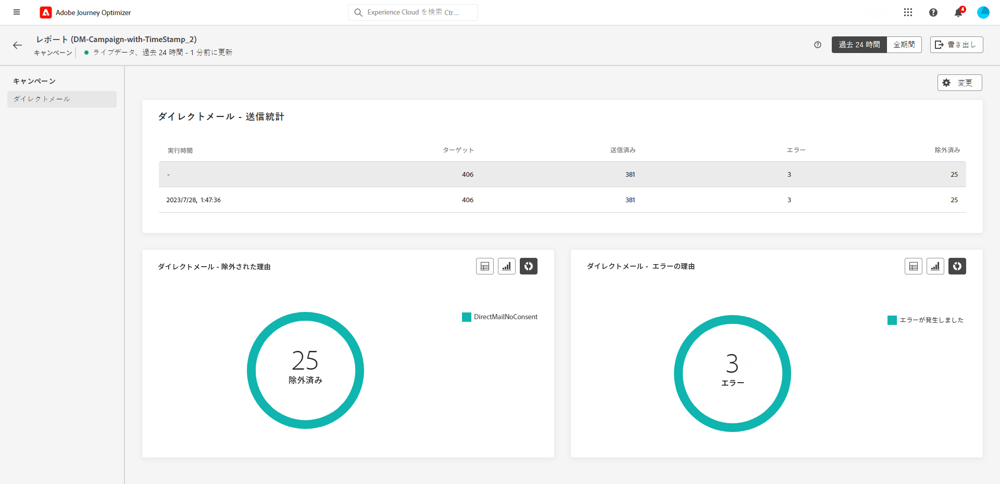

# キャンペーンのライブレポート {#campaign-live-report}

>[!CONTEXTUALHELP]
>id="ajo_campaign_live_report"
>title="キャンペーンのライブレポート"
>abstract="キャンペーンのライブレポートでは、過去 24 時間のみのキャンペーンの効果とパフォーマンスをリアルタイムで測定および視覚化できます。レポートは、キャンペーンの成功とエラーの詳細を示す様々なウィジェットに分かれています。各レポートダッシュボードは、ウィジェットのサイズ変更や削除を行うことで変更できます。"

「過去 24 時間」タブからアクセスできるライブレポートには、過去 24 時間以内に発生したイベントが、イベント発生から最小 2 分の時間間隔で表示されます。これに対し、グローバルレポートでは、少なくとも 2 時間前に発生したイベントに焦点を当て、選択した期間のイベントが表示されます。

キャンペーンのライブレポートは、「**[!UICONTROL ライブ表示]**」ボタンを使用して、キャンペーンから直接アクセスできます。

キャンペーンの&#x200B;**[!UICONTROL ライブレポート]**&#x200B;ページには次のタブが表示されます。

* [キャンペーン](#campaign-live)
* [メール](#email-live)
* [アプリ内](#inapp-live)
* [プッシュ](#push-live)
* [SMS](#sms-live)
* [Web](#web-tab)
* [ダイレクトメール](#direct-mail-tab)

キャンペーンの&#x200B;**[!UICONTROL ライブレポート]**&#x200B;は、キャンペーンの成功とエラーの詳細を示す様々なウィジェットに分かれています。必要に応じて、各ウィジェットのサイズを変更したり削除したりできます。詳しくは、この[節](../reports/live-report.md#modify-dashboard)を参照してください。

Adobe Journey Optimizer で使用可能なすべての指標の詳細なリストについては、[こちらのページ](live-report.md#list-of-components-live)を参照してください。

## 「キャンペーン」タブ {#campaign-live}

### 配信 {#delivery-live}

**[!UICONTROL キャンペーン統計]**&#x200B;ウィジェットには、キャンペーンに関連する主な情報の詳細が表示されます。

* **[!UICONTROL エントリしたプロファイル]**：ジャーニーを開始したプロファイルの数。

<!--
### Experimentation tab (#experimentation-live)

From your Campaign **[!UICONTROL Live report]**, the **[!UICONTROL Experimentation]** tab details the main information relative to how each variant is performing and if there is was winner during the test.
-->

## 「メール」タブ {#email-live}

キャンペーンの&#x200B;**[!UICONTROL ライブレポート]**&#x200B;の「**[!UICONTROL メール]**」タブには、キャンペーンで送信されるメール配信に関連する主な情報の詳細が表示されます。

+++メールレポートで使用できる様々な指標およびウィジェットについて詳しくは、こちらを参照してください。

**[!UICONTROL メール送信統計情報]**&#x200B;ウィジェットには、メッセージに関連する主な情報の詳細が表示されます。

* **[!UICONTROL 配信済み]**：正常に送信されたメッセージ数。

* **[!UICONTROL バウンス数]**：配信中および自動返信処理中のエラーの累計。

* **[!UICONTROL エラー]**：配信中に発生し、プロファイルに送信できなかったエラーの合計数。

**[!UICONTROL メール別送信指標]**&#x200B;テーブルと&#x200B;**[!UICONTROL メールの概要]**&#x200B;グラフに、配信が成功した詳細を示します。

* **[!UICONTROL 送信済み]**：配信用に送信した合計数。

* **[!UICONTROL 配信済み]**：正常に送信されたメッセージ数。

* **[!UICONTROL バウンス数]**：配信中および自動返信処理中のエラーの累計。

* **[!UICONTROL エラー]**：配信中に発生し、プロファイルに送信できなかったエラーの合計数。

* **[!UICONTROL 開封数]**：配信でメッセージが開封された回数。

* **[!UICONTROL クリック数]**：配信でコンテンツがクリックされた回数。

* **[!UICONTROL 購読解除]**：購読解除リンクのクリック数。

* **[!UICONTROL スパムの苦情数]**：メッセージがスパムまたは迷惑メールとして宣言された回数。

**[!UICONTROL バウンス理由]**、**[!UICONTROL バウンスカテゴリ]**、**[!UICONTROL ハードとバウンス - メール別]**&#x200B;などのウィジェットには、バウンスメッセージに関して利用できるデータが含まれます。

* **[!UICONTROL ハードバウンス]**：永続的なエラー（メールアドレスの間違いなど）の合計数。このエラーは、アドレスが無効であることを明示的に示すエラーメッセージ（例：「不明なユーザー」）を伴います。

* **[!UICONTROL ソフトバウンス数]**：一時的なエラー（インボックスが満杯など）の合計数。

* **[!UICONTROL 無視]**：一時的なエラー（不在など）や技術的なエラー（送信者のタイプが postmaster の場合など）の合計数。

**[!UICONTROL エラーの理由]**&#x200B;および&#x200B;**[!UICONTROL 除外された理由]**&#x200B;のグラフとテーブルを使用すると、配信中に発生したエラーと除外を確認できます。

「**[!UICONTROL 電子メール - 上位の受信者ドメイン]**」のグラフと表は、受信者が電子メールを開くために最も多く使用しているドメインの詳細を示しています。
+++

## 「アプリ内」タブ {#inapp-live}

>[!CONTEXTUALHELP]
>id="ajo_campaign_live_inapp_performance"
>title="アプリ内パフォーマンス"
>abstract="アプリ内パフォーマンス KPI は、過去 24 時間の訪問者のアプリ内メッセージに対するエンゲージメントに関する重要なインサイトを提供します。"

>[!CONTEXTUALHELP]
>id="ajo_campaign_live_inapp_interactions"
>title="タイプ別のインタラクション数"
>abstract="タイプ別インタラクションのグラフと表では、過去 24 時間のクリック、解除またはインタラクションを追跡して、ユーザーがアプリ内メッセージに対してどのような操作をしたかを詳しく説明します。"

>[!CONTEXTUALHELP]
>id="ajo_campaign_live_inapp_summary"
>title="アプリ内概要"
>abstract="アプリ内概要グラフは、過去 24 時間のアプリ内インプレッション数およびインタラクション数の進行状況を示します。"

キャンペーンの&#x200B;**[!UICONTROL ライブレポート]**&#x200B;の「**[!UICONTROL アプリ内]**」タブには、キャンペーンで送信されたアプリ内配信に関連する主な情報の詳細が表示されます。

+++アプリ内レポートで使用できる様々な指標およびウィジェットの詳細を説明します。

**[!UICONTROL アプリ内パフォーマンス]** KPI では、次のような、アプリ内メッセージに対する訪問者のエンゲージメントに関する主な情報を詳しく示します。

* **[!UICONTROL インプレッション数]**：すべてのユーザーに配信されたアプリ内メッセージの合計数。

* **[!UICONTROL インタラクション数]**：アプリ内メッセージに対するエンゲージメントの合計数。これには、クリック、破棄、その他のインタラクションなど、ユーザーが実行したすべてのアクションが含まれます。

**[!UICONTROL アプリ内の概要]**&#x200B;グラフは、対象期間のアプリ内インプレッション数とインタラクション数の変化を示します。

**[!UICONTROL タイプ別インタラクション数]**&#x200B;グラフと表は、クリック、破棄、インタラクションを追跡して、ユーザーがアプリ内メッセージに対してどのような操作をしたかを示します。

+++

## 「プッシュ通知」タブ {#push-live}

>[!CONTEXTUALHELP]
>id="ajo_campaign_live_push_sending_performance"
>title="プッシュ通知 — 送信パフォーマンス"
>abstract="プッシュ通知送信パフォーマンスグラフは、過去 24 時間のエラーや配信済みメッセージなど、プッシュ通知に関する重要なデータをまとめます。"

>[!CONTEXTUALHELP]
>id="ajo_campaign_live_push_statistics"
>title="プッシュ通知 — 統計"
>abstract="「プッシュ統計」テーブルは、過去 24 時間の配信の受信者アクティビティに関するデータを提供します。"

>[!CONTEXTUALHELP]
>id="ajo_campaign_live_push_sending_summary"
>title="プッシュ通知 — 送信の概要"
>abstract="「プッシュ通知送信の概要」グラフには、過去 24 時間に送信されたプッシュ通知で使用可能なデータが表示されます。"

>[!CONTEXTUALHELP]
>id="ajo_campaign_live_push_excluded_reasons"
>title="プッシュ通知 — 除外された理由"
>abstract="除外された理由のグラフと表は、対象のオーディエンスから除外され、過去 24 時間にメッセージを受信しなかった、ユーザープロファイルにつながった様々な要因を示しています。"

>[!CONTEXTUALHELP]
>id="ajo_campaign_live_push_error_reasons"
>title="プッシュ通知 — エラー理由"
>abstract="「エラー理由」のグラフと表を使用して、配信中に過去 24 時間に発生した特定のエラーを特定できます。"

>[!CONTEXTUALHELP]
>id="ajo_campaign_live_push_breakdown_platform"
>title="プッシュ通知 — プラットフォーム別の分類"
>abstract="プラットフォームごとの分類のグラフと表は、過去 24 時間のプッシュ通知の成功の内訳を、受信者のオペレーティングシステムに基づいて示しています。"

キャンペーンの&#x200B;**[!UICONTROL ライブレポート]**&#x200B;の「**[!UICONTROL プッシュ通知]**」タブには、キャンペーンで送信されるプッシュ配信に関連する主な情報の詳細が表示されます。

+++プッシュレポートで使用できる様々な指標およびウィジェットの詳細を説明します。

**[!UICONTROL プッシュ通知の送信パフォーマンス]**, **[!UICONTROL プッシュ通知の概要]** および **[!UICONTROL プッシュ通知 — 統計]** widgets は、メッセージに関する主な情報の詳細を示します。

* **[!UICONTROL 送信済み]**：配信用に送信した合計数。

* **[!UICONTROL 配信済み]**：正常に送信されたメッセージ数。

* **[!UICONTROL バウンス数]**：配信中および自動返信処理中のエラーの累計。

* **[!UICONTROL エラー]**：配信中に発生し、プロファイルに送信できなかったエラーの合計数。

* **[!UICONTROL 開封数]**：配信でメッセージが開封された回数。

* **[!UICONTROL アクション]**：配信されたプッシュ通知に対するアクション（ボタンのクリックや解除など）の合計数。

* **[!UICONTROL エンゲージメント]**：このプッシュ通知に対する開封数とアクション数（「プロファイルがプッシュを開封した」、「ボタンがクリックされた」など）の合計。

**[!UICONTROL エラーの理由]**&#x200B;および&#x200B;**[!UICONTROL 除外された理由]**&#x200B;のグラフとテーブルを使用すると、配信中に発生したエラーと除外を確認できます。

**[!UICONTROL 送信統計 - 失敗]**&#x200B;ウィジェットには、発生したエラーとバウンスの数が表示されます。

**[!UICONTROL プラットフォームごとのトラッキング]**、**[!UICONTROL プラットフォームごとの送信]**、**[!UICONTROL プラットフォームごとの分類]**のグラフとテーブルには、オペレーティングシステムに応じたプッシュ通知の成功の詳細が表示されます。
+++

## 「SMS」タブ {#sms-live}

>[!CONTEXTUALHELP]
>id="ajo_campaign_live_sms_statistics"
>title="SMS — 統計"
>abstract="SMS 送信統計の表は、過去 24 時間のターゲットメッセージや配信済みメッセージなど、SMS メッセージに関する重要なデータをまとめています。"

>[!CONTEXTUALHELP]
>id="ajo_campaign_live_sms_performance"
>title="SMS — 日別パフォーマンス"
>abstract="日付別の SMS パフォーマンスウィジェットは、過去 24 時間のメッセージに関する重要な情報をグラフで表示します。"

>[!CONTEXTUALHELP]
>id="ajo_campaign_live_sms_error_reasons"
>title="SMS — エラー理由"
>abstract="「SMS — エラー理由」のグラフと表を使用して、配信中に過去 24 時間に発生した特定のエラーを特定できます。"

>[!CONTEXTUALHELP]
>id="ajo_campaign_live_sms_excluded_reasons"
>title="SMS — 除外された理由"
>abstract="除外された理由のグラフと表は、対象のオーディエンスから除外され、過去 24 時間にメッセージを受信しなかった、ユーザープロファイルにつながった様々な要因を示しています。"

>[!CONTEXTUALHELP]
>id="ajo_campaign_live_sms_bounces_reasons"
>title="SMS — バウンス理由"
>abstract="「バウンス理由」のグラフと表には、バウンスメッセージに関連する過去 24 時間のデータが含まれています。"

キャンペーンの&#x200B;**[!UICONTROL ライブレポート]**&#x200B;の「**[!UICONTROL SMS]**」タブには、キャンペーンで送信される SMS 配信に関連する主な情報の詳細が表示されます。

+++SMS レポートで使用できる様々な指標およびウィジェットの詳細を説明します。

**[!UICONTROL SMS - 統計]**&#x200B;テーブルは、配信の成功の詳細を表示します。

* **[!UICONTROL ターゲット]** : この配信のターゲットプロファイルとして認定されるユーザープロファイルの数。

* **[!UICONTROL 除外済み]**：ターゲットプロファイルから除外されメッセージを受信しなかったユーザープロファイルの数。

* **[!UICONTROL 送信済み]**：配信用の送信の合計数。

* **[!UICONTROL バウンス数]**：配信中および自動返信処理中のエラーの累計。

* **[!UICONTROL エラー]**：配信中に発生し、プロファイルに送信できなかったエラーの合計数。

* **[!UICONTROL クリック数]**：URL 訪問の合計数。

**[!UICONTROL SMS の日別パフォーマンス]**&#x200B;ウィジェットは、メッセージに関連する主な情報の詳細をグラフで表示します。

* **[!UICONTROL 送信済み]**：配信用の送信の合計数。

* **[!UICONTROL バウンス数]**：配信中および自動返信処理中のエラーの累計。

* **[!UICONTROL エラー]**：配信中に発生し、プロファイルに送信できなかったエラーの合計数。

**[!UICONTROL 除外された理由]**、**[!UICONTROL バウンスの理由]**&#x200B;および&#x200B;**[!UICONTROL エラーの理由]**のグラフとテーブルを使用すると、配信中に発生したエラーと除外を確認できます。
+++

## 「Web」タブ {#web-tab}

>[!CONTEXTUALHELP]
>id="ajo_campaign_live_web_performance"
>title="Web パフォーマンス"
>abstract="Web パフォーマンス KPI は、過去 24 時間の訪問者の Web エクスペリエンスに対するエンゲージメントに関する包括的な情報を提供します。"

>[!CONTEXTUALHELP]
>id="ajo_campaign_live_web_summary"
>title="Web サマリ"
>abstract="Web 概要グラフは、過去 24 時間のインプレッション数、個別インプレッション数およびインタラクション数を含む Web エクスペリエンスの進行状況を示します。"

>[!CONTEXTUALHELP]
>id="ajo_campaign_live_web_interactions"
>title="要素別インタラクション数"
>abstract="「要素別インタラクション数」の表は、過去 24 時間の Web ページでの訪問者の様々な要素に対するエンゲージメントに関する重要な情報を提供します。"

キャンペーンの&#x200B;**[!UICONTROL ライブレポート]**&#x200B;の「**[!UICONTROL Web]**」タブには、web ページに関連する主な情報の詳細が表示されます。

+++Web レポートで使用できる様々な指標およびウィジェットの詳細を説明します。

**[!UICONTROL Web パフォーマンス]** KPI では、次のような、web エクスペリエンスに対する訪問者のエンゲージメントに関する主な情報を詳しく示します。

* **[!UICONTROL インプレッション数]**：すべてのユーザーに配信された web エクスペリエンスの合計数。

* **[!UICONTROL インタラクション数]**：Web ページに対するエンゲージメントの合計数。これには、クリックやその他のインタラクションなど、ユーザーが実行したすべてのアクションが含まれます。

**[!UICONTROL Web の概要]**&#x200B;グラフでは、過去 24 時間の web エクスペリエンス（インプレッション数、ユニークインプレッション数、インタラクション数）の変化を確認できます。

**[!UICONTROL 要素別インタラクション数]**の表では、web ページ上の様々な要素に対する訪問者のエンゲージメントについての主な情報の詳細を確認できます。
+++

## 「ダイレクトメール」タブ {#direct-mail-tab}

>[!CONTEXTUALHELP]
>id="ajo_campaign_live_direct_sending_statistics"
>title="ダイレクトメール — 送信統計"
>abstract="「ダイレクトメール送信統計」の表は、ターゲットメッセージや配信済みメッセージなど、ダイレクトメールメッセージに関する過去 24 時間の重要なデータをまとめます。"

>[!CONTEXTUALHELP]
>id="ajo_campaign_live_direct_error_reasons"
>title="ダイレクトメール — エラー理由"
>abstract="ダイレクトメール — エラー理由のグラフと表を使用して、過去 24 時間に発生した特定のエラーを特定できます。"

>[!CONTEXTUALHELP]
>id="ajo_campaign_live_direct_excluded_reasons"
>title="ダイレクトメール — 除外された理由"
>abstract="ダイレクトメールの除外理由のグラフと表に、対象のオーディエンスから除外され、過去 24 時間にメッセージを受信しなかった、ユーザープロファイルにつながった様々な要因を示します。"

キャンペーンから **[!UICONTROL ライブレポート]**、 **[!UICONTROL ダイレクトメール]** 「 」タブには、ダイレクトメール配信に関する主な情報の詳細が表示されます。

+++ダイレクトメールレポートで使用できる様々な指標やウィジェットについて詳しくは、こちらを参照してください。

**[!UICONTROL ダイレクトメール - 送信統計]**&#x200B;テーブルは、配信の成功の詳細を示します。

* **[!UICONTROL ターゲット]** : この配信のターゲットプロファイルと認定されるユーザープロファイルの数。

* **[!UICONTROL 送信済み]**：配信用の送信の合計数。

* **[!UICONTROL エラー]**：配信中に発生してプロファイルに送信できない原因となったエラーの合計数。

* **[!UICONTROL 除外]**：ターゲットプロファイルから除外されて配信を受信しなかったユーザープロファイルの数。

**[!UICONTROL ダイレクトメール - 除外された理由]**&#x200B;と&#x200B;**[!UICONTROL ダイレクトメール - エラー理由]**のグラフとテーブルを使用すると、配信中に発生したエラーと除外を確認できます。
+++

## その他のリソース

* [キャンペーンの基本を学ぶ](../campaigns/get-started-with-campaigns.md)
* [キャンペーンの作成](../campaigns/create-campaign.md)
* [API トリガーキャンペーンの作成](../campaigns/api-triggered-campaigns.md)
* [キャンペーンの変更または停止](../campaigns/modify-stop-campaign.md)
* [キャンペーンのグローバルレポート](campaign-global-report.md)
