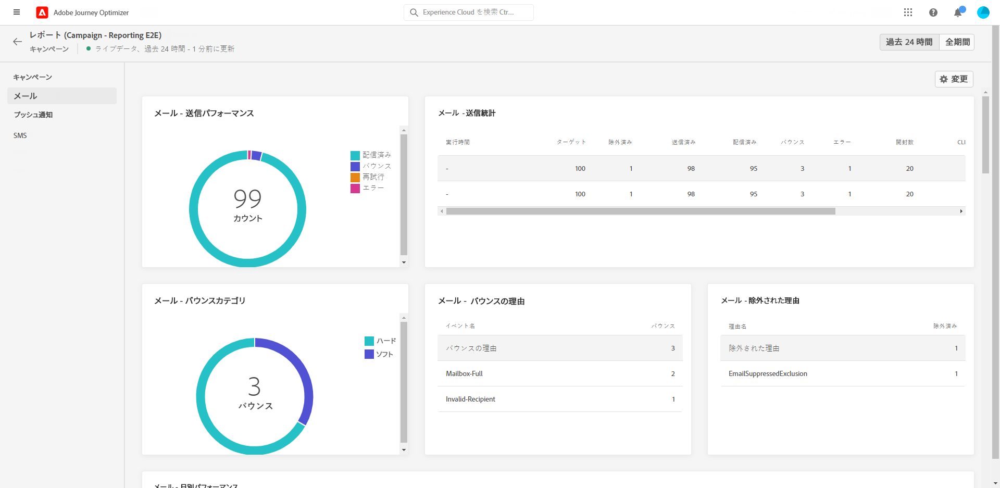
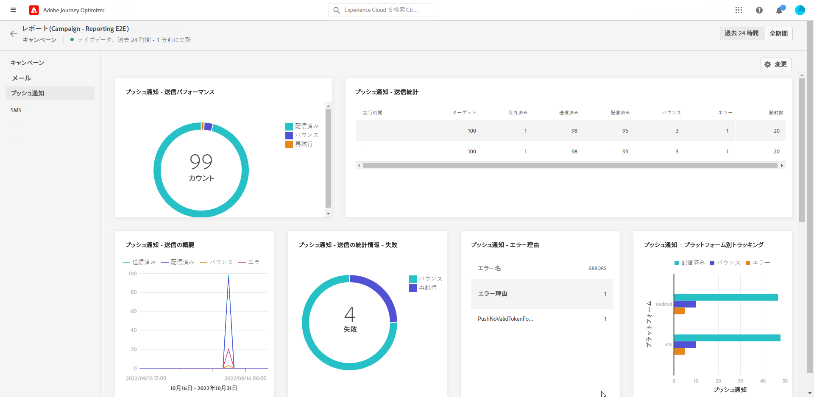
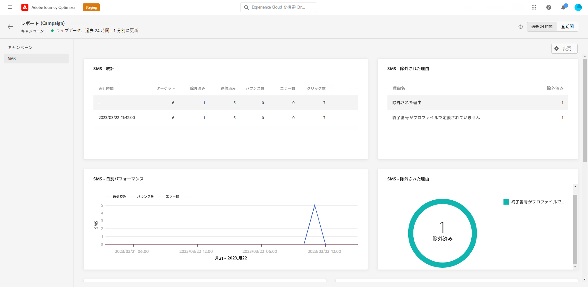

# キャンペーンライブレポート {#campaign-live-report}

キャンペーンライブレポートには、 **[!UICONTROL Live view]** ボタンを使用してキャンペーンから直接アクセスすることができます。

キャンペーン **[!UICONTROL Live report]** ページには、次のタブが表示されます。

* [キャンペーン](#campaign-live)
* [電子メール](#email-live)
* [プル](#push-live)
* [SMS](#sms-live)

**[!UICONTROL Live report]**&#x200B;キャンペーンは、キャンペーンの成功とエラーについての様々な widget に分割されています。各 widget については、必要に応じてサイズ変更や削除を行うことができます。 詳細については、ここを  参照してください。

アドビシステムズ社のオプティマイザーで利用可能なすべてのメトリックスのリストについては、このページ ](live-report.md#list-of-components-live) を [ 参照してください。

## 「キャンペーン」タブ {#campaign-global}

### 先住 {#delivery-global}

Widget には、キャンペーンに関する重要な情報が表示され **[!UICONTROL Campaign Statistics]** ます。

* **[!UICONTROL Entered profiles]**: 旅を開始したプロファイルの数。

<!--
### Experimentation tab (#experimentation-live)

From your Campaign **[!UICONTROL Live report]**, the **[!UICONTROL Experimentation]** tab details the main information relative to how each variant is performing and if there is was winner during the test.
-->

## 電子メールタブ {#email-live}

キャンペーン **[!UICONTROL Live report]** からは、キャンペーンで送信された電子メール配信を基準とした重要な情報がタブに **[!UICONTROL Email]** 表示されます。

電子メールレポートに使用できる様々なメトリックスと widget について詳しくは、+ + + こちらを参照してください。

Widget には、メッセージを基準とした重要な情報が表示され **[!UICONTROL Email Sending Statistics]** ます。

* **[!UICONTROL Delivered]**: 正常に送信されたメッセージの数を指定します。

* **[!UICONTROL Bounces]**: 配信中に発生したエラーの合計数が累積され、戻り処理は自動的に実行されます。

* **[!UICONTROL Errors]**: 配信中に発生したエラーの総数が、プロファイルに送信されるのを防ぐことができます。

テーブルと **[!UICONTROL Email Summary]** グラフは、 **[!UICONTROL Sending metrics by Email]** 配信が成功した場合に、次のことを行います。

* **[!UICONTROL Sent]**: 配布に使用された送信の合計数。

* **[!UICONTROL Delivered]**: 正常に送信されたメッセージの数を指定します。

* **[!UICONTROL Bounces]**: 配信中に発生したエラーの合計数が累積され、戻り処理は自動的に実行されます。

* **[!UICONTROL Errors]**: 配信中に発生したエラーの総数が、プロファイルに送信されるのを防ぐことができます。

* **[!UICONTROL Opens]**: メッセージが配信中に開かれた回数を示します。

* **[!UICONTROL Clicks]**: 配信されたコンテンツをクリックした回数。

* **[!UICONTROL Unsubscribe]**: Unsubscription リンクのクリック回数。

* **[!UICONTROL Spam complaints]**: メッセージがスパムまたは迷惑メールとして宣言された回数。

**[!UICONTROL Bounce Reasons]** **[!UICONTROL Bounce categories]** および **[!UICONTROL Hard and bounce - by Email]** widget には、バウンスメッセージに関連する次のようなデータが含まれています。

* **[!UICONTROL Hard bounce]**: 電子メールアドレスの間違いなどの永続的なエラーの合計数。 これには、不明なユーザーなど、アドレスが無効であることを示すエラーメッセージが表示されます。

* **[!UICONTROL Soft bounce]**: 完全な受信ボックスなど、一時的なエラーの合計数。

* **[!UICONTROL Ignored]**: 「外出中」などの一時的な合計数、または送信者の種類がポストマスターである場合などの技術的なエラーが挙げられます。

**[!UICONTROL Error Reasons]**&#x200B;および **[!UICONTROL Exclude Reasons]** グラフとテーブルを使用すると、配信中に発生したエラーと除外を確認できます。

グラフとテーブルに **[!UICONTROL Email - Top recipient domain]** は、電子メールを開くために受信者が最も頻繁に使用するドメインが詳しく表示されます。
+++

## 「プッシュ通知」タブ {#push-live}

キャンペーン **[!UICONTROL Live report]** から、このタブは **[!UICONTROL Push notification]** 、キャンペーンで送信された配信配信を基準とした重要な情報を表示します。

+ + + プッシュレポートに使用できる様々なメトリックスと widget について詳しくは、こちらを参照してください。

**[!UICONTROL Push notification sending performance]**、ウィジェットによって、 **[!UICONTROL Push notification summary]** メッセージを基準とし **[!UICONTROL Sending metrics - by Push]** た重要な情報が表示されます。

* **[!UICONTROL Sent]**: 配布に使用された送信の合計数。

* **[!UICONTROL Delivered]**: 正常に送信されたメッセージの数を指定します。

* **[!UICONTROL Bounces]**: 配信中に発生したエラーの合計数が累積され、戻り処理は自動的に実行されます。

* **[!UICONTROL Errors]**: 配信中に発生したエラーの総数が、プロファイルに送信されるのを防ぐことができます。

* **[!UICONTROL Opens]**: メッセージが配信中に開かれた回数を示します。

* **[!UICONTROL Actions]**: プッシュ通知で配信されたアクションの合計数 (例えば、ボタンのクリックまたは dismissal)。

* **[!UICONTROL Engagements]**: このプッシュ通知のオープン数とアクション数の合計、つまり、プロファイルからプッシュが開かれたか、ボタンがクリックされたかどうかを示します。

**[!UICONTROL Error Reasons]**&#x200B;および **[!UICONTROL Exclude Reasons]** グラフとテーブルを使用すると、配信中に発生したエラーと除外を確認できます。

この widget を使用すると、 **[!UICONTROL Sending statistics - Failed]** エラーが発生した回数と、バウンスが発生したことを確認できます。

**[!UICONTROL Tracking by platform]** **[!UICONTROL Sending by platform]** 、、グラフ、および **[!UICONTROL Breakdown by platform]** テーブルによって、稼働システムによってはプッシュ通知が成功したかを確認することができます。
+++

## 「SMS」タブ {#sms-live}

キャンペーン **[!UICONTROL Live report]** からは、キャンペーンで送信された SMS 配信に関する重要な情報がタブに **[!UICONTROL SMS]** 表示されます。

、SMS レポートに使用できる様々なメトリックスと widget について詳しく説明します。

以下の表は **[!UICONTROL SMS - Sending statistics]** 、配信が成功したことを示しています。

* **[!UICONTROL Targeted]**&#x200B;この配信には、ターゲットのプロファイルとして認定されるユーザープロファイルの数を指定します。

* **[!UICONTROL Excluded]**: メッセージが配信されなかった対象のプロファイルから除外されたユーザープロファイルの数。

* **[!UICONTROL Sent]**: 配布に使用された送信の合計数。

* **[!UICONTROL Delivered]**: 正常に送信されたメッセージの数を指定します。

* **[!UICONTROL Bounces]**: 配信中に発生したエラーの合計数が累積され、戻り処理は自動的に実行されます。

* **[!UICONTROL Errors]**: 配信中に発生したエラーの総数が、プロファイルに送信されるのを防ぐことができます。

Widget を使用すると、 **[!UICONTROL SMS Performance by date]** グラフでメッセージを基準とした主な情報が詳細に表示されます。

* **[!UICONTROL Sent]**: 配布に使用された送信の合計数。

* **[!UICONTROL Delivered]**: 正常に送信されたメッセージの数を指定します。

* **[!UICONTROL Bounces]**: 配信中に発生したエラーの合計数が累積され、戻り処理は自動的に実行されます。

* **[!UICONTROL Errors]**: 配信中に発生したエラーの総数が、プロファイルに送信されるのを防ぐことができます。

**[!UICONTROL Exclude Reasons]**、 **[!UICONTROL Bounces Reasons]** グラフ、および **[!UICONTROL Error Reasons]** テーブルを使用すると、配信中に発生したエラーと除外を確認することができます。
+++

## その他のリソース

* [キャンペーンの開始](../campaigns/get-started-with-campaigns.md)
* [キャンペーンの作成](../campaigns/create-campaign.md)
* [API トリガキャンペーンの作成](../campaigns/api-triggered-campaigns.md)
* [キャンペーンの変更または停止](../campaigns/modify-stop-campaign.md)
* [キャンペーングローバルレポート](campaign-global-report.md)
