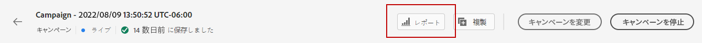

# キャンペーンのライブレポート {#campaign-live-report}

キャンペーンのライブレポートには、 **[!UICONTROL レポート]** 」ボタンをクリックします。

選択後、 **[!UICONTROL 過去 24 時間]** タブ、キャンペーン **[!UICONTROL ライブレポート]** ページが次のタブと共に表示されます。

* [キャンペーン](#campaign-live)
* [メール](#email-live)
* [プッシュ](#push-live)

キャンペーンの&#x200B;**[!UICONTROL ライブレポート]**&#x200B;は、キャンペーンの成功とエラーの詳細を示す様々なウィジェットに分かれています。必要に応じて、各ウィジェットのサイズを変更したり削除したりできます。詳しくは、この[節](../reports/live-report.md#modify-dashboard)を参照してください。

## 「キャンペーン」タブ {#campaign-global}

### 配信 {#delivery-global}

**[!UICONTROL キャンペーン統計]**&#x200B;ウィジェットには、キャンペーンに関連する主な情報の詳細が表示されます。

* **[!UICONTROL エントリしたプロファイル]**：ジャーニーを開始したプロファイルの数。

<!--
### Experimentation tab (#experimentation-live)

From your Campaign **[!UICONTROL Live report]**, the **[!UICONTROL Experimentation]** tab details the main information relative to how each variant is performing and if there is was winner during the test.
-->
## 「メール」タブ {#email-live}

キャンペーンの&#x200B;**[!UICONTROL ライブレポート]**&#x200B;の「**[!UICONTROL メール]**」タブには、キャンペーンで送信されるメール配信に関連する主な情報の詳細が表示されます。

**[!UICONTROL メール送信統計情報]**&#x200B;ウィジェットには、メッセージに関連する主な情報の詳細が表示されます。

* **[!UICONTROL 配信済み]**：送信されたメッセージの合計数に対して、正常に配達できたメッセージの数。

* **[!UICONTROL バウンス]**：送信されたメッセージの総数に対して、配信と自動返信の処理中に発生したエラーの累計。

* **[!UICONTROL エラー]**：配信中に発生し、プロファイルに送信できなかったエラーの合計数。

**[!UICONTROL メール別送信指標]**&#x200B;テーブルと&#x200B;**[!UICONTROL メールの概要]**&#x200B;グラフに、配信が成功した詳細を示します。

* **[!UICONTROL 送信済み]**：配信用に送信した合計数。

* **[!UICONTROL 配信済み]**：送信されたメッセージの合計数に対して、正常に配達できたメッセージの数。

* **[!UICONTROL バウンス]**：送信されたメッセージの総数に対して、配信と自動返信の処理中に発生したエラーの累計。

* **[!UICONTROL エラー]**：配信中に発生し、プロファイルへの送信の妨げとなったエラーの合計数。

* **[!UICONTROL 開封数]**：配信でメッセージが開封された回数。

* **[!UICONTROL クリック数]**：配信でコンテンツがクリックされた回数。

* **[!UICONTROL 購読解除]**：購読解除リンクのクリック数。

* **[!UICONTROL スパムの苦情数]**：メッセージがスパムまたは迷惑メールとして宣言された回数。

**[!UICONTROL バウンス理由]**、**[!UICONTROL バウンスカテゴリ]**、**[!UICONTROL ハードとバウンス - メール別]**&#x200B;などのウィジェットには、バウンスメッセージに関して利用できるデータが含まれます。

* **[!UICONTROL ハードバウンス]**：永続的なエラー（メールアドレスの間違いなど）の合計数。このエラーは、アドレスが無効であることを明示的に示すエラーメッセージ（例：「不明なユーザー」）を伴います。

* **[!UICONTROL ソフトバウンス数]**：一時的なエラー（インボックスが満杯など）の合計数。

* **[!UICONTROL 無視]**：一時的なエラー（不在など）や技術的なエラー（送信者のタイプが postmaster の場合など）の合計数。

**[!UICONTROL エラーの理由]**&#x200B;および&#x200B;**[!UICONTROL 除外された理由]**&#x200B;のグラフとテーブルを使用すると、配信中に発生したエラーと除外を確認できます。

「**[!UICONTROL 電子メール - 上位の受信者ドメイン]**」のグラフと表は、受信者が電子メールを開くために最も多く使用しているドメインの詳細を示しています。

## 「プッシュ」タブ {#push-live}

キャンペーンの&#x200B;**[!UICONTROL ライブレポート]**&#x200B;の「**[!UICONTROL プッシュ]**」タブには、キャンペーンで送信されるプッシュ配信に関連する主な情報の詳細が表示されます。

**[!UICONTROL プッシュ通知の送信パフォーマンス]**、 **[!UICONTROL プッシュ通知の概要]**&#x200B;および&#x200B;**[!UICONTROL 送信指標（プッシュ別）]**&#x200B;の各ウィジェットには、メッセージに関連する主な情報の詳細が表示されます。

* **[!UICONTROL 送信済み]**：配信に対する送信の合計数。

* **[!UICONTROL 配信済み]**：送信されたメッセージの合計数に対して、正常に配達できたメッセージの数。

* **[!UICONTROL バウンス]**：送信されたメッセージの総数に対して、配信と自動返信の処理中に発生したエラーの累計。

* **[!UICONTROL エラー]**：配信中に発生し、プロファイルへの送信の妨げとなったエラーの合計数。

* **[!UICONTROL 開封数]**：配信でメッセージが開封された回数。

* **[!UICONTROL アクション]**：配信されたプッシュ通知に対するアクション（ボタンのクリックや解除など）の合計数。

* **[!UICONTROL エンゲージメント]**：このプッシュ通知に対する開封数とアクション数（「プロファイルがプッシュを開封した」、「ボタンがクリックされた」など）の合計。

**[!UICONTROL エラーの理由]**&#x200B;および&#x200B;**[!UICONTROL 除外された理由]**&#x200B;のグラフとテーブルを使用すると、配信中に発生したエラーと除外を確認できます。

**[!UICONTROL 送信統計 - 失敗]**&#x200B;ウィジェットには、発生したエラーとバウンスの数が表示されます。

**[!UICONTROL プラットフォームごとのトラッキング]**、**[!UICONTROL プラットフォームごとの送信]**、**[!UICONTROL プラットフォームごとの分類]**&#x200B;のグラフとテーブルには、オペレーティングシステムに応じたプッシュ通知の成功の詳細が表示されます。
