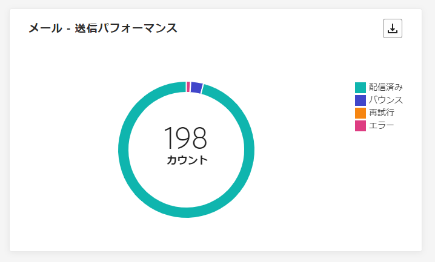

# キャンペーンのライブレポート {#campaign-live-report}

>[!CONTEXTUALHELP]
>id="ajo_campaign_live_report"
>title="キャンペーンのライブレポート"
>abstract="キャンペーンのライブレポートでは、過去 24 時間のみのキャンペーンの効果とパフォーマンスをリアルタイムで測定および視覚化できます。レポートは、キャンペーンの成功とエラーの詳細を示す様々なウィジェットに分かれています。各レポートダッシュボードは、ウィジェットのサイズ変更や削除を行うことで変更できます。"

「過去 24 時間」タブからアクセスできるライブレポートには、過去 24 時間以内に発生したイベントが、イベント発生から最小 2 分の時間間隔で表示されます。これに対し、Customer Journey Analytics レポートでは、少なくとも 2 時間前に発生したイベントに焦点を当て、選択した期間のイベントが表示されます。

キャンペーンのライブレポートは、「**[!UICONTROL ライブ表示]**」ボタンを使用して、キャンペーンから直接アクセスできます。

キャンペーンの&#x200B;**[!UICONTROL ライブレポート]**&#x200B;ページには次のタブが表示されます。

* [キャンペーン](#campaign-live)
* [メール](#email-live)
* [アプリ内](#inapp-live)
* [プッシュ](#push-live)
* [SMS](#sms-live)
* [Web](#web-tab)
* [ダイレクトメール](#direct-mail-tab)

キャンペーンの&#x200B;**[!UICONTROL ライブレポート]**&#x200B;は、キャンペーンの成功とエラーの詳細を示す様々なウィジェットに分かれています。必要に応じて、各ウィジェットのサイズを変更したり削除したりできます。詳しくは、この[節](../reports/live-report.md#modify-dashboard)を参照してください。

Adobe Journey Optimizer で使用可能なすべての指標の詳細なリストについては、[こちらのページ](live-report.md#list-of-components-live)を参照してください。

## 「キャンペーン」タブ {#campaign-live}

### 配信 {#delivery-live}

**[!UICONTROL キャンペーンの統計]**&#x200B;の KPI は、包括的なダッシュボードとして機能し、キャンペーンに関連する過去 24 時間の主要指標の詳細な分類を提供します。これには、配信されたプロファイル数やアクション数など、キャンペーンのパフォーマンスとエンゲージメントを完全に把握できる重要な情報が含まれます。

+++ キャンペーンの統計指標の詳細情報

* **[!UICONTROL オーディエンス]**：ターゲットプロファイルの数。

* **[!UICONTROL 配信されたアクション]**：アクションが配信されたユニーク回数の合計。

* **[!UICONTROL エラー]**：送信プロセス中に発生し、プロファイルへの送信の妨げとなったエラーの合計数。

+++

<!--
### Experimentation tab (#experimentation-live)

From your Campaign **[!UICONTROL Live report]**, the **[!UICONTROL Experimentation]** tab details the main information relative to how each variant is performing and if there is was winner during the test.
-->

## 「メール」タブ {#email-live}

キャンペーンの&#x200B;**[!UICONTROL ライブレポート]**&#x200B;の「**[!UICONTROL メール]**」タブには、キャンペーンで送信されるメール配信に関連する主な情報の詳細が表示されます。

### メール - 送信パフォーマンス {#email-sending-performance}

>[!CONTEXTUALHELP]
>id="ajo_campaign_live_email_sending_statistics"
>title="メール - 送信統計"
>abstract="メール - 送信統計グラフは、過去 24 時間のターゲットや配信など、メールに関する重要なデータを要約します。"

**[!UICONTROL メール - 送信パフォーマンス]**&#x200B;は、過去 24 時間以内に送信されたメールに関連するデータの詳細な概要を提供します。配信済みとバウンス数などの重要な指標に関するインサイトを提供し、メール送信プロセスを詳細に確認できます。

+++ メール送信パフォーマンス指標の詳細情報

* **[!UICONTROL 配信済み]**：正常に送信されたメールの数。

* **[!UICONTROL バウンス数]**：送信プロセスおよび自動返信処理の間に累積したエラーの合計数。

* **[!UICONTROL 再試行]**：再試行のキュー内のメール数。

* **[!UICONTROL エラー]**：送信プロセス中に発生し、プロファイルへの送信の妨げとなったエラーの合計数。
+++

### メール - 統計

>[!CONTEXTUALHELP]
>id="ajo_campaign_live_email_statistics"
>title="メール - 統計"
>abstract="メール - 統計テーブルには、過去 24 時間のメールのプロファイルアクティビティに関するデータが表示されます。"

**[!UICONTROL メール別送信指標]**&#x200B;のテーブルは、過去 24 時間のデータの包括的な概要を示します。ターゲットオーディエンスのサイズや正常に配信されたメールの数など、重要な指標の概要を説明します。これにより、メールキャンペーンの効果とリーチに関する重要なインサイトが得られます。

+++ メール - 統計指標の詳細情報

* **[!UICONTROL 実行時間]**：繰り返しメールの各実行の開始時間。1 つまたは複数の繰り返しメールのみをターゲットにするには、**[!UICONTROL 実行時間]**&#x200B;ドロップダウンから選択します。

* **[!UICONTROL ターゲット]**：送信プロセス中に処理されたメッセージの合計数。

* **[!UICONTROL 除外済み]**：ターゲットプロファイルから除外されメッセージを受信しなかったユーザープロファイルの数。

* **[!UICONTROL 送信済み]**：送信の合計数。

* **[!UICONTROL 配信済み]**：正常に送信されたメッセージ数。

* **[!UICONTROL バウンス数]**：送信プロセスおよび自動返信処理の間に累積したエラーの合計数。

* **[!UICONTROL エラー]**：配信中に発生してプロファイルに送信できない原因となったエラーの合計数。

* **[!UICONTROL 開封数]**：メッセージが開封された回数。

* **[!UICONTROL クリック数]**：コンテンツがクリックされた回数。

* **[!UICONTROL 購読解除]**：購読解除リンクのクリック数。

* **[!UICONTROL スパムのの苦情数]**：メッセージがスパムまたはジャンクとして宣言された回数。

* **[!UICONTROL 再試行]**：再試行のキュー内のメール数。
+++

### メール - バウンスのカテゴリと理由 {#bounce-categories}

>[!CONTEXTUALHELP]
>id="ajo_campaign_live_email_bounce_categories"
>title="メール - バウンスカテゴリ"
>abstract="メール - バウンスカテゴリのグラフとテーブルには、過去 24 時間の一時的なエラーと永続的なエラーの両方に関するデータが表示されます。"

>[!CONTEXTUALHELP]
>id="ajo_campaign_live_email_bounce_reasons"
>title="メール - バウンス理由"
>abstract="メール - バウンス理由のグラフとテーブルには、過去 24 時間のバウンスメッセージに関連して使用可能なデータが含まれています。"

**[!UICONTROL バウンスの理由]**&#x200B;および&#x200B;**[!UICONTROL バウンスのカテゴリ]**&#x200B;のウィジェットは、バウンスしたメッセージに関連する過去 24 時間の使用可能なデータを集計し、メールのバウンスの背後にある特定の理由とカテゴリに関する詳細なインサイトを提供します。

バウンスについて詳しくは、[抑制リスト](../reports/suppression-list.md)のページを参照してください。

+++ メール - バウンスのカテゴリと理由指標の詳細情報

* **[!UICONTROL ハードバウンス]**：永続的なエラー（メールアドレスの間違いなど）の合計数。このエラーは、アドレスが無効であることを明示的に示すエラーメッセージ（例：「不明なユーザー」）を伴います。

* **[!UICONTROL ソフトバウンス数]**：一時的なエラー（インボックスが満杯など）の合計数。

* **[!UICONTROL 無視]**：一時的なエラー（不在など）や技術的なエラー（送信者のタイプが postmaster の場合など）の合計数。

+++

### メール - 日別のパフォーマンス {#email-performance-date}

>[!CONTEXTUALHELP]
>id="ajo_campaign_live_email_performance_bydate"
>title="メール - 日別のパフォーマンス"
>abstract="メール - 日別パフォーマンスのグラフには、送信されたメールに関する過去 24 時間の包括的なデータが表示され、配信やバウンスなどの主要指標に関するインサイトが提供され、メール送信プロセスの詳細な分析を提供します。"

**[!UICONTROL メール - 日別のパフォーマンス]**&#x200B;のウィジェットは、メッセージに関する主要情報の詳細な概要をグラフで示し、過去 24 時間のパフォーマンスのトレンドに関するインサイトを提供します。

+++ メール - 日別のパフォーマンスと理由指標の詳細情報

* **[!UICONTROL 送信済み]**：送信の合計数。

* **[!UICONTROL 配信済み]**：正常に送信されたメッセージ数。

* **[!UICONTROL バウンス数]**：送信プロセスおよび自動返信処理の間に累積したエラーの合計数。

* **[!UICONTROL エラー]**：配信中に発生してプロファイルに送信できない原因となったエラーの合計数。

* **[!UICONTROL 開封数]**：メッセージが開封された回数。

* **[!UICONTROL クリック数]**：コンテンツがクリックされた回数。

* **[!UICONTROL 購読解除]** : 購読解除リンクのクリック数。

* **[!UICONTROL スパムのの苦情数]**：メッセージがスパムまたはジャンクとして宣言された回数。

+++

### エラー理由 {#email-error-reasons}

>[!CONTEXTUALHELP]
>id="ajo_campaign_live_email_error_reasons"
>title="メール - エラー理由"
>abstract="メール - エラー理由のグラフとテーブルを使用すると、過去 24 時間の送信プロセス中に発生した特定のエラーを特定できます。"

**[!UICONTROL エラー理由]**&#x200B;のグラフとテーブルは、過去 24 時間に送信プロセス中に発生した特定のエラーについてのインサイトを提供します。この情報は、エラーの特性と頻度を理解するのに役立ちます。

### 除外された理由 {#email-exclude-reasons}

>[!CONTEXTUALHELP]
>id="ajo_campaign_live_email_excluded_reasons"
>title="メール - 除外された理由"
>abstract="「除外された理由」グラフとテーブルには、対象のオーディエンスから除外され、過去 24 時間にメッセージを受信しなかった、ユーザープロファイルにつながった様々な要因が表示されます。"

**[!UICONTROL 除外された理由]**&#x200B;のグラフとテーブルは、過去 24 時間のターゲットオーディエンスからユーザープロファイルが除外された様々な要因に関する包括的な見解を提供します。

除外理由の包括的なリストについては、[このページ](exclusion-list.md)を参照してください。

### メール - 最適な受信者ドメイン {#email-best-recipient}

>[!CONTEXTUALHELP]
>id="ajo_campaign_live_email_best_recipient"
>title="メール - 最適な受信者ドメイン"
>abstract="メール - 最適な受信者ドメインのグラフとテーブルには、受信者がメールを開くのに最も頻繁に使用するドメインの詳細な分類が表示され、過去 24 時間の受信者の行動に関する有益なインサイトが提供されます。"

**[!UICONTROL メール - 最適な受信者ドメイン]**&#x200B;のグラフとテーブルは、過去 24 時間にプロファイルがメールを開封する際に最も頻繁に使用したドメインの詳細な分類を提供します。これにより、プロファイルの行動に関する重要なインサイトが得られ、好まれるプラットフォームを理解するのに役立ちます。

### メール - オファー {#email-offers}

>[!NOTE]
>
>オファーのウィジェットと指標は、決定がメールに挿入された場合にのみ使用できます。 意思決定管理について詳しくは、[このページ](../offers/get-started/starting-offer-decisioning.md)を参照してください。

**[!UICONTROL オファー統計]**&#x200B;および&#x200B;**[!UICONTROL オファー統計の推移]**&#x200B;のウィジェットは、オファーの成功とターゲットオーディエンスに対する影響を測定します。メッセージに関連する主な情報について、KPI を使用して詳しく説明します。

+++ メール - オファー指標の詳細情報

* **[!UICONTROL 送信されたオファー]**：オファーの送信の合計数。

* **[!UICONTROL オファーのインプレッション]**：メールのオファーが開封された回数。

* **[!UICONTROL オファーのクリック数]**：メールでオファーがクリックされた回数。

+++

## 「アプリ内」タブ {#inapp-live}

キャンペーンの&#x200B;**[!UICONTROL ライブレポート]**&#x200B;の「**[!UICONTROL アプリ内]**」タブには、キャンペーンで送信されたアプリ内配信メッセージに関連する主な情報の詳細が表示されます。

### アプリ内パフォーマンス {#inapp-performance}

>[!CONTEXTUALHELP]
>id="ajo_campaign_live_inapp_performance"
>title="アプリ内パフォーマンス"
>abstract="アプリ内パフォーマンス KPI は、過去 24 時間の訪問者のアプリ内メッセージに対するエンゲージメントに関する重要なインサイトを提供します。"

**[!UICONTROL アプリ内パフォーマンス]**&#x200B;の KPI は、過去 24 時間のプロファイルのアプリ内メッセージにおけるエンゲージメントに関する重要なインサイトを提供し、アプリ内キャンペーンの有効性と影響を評価するための重要な指標を提供します。

+++ アプリ内パフォーマンス指標の詳細情報

* **[!UICONTROL インプレッション数]**：すべてのユーザーに送信されたアプリ内メッセージの合計数。

* **[!UICONTROL インタラクション数]**：アプリ内メッセージとのエンゲージメントの合計数。これには、クリック、解除またはその他のやり取りなど、ユーザーが実行したすべてのアクションが含まれます。

+++

### アプリ内の概要 {#inapp-summary}

>[!CONTEXTUALHELP]
>id="ajo_campaign_live_inapp_summary"
>title="アプリ内の概要"
>abstract="アプリ内概要グラフは、過去 24 時間のアプリ内インプレッション数およびインタラクション数の進行状況を示します。"

**[!UICONTROL アプリ内の概要]**&#x200B;のグラフは、過去 24 時間のアプリ内インプレッション数とインタラクション数の進行状況を示し、アプリ内メッセージのパフォーマンスの包括的な概要を示します。

+++ アプリ内の概要指標の詳細情報

* **[!UICONTROL インプレッション数]**：すべてのユーザーに配信されたアプリ内メッセージの合計数。

* **[!UICONTROL インタラクション数]**：アプリ内メッセージとのエンゲージメントの合計数。これには、クリック、解除またはその他のやり取りなど、ユーザーが実行したすべてのアクションが含まれます。

+++

### タイプ別インタラクション数 {#inapp-interactions}

>[!CONTEXTUALHELP]
>id="ajo_campaign_live_inapp_interactions"
>title="タイプ別インタラクション数"
>abstract="タイプ別インタラクション数のグラフとテーブルは、過去 24 時間のクリック、破棄、インタラクションを追跡して、ユーザーがアプリ内メッセージに対して行った操作の詳細を示します。"

**[!UICONTROL タイプ別インタラクション数]**&#x200B;のグラフとテーブルは、過去 24 時間にプロファイルがアプリ内メッセージでどのようなやり取りを行ったかに関する詳細な説明を提供し、クリック、解除またはその他の形式のエンゲージメントなどのアクションを追跡します。

## 「プッシュ通知」タブ {#push-live}

キャンペーンの&#x200B;**[!UICONTROL ライブレポート]**&#x200B;の「**[!UICONTROL プッシュ通知]**」タブには、キャンペーンで送信されるプッシュ配信に関連する主な情報の詳細が表示されます。

### プッシュ通知 - 送信パフォーマンス {#push-sending-performance}

>[!CONTEXTUALHELP]
>id="ajo_campaign_live_push_sending_performance"
>title="プッシュ通知 - 送信パフォーマンス"
>abstract="プッシュ通知送信パフォーマンスのグラフは、過去 24 時間のエラーメッセージや配信済みメッセージなど、プッシュ通知に関する重要なデータを要約します。"

**[!UICONTROL プッシュ通知の送信パフォーマンス]**&#x200B;のグラフでは、過去 24 時間以内に送信されたプッシュ通知に関連するデータの詳細な概要を提供します。配信済みとバウンスなどの重要な指標に関するインサイトを提供し、プッシュ通知の送信プロセスを詳細に確認できます。

+++ プッシュ通知 - 送信パフォーマンス指標の詳細情報

* **[!UICONTROL 配信済み]**：正常に送信されたメッセージ数。

* **[!UICONTROL バウンス数]**：送信プロセスおよび自動返信処理の間に累積したエラーの合計数。

* **[!UICONTROL エラー数]**：送信プロセス中に発生し、プロファイルへの送信の妨げとなったエラーの合計数。

+++

### プッシュ通知 - 統計 {#push-statistics}

>[!CONTEXTUALHELP]
>id="ajo_campaign_live_push_statistics"
>title="プッシュ通知 - 統計"
>abstract="プッシュ統計テーブルには、過去 24 時間のプッシュ通知の受信者アクティビティに関するデータが表示されます。"

**[!UICONTROL プッシュ通知 - 統計]**&#x200B;のテーブルは、ターゲットメッセージ数や正常に配信されたメッセージ数などの主要指標を含め、過去 24 時間以内のプッシュ通知に関連する重要なデータの簡潔な概要を示します。

+++ プッシュ通知 - 統計指標の詳細情報

* **[!UICONTROL 実行時間]**：繰り返しプッシュ通知の各実行の開始時間。1 つまたは複数の繰り返しプッシュ通知のみをターゲットにするには、**[!UICONTROL 実行時間]**&#x200B;ドロップダウンから選択します。

* **[!UICONTROL ターゲット]**：送信プロセス中に処理されたメッセージの合計数。

* **[!UICONTROL 除外済み]**：ターゲットプロファイルから除外されメッセージを受信しなかったユーザープロファイルの数。

* **[!UICONTROL 送信済み]**：送信の合計数。

* **[!UICONTROL 配信済み]**：正常に送信されたメッセージ数。

* **[!UICONTROL バウンス数]**：送信プロセスおよび自動返信処理の間に累積したエラーの合計数。

* **[!UICONTROL エラー]**：配信中に発生してプロファイルに送信できない原因となったエラーの合計数。

* **[!UICONTROL 開封数]**：メッセージが開封された回数。

+++

### プッシュ通知 - 送信の概要 {#push-sending-summary}

>[!CONTEXTUALHELP]
>id="ajo_campaign_live_push_sending_summary"
>title="プッシュ通知 - 送信の概要"
>abstract="プッシュ通知送信の概要グラフには、過去 24 時間に送信されたプッシュ通知で使用可能なデータが表示されます。"

**[!UICONTROL プッシュ通知 - 統計]**&#x200B;のグラフは、過去 24 時間のプッシュ通知アクティビティの分析を動的な表現で表示します。このグラフでは、送信されたプッシュ通知の包括的な分類を示します。

+++ プッシュ通知 - 送信の概要指標の詳細情報

* **[!UICONTROL 開封数]**：プッシュ通知が開封された回数。

* **[!UICONTROL アクション]**：配信されたプッシュ通知に対するアクション（ボタンのクリックや解除など）の合計数。

* **[!UICONTROL バウンス数]**：送信されたメッセージの合計数に対する、累計エラー数および自動返信処理の合計数。

* **[!UICONTROL 配信済み]**：送信されたメッセージの合計数に対して、正常に配達できたメッセージの数。

* **[!UICONTROL エラー]**：プロファイルへの送信を妨げたエラーの合計数。

+++

### プッシュ通知 - 除外された理由 {#push-excluded}

>[!CONTEXTUALHELP]
>id="ajo_campaign_live_push_excluded_reasons"
>title="プッシュ通知 - 除外された理由"
>abstract="「除外された理由」グラフとテーブルには、対象のオーディエンスから除外され、過去 24 時間にメッセージを受信しなかった、ユーザープロファイルにつながった様々な要因が表示されます。"

**[!UICONTROL 除外された理由]**&#x200B;のグラフとテーブルは、ターゲットプロファイルから除外されたユーザープロファイルが、過去 24 時間でプッシュ通知を受信できない様々な理由が表示されます。

除外理由の包括的なリストについては、[このページ](exclusion-list.md)を参照してください。

### プッシュ通知 - エラー理由 {#push-error}

>[!CONTEXTUALHELP]
>id="ajo_campaign_live_push_error_reasons"
>title="プッシュ通知 - エラー理由"
>abstract="エラー理由のグラフとテーブルを使用して、過去 24 時間の送信プロセス中に発生した特定のエラーを特定できます。"

**[!UICONTROL エラー理由]**&#x200B;のテーブルとグラフは、過去 24 時間以内にプッシュ通知の送信プロセス中に発生した特定のエラーを識別することができ、進行中に発生した問題に関する詳細なインサイトを提供します。

### プッシュ通知 - プラットフォームごとの分類 {#push-breakdown-platform}

>[!CONTEXTUALHELP]
>id="ajo_campaign_live_push_breakdown_platform"
>title="プッシュ通知 - プラットフォームごとの分類"
>abstract="プラットフォームごとの分類のグラフとテーブルには、過去 24 時間のプッシュ通知の成功の分類が、受信者のオペレーティングシステムに基づいて表示されます。"

**[!UICONTROL プッシュ通知 - プラットフォームごとの分類]**&#x200B;のグラフとテーブルは、過去 24 時間の正常に行われたプッシュ通知の詳細な分析を提供し、プロファイルのオペレーティングシステムに基づいたインサイトを示します。この分類により、様々なプラットフォームでのプッシュ通知のパフォーマンスをさらに把握できます。

+++ プッシュ通知 - プラットフォームごとの分類指標の詳細情報

* **[!UICONTROL ターゲット]**：分析中に処理されたメッセージの合計数。

* **[!UICONTROL 配信済み]**：送信されたメッセージの合計数に対して、正常に送信されたメッセージの数。

* **[!UICONTROL 開封数]**：プッシュ通知が開封された回数。

* **[!UICONTROL アクション]**：配信されたプッシュ通知に対するアクション（ボタンのクリックや解除など）の合計数。

* **[!UICONTROL バウンス数]**：送信されたメッセージの合計数に対する、累計エラー数および自動返信処理の合計数。

* **[!UICONTROL エラー]**：プロファイルへの送信の妨げとなったエラーの合計数。

* **[!UICONTROL 除外済み]**：Adobe Journey Optimizer によって除外されたプロファイルの数。

+++

## 「SMS」タブ {#sms-live}

キャンペーンの&#x200B;**[!UICONTROL ライブレポート]**&#x200B;の「**[!UICONTROL SMS]**」タブには、キャンペーンで送信される SMS メッセージに関連する主な情報の詳細が表示されます。

### SMS - 統計 {#sms-statistics}

>[!CONTEXTUALHELP]
>id="ajo_campaign_live_sms_statistics"
>title="SMS - 統計"
>abstract="SMS 送信統計のテーブルは、過去 24 時間のターゲットメッセージや配信済みメッセージなど、SMS メッセージに関する重要なデータを要約します。"

**[!UICONTROL SMS - 統計]**&#x200B;のテーブルは、ターゲットメッセージの数や正常に配信されたメッセージの数などの主要指標を含む、過去 24 時間以内の SMS メッセージに関連する重要なデータの簡潔な概要を示します。

+++ SMS - 統計指標の詳細情報

* **[!UICONTROL 実行時間]**：繰り返し SMS メッセージの各実行の開始時間。1 つまたは複数の繰り返し SMS メッセージのみをターゲットにするには、**[!UICONTROL 実行時間]**&#x200B;ドロップダウンから選択します。

* **[!UICONTROL ターゲット]**：ターゲットプロファイルとして適合するユーザープロファイルの数。

* **[!UICONTROL 除外済み]**：ターゲットプロファイルから除外されメッセージを受信しなかったユーザープロファイルの数。

* **[!UICONTROL 送信済み]**：送信の合計数。

* **[!UICONTROL バウンス数]**：送信プロセスおよび自動返信処理の間に累積したエラーの合計数。

* **[!UICONTROL エラー]**：配信中に発生してプロファイルに送信できない原因となったエラーの合計数。

* **[!UICONTROL クリック数]**：URL 訪問の合計数。

+++

### SMS - 日別パフォーマンス {#sms-perfomance-date}

>[!CONTEXTUALHELP]
>id="ajo_campaign_live_sms_performance"
>title="SMS - 日別パフォーマンス"
>abstract="日付別 SMS パフォーマンスのウィジェットには、過去 24 時間のメッセージに関する重要な情報がグラフで表示されます。"

**[!UICONTROL SMS の日別パフォーマンス]**&#x200B;のウィジェットは、メッセージに関する主要情報の詳細な概要をグラフで示し、過去 24 時間のパフォーマンスのトレンドに関するインサイトを提供します。

+++ SMS - 日別パフォーマンス指標の詳細情報

* **[!UICONTROL 送信済み]**：送信の合計数。

* **[!UICONTROL バウンス数]**：送信プロセスおよび自動返信処理の間に累積したエラーの合計数。

* **[!UICONTROL エラー]**：配信中に発生してプロファイルに送信できない原因となったエラーの合計数。

+++

### SMS - エラー理由 {#sms-error-reasons}

>[!CONTEXTUALHELP]
>id="ajo_campaign_live_sms_error_reasons"
>title="SMS - エラー理由"
>abstract="SMS - エラー理由のグラフとテーブルを使用すると、過去 24 時間の送信プロセス中に発生した特定のエラーを識別できます。"

**[!UICONTROL 除外された理由]**&#x200B;のグラフとテーブルを使用すると、過去 24 時間以内に SMS メッセージの送信プロセス中に発生した特定のエラーを識別し、発生した問題を徹底的に分析できます。

### SMS - 除外された理由 {#sms-excluded-reasons}

>[!CONTEXTUALHELP]
>id="ajo_campaign_live_sms_excluded_reasons"
>title="SMS - 除外された理由"
>abstract="「除外された理由」グラフとテーブルには、対象のオーディエンスから除外され、過去 24 時間にメッセージを受信しなかった、ユーザープロファイルにつながった様々な要因が表示されます。"

**[!UICONTROL 除外された理由]**&#x200B;のグラフとテーブルでは、ターゲットオーディエンスからユーザープロファイルが除外され、過去 24 時間に SMS メッセージを受信できない原因となった様々な要因を視覚的に示します。

除外理由の包括的なリストについては、[このページ](exclusion-list.md)を参照してください。

### SMS - バウンスの理由 {#sms-bounces-reasons}

>[!CONTEXTUALHELP]
>id="ajo_campaign_live_sms_bounces_reasons"
>title="SMS - バウンスの理由"
>abstract="バウンス理由のグラフとテーブルには、バウンスメッセージに関連する過去 24 時間のデータが含まれています。"

**[!UICONTROL バウンスの理由]**&#x200B;のグラフとテーブルは、バウンスした SMS メッセージに関するデータの包括的な概要を提供し、過去 24 時間に SMS メッセージがバウンスした特定の理由に関する重要なインサイトを表示します。

## 「Web」タブ {#web-tab}

キャンペーンの&#x200B;**[!UICONTROL ライブレポート]**&#x200B;の「**[!UICONTROL Web]**」タブには、web ページに関連する主な情報の詳細が表示されます。

### Web パフォーマンス {#web-performance}

>[!CONTEXTUALHELP]
>id="ajo_campaign_live_web_performance"
>title="Web パフォーマンス"
>abstract="Web パフォーマンス KPI では、過去 24 時間の訪問者の web エクスペリエンスに対するエンゲージメントに関する包括的な情報を提供します。"

**[!UICONTROL Web パフォーマンス]**&#x200B;の KPI は、インプレッション数やインタラクション数などの主要指標を含む、過去 24 時間の訪問者の web ページでのエンゲージメントに関する包括的なインサイトを提供します。

+++ Web パフォーマンス指標の詳細情報

* **[!UICONTROL インプレッション数]**：すべてのユーザーに配信された web エクスペリエンスの合計数。

* **[!UICONTROL インタラクション数]**：Web ページに対するエンゲージメントの合計数。これには、クリックやその他のインタラクションなど、ユーザーが実行したすべてのアクションが含まれます。

+++

### Web の概要 {#web-summary}

>[!CONTEXTUALHELP]
>id="ajo_campaign_live_web_summary"
>title="Web の概要"
>abstract="Web 概要グラフでは、過去 24 時間の web エクスペリエンス（インプレッション数、ユニークインプレッション数、インタラクション数）の変化を確認できます。"

**[!UICONTROL Web の概要]**&#x200B;のグラフでは、過去 24 時間の web エクスペリエンス（インプレッション数、ユニークインプレッション数、インタラクション数）の変化を確認できます。

+++ Web の概要指標の詳細情報

* **[!UICONTROL インプレッション数]**：すべてのユーザーに配信された web エクスペリエンスの合計数。

* **[!UICONTROL インタラクション数]**：Web ページに対するエンゲージメントの合計数。これには、クリックやその他のインタラクションなど、ユーザーが実行したすべてのアクションが含まれます。

+++

### 要素別インタラクション数 {#web-interactions}

>[!CONTEXTUALHELP]
>id="ajo_campaign_live_web_interactions"
>title="要素別インタラクション数"
>abstract="要素別インタラクション数のテーブルには、web ページ上の様々な要素に対する過去 24 時間の訪問者のエンゲージメントに関する重要な情報が表示されます。"

**[!UICONTROL 要素別インタラクション数]**&#x200B;のテーブルは、過去 24 時間の web ページの様々な要素に対する訪問者のエンゲージメントに関する包括的な情報を表示し、ユーザーのやり取りや好みに関する重要なインサイトを提供します。

## 「ダイレクトメール」タブ {#direct-mail-tab}

キャンペーンの&#x200B;**[!UICONTROL ライブレポート]**&#x200B;の「**[!UICONTROL ダイレクトメール]**」タブには、ダイレクトメールに関連する主な情報の詳細が表示されます。

### ダイレクトメール - 送信統計 {#direct-mail-sending}

>[!CONTEXTUALHELP]
>id="ajo_campaign_live_direct_sending_statistics"
>title="ダイレクトメール - 送信統計"
>abstract="ダイレクトメール送信統計テーブルは、ターゲットメッセージや配信済みメッセージなど、ダイレクトメールメッセージに関する過去 24 時間の重要なデータを要約します。"

**[!UICONTROL ダイレクトメール - 送信統計]**&#x200B;のテーブルは、ターゲットメッセージ数や過去 24 時間以内に正常に配信されたメッセージの数などの主要指標を含む、ダイレクトメールメッセージに関する重要なデータの簡潔な概要を示します。

+++ ダイレクトメール - 送信統計指標の詳細情報

* **[!UICONTROL ターゲット]**：ターゲットプロファイルとして認定されるユーザープロファイルの数。

* **[!UICONTROL 送信済み]**：送信の合計数。

* **[!UICONTROL エラー]**：配信中に発生してプロファイルに送信できない原因となったエラーの合計数。

* **[!UICONTROL 除外済み]**：ターゲットプロファイルから除外され、ダイレクトメールを受信しなかったユーザープロファイルの数。

+++

### ダイレクトメール - エラー理由 {#direct-mail-error-reasons}

>[!CONTEXTUALHELP]
>id="ajo_campaign_live_direct_error_reasons"
>title="ダイレクトメール - エラー理由"
>abstract="ダイレクトメール - エラー理由のグラフとテーブルを使用して、過去 24 時間に発生した特定のエラーを特定できます。"

**[!UICONTROL ダイレクトメール - エラー理由]**&#x200B;のグラフとテーブルは、ダイレクトメールメッセージの送信プロセス中に発生した特定のエラーを識別する手段を提供し、過去 24 時間に発生した問題を詳細に分析できます。

### ダイレクトメール - 除外された理由 {#direct-mail-excluded-reasons}

>[!CONTEXTUALHELP]
>id="ajo_campaign_live_direct_excluded_reasons"
>title="ダイレクトメール - 除外された理由"
>abstract="ダイレクトメール除外理由のグラフとテーブルには、対象のオーディエンスから除外され、過去 24 時間にメッセージを受信しなかった、ユーザープロファイルにつながった様々な要因が表示されます。"

**[!UICONTROL ダイレクトメール - 除外された理由]**&#x200B;のグラフとテーブルには、ターゲットオーディエンスからユーザープロファイルを除外した結果、過去 24 時間にダイレクトメールメッセージを受信できない原因となった様々な要因が視覚的に表示されます。

除外された理由の包括的なリストについては、[このページ](exclusion-list.md)を参照してください。

## その他のリソース

* [キャンペーンの基本を学ぶ](../campaigns/get-started-with-campaigns.md)
* [キャンペーンの作成](../campaigns/create-campaign.md)
* [API トリガーキャンペーンの作成](../campaigns/api-triggered-campaigns.md)
* [キャンペーンの変更または停止](../campaigns/modify-stop-campaign.md)
* [キャンペーンレポート](campaign-global-report-cja.md)
