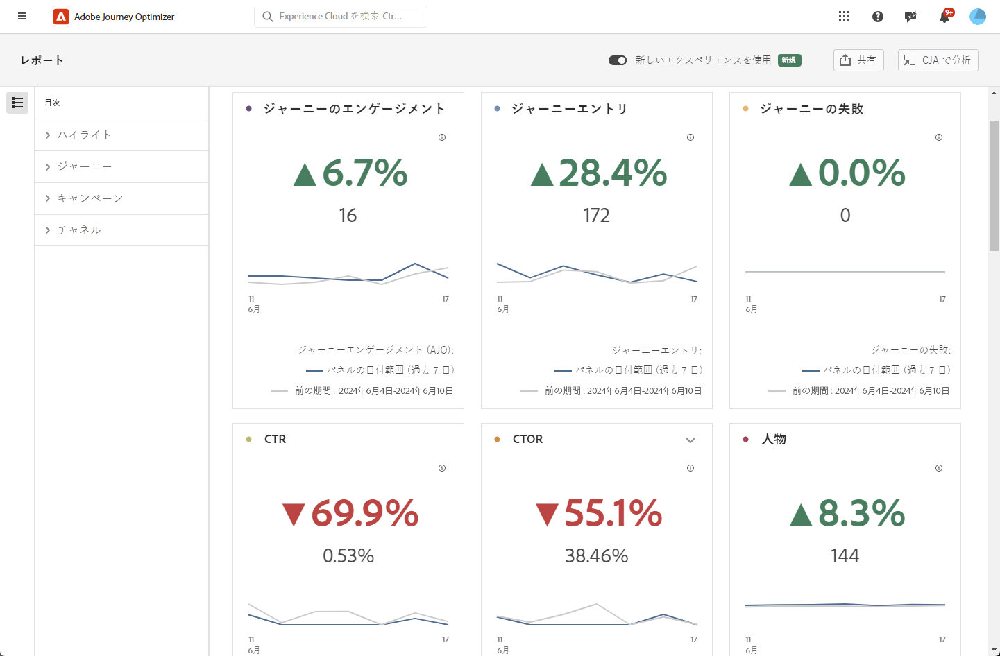
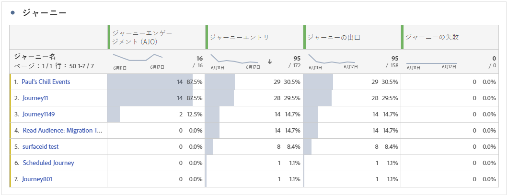
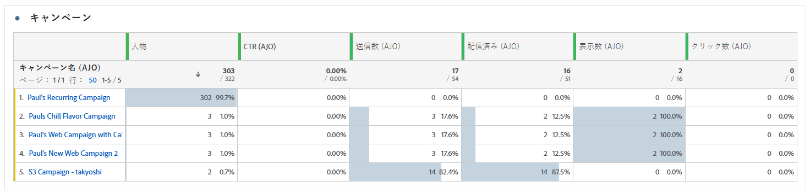
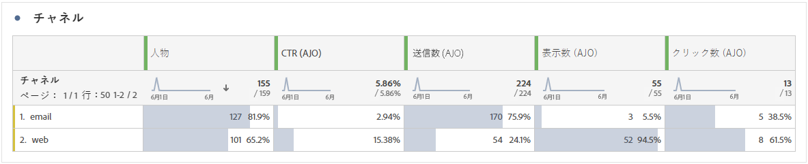
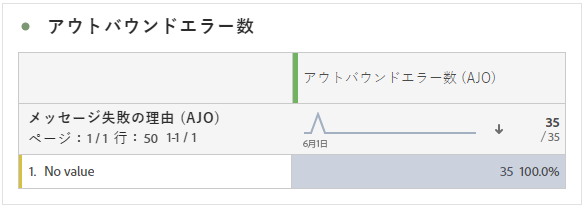
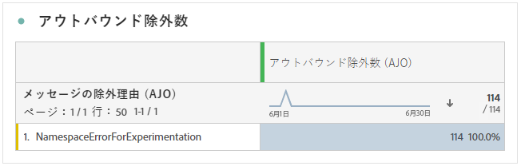

# 概要レポート {#channel-report-cja}

概要レポートでは、環境内のすべてのキャンペーンとジャーニーに対するトラフィック指標とエンゲージメント指標の完全な概要がユーザーに提供されます。これらの指標を組み合わせることで、様々なキャンペーンやジャーニーを含む様々なチャネルからのアクションに対して統一された値が表示されます。

概要レポートにアクセスするには、「**ジャーニー管理**」セクション内の&#x200B;**レポート**&#x200B;メニューに移動します。

次のタブを含むレポートページが表示されます。

* [ジャーニー](#journey)
* [キャンペーン](#campaign)
* [チャネル](#channel)
* [ルールセット](#rule-sets)

Customer Journey Analytics ワークスペースと、データのフィルタリングおよび分析方法について詳しくは、[このページ](https://experienceleague.adobe.com/ja/docs/analytics-platform/using/cja-workspace/home)を参照してください。

## ハイライト {#highlights}

**[!UICONTROL ハイライト]**&#x200B;の KPI は、環境内のすべてのキャンペーンとジャーニーの主要指標の詳細な分類を提供、およびパフォーマンスを迅速に評価して改善領域を特定する、包括的なダッシュボードとして機能します。

+++ 詳しくは、ハイライト指標を参照してください

* **[!UICONTROL ジャーニーのエンゲージメント]**：ジャーニーの指定されたアクションポイントに到達した個別のプロファイルを表す、ジャーニーを通じて送信されたメッセージを受信した一意の個人の合計数。

* **[!UICONTROL ジャーニーのエントリ数]**：ジャーニーのエントリイベントに到達した個人の合計数。

* **[!UICONTROL ジャーニーの失敗数]**：正常に実行されなかった個別ジャーニーの合計数。

* **[!UICONTROL クリックスルー率]**：メッセージでのクリック数の割合。

* **[!UICONTROL クリックスルー開封率（CTOR）]**：メッセージが開封された回数。

* **[!UICONTROL 人物]**：メッセージのターゲットプロファイルに適格な、ユーザープロファイルの数。

* **[!UICONTROL クリック数]**：メッセージでコンテンツがクリックされた回数。

* **[!UICONTROL スパムの苦情数]**：メッセージがスパムまたはジャンクとして宣言された回数。

* **[!UICONTROL 登録解除]**：登録解除リンクのクリック数。

+++

## ジャーニー {#journey}

**[!UICONTROL ジャーニー]**&#x200B;のテーブルは、ジャーニーに関連する主要指標の分析を提供する、包括的なダッシュボードとして機能します。これには、エントリ済みプロファイルの数や失敗した個々のジャーニーのインスタンスなどの詳細が含まれ、ジャーニーの効果とエンゲージメントレベルを徹底的に理解できます。

このテーブルにリストされているジャーニーの名前をクリックすると、各ジャーニーを個別に簡単に調べ、新しいタブでその包括的なレポートにすぐにアクセスできます。

+++ 詳しくは、ジャーニー指標を参照してください

* **[!UICONTROL ジャーニーのエントリ数]**：ジャーニーのエントリイベントに到達した個人の合計数。

* **[!UICONTROL ジャーニーの退出数]**：ジャーニーから退出した個人の合計数。

* **[!UICONTROL ジャーニーの失敗数]**：正常に実行されなかった個人のジャーニーの合計数。

+++

## キャンペーン {#campaign}

**[!UICONTROL キャンペーン]**&#x200B;のテーブルは、キャンペーンの重要な指標の詳細な概要を表示する、包括的なダッシュボードとして機能します。プロファイル数や送信数などの重要なデータを表示し、キャンペーンのパフォーマンスレベルとエンゲージメントレベルに関する包括的なインサイトを提供します。

このテーブルにリストされているキャンペーンの名前をクリックすると、各キャンペーンを個別に簡単に調べることができ、新しいタブでその包括的なレポートにすぐにアクセスできます。

+++ 詳しくは、キャンペーン指標を参照してください

* **[!UICONTROL ユーザー]**：メッセージのターゲットプロファイルに適格な、ユーザープロファイルの数。

* **[!UICONTROL クリックスルー率（CTR）]**：メッセージでのクリック数の割合。

* **[!UICONTROL 送信数]**：各キャンペーンの送信の合計数。

* **[!UICONTROL 配信済み]**：正常に送信されたメッセージ数。

* **[!UICONTROL 表示数]**：メッセージが開封された回数。

* **[!UICONTROL クリック数]**：メッセージでコンテンツがクリックされた回数。

+++

## チャネル {#channel}

### チャネル

**[!UICONTROL チャネル]**&#x200B;のテーブルには、チャネルレベルでのメッセージに対するプロファイルのエンゲージメントの詳細な分類が表示されます。これにより、様々なチャネルのパフォーマンスに関するより深いインサイトを得ることができます。

+++ 詳しくは、チャネル指標を参照してください

* **[!UICONTROL ユーザー]**：メッセージのターゲットプロファイルに適格な、ユーザープロファイルの数。

* **[!UICONTROL クリックスルー率（CTR）]**：メッセージでのクリック数の割合。

* **[!UICONTROL 配信済み]**：正常に送信されたメッセージ数。

* **[!UICONTROL 表示数]**：メッセージが開封された回数。

* **[!UICONTROL クリック数]**：メッセージでコンテンツがクリックされた回数。

+++

### アウトバウンドエラー数

**[!UICONTROL アウトバウンドエラー数]**&#x200B;のテーブルを使用すると、送信プロセス中に発生したエラーを正確に識別し、発生した問題を明確に把握できるようになります。

### アウトバウンド除外数

**[!UICONTROL アウトバウンド除外数]**&#x200B;のテーブルには、ターゲットオーディエンスからユーザープロファイルを除外した結果、メッセージを受信できない原因となった様々な要因が包括的に表示されます。

## ジャーニーのキャッピングと競合 {#rule-sets}

**[!UICONTROL ジャーニーのキャッピングと競合]** テーブルでは、ジャーニーの判別ルールセットの実行方法に関するインサイトを提供し、ジャーニーに適用されたキャッピングルールと優先度スコアに基づいて、ジャーニーのエントリと除外を表示します。

+++ ルールセット指標の詳細

**[!UICONTROL ルールセット別のジャーニーエントリ]** 列には、ジャーニーにエントリしたプロファイルの数が表示されます。 エントリには次の 3 種類があります。

* **&#x200B;**&#x200B;[!UICONTROL 競合なし]&#x200B;**&#x200B;**：プロファイルは、ルールセットの競合なしでジャーニーにエントリしました。 アクティブなルールセットがなかったので、判別ルールに関係なく、ジャーニーエントリが発生しました。

* **優先度が高い**：競合する他のジャーニーよりも優先度が高いため、プロファイルがジャーニーにエントリしました。 競合（プロファイルが複数のジャーニーに対して選定）がありましたが、優先度スコアがより高かったので、このジャーニーが選択されました。

* **適用なし**：プロファイルはジャーニーにエントリしましたが、ルールセットがアクティブではないか、エントリ時にこのジャーニーエントリに適用されませんでした。

**[!UICONTROL 除外]** 列には、ジャーニーへのエントリから除外されたプロファイルの数が表示されます。 プロファイルは、次の 2 つの理由で除外できます。

* **キャップに達しました**：プロファイルは、キャッピングルールで許可されているジャーニーエントリまたは同時ジャーニーの最大数に達しました。

* **優先度が低い**：上限に達していないが、優先度が高い他のジャーニーは制約を満たす。 プロファイルはこのジャーニーから除外され、代わりに、より優先度の高いジャーニーにエントリしました。

+++

➡️[&#x200B; ジャーニーキャッピングと判別の詳細については、こちらを参照してください &#x200B;](../conflict-prioritization/journey-capping.md)