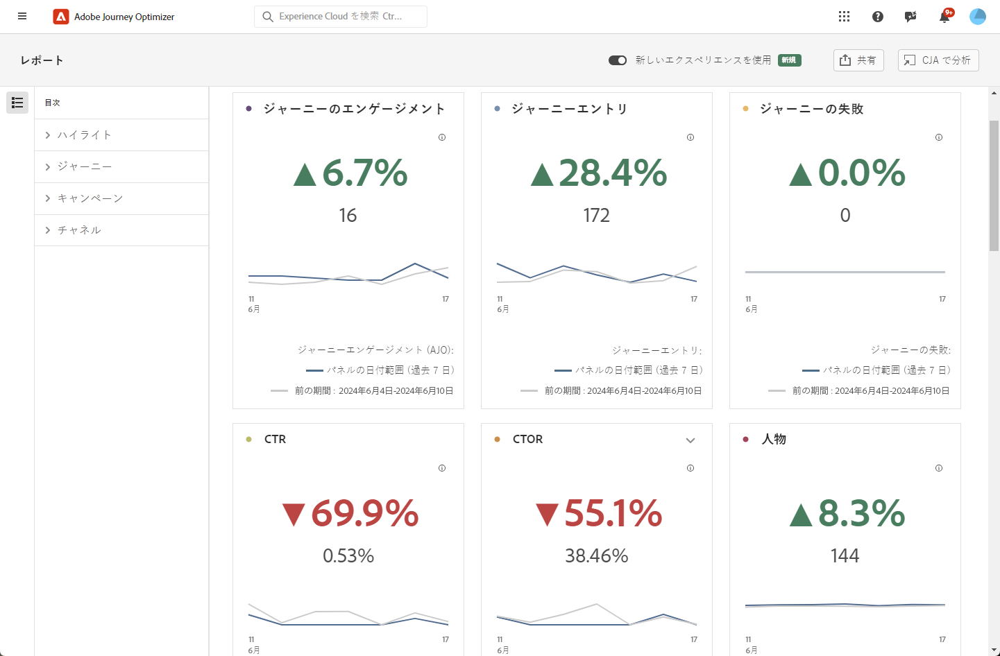
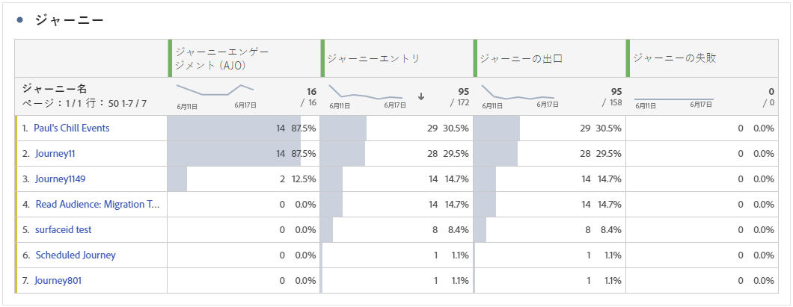
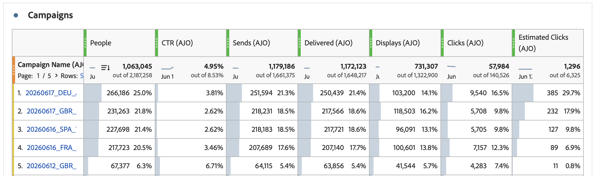
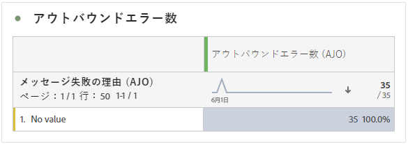
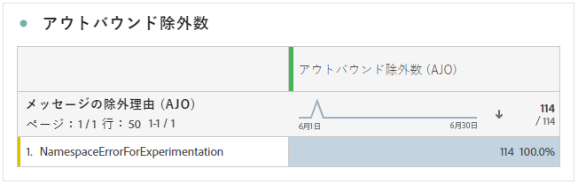
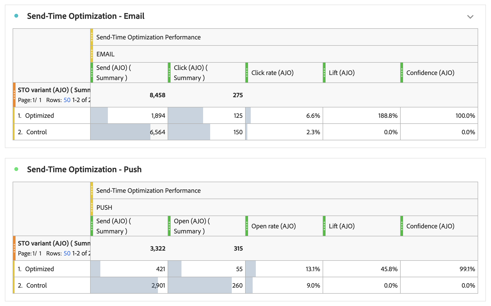

# 概要レポート {#channel-report-cja}

>[!BEGINSHADEBOX]

**このページで：**&#x200B;概要レポートを使用して、ジャーニー、キャンペーン、チャネル、ジャーニー上限ルールセット、最適化モデル用の専用タブを使用して、すべてのキャンペーンとジャーニーをまたいで統合トラフィックとエンゲージメント指標を分析する方法を説明します。

>[!ENDSHADEBOX]

概要レポートでは、環境内のすべてのキャンペーンとジャーニーに対するトラフィック指標とエンゲージメント指標の完全な概要がユーザーに提供されます。 これらの指標を組み合わせることで、様々なキャンペーンやジャーニーを含む様々なチャネルからのアクションに対して統一された値が表示されます。

概要レポートにアクセスするには、「**ジャーニー管理**」セクション内の&#x200B;**レポート**&#x200B;メニューに移動します。

次のタブを含むレポートページが表示されます。

* [ジャーニー](#journey)
* [キャンペーン](#campaign)
* [チャネル](#channel)
* [ルールセット](#rule-sets)
* [最適化モデル](#optimization-models)

Customer Journey Analytics ワークスペースと、データのフィルタリングおよび分析方法について詳しくは、[このページ](https://experienceleague.adobe.com/ja/docs/analytics-platform/using/cja-workspace/home)を参照してください。

## ハイライト {#highlights}

**[!UICONTROL ハイライト]**&#x200B;の KPI は、環境内のすべてのキャンペーンとジャーニーの主要指標の詳細な分類を提供、およびパフォーマンスを迅速に評価して改善領域を特定する、包括的なダッシュボードとして機能します。

+++ 詳しくは、ハイライト指標を参照してください

* **[!UICONTROL ジャーニーのエンゲージメント]**：ジャーニーの指定されたアクションポイントに到達した個別のプロファイルを表す、ジャーニーを通じて送信されたメッセージを受信した一意の個人の合計数。

* **[!UICONTROL ジャーニーのエントリ数]**：ジャーニーのエントリイベントに到達した個人の合計数。

* **[!UICONTROL ジャーニーの失敗数]**：正常に実行されなかった個別ジャーニーの合計数。

* **[!UICONTROL クリックスルー率]**：メッセージでのクリック数の割合。

* **[!UICONTROL クリックスルー開封率（CTOR）]**：メッセージが開封された回数。

* **[!UICONTROL 人物]**：メッセージのターゲットプロファイルに適格な、ユーザープロファイルの数。

* **[!UICONTROL クリック数]**：メッセージでコンテンツがクリックされた回数。

* **[!UICONTROL スパムの苦情数]**：メッセージがスパムまたはジャンクとして宣言された回数。

* **[!UICONTROL 登録解除]**：登録解除リンクのクリック数。

+++

## ジャーニー {#journey}

**[!UICONTROL ジャーニー]**&#x200B;のテーブルは、ジャーニーに関連する主要指標の分析を提供する、包括的なダッシュボードとして機能します。 これには、エントリ済みプロファイルの数や失敗した個々のジャーニーのインスタンスなどの詳細が含まれ、ジャーニーの効果とエンゲージメントレベルを徹底的に理解できます。

このテーブルにリストされているジャーニーの名前をクリックすると、各ジャーニーを個別に簡単に調べ、新しいタブでその包括的なレポートにすぐにアクセスできます。

+++ 詳しくは、ジャーニー指標を参照してください

* **[!UICONTROL ジャーニーのエントリ数]**：ジャーニーのエントリイベントに到達した個人の合計数。

* **[!UICONTROL ジャーニーの退出数]**：ジャーニーから退出した個人の合計数。

* **[!UICONTROL ジャーニーの失敗数]**：正常に実行されなかった個人のジャーニーの合計数。

+++

## キャンペーン {#campaign}

**[!UICONTROL キャンペーン]**&#x200B;のテーブルは、キャンペーンの重要な指標の詳細な概要を表示する、包括的なダッシュボードとして機能します。 プロファイル数や送信数などの重要なデータを表示し、キャンペーンのパフォーマンスレベルとエンゲージメントレベルに関する包括的なインサイトを提供します。

このテーブルにリストされているキャンペーンの名前をクリックすると、各キャンペーンを個別に簡単に調べることができ、新しいタブでその包括的なレポートにすぐにアクセスできます。

+++ 詳しくは、キャンペーン指標を参照してください

* **[!UICONTROL ユーザー]**：メッセージのターゲットプロファイルに適格な、ユーザープロファイルの数。

* **[!UICONTROL クリックスルー率（CTR）]**：メッセージでのクリック数の割合。

* **[!UICONTROL 送信数]**：各キャンペーンの送信の合計数。

* **[!UICONTROL 配信済み]**：正常に送信されたメッセージ数。

* **[!UICONTROL 表示数]**：メッセージが開封された回数。

* **[!UICONTROL クリック数]**：メッセージでコンテンツがクリックされた回数。

+++

## チャネル {#channel}

### チャネル

**[!UICONTROL チャネル]**&#x200B;のテーブルには、チャネルレベルでのメッセージに対するプロファイルのエンゲージメントの詳細な分類が表示されます。 これにより、様々なチャネルのパフォーマンスに関するより深いインサイトを得ることができます。

+++ 詳しくは、チャネル指標を参照してください

* **[!UICONTROL ユーザー]**：メッセージのターゲットプロファイルに適格な、ユーザープロファイルの数。

* **[!UICONTROL クリックスルー率（CTR）]**：メッセージでのクリック数の割合。

* **[!UICONTROL 配信済み]**：正常に送信されたメッセージ数。

* **[!UICONTROL 表示数]**：メッセージが開封された回数。

* **[!UICONTROL クリック数]**：メッセージでコンテンツがクリックされた回数。

+++

### アウトバウンドエラー数

**[!UICONTROL アウトバウンドエラー数]**&#x200B;のテーブルを使用すると、送信プロセス中に発生したエラーを正確に識別し、発生した問題を明確に把握できるようになります。

### アウトバウンド除外数

**[!UICONTROL アウトバウンド除外数]**&#x200B;のテーブルには、ターゲットオーディエンスからユーザープロファイルを除外した結果、メッセージを受信できない原因となった様々な要因が包括的に表示されます。

## ジャーニーの上限設定と競合 {#rule-sets}

**[!UICONTROL ジャーニーの上限と競合]** テーブルには、ジャーニーの調停ルールセットのパフォーマンスに関するインサイトが表示され、ジャーニーに適用された上限ルールと優先スコアに基づいて、ジャーニーのエントリと除外が表示されます。

+++ ルールセット指標の詳細

ルールセット別&#x200B;**[!UICONTROL ジャーニーエントリ]**&#x200B;列には、ジャーニーにエントリしたプロファイルの数が表示されます。 エントランスには3つのタイプがあります。

* **&#x200B;**&#x200B;[!UICONTROL 競合なし]&#x200B;**&#x200B;**: プロファイルは、ルールセットの競合なしでジャーニーにエントリしました。 アクティブなルールセットはこのエントリを妨げておらず、ジャーニーのエントリは調停ルールに関係なく発生しました。

* **優先度が高い**: プロファイルは、他の競合ジャーニーよりも優先度が高いため、ジャーニーにエントリしました。 競合（複数のジャーニーに適格なプロファイル）があったにもかかわらず、このジャーニーは、優先度スコアが高いため選択されました。

* **適用されていません**: プロファイルはジャーニーにエントリしましたが、ルールセットがアクティブでないか、エントリ時にこのジャーニーエントリに適用されませんでした。

**[!UICONTROL 除外]**&#x200B;列には、ジャーニーの入力から除外されたプロファイルの数が表示されます。 プロファイルは、次の2つの理由で除外できます。

* **上限に達しました**: プロファイルは、キャッピングルールで許可されているジャーニーエントリまたは同時ジャーニーの最大数に達しました。

* **優先度が低い**：上限に達していませんが、他の優先度の高いジャーニーは制約を満たしています。 プロファイルはこのジャーニーから除外され、代わりに優先度の高いジャーニーに入りました。

+++

Adobe Experience Platform クエリサービスを使用してデータレイクレベルでこれらの除外を調査するには、[&#x200B; ビジネスルールクエリ &#x200B;](query-examples.md#business-rules-queries)を参照してください。

➡️ [&#x200B; ジャーニーの上限設定と調停について詳しく見る](../conflict-prioritization/journey-capping.md)

## 最適化モデル {#optimization-models}

**[!UICONTROL 送信時間の最適化]** テーブルは、最適化および制御メールまたはプッシュメッセージのパフォーマンスに関するインサイトを提供します。 このツールを使用して、送信、開封、クリック、バウンスなどの主要指標を比較し、各バリエーションがどのように機能しているかを確認し、最適化の意思決定に活用できます。

このレポートの指標（**[!UICONTROL 上昇率]**&#x200B;および&#x200B;**[!UICONTROL 信頼性]**&#x200B;など）は、送信とエンゲージメントの&#x200B;**60日**&#x200B;から計算されます。

+++ 送信時間の最適化指標について詳しく見る

* **[!UICONTROL Sends]**：各メッセージバリアントが送信された合計回数。

* **[!UICONTROL 開封]**: メッセージに記録された開封イベントの合計数。

* **[!UICONTROL 開封率]**: プロファイルがメッセージを少なくとも1回開いたメッセージの送信済みメッセージの割合。

* **[!UICONTROL 上昇率]**：ベースラインのバリアントに対する特定の治療のコンバージョン率のパーセンテージ改善。 上昇率は、差分の大きさを定量化します。**[!UICONTROL 信頼性]**&#x200B;と共に解釈します。

* **[!UICONTROL 信頼性]**：送信時間最適化バリアントの開封率またはクリック率がコントロールバリアントと異なるという証拠の統計的強度（ランダムに割り当てられた送信時間）。 これは二比例のZ検定で計算される。

+++
