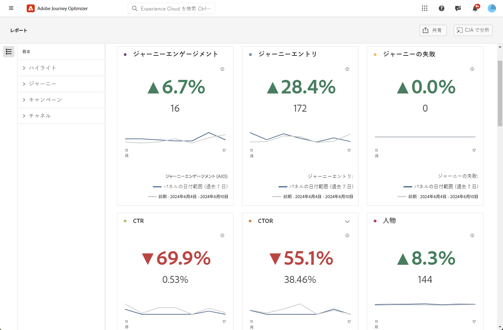

# 概要レポート {#channel-report-cja}

概要レポートは、環境内のすべてのキャンペーンとジャーニーのトラフィックおよびエンゲージメント指標の完全な概要をユーザーに提供します。 これらの指標は組み合わされ、様々なキャンペーンやジャーニーを含む、様々なチャネルからのアクションに対して統一された値が表示されます。

概要レポートにアクセスするには、に移動します **報告書** 内のメニュー **ジャーニー管理** セクション。

次のタブを含むレポートページが表示されます。

* [ジャーニー](#journey)
* [キャンペーン](#campaign)
* [チャネル](#channel)

Customer Journey Analyticsワークスペースの詳細と、データをフィルタリングして分析する方法については、を参照してください。 [このページ](https://experienceleague.adobe.com/en/docs/analytics-platform/using/cja-workspace/home).

## ハイライト {#highlights}

この **[!UICONTROL ハイライト]** KPI は、環境内のすべてのキャンペーンやジャーニーの主要指標の詳細な分類を提供する包括的なダッシュボードとして機能し、パフォーマンスを迅速に評価して、改善点を特定できるようにします。

+++ 指標のハイライトについて学ぶ

* **[!UICONTROL ジャーニーエンゲージメント]**：ジャーニーから送信されたメッセージを操作した個人の合計数。

* **[!UICONTROL ジャーニーエントリ]**：ジャーニーのエントリイベントに到達した個人の合計数。

* **[!UICONTROL ジャーニーエラー]**：正常に実行されなかった個人のジャーニーの合計数。

* **[!UICONTROL クリックスルー率]**：メッセージでのクリック率。

* **[!UICONTROL クリックスルー開封率（CTOR）]**：メッセージが開かれた回数。

* **[!UICONTROL 人物]**：メッセージのターゲットプロファイルと認定されるユーザープロファイルの数。

* **[!UICONTROL クリック数]**：メッセージでコンテンツがクリックされた回数。

* **[!UICONTROL スパムのの苦情数]**：メッセージがスパムまたはジャンクとして宣言された回数。

* **[!UICONTROL 登録解除]**：登録解除リンクのクリック数。

+++

## ジャーニー {#journey}

この **[!UICONTROL ジャーニー]** テーブルは、ジャーニーに関連する主要指標の分析を提供する、包括的なダッシュボードとして機能します。 エントリしたプロファイルの数や失敗した個々のジャーニーのインスタンスなどの詳細が含まれ、ジャーニーの有効性とエンゲージメントレベルを完全に理解できます。

この表に示されているジャーニーの名前をクリックすると、各ジャーニーを個別に簡単に調べることができ、新しいタブでその包括的なレポートにすぐにアクセスできます。

+++ ジャーニー指標の詳細

* **[!UICONTROL ジャーニーエントリ]**：ジャーニーのエントリイベントに到達した個人の合計数。

* **[!UICONTROL ジャーニー出口]**：ジャーニーから退出した個人の合計数。

* **[!UICONTROL ジャーニーエラー]**：正常に実行されなかった個人のジャーニーの合計数。

+++

## キャンペーン {#campaign}

この **[!UICONTROL キャンペーン]** テーブルは、すべてを包含するダッシュボードとして機能し、キャンペーンの重要な指標の詳細な概要を示します。 プロファイルや送信の数などの重要なデータが含まれているので、キャンペーンのパフォーマンスとエンゲージメントレベルに関する包括的なインサイトを得ることができます。

この表に示されているキャンペーンの名前をクリックすると、各キャンペーンを個別に簡単に調べることができ、新しいタブでその包括的なレポートにすぐにアクセスできます。

+++ Campaign 指標の詳細

* **[!UICONTROL 人物]**：メッセージのターゲットプロファイルと認定されるユーザープロファイルの数。

* **[!UICONTROL 送信数]**：各キャンペーンの送信の合計数。

* **[!UICONTROL ディスプレイ]**：メッセージが開かれた回数。

* **[!UICONTROL クリック数]**：メッセージでコンテンツがクリックされた回数。

+++

## チャネル {#channel}

### チャネル

この **[!UICONTROL チャネル]** 表は、チャネルレベルでのプロファイルのメッセージに対するエンゲージメントの詳細な分類を提供します。 これにより、様々なチャネルのパフォーマンスに関するより深いインサイトを得ることができます。

+++ チャネル指標の詳細

* **[!UICONTROL 人物]**：メッセージのターゲットプロファイルと認定されるユーザープロファイルの数。

* **[!UICONTROL クリックスルー率]**：メッセージでのクリック率。

* **[!UICONTROL 送信数]**：各キャンペーンの送信の合計数。

* **[!UICONTROL ディスプレイ]**：メッセージが開かれた回数。

* **[!UICONTROL クリック数]**：メッセージでコンテンツがクリックされた回数。

+++

### アウトバウンドエラー

この **[!UICONTROL アウトバウンドエラー]** 表を使用すると、送信プロセス全体で発生した正確なエラーを特定でき、発生した問題を明確に理解しやすくなります。

### アウトバウンド除外

この **[!UICONTROL アウトバウンド除外]** 表は、ターゲットオーディエンスからユーザープロファイルが除外され、メッセージが受信されなかった原因となった様々な要因を包括的に示します。
