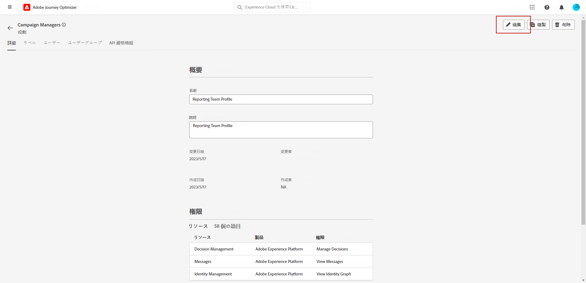
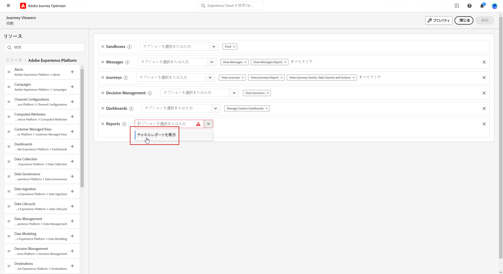
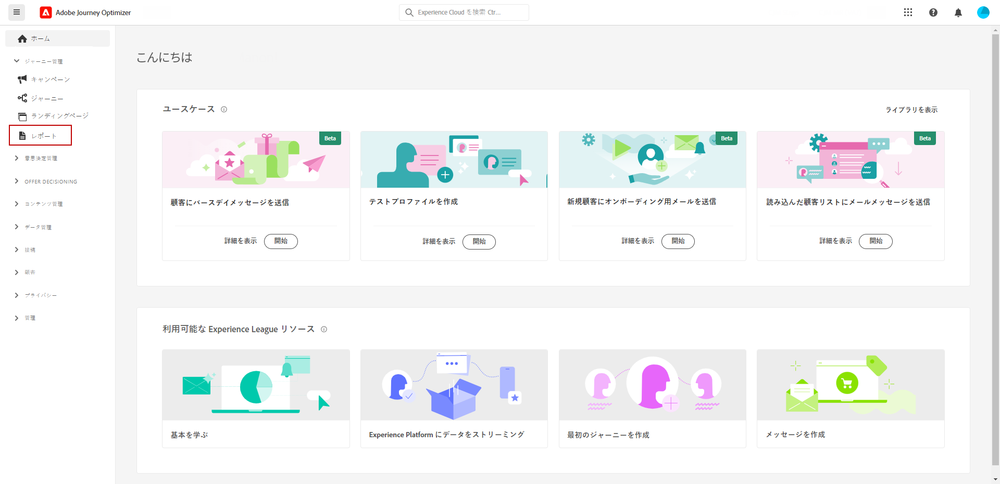
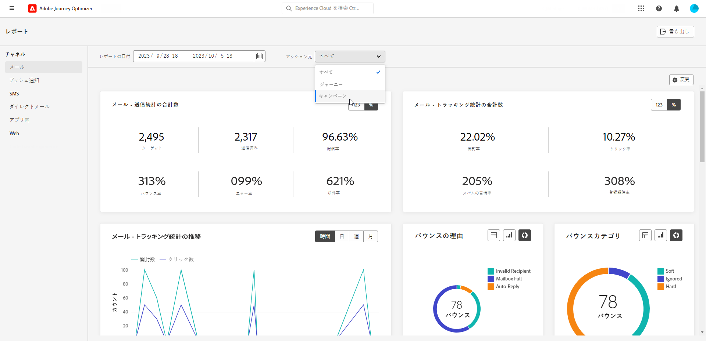
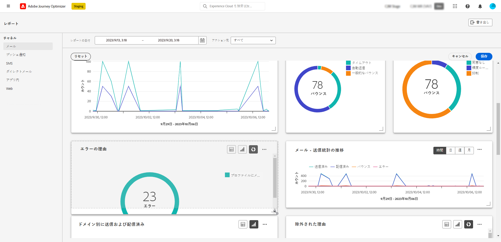
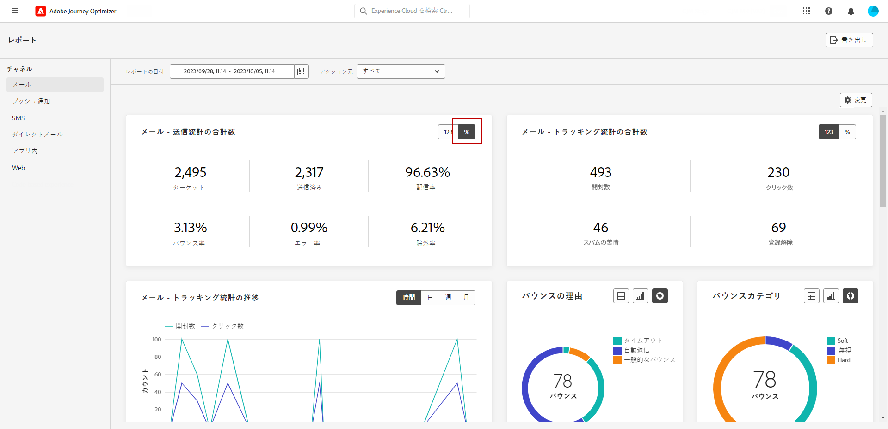

# チャネルレポートの基本を学ぶ {#channel-report-gs}

>[!AVAILABILITY]
>
>現在のレポートエクスペリエンスは、2025年1月の時点で廃止されます。この日以降、新しいレポートエクスペリエンスが標準となります。スムーズに移行できるように、新機能を理解しておくことをお勧めします。[Journey Optimizer の新しいレポートインターフェイスの基本を学ぶ。](report-gs-cja.md)

チャネルレポートは、トラフィック指標とエンゲージメント指標の包括的な概要を各チャネルの統合レポートに提供する強力なツールで、すべてのキャンペーンとジャーニーのすべてのアクションを網羅します。様々なウィジェットは分割され、それぞれがキャンペーンまたはジャーニーのパフォーマンスの特定のビューを提供します。

チャネルレポートは完全にカスタマイズ可能で、ウィジェットのサイズを変更したり、削除したりして、特定のニーズに合ったダッシュボードを作成できます。また、レポートデータを PDF ファイルまたは CSV ファイルに書き出して、さらに詳しく分析することもできます。

チャネルレポートで使用できる様々な指標およびウィジェットについて詳しくは、[このページ](channel-report.md)を参照してください。

## 開始する前に {#manage-reports-prereq}

開始する前に、**[!UICONTROL レポート]** メニューにアクセス権があるかを確認します。

**[!UICONTROL レポート]**&#x200B;メニューが表示されていない場合、アクセス権を拡張して&#x200B;**[!UICONTROL チャネルレポートを表示]**&#x200B;する権限が必要となります。組織の Adobe Experience Platform [権限](https://experienceleague.adobe.com/docs/experience-platform/access-control/home.html?lang=ja){target="_blank"}にアクセスできる場合は、自身の権限を延長できます。そうでない場合は、Adobe Journey Optimizer 管理者にお問い合わせください。

+++ レポート権限の割り当て方法を学ぶ

この権限は、キャンペーンマネージャー、キャンペーン承認者、キャンペーン閲覧者およびキャンペーン管理者の組み込みの&#x200B;**[!UICONTROL 役割]**&#x200B;に含まれていることに注意してください。

該当する権限を&#x200B;**[!UICONTROL 役割]**&#x200B;に割り当てるには、次の手順に従います。

1. [!DNL Permissions] 製品から、**[!UICONTROL 役割]**&#x200B;メニューに移動して、新しい&#x200B;**[!UICONTROL チャネルレポートを表示]**&#x200B;する権限で更新する役割を選択します。

1. **[!UICONTROL 役割]**&#x200B;ダッシュボードで、「**[!UICONTROL 編集]**」をクリックします。

   

1. **[!UICONTROL レポート]**&#x200B;リソースをドラッグ＆ドロップして、権限を割り当てます。

   **[!UICONTROL レポート]**&#x200B;リソースドロップダウンから、**[!UICONTROL チャネルレポートを表示]**&#x200B;する権限を選択します。

   

1. 「**[!UICONTROL 保存]**」をクリックします。

この&#x200B;**[!UICONTROL 役割]**&#x200B;に割り当てられたユーザーは、**[!UICONTROL レポート]**&#x200B;メニューにアクセスできるようになります。

+++

## レポートダッシュボードの管理 {#manage-reports}

チャネルレポートにアクセスして管理するには、次の手順に従います。

1. 「**[!UICONTROL ジャーニー管理]**」セクション内の&#x200B;**[!UICONTROL レポート]**&#x200B;メニューに移動します。

   

1. ダッシュボードから、**開始**&#x200B;および&#x200B;**[!UICONTROL 終了時間]**&#x200B;を選択して特定のデータをターゲットにします。

1. **[!UICONTROL アクション元]**&#x200B;ドロップダウンから、キャンペーン、ジャーニーまたはその両方をターゲットにするかを選択します。

   

1. 「**[!UICONTROL 変更]**」をクリックし、ウィジェットのサイズを変更または削除して、特定のニーズに合ったダッシュボードを作成します。

   

1. ウィジェットの表示順とサイズが定まったら、「**[!UICONTROL 保存]**」をクリックします。

1. ウィジェットに応じて、テーブル、棒グラフまたはドーナツグラフに切り替えることができます。

1. 割合アイコンをクリックして、データを割合で表示します。

   

## レポートを書き出し {#export-reports}

様々なレポートを PDF 形式または CSV 形式で簡単に書き出して、共有、変更または印刷できます。チャネルレポートを書き出す手順について詳しくは、次のタブを参照してください。

>[!BEGINTABS]

>[!TAB PDF ファイルでレポートを書き出す]

1. レポートから、「**[!UICONTROL 書き出し]**」をクリックし、「**[!UICONTROL PDF ファイル]**」を選択します。

1. 印刷ウィンドウで必要に応じてドキュメントを設定します。なお、オプションはブラウザーによって異なる場合があります。

1. PDF としてレポートを印刷するか、保存するかを選択します。

1. ファイルを保存するフォルダを探し、必要に応じて名前を変更して「保存」をクリックします。

これで、レポートを PDF ファイルで表示または共有できるようになりました。

>[!TAB CSV ファイルでレポートを書き出し]

1. レポートで、「**[!UICONTROL 書き出し]**」をクリックし、「**[!UICONTROL CSV ファイル]**」を選択して、全体的なレポートレベルで CSV ファイルを生成します。

1. 特定のウィジェットからデータを書き出すこともできます。選択したウィジェットの横にある「**[!UICONTROL ウィジェットデータを CSV に書き出し]**」をクリックします。

1. ファイルが自動的にダウンロードされ、ローカルファイルに配置できます。

   レポートレベルでファイルを生成した場合は、タイトルやデータなど、各ウィジェットの詳細情報がファイルに含まれています。

   ウィジェットレベルでファイルを生成した場合は、特に、選択したウィジェットのデータがファイルに含まれています。

>[!ENDTABS]
