# チャネルレポート {#channel-report}

>[!CONTEXTUALHELP]
>id="ajo_channel_level_report"
>title="チャネルレベルのレポート"
>abstract="チャネルレポートでは、すべてのチャネルにわたるトラフィックとエンゲージメント指標の包括的な概要を提供します。レポートは、キャンペーンとジャーニーの成功とエラーを示す様々なウィジェットに分かれています。各レポートダッシュボードは、ウィジェットのサイズ変更や削除を行うことで変更できます。"

>[!AVAILABILITY]
>
>現在のレポートエクスペリエンスは、2025 年 1 月をもって廃止されます。 この日以降、新しいレポートエクスペリエンスが標準となります。スムーズに移行できるように、新機能を理解しておくことをお勧めします。[Journey Optimizer の新しいレポートインターフェイスの基本を学ぶ。](report-gs-cja.md)

>[!IMPORTANT]
>
> **レポート**&#x200B;メニューにアクセスするには、**[!UICONTROL チャネルレポートを表示]**&#x200B;する権限が必要です。[詳細情報](channel-report-gs.md#before-starting-manage-reports-prereq)

チャネルレポートは、チャネルレベルでのトラフィックとエンゲージメント指標の包括的な概要をユーザーに提供します。指標は集計されて、様々なキャンペーンやジャーニーにわたり、選択したチャネルからのアクションの統合値を示します。

チャネルレポートにアクセスするには、「**ジャーニー管理**」セクション内の&#x200B;**レポート**&#x200B;メニューに移動します。完全にカスタマイズ可能で、レポートの日付やアクションに応じてデータをフィルタリングできます。[詳細情報](channel-report-gs.md)

次のタブを含むレポートページが表示されます。

* [メール](#email)
* [プッシュ通知](#push)
* [SMS](#sms)
* [アプリ内](#inapp)
* [Web](#web)
* [ダイレクトメール](#direct-mail)

➡️ [この機能をビデオで確認](#channel-report-video)

## メール {#email}

チャネルレポートのメールメニューには、キャンペーンおよびジャーニーで送信されたメールに関する主な情報が表示されます。指標の詳細は次のとおりです。

### メール - 送信統計の合計数 {#email-total-sending}

>[!CONTEXTUALHELP]
>id="ajo_channel_email_sending_statistics"
>title="メール - 送信統計の合計数"
>abstract="メール - 送信統計の合計数 KPI は、ターゲットメッセージや配信済みメッセージなど、メールに関する重要なデータを要約します。"

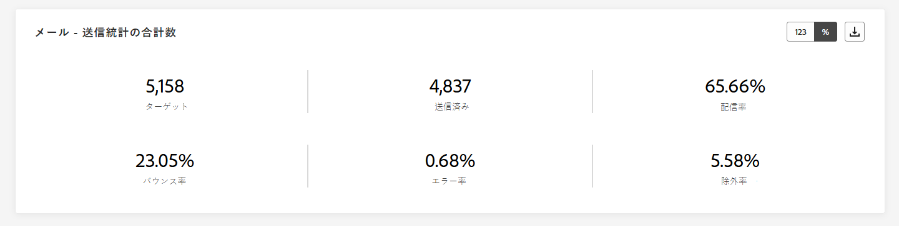

**[!UICONTROL メール - 送信統計の合計数]**&#x200B;ウィジェットでは、メールに関する重要なデータを要約する主要業績評価指標（KPI）を確認し、メールのパフォーマンスに関する包括的な概要を把握できます。

+++ メール - 送信統計の合計数指標の詳細情報

* **[!UICONTROL ターゲット]**：処理されたメールの合計数。

* **[!UICONTROL 送信済み]**：送信の合計数。

* **[!UICONTROL 配信済み]**：送信されたメッセージの総数に対する、正常に送信されたメッセージの数。

* **[!UICONTROL 配信率]**：正常に送信されたメッセージの割合。

* **[!UICONTROL バウンス数]**：送信されたメッセージの合計数に対する、累計エラー数および自動返信処理の合計数。

* **[!UICONTROL バウンス率]**：送信メールに対するバウンスメールの割合。

* **[!UICONTROL エラー]**：プロファイルへの送信の妨げとなったエラーの合計数。

* **[!UICONTROL エラー率]**：送信されたメールに対する、エラーが発生して送信できなかったメールの割合。

* **[!UICONTROL 除外済み]**：Adobe Journey Optimizer によって除外されたプロファイルの数。

* **[!UICONTROL 除外率]**：Adobe Journey Optimizer によって除外されたプロファイルの割合。

+++

### メール - トラッキング統計の合計数 {#email-total-tracking}

>[!CONTEXTUALHELP]
>id="ajo_channel_email_tracking_statistics"
>title="メール - トラッキング統計の合計数"
>abstract="メール - 合計トラッキング統計 KPI は、メールのプロファイルアクティビティに関するデータを提供します。"

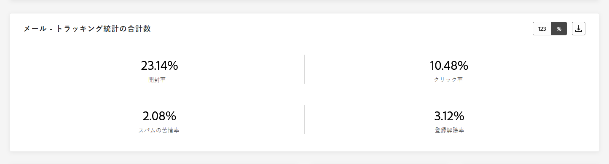

**[!UICONTROL メール - トラッキング統計の合計数]**&#x200B;ウィジェットでは、メールに関連付けられているプロファイルアクティビティの詳細なスナップショットを確認し、エンゲージメントとメールの効果に関する重要なインサイトを得ることができます。

+++ メール - トラッキング統計の合計数指標の詳細情報

* **[!UICONTROL 開封数]**：メッセージが開封された回数。

* **[!UICONTROL 開封率]**：配信されたメール数に対して、開封されたメールの合計数。

* **[!UICONTROL クリック数]**：メッセージでコンテンツがクリックされた回数。

* **[!UICONTROL クリック率]**：メールでインタラクションを行ったユーザーの割合。

* **[!UICONTROL スパムのの苦情数]**：メッセージがスパムまたはジャンクとして宣言された回数。

* **[!UICONTROL スパムの苦情率]**：送信されたメールの数に対する、スパムまたは迷惑メールとして判定されたメッセージの割合。

* **[!UICONTROL 登録解除]**：購読リンクのクリック数。

* **[!UICONTROL 登録解除率]**：送信済みメールの数に対する、登録解除の割合。

+++

### メール - 送信統計の推移 {#email-sending-statistics-overtime}

>[!CONTEXTUALHELP]
>id="ajo_channel_email_sending_statistics_overtime"
>title="メール - 送信統計の推移"
>abstract="メール - 経時的な送信統計のグラフには、送信されたメールに関するデータが、時間単位、日単位、週単位、または月単位で表示されます。"

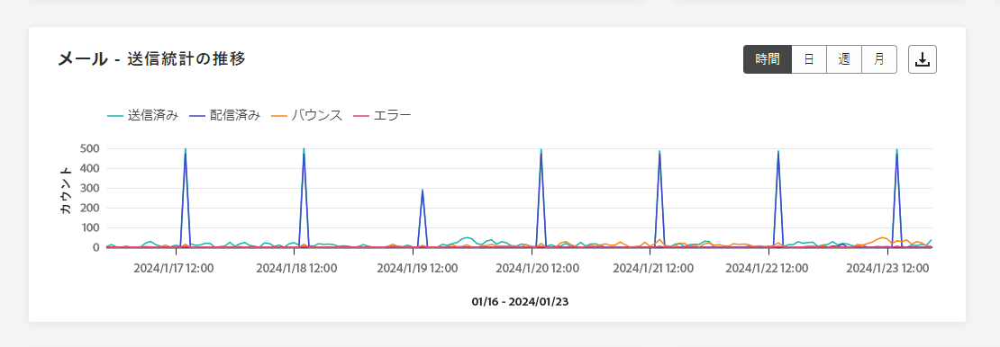

**[!UICONTROL メール - 送信統計の推移]**&#x200B;グラフには、メールアクティビティの分析結果が動的に表示されます。このグラフでは、送信済みメールの包括的な分類を把握し、時間単位、日単位、週単位、月単位のスケールでトレンドとパターンを確認できます。

+++ メール - 送信統計の推移指標の詳細情報

* **[!UICONTROL 送信済み]**：送信の合計数。

* **[!UICONTROL 配信済み]**：送信されたメッセージの合計数に対する、正常に送信されたメッセージの数。

* **[!UICONTROL バウンス数]**：送信されたメッセージの合計数に対する、累計エラー数および自動返信処理の合計数。

* **[!UICONTROL エラー]**：プロファイルへの送信を妨げるエラーが発生した合計数。

+++

### メール - トラッキング統計の推移 {#email-tracking-statistics-overtime}

>[!CONTEXTUALHELP]
>id="ajo_channel_email_tracking_statistics_overtime"
>title="メール - トラッキング統計の推移"
>abstract="E メール — 経時的な追跡統計グラフには、メールのプロファイルアクティビティに関するデータが、時間単位、日単位、週単位、または月単位で表示されます。"

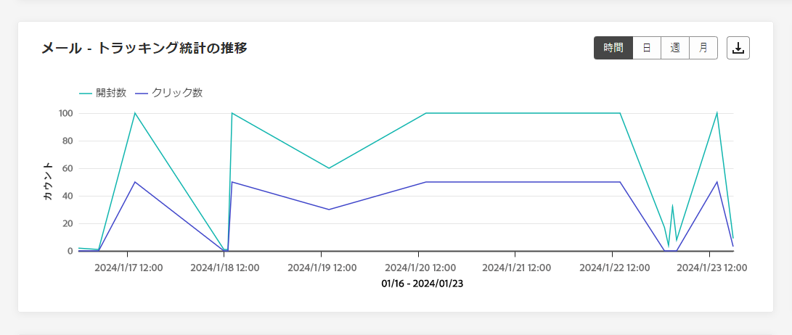

**[!UICONTROL メール - トラッキング統計の推移]**&#x200B;グラフには、メールに関連するプロファイルアクティビティの詳細な概要が表示されます。このグラフでは、時間単位、日単位、週単位、月単位でデータが分類され、受信者のエンゲージメントが様々な期間でどのように変化しているかについての貴重なインサイトを得ることができます。

+++ メール - トラッキング統計の推移指標の詳細情報

* **[!UICONTROL 開封数]**：メッセージが開封された回数。

* **[!UICONTROL クリック数]**：メッセージでコンテンツがクリックされた回数。

+++

### メール - バウンスのカテゴリと理由 {#bounce-categories}

>[!CONTEXTUALHELP]
>id="ajo_channel_email_bounce_categories"
>title="バウンスのカテゴリ"
>abstract="バウンスカテゴリのグラフとテーブルには、一時的なエラーと永続的なエラーの両方に関するデータが表示されます。"

>[!CONTEXTUALHELP]
>id="ajo_channel_email_bounce_reasons"
>title="バウンスの理由"
>abstract="バウンス理由のグラフとテーブルには、バウンスされたメッセージに関連して使用可能なデータが含まれます。"

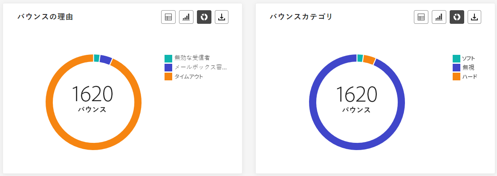

**[!UICONTROL バウンスカテゴリ]**&#x200B;ウィジェットと&#x200B;**[!UICONTROL バウンスの理由]**&#x200B;ウィジェットでは、バウンスされたメッセージに関連付けられているデータをカプセル化し、メッセージバウンスの背後にある様々なカテゴリと特定の理由に関する包括的な概要を表示します

バウンスの詳細については、[抑制リスト](../reports/suppression-list.md)のページを参照してください。

+++ バウンスカテゴリ指標の詳細情報

* **[!UICONTROL ハードバウンス]**：永続的なエラー（メールアドレスの間違いなど）の合計数。このエラーは、アドレスが無効であることを明示的に示すエラーメッセージ（例：「不明なユーザー」）を伴います。

* **[!UICONTROL ソフトバウンス数]**：一時的なエラー（インボックスが満杯など）の合計数。

* **[!UICONTROL 無視]**：一時的なエラー（不在など）や技術的なエラー（送信者のタイプが postmaster の場合など）の合計数。

+++

### エラー理由 {#error-reasons}

>[!CONTEXTUALHELP]
>id="ajo_channel_email_error_reasons"
>title="エラー理由"
>abstract="エラー理由のグラフとテーブルを使用すると、送信プロセス中に発生した特定のエラーを識別できます。"

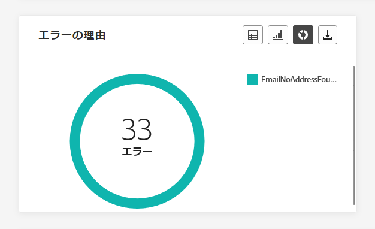

**[!UICONTROL エラー理由]**&#x200B;のグラフとテーブルを使用すると、送信プロセス中に発生したエラーを正確に識別し、発生した問題を明確に把握できるようになります。

### 除外された理由 {#excluded-reasons}

>[!CONTEXTUALHELP]
>id="ajo_channel_email_excluded_reasons"
>title="除外された理由"
>abstract="この除外された理由のグラフとテーブルには、ユーザープロファイルがターゲットオーディエンスから除外され、メッセージが受信されない原因となった様々な要因が表示されます。"

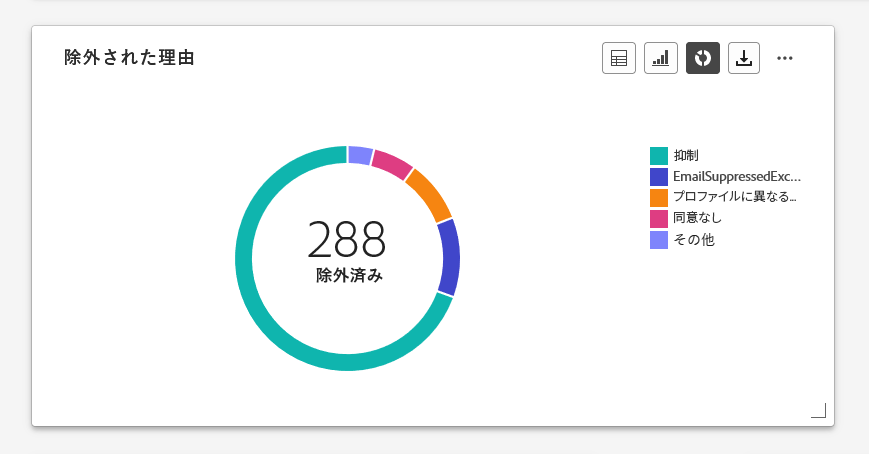

**[!UICONTROL 除外理由]**&#x200B;のグラフとテーブルは、ターゲットのオーディエンスからユーザープロファイルを除外した結果、メッセージを受信できない原因となった様々な要因の包括的なビューを示します。

除外理由の包括的なリストについては、[このページ](exclusion-list.md)を参照してください。

### ドメイン別に送信および配信 {#sent-delivered-domains}

>[!CONTEXTUALHELP]
>id="ajo_channel_email_sending_delivered_domains"
>title="ドメイン別に送信および配信"
>abstract="送信済みおよび配信済み（ドメイン別）のグラフとテーブルは、メール送信の重要なデータすべてのドメインレベルの分類を表します。"

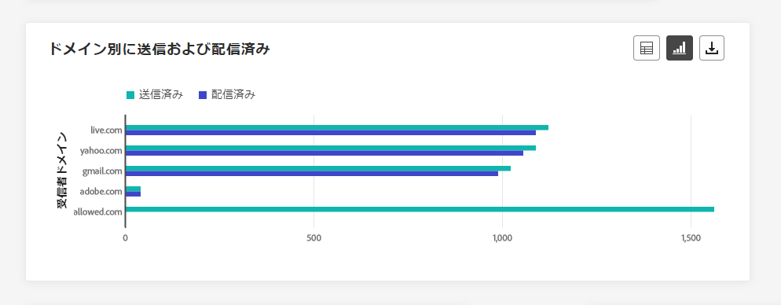

**[!UICONTROL ドメイン別に送信および配信]**&#x200B;のテーブルとグラフは、ドメインレベルでのメール配信の詳細な分類を提供し、メールのパフォーマンスに関する包括的なインサイトを提供します。

+++ ドメイン別に送信および配信指標の詳細情報

* **[!UICONTROL 送信済み]**：メールの送信の合計数。

* **[!UICONTROL 配信済み]**：送信されたメッセージの合計数に対する、正常に送信されたメッセージの数。

+++

### ドメイン別バウンス数とエラー数 {#bounces-errors-domains}

>[!CONTEXTUALHELP]
>id="ajo_channel_email_bounces_errors_domains"
>title="ドメイン別バウンス数とエラー数"
>abstract="ドメイン別バウンス数とエラー数のグラフとテーブルは、送信プロセス中に発生した特定のエラーのドメインレベルでの分類を表しています。"

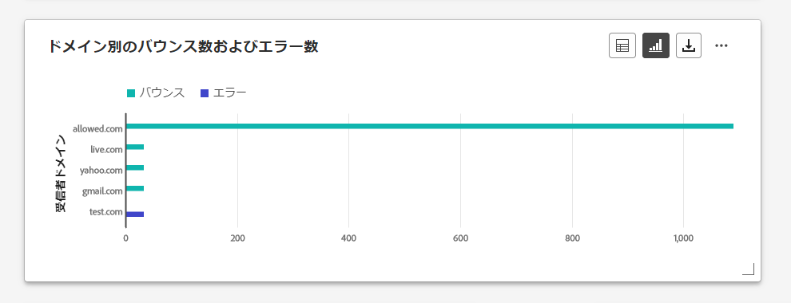

**[!UICONTROL ドメイン別バウンス数とエラー数]**&#x200B;のグラフとテーブルには、送信プロセス中に発生した特定のエラーのドメインレベルでの分類が表示され、発生した問題を詳しく分析できます。

+++ ドメイン別のバウンス数およびエラー数指標の詳細情報

* **[!UICONTROL バウンス数]**：送信されたメッセージの合計数に対する、送信プロセス中および自動返信処理中に累積したエラーの合計数。

* **[!UICONTROL エラー数]**：送信プロセス中に発生し、プロファイルに送信できない原因となったエラーの合計数。

+++

### ドメイン別の開封数およびクリック数 {#open-clicks-domains}

>[!CONTEXTUALHELP]
>id="ajo_channel_email_open_clicks_domains"
>title="ドメイン別の開封数およびクリック数"
>abstract="ドメイン別の開封数およびクリック数のグラフおよびテーブルは、訪問者のメールに対するエンゲージメントのドメインレベルの分類を表します。"

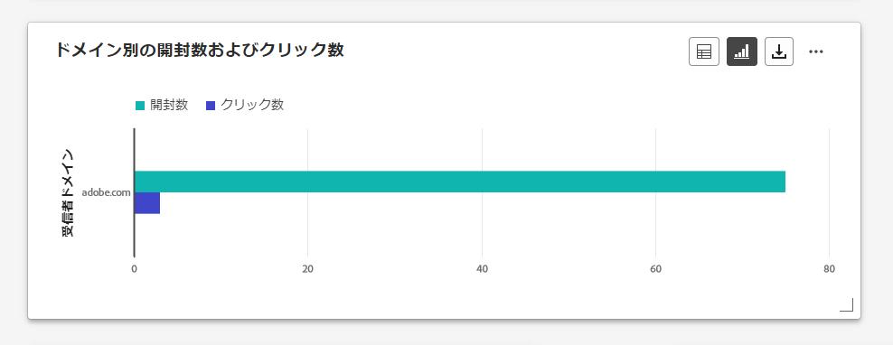

**[!UICONTROL ドメイン別の開封数およびクリック数]**&#x200B;のグラフとテーブルでは、プロファイルのメールに対するエンゲージメントのドメインレベルの分類を示し、様々なドメインがコンテンツとどのようにやり取りするかに関する有益なインサイトを提供します。

+++ ドメイン別の開封数およびクリック数指標の詳細情報

* **[!UICONTROL 開封数]**：メールが開封された回数。

* **[!UICONTROL クリック数]**：メールのコンテンツがクリックされた回数。

+++

### ドメイン別のバウンス理由 {#bounce-reasons-domains}

>[!CONTEXTUALHELP]
>id="ajo_channel_email_bounce_reasons_domains"
>title="ドメイン別のバウンス理由"
>abstract="ドメイン別のバウンス理由グラフとテーブルは、一時的なエラーと永続的なエラーの両方でのデータのドメインレベルの分類を表しています。"

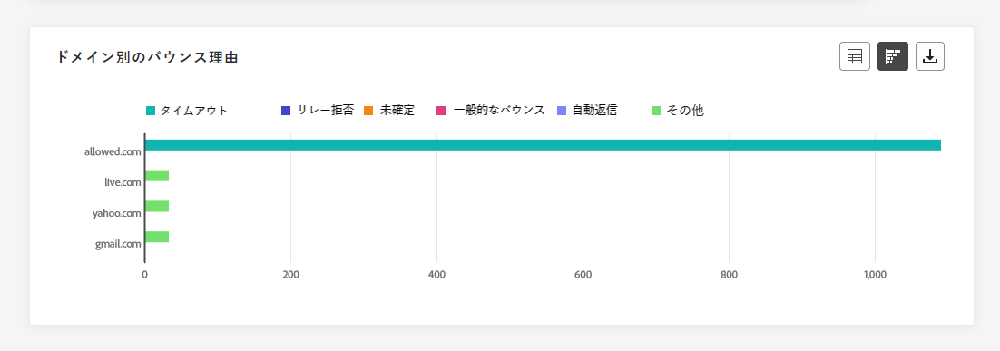

**[!UICONTROL ドメイン別のバウンス理由]**&#x200B;のグラフとテーブルには、一時的なエラーと永続的なエラーの両方に関するデータがドメインレベルで分類して表示され、バウンスメッセージの原因に関する詳細なインサイトを得ることができます。

バウンスの詳細については、[抑制リスト](../reports/suppression-list.md)のページを参照してください。

## プッシュ通知 {#push}

チャネルレポートの&#x200B;**プッシュ通知**&#x200B;メニューには、キャンペーンおよびジャーニーで送信されるプッシュ通知に関する主な情報の詳細が表示されます。次の指標があります。

### プッシュ通知 - 送信統計の合計数 {#push-total-sending}

>[!CONTEXTUALHELP]
>id="ajo_channel_push_sending_statistics"
>title="プッシュ通知 - 送信統計の合計数"
>abstract="プッシュ通知 - 送信統計の合計数 KPI には、ターゲットや配信など、プッシュ通知に関する重要なデータを要約します。"

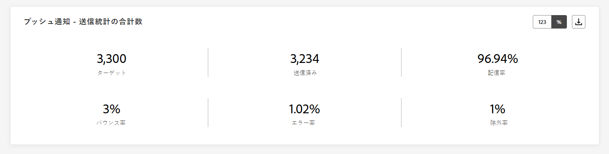

**[!UICONTROL プッシュ通知 - 送信統計の合計数]**&#x200B;の KPI は、包括的な概要として機能し、プッシュ通知に関連する重要なデータをカプセル化します。これらの指標には、ターゲットオーディエンスと実際の配信ステータスに関する詳細なインサイトが含まれており、プッシュ通知の効果とリーチの明確な見解を得ることができます。

+++ プッシュ通知 - 送信統計の合計数指標の詳細情報

* **[!UICONTROL ターゲット]**：処理されたプッシュ通知の合計数。

* **[!UICONTROL 送信済み]**：送信されたプッシュ通知の合計数。

* **[!UICONTROL 配信済み]**：送信されたプッシュ通知の合計数に対する、正常に送信されたプッシュ通知の数。

* **[!UICONTROL 配信率]**：正常に送信されたプッシュ通知の割合。

* **[!UICONTROL バウンス数]**：送信されたメッセージの合計数に対する、累計エラー数および自動返信処理の合計数。

* **[!UICONTROL バウンス率]**：送信済みのプッシュ通知に対する、バウンスしたプッシュ通知の割合。

* **[!UICONTROL エラー]**：プロファイルへの送信を妨げるエラーが発生した合計数。

* **[!UICONTROL エラー率]**：送信されたプッシュ通知に対する、エラーが発生して送信できなかったプッシュ通知の割合。

* **[!UICONTROL 除外済み]**：Adobe Journey Optimizer によって除外されたプロファイルの数。

* **[!UICONTROL 除外率]**：Adobe Journey Optimizer によって除外されたプロファイルの割合。

+++

### プッシュ通知 - トラッキング統計の合計数 {#push-total-tracking}

>[!CONTEXTUALHELP]
>id="ajo_channel_push_tracking_statistics"
>title="プッシュ通知 - トラッキング統計の合計数"
>abstract="プッシュ通知 - トラッキング統計の合計数では、プッシュ通知のプロファイルアクティビティに関するデータを提供します。"

**[!UICONTROL プッシュ通知 - トラッキング統計の合計数]**&#x200B;ウィジェットでは、プッシュ通知に関連するプロファイルアクティビティの詳細なスナップショットを確認し、エンゲージメントとプッシュ通知の効果に関する重要なインサイトを得ることができます。

+++ プッシュ通知 - トラッキング統計の合計数指標の詳細情報

* **[!UICONTROL 開封数]**：プッシュ通知が開封された回数。

* **[!UICONTROL 開封率]**：開封されたプッシュ通知の割合。

* **[!UICONTROL アクション]**：配信されたプッシュ通知に対するアクション（ボタンのクリックや解除など）の合計数。

* **[!UICONTROL アクション率]**：送信されたプッシュ通知に対する、配信されたプッシュ通知に対するアクションの割合。

+++

### プッシュ通知 - 送信統計の推移 {#push-sending-overtime}

>[!CONTEXTUALHELP]
>id="ajo_channel_push_sending_statistics_overtime"
>title="プッシュ通知 - 送信統計の推移"
>abstract="プッシュ通知 - 送信統計の推移グラフには、送信されたプッシュ通知に関するデータが、時間単位、日単位、週単位、または月単位で表示されます。"

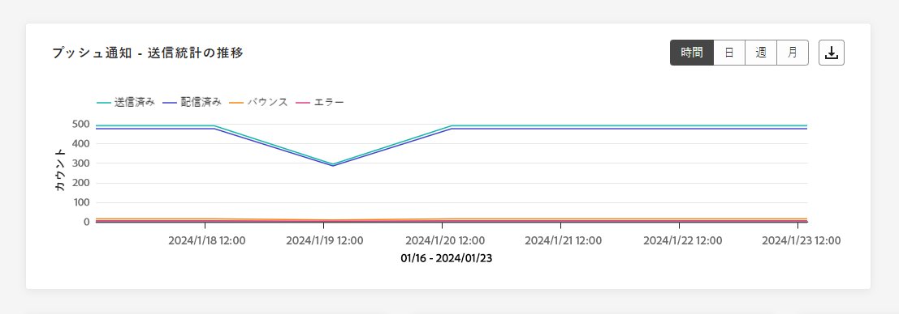

**[!UICONTROL プッシュ通知 - 送信統計の推移]**&#x200B;のグラフには、プッシュ通知アクティビティの分析結果が動的に表示されます。このグラフでは、送信済みプッシュ通知の包括的な分類を把握し、時間単位、日単位、週単位、月単位のスケールでトレンドとパターンを確認できます。

+++ プッシュ通知 - 送信統計の推移指標の詳細情報

* **[!UICONTROL 送信済み]**：送信されたプッシュ通知の合計数。

* **[!UICONTROL 配信済み]**：送信されたプッシュ通知の合計数に対する、正常に送信されたプッシュ通知の数。

* **[!UICONTROL バウンス数]**：送信されたメッセージの合計数に対する、累計エラー数および自動返信処理の合計数。

* **[!UICONTROL エラー]**：プロファイルへの送信を妨げるエラーが発生した合計数。

+++

### プッシュ通知 - トラッキング統計の推移 {#push-tracking-overtime}

>[!CONTEXTUALHELP]
>id="ajo_channel_push_tracking_statistics_overtime"
>title="プッシュ通知 - トラッキング統計の推移"
>abstract="プッシュ通知 - トラッキング統計の推移グラフには、プッシュ通知のプロファイルアクティビティに関するデータが、時間単位、日単位、週単位、または月単位で表示されます。"

**[!UICONTROL プッシュ通知 - トラッキング統計の推移]**&#x200B;のグラフには、プッシュ通知に関連するプロファイルアクティビティの詳細な概要が表示されます。このグラフでは、時間単位、日単位、週単位、月単位でデータが分類され、受信者のエンゲージメントが様々な期間でどのように変化しているかについての貴重なインサイトを得ることができます。

+++ プッシュ通知 - トラッキング統計の推移指標の詳細情報

* **[!UICONTROL 開封数]**：プッシュ通知が開封された回数。

* **[!UICONTROL アクション]**：配信されたプッシュ通知に対するアクション（ボタンのクリックや解除など）の合計数。

+++

### プッシュ通知 - 除外された理由 {#push-excluded-reasons}

>[!CONTEXTUALHELP]
>id="ajo_channel_push_excluded_reasons"
>title="除外された理由"
>abstract="この除外された理由のグラフとテーブルには、ユーザープロファイルがターゲットオーディエンスから除外され、メッセージが受信されない原因となった様々な要因が表示されます。"

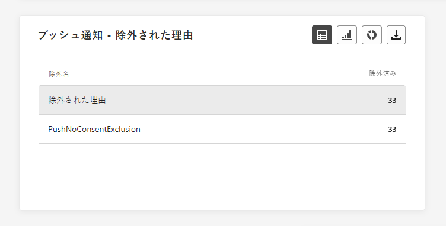

**[!UICONTROL 除外された理由]**&#x200B;のグラフとテーブルには、ターゲットプロファイルから除外されたユーザープロファイルがプッシュ通知を受信できない様々な理由が表示されます。

除外された理由の包括的なリストについては、[このページ](exclusion-list.md)を参照してください。

### プッシュ通知 - エラー理由 {#push-error-reasons}

>[!CONTEXTUALHELP]
>id="ajo_channel_push_error_reasons"
>title="エラー理由"
>abstract="エラー理由のグラフとテーブルを使用すると、送信プロセス中に発生した特定のエラーを識別できます。"

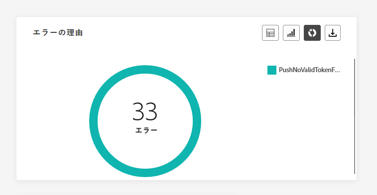

**[!UICONTROL エラー理由]**&#x200B;のグラフとテーブルには、プッシュ通知の送信プロセス中に発生した特定のエラーを識別する機能があり、進行中に発生した問題に関する詳細なインサイトを得ることができます。

### プッシュ通知 - プラットフォーム別トラッキング {#push-tracking-platform}

>[!CONTEXTUALHELP]
>id="ajo_channel_push_tracking_statistics_platform"
>title="プラットフォームごとのトラッキング統計"
>abstract="プラットフォームごとのトラッキング統計のグラフとテーブルには、プロファイルのオペレーティングシステムに応じたプッシュ通知のプロファイルアクティビティに関するデータが表示されます。"

**[!UICONTROL プッシュ通知 - プラットフォーム別トラッキング]**&#x200B;のグラフとテーブルは、プロファイルの運用システムに応じて、プッシュ通知の受信者アクティビティの詳細を示します。

### プッシュ通知 - プラットフォーム別送信 {#push-sending-platform}

>[!CONTEXTUALHELP]
>id="ajo_channel_push_sending_statistics_platform"
>title="プラットフォームごとの送信統計"
>abstract="プラットフォームごとの送信統計のグラフとテーブルには、送信されたプッシュ通知に関するデータが表示されます。"

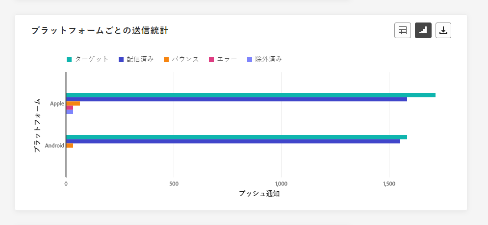

**[!UICONTROL プッシュ通知 - プラットフォーム別送信]**&#x200B;のグラフとテーブルは、包括的な分類を提供し、プロファイルの運用システムに関する正常に実行されたプッシュ通知の詳細を示します。この徹底的な分析は、様々なプラットフォームにわたるプッシュ通知の効果に関する有益なインサイトを提供します。

## SMS {#sms}

**チャネル**&#x200B;のレポートより、SMS メニューには、キャンペーンおよびジャーニーで送信された SMS に関する主な情報が表示されます。指標の詳細は次のとおりです。

### SMS - 送信統計の合計数 {#sms-sending-statistics}

>[!CONTEXTUALHELP]
>id="ajo_channel_sms_sending_statistics"
>title="SMS - 送信統計の合計数"
>abstract="SMS - 送信統計の合計数 KPI は、ターゲットまたは配信など、SMS メッセージに関する重要なデータを要約します。"

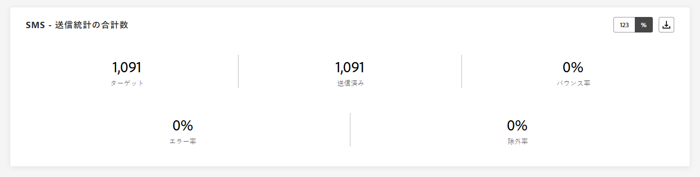

**[!UICONTROL SMS - 送信統計の合計数]**&#x200B;の KPI は、包括的な概要として機能し、SMS に関連する必要不可欠なデータをカプセル化します。これらの指標には、ターゲットオーディエンスと実際の配信ステータスに関する詳細なインサイトが含まれ、SMS メッセージの効果とリーチの明確な見解を提供します。

+++ プッシュ通知 - 送信統計の合計数指標の詳細情報

* **[!UICONTROL ターゲット]**：SMS チャネルのターゲットプロファイルとして適合するユーザープロファイルの数。

* **[!UICONTROL 送信済み]**：送信された SMS メッセージの合計数。

* **[!UICONTROL 配信済み]**：送信された SMS メッセージの合計数に対する、正常に送信された SMS メッセージの数。

* **[!UICONTROL 配信率]**：正常に送信された SMS メッセージの割合。

* **[!UICONTROL バウンス数]**：送信された SMS メッセージの合計数に対する、累計エラー数および自動返信処理の合計数。

* **[!UICONTROL バウンス率]**：送信された SMS メッセージに対する、バウンスした SMS メッセージの割合。

* **[!UICONTROL エラー]**：プロファイルへの送信を妨げるエラーが発生した合計数。

* **[!UICONTROL エラー率]**：送信された SMS メッセージに対する、発生したエラーによって送信が妨げられた割合。

* **[!UICONTROL 除外済み]**：ターゲットプロファイルから除外されメッセージを受信しなかったユーザープロファイルの数。

* **[!UICONTROL 除外済み]**：Adobe Journey Optimizer によって除外されたプロファイルの割合。

+++

### SMS - トラッキング統計の合計数 {#sms-tracking-statistics}

>[!CONTEXTUALHELP]
>id="ajo_channel_sms_tracking_statistics"
>title="SMS - トラッキング統計の合計数"
>abstract="SMS - トラッキング統計の合計数 KPI では、SMS メッセージのプロファイルアクティビティに関するデータを提供します。"

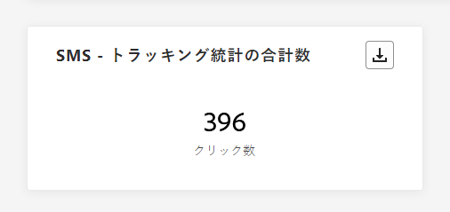

**[!UICONTROL SMS - トラッキング統計の合計]**&#x200B;ウィジェットでは、訪問者の URL へのエンゲージメントに関する主要情報の詳細な概要が表示され、SMS メッセージの有効性に関するインサイトを得ることができます。

* **[!UICONTROL クリック数]**：SMS メッセージでコンテンツがクリックされた回数。

### SMS - 送信統計の推移 {#sms-sending-statistics-overtime}

>[!CONTEXTUALHELP]
>id="ajo_channel_sms_sending_statistics_overtime"
>title="SMS - 送信統計の推移"
>abstract="SMS - 送信統計の推移グラフには、送信された SMS メッセージに関するデータが、時間単位、日単位、週単位、または月単位で表示されます。"

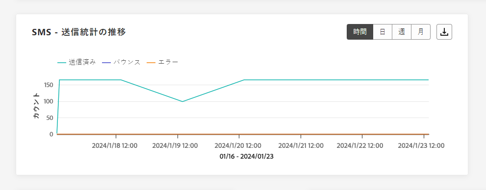

**[!UICONTROL SMS - 送信統計の推移]**&#x200B;のグラフは、送信された SMS メッセージの包括的な見解を示し、時間単位、日単位、週単位または月単位で分類されたデータを提供します。このグラフでは、様々な時間間隔における SMS メッセージアクティビティのトレンドを追跡および分析できます。

+++ SMS - 送信統計の推移指標の詳細情報

* **[!UICONTROL 送信済み]**：送信された SMS メッセージの合計数。

* **[!UICONTROL バウンス数]**：送信された SMS メッセージの合計数に対する、累計エラー数および自動返信処理の合計数。

* **[!UICONTROL エラー]**：プロファイルへの送信を妨げるエラーが発生した合計数。

+++

### SMS - トラッキング統計の推移 {#sms-tracking-statistics-overtime}

>[!CONTEXTUALHELP]
>id="ajo_channel_sms_tracking_statistics_overtime"
>title="SMS - トラッキング統計の推移"
>abstract="SMS - トラッキング統計の推移グラフには、SMS メッセージのプロファイルアクティビティに関するデータが、時間単位、日単位、週単位、または月単位で表示されます。"

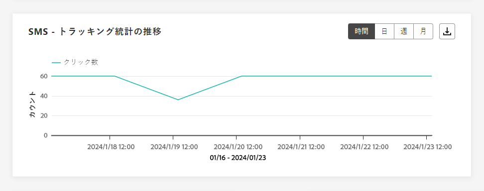

**[!UICONTROL SMS - トラッキング統計の推移]**&#x200B;のグラフには、SMS メッセージに関連するプロファイルアクティビティのデータが表示され、時間単位、日単位、週単位または月単位で詳細な分類を提供します。このグラフでは、様々な時間間隔におけるユーザーエンゲージメントのパターンを分析および理解できます。

* **[!UICONTROL クリック数]**：SMS メッセージでコンテンツがクリックされた回数。

### 除外された理由 {#sms-excluded-reasons}

>[!CONTEXTUALHELP]
>id="ajo_channel_sms_excluded_reasons"
>title="除外された理由"
>abstract="この除外された理由のグラフとテーブルには、ユーザープロファイルがターゲットオーディエンスから除外され、メッセージが受信されない原因となった様々な要因が表示されます。"

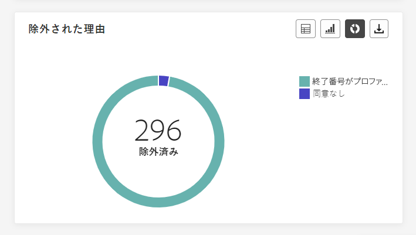

**[!UICONTROL 除外された理由]**&#x200B;グラフおよびテーブルは、ターゲットオーディエンスからユーザープロファイルが除外されることで、SMS メッセージを受信できなくなった様々な要因を視覚的に示しています。

除外の理由の包括的なリストについては、[このページ](exclusion-list.md)を参照してください。

### バウンスの理由 {#sms-bounce-reasons}

>[!CONTEXTUALHELP]
>id="ajo_channel_sms_bounce_reasons"
>title="バウンスの理由"
>abstract="バウンス理由のグラフとテーブルには、バウンスされたメッセージに関連して使用可能なデータが含まれます。"

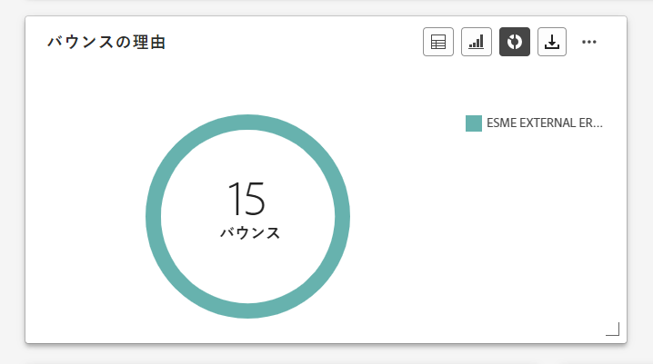

**[!UICONTROL バウンスの理由]**&#x200B;のグラフとテーブルには、バウンスした SMS メッセージに関するデータの包括的な概要が表示され、SMS メッセージのバウンスが発生したインスタンスの背後にある特定の理由に関する貴重なインサイトを得ることができます。

### エラー理由 {#sms-error-reasons}

>[!CONTEXTUALHELP]
>id="ajo_channel_sms_error_reasons"
>title="エラー理由"
>abstract="エラー理由のグラフとテーブルを使用すると、送信プロセス中に発生した特定のエラーを識別できます。"

**[!UICONTROL エラー理由]**&#x200B;のグラフとテーブルを使用すると、SMS メッセージの送信プロセス中に発生した特定のエラーを識別し、発生した問題を徹底的に分析できるようになります。

## ダイレクトメール {#direct-mail}

**チャネル**&#x200B;レポートの&#x200B;**ダイレクトメール**&#x200B;メニューには、**キャンペーン**&#x200B;および&#x200B;**ジャーニー**&#x200B;で送信されたダイレクトメールメッセージに関する主な情報が表示されます。次の指標があります。

### ダイレクトメール - 送信統計の合計数 {#direct-mail-total-sending}

>[!CONTEXTUALHELP]
>id="ajo_channel_direct_sending_statistics"
>title="ダイレクトメール - 送信統計の合計数"
>abstract="ダイレクトメール - 送信統計の合計数 KPI には、ターゲットまたは配信など、ダイレクトメールメッセージに関する重要なデータがまとめられます。"

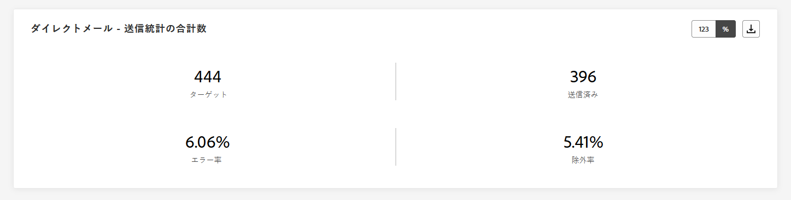

**[!UICONTROL ダイレクトメール - 送信統計の合計数]**&#x200B;ウィジェットは、ダイレクトメールメッセージのパフォーマンスに関する包括的な概要を提供し、ダイレクトメールメッセージに関する重要なデータを要約する主要業績評価指標（KPI）を表示します。

+++ ダイレクトメール - 送信統計の合計数指標の詳細情報

* **[!UICONTROL ターゲット]**：ダイレクトメールメッセージのターゲットプロファイルとして適合するユーザープロファイルの数。

* **[!UICONTROL 送信済み]**：送信の合計数。

* **[!UICONTROL エラー]**：プロファイルへの送信を妨げたエラーの合計数。

* **[!UICONTROL エラー率]**：送信されたプッシュ通知の数と比較して、送信の妨げとなったエラーの割合。

* **[!UICONTROL 除外済み]**：ターゲットプロファイルから除外されメッセージを受信しなかったユーザープロファイルの数。

* **[!UICONTROL 除外済み]**：Adobe Journey Optimizer によって除外されたプロファイルの割合。

+++

### 除外された理由 {#direct-mail-excluded-reasons}

>[!CONTEXTUALHELP]
>id="ajo_channel_direct_excluded_reasons"
>title="除外された理由"
>abstract="この除外された理由のグラフとテーブルには、ユーザープロファイルがターゲットオーディエンスから除外され、メッセージが受信されない原因となった様々な要因が表示されます。"

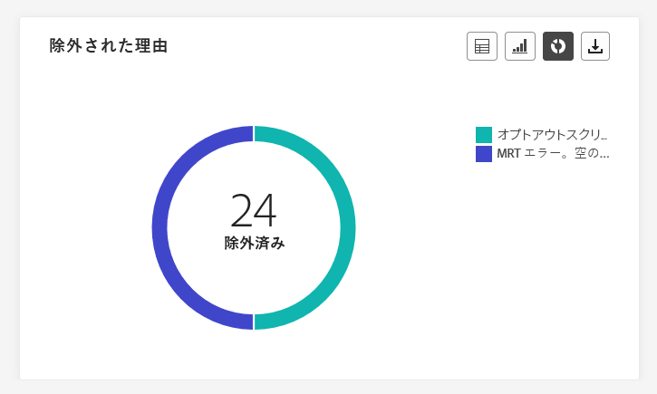

**[!UICONTROL ダイレクトメール - 除外された理由]**&#x200B;のグラフとテーブルでは、ターゲットオーディエンスからユーザープロファイルが除外され、ダイレクトメールメッセージを受信できなかった様々な要因を視覚的に示します。

除外の理由の包括的なリストについては、[このページ](exclusion-list.md)を参照してください。

### エラー理由 {#direct-mail-error-reasons}

>[!CONTEXTUALHELP]
>id="ajo_channel_direct_error_reasons"
>title="エラー理由"
>abstract="エラー理由のグラフとテーブルを使用すると、送信プロセス中に発生した特定のエラーを識別できます。"

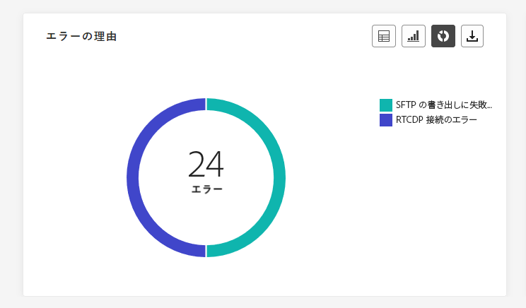

**[!UICONTROL ダイレクトメール - エラー理由]**&#x200B;は、ダイレクトメールメッセージの送信プロセス中に発生した特定のエラーを識別する手段を提供し、発生した問題を詳細に分析できます。

## アプリ内 {#in-app}

チャネルレポートのアプリ内メニューには、キャンペーンおよびジャーニーで送信されたアプリ内メッセージに関する主な情報が詳細に表示されます。指標の詳細は次のとおりです。

### アプリ内エンゲージメントの合計数 {#inapp-total-engagement}

>[!CONTEXTUALHELP]
>id="ajo_channel_inapp_engagement"
>title="アプリ内 - 総エンゲージメント数"
>abstract="アプリ内 - 総エンゲージメント数 KPI には、インプレッション数やインタラクション数などの指標を含め、訪問者のアプリ内メッセージに対するエンゲージメントに関する包括的な情報が表示されます。"

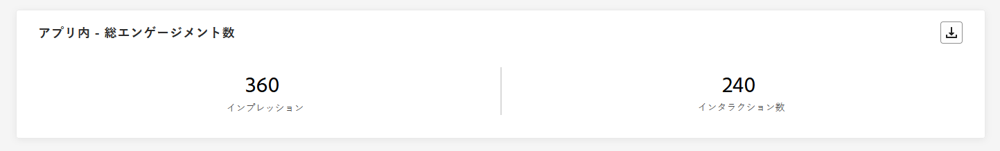

**[!UICONTROL アプリ内エンゲージメントの合計数]** KPI は、**インプレッション**&#x200B;や&#x200B;**インタラクション**&#x200B;などの主要指標を含む、アプリ内メッセージに対する訪問者のエンゲージメントについての包括的なインサイトを提供します。

+++ アプリ内エンゲージメントの合計数指標の詳細情報

* **[!UICONTROL インプレッション数]**：すべてのユーザーに配信されたアプリ内メッセージの合計数。

* **[!UICONTROL インタラクション数]**：アプリ内メッセージに対するエンゲージメントの合計数。これには、クリック、解除またはその他のやり取りなど、ユーザーが実行したすべてのアクションが含まれます。

+++

### アプリ内エンゲージメントの推移 {#inapp-engagement-overtime}

>[!CONTEXTUALHELP]
>id="ajo_channel_inapp_engagement_overtime"
>title="アプリ内 - エンゲージメントの推移"
>abstract="アプリ内 - エンゲージメントの推移グラフには、アプリ内のインプレッション数やインタラクション数を追跡し、時間単位、日単位、週単位および月単位の分類が表示されます。"

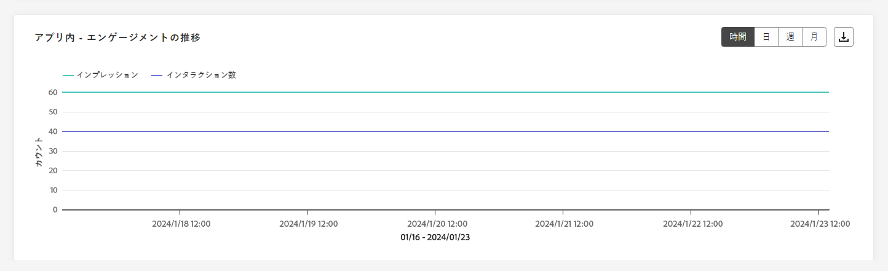

**[!UICONTROL アプリ内のエンゲージメントの推移]**&#x200B;グラフには、任意のインプレッション数、解除数またはインタラクション数を追跡して得られた、該当期間におけるアプリ内のインプレッション数およびインタラクション数の推移が表示されます。

+++ アプリ内エンゲージメントの推移指標の詳細情報

* **[!UICONTROL インプレッション数]**：すべてのユーザーに配信されたアプリ内メッセージの合計数。

* **[!UICONTROL インタラクション数]**：アプリ内メッセージに対するエンゲージメントの合計数。これには、クリック、解除またはその他のやり取りなど、ユーザーが実行したすべてのアクションが含まれます。

+++

## Web {#web}

**チャネル**&#x200B;レポートの web メニューには、**キャンペーン**&#x200B;と&#x200B;**ジャーニー**&#x200B;に含まれる web ページに関する主な情報が詳しく表示されます。指標の詳細は次のとおりです。

### Web - エンゲージメントの合計数 {#web-engagement-total}

>[!CONTEXTUALHELP]
>id="ajo_channel_web_engagement"
>title="Web - エンゲージメントの合計数"
>abstract="Web - 総エンゲージメント数 KPI には、インプレッション数やインタラクション数などの指標を含め、訪問者の web ページに対するエンゲージメントに関する包括的な情報が表示されます。"

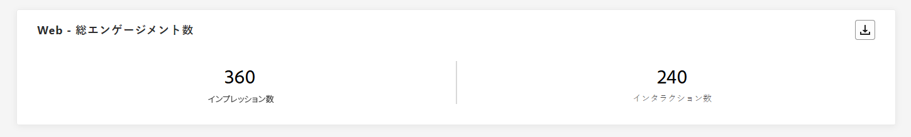

**[!UICONTROL Web エンゲージメントの合計数]** KPI は、インプレッションやインタラクションなどの主要指標を含む、web ページに対する訪問者のエンゲージメントに関する包括的なインサイトを提供します。

+++ Web エンゲージメントの合計数指標の詳細情報

* **[!UICONTROL インプレッション数]**：すべてのユーザーに配信された web エクスペリエンスの合計数。

* **[!UICONTROL インタラクション数]**：Web ページに対するエンゲージメントの合計数。これには、クリックやその他のインタラクションなど、ユーザーが実行したすべてのアクションが含まれます。

+++

### Web - エンゲージメントの合計数の推移 {#web-engagement-total-overtime}

>[!CONTEXTUALHELP]
>id="ajo_channel_web_engagement_overtime"
>title="Web - エンゲージメントの合計数の推移"
>abstract="Web - 総エンゲージメント数の推移グラフには、web ページのインプレッション数やインタラクション数を追跡し、時間単位、日単位、週単位および月単位の分類が表示されます。"

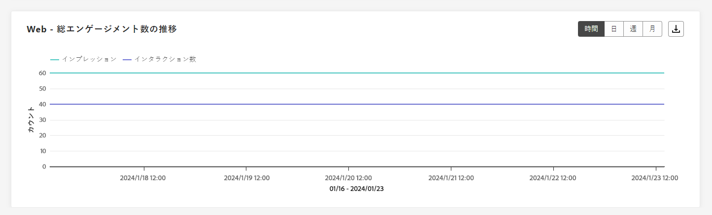

**[!UICONTROL Web エンゲージメントの合計数の推移]**&#x200B;グラフは、**インプレッション**&#x200B;と&#x200B;**インタラクション**&#x200B;を監視し、時間単位、日単位、週単位、月単位の詳細な分類を提供します。

+++ Web エンゲージメントの推移指標の詳細情報

* **[!UICONTROL インプレッション数]**：すべてのユーザーに配信された web エクスペリエンスの合計数。

* **[!UICONTROL インタラクション数]**：Web ページに対するエンゲージメントの合計数。これには、クリックやその他のインタラクションなど、ユーザーが実行したすべてのアクションが含まれます。

+++

## チャネルレポート（ビデオ） {#channel-report-video}

このビデオでチャネルレベルのレポートにアクセス、ナビゲートおよび書き出し方法を学ぶ

>[!VIDEO](https://video.tv.adobe.com/v/3424537?quality=12)
